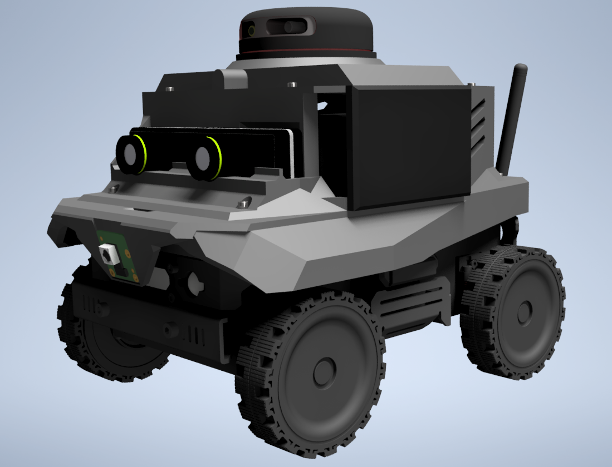
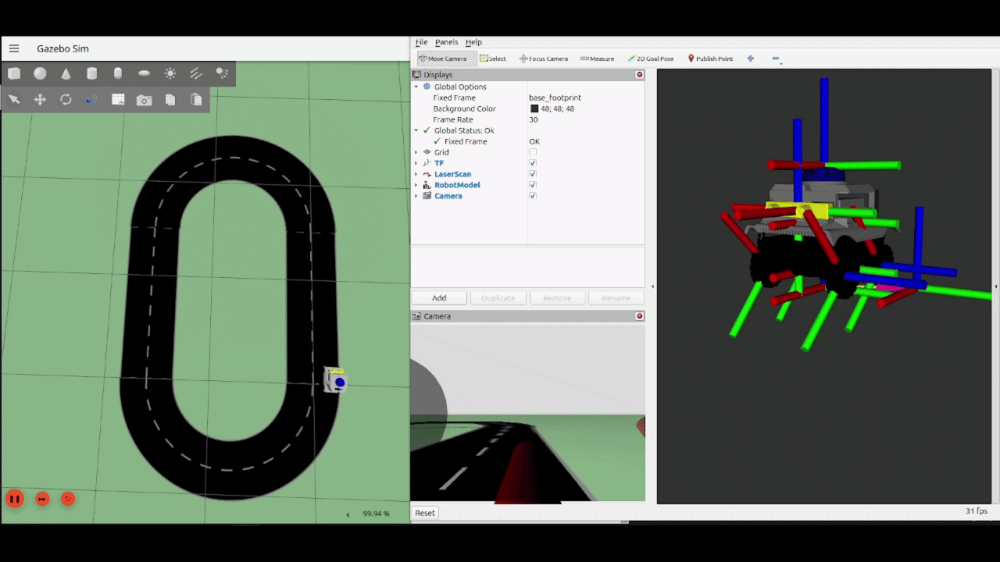
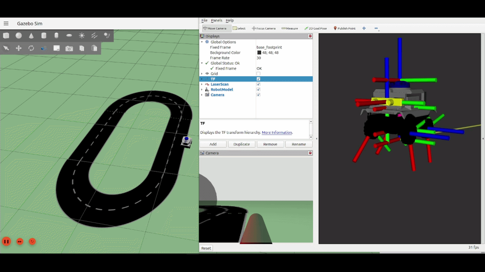
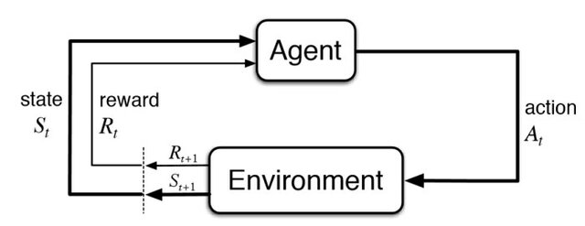
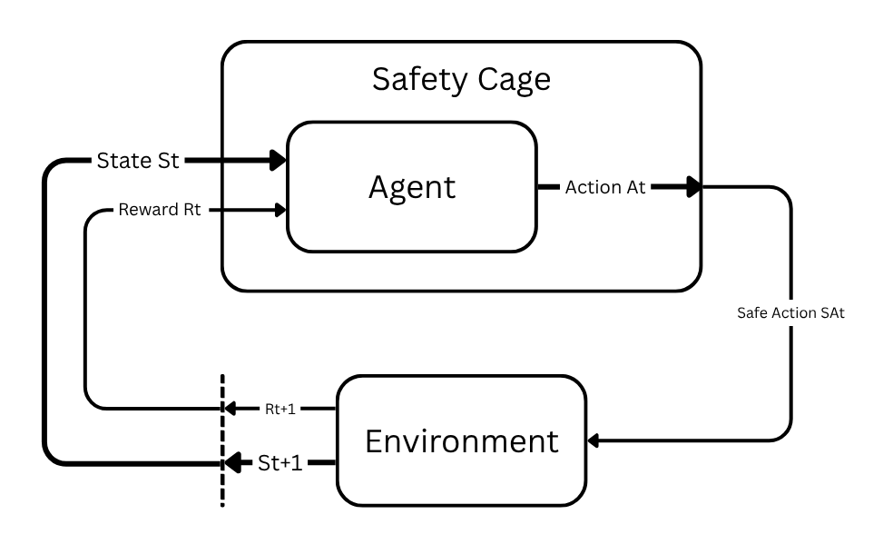
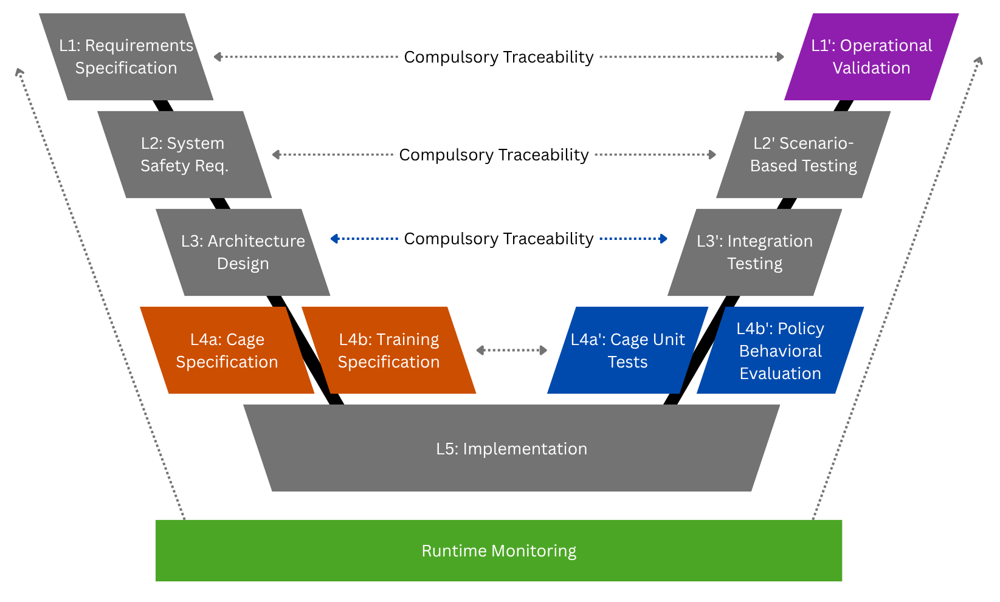

<h1 align="center">Safety Cages and Safe RL within an SE4AI Framework for Autonomous Driving</h1>

<p align="center">
  <i>A master's thesis on wrapping an end-to-end camera Reinforcement-Learning driver in a runtime safety cage —<br>
  engineered, traced and validated end-to-end, from hazard to logged evidence.</i>
</p>

<table>
<tr>
<td width="32%" valign="middle">

</td>
<td width="68%" valign="middle">

**CobraFlex 1:14** is a scale ground vehicle with a 360° lidar, a stereo camera and a differential / skid-steer drive (four fixed wheels, no steering angle — the sim's DiffDrive plugin is faithful to this). The thesis develops and validates the safety cage in Gazebo around an **end-to-end front-camera PPO policy** — a CNN that maps raw camera frames to **steering *and* throttle** on the `complex_b` circuit — before transferring it to the physical car. The URDF/SDF, Gazebo worlds, road assets and perception/control nodes all live in [`src/cobraflex`](src/cobraflex/).

</td>
</tr>
</table>

<p align="center">
  
  
  
  
  
  
</p>

---

## See it in action

<p align="center">
  <a href="manuscript/media/PPO_Eval.gif">
    
  </a>
  <br>
  <sub>The trained <b>end-to-end camera PPO policy</b> driving the <code>complex_b</code> circuit under the cage in <b>Gazebo</b> (left). The <b>RViz</b> panel (centre) shows the two consumers of the same frame: the <i>Camera Lane</i> overlay of the cage's own deterministic CV lane-estimator (green centreline) and the grayscale observation the CNN actually sees; the map (right) tracks the vehicle against the lane boundaries.</sub>
</p>

<p align="center">
  <a href="manuscript/media/PPO_Training.gif">
    
  </a>
  <br>
  <sub>Training the same <b>end-to-end camera</b> policy in <b>Gazebo</b> on <code>complex_b</code> (left), with the live camera / lane-estimate views and the ego-centric lane view (right). Training runs <b>with the cage enabled in enforcement mode</b> and with camera domain randomisation on.</sub>
</p>

---

## What this is

This repository holds the full research artefacts of a master's thesis investigating how a **runtime safety cage** can constrain a **Reinforcement-Learning** agent driving an autonomous vehicle. The work is built on a **Systems Engineering for AI (SE4AI)** methodology: every design decision is traceable from a formal hazard down to the experimental evidence that closes it.

Everything is exercised in **Gazebo** simulation and is being carried toward the **CobraFlex 1:14** scale physical platform.

| Pillar | What it means here |
| --- | --- |
| **Hazard analysis** | 12 hazards (`H-01…H-12`) systematically identified and rated (including the camera-perception hazards) |
| **Safety requirements** | 14 requirements (`SR-001…SR-014`) derived from those hazards |
| **Runtime safety cage** | 6 rules (`C-01…C-06`) that filter the RL policy's action *before* it reaches the car |
| **RL policy** | One end-to-end front-camera **PPO** driver: a CNN over 84×84 grayscale frames (stack of 4) commanding **steering + throttle**, trained and evaluated under cage supervision |
| **Validation scenarios** | Nominal, edge-case and perturbed scenarios for systematic testing (28 on `complex_b`) |
| **Full traceability** | Every hazard reaches a verdict through an auditable, mechanically-checked chain |

The central commitment of the whole project is **traceability** — every hazard must reach a final verdict through a chain of explicitly linked artefacts:

```text
Hazard → Safety Requirement → Cage Rule → Scenario → Metric → Logged Evidence → Verdict
```

The absence of orphans on either side of this chain is verified mechanically before every Gate review.

---

## The idea: a runtime safety cage

A standard RL agent learns a policy by interacting with its environment. We keep that loop intact and **wrap the agent in a cage**: every action the policy proposes is filtered into a *safe action* that provably respects the safety rules before it ever reaches the actuators.

<table>
<tr>
<td width="50%" valign="top">

<br><sub><b>Standard RL loop.</b> The agent observes a state, acts, and receives a reward from the environment.</sub>
</td>
<td width="50%" valign="top">

<br><sub><b>…wrapped in a cage.</b> The raw action is filtered to a <i>safe action</i> before it reaches the environment.</sub>
</td>
</tr>
</table>

The cage ([`cage/`](cage/)) is **pure Python** and importable without ROS 2, so its rules can be unit-tested in isolation. It chains six rules in a fixed order — `C-06 → C-04 → C-02 → C-03 → C-01 → C-05` — covering rate limiting, speed, heading, time-to-lane-crossing, lane boundary and emergency stop.

The camera frame is degraded once by the scenario's stressor and then **split between two independent consumers** — the CNN policy and the cage's **own deterministic CV lane-estimator** (D-43, the common-cause guarantee, [`docs/12`](docs/12_cv_lane_keeper.md)). The cage never reads the network's belief about where the lane is. Verdicts are always scored on the **true pose**:

```text
camera frame ─▶ scenario degradation ─┬▶ CV lane-estimator ─▶ cage state (ey, epsi)
                                      └▶ 84×84 grayscale ×4 ─▶ CNN policy ─▶ raw (steer, throttle)
raw action + cage state ─▶ cage (C-06→…→C-05) ─▶ safe (steer, throttle) ─▶ vehicle ─▶ scored on ground truth
```

In simulation this loop runs in-process. For the physical car the **same cage core** is exposed by thin ROS 2 wrappers as a distributed node chain — the safety-relevant logic is bit-identical, only the image source and the actuation sink change ([`docs/17`](docs/17_physical_deployment.md)):

```text
camera ─▶ rl_policy_node ─▶ /raw_action ─┐
camera ─▶ cv_lane_estimator_node ─▶ /state_obs ─┤
                                                ▼
                       cage_ros_node ─▶ /safe_action ─▶ vehicle_control_node ─▶ /cmd_vel
                                    └─▶ /cage_status ─▶ cage_logger_node ─▶ CSV evidence
```

---

## Results at a glance

The system is the end-to-end camera PPO driver `ppo_gz2d_cap022_1M_2024` (seed 2024, `CnnPolicy`, 2-D action = steering + throttle, speed cap 0.22 m/s, camera domain randomisation on), evaluated at its selected checkpoint **550 k**.

<p align="center">
  <b>5.32 laps of <code>complex_b</code>&nbsp;·&nbsp; 8.6 mm mean lateral error (27 mm max)&nbsp;·&nbsp; 0 emergencies&nbsp;·&nbsp; 0 safety interventions — only the benign C-06 rate limiter</b>
</p>

<p align="center">
  
  <br>
  <sub>Training reward of the policy (top curve): a stable high plateau, <code>ep_rew_mean</code> peaking at <b>1755 @ 472 k</b>. The marked points are the three checkpoints that were evaluated by driving. The two lower curves are earlier camera-policy variants, shown only for scale.</sub>
</p>

**Training** — 1 M budget on the self-approaching `complex_b` circuit (perimeter 19.2 m), stopped at ~700 k, checkpoints every 25 k. The cage is enabled in enforcement throughout training and stays **latent for safety** (`C-01/02/03/05 = 0`, 0 emergencies): the policy learns to respect the constraints rather than leaning on the cage. Only `C-06`, the rate limiter, fires.

**Checkpoint selection — by driving, not by reward.** Three candidates were evaluated deterministically on `SC-NOM-01`, and the result was decisive: the **reward-peak checkpoint (475 k) is *not* the best one** (14 safety interventions, max |ey| 49 mm), while **550 k** wins on every behavioural criterion. Selecting on training reward alone would have picked the worst of the three — the cage-intervention rate is the discriminating signal (D-66).

**Evaluation** (`rl_ppo2d_cap022_550000_nom_4k4`, `SC-NOM-01`, 4400 steps / 440 s, enforcement) — **5.32 continuous laps**, mean |ey| **8.6 mm**, max |ey| **27 mm**, **0 emergencies**, **0 safety interventions** (76 % `C-06` rate-limiting only). Its D-43 preflight — the check that the cage's CV estimator is trustworthy on this policy's trajectories — passes **7/7** (`experiments/sim/eval_gz2d/d43_preflight_ppo2d_cap022_550k.json`).

> **Scenario campaign — in progress.** The verdict campaign for this checkpoint is running now: `experiments/sim/campaign_2d_ppo550k/` — **1890 runs**, 27 `complex_b` scenarios × {enforcement, monitoring}, seed 2024 (`SC-PERT-03` is excluded; its stall meta-test is policy-independent and already closed, D-64). **No campaign verdict is claimed here yet**; the numbers above are the nominal evaluation only. Gate **G4 closed on 02.07.2026** on the frozen camera-track campaign evidence recorded in [`docs/07`](docs/07_traceability_matrix.md) and ch. 8; this campaign is posterior `E5` work.

*All figures are regenerated from logged runs — never hand-drawn; the underlying numbers live under [`experiments/`](experiments/).*

---

## Methodology — SE4AI and the adapted V-model

The project follows a V-model **adapted for an AI component**: the classical left/right arms are kept, but the implementation tier is split into a **cage side** (specified, then unit-tested) and a **learned side** (a training specification, then behavioural evaluation), with a **runtime-monitoring** layer running underneath all of it. Compulsory traceability links each left-arm artefact to its right-arm counterpart.

<p align="center">
  
</p>

The work advances through gated phases. Each Gate is blocked until traceability passes with no orphans.

> **Where the work stands (2026-09-02).** All simulation verdicts are closed and frozen. The **verdict of record** is the 2-D PPO 550k pre-deployment campaign (1890 runs, 31.07.2026, D-69); **GE4-V2** (1970 runs, 28.06.2026) remains the frozen G4 gate record and is not re-scored. **Phase 5 ran and is closed**: the sim-to-real v2 policy **transfers** — 18.05 m of the real circuit in one uninterrupted segment with no safety rule fired — and what stops the vehicle is the **measurement**, not the control, across thirteen measured gap terms of which **none is the control policy** (`docs/17` §14). The physical verdict column is **not executed and will not be**: no scenario was ever run under the scenario protocol, every physical run was in `monitoring`, and **the cage has never modified an action on hardware**. Nothing in Phase 5 re-scores a gate.

| Phase | Focus | Gate | Status |
| --- | --- | :---: | --- |
| **F0** | Foundation & workspace | G0 | complete |
| **F1** | Hazard analysis + safety requirements (12 H / 14 SR) | G1 | complete |
| **F2** | Safety cage (`C-01…C-06`) + ROS 2 pipeline | G2 | complete |
| **F3** | PPO & SAC training & policy comparison | G3 | complete |
| **F4** | Simulation-based scenario evaluation | G4 | complete |
| **F5** | Physical CobraFlex platform deployment | G5 | **evidence closed 01.09.2026** — the vehicle drives; `verdict_phys` deliberately **not executed** |
| F6 | Closure & defence | G6 | in progress (write-up) |

---

## Repository layout

```text
.
├── docs/           Living engineering documents (HARA, SRS, cage spec, metrics, ODD, deployment, …)
├── cage/           Pure-Python safety cage (rules C-01…C-06) + ROS 2 helpers — importable without ROS 2
├── policy/         RL pipeline: camera PPO training, evaluation, checkpoints
├── scenarios/      Oval scenario library
├── scenarios_complex_b/  Scenario library of record — 28 camera scenarios on complex_b
├── experiments/    Calibration data, ODD inspection, sim + physical run outputs
├── tools/          Traceability check, manuscript→CSV sync, figure generation
├── manuscript/     Thesis chapters, figures and demo media
├── scripts/        Workspace bootstrap (mesh download, track generators)
└── src/            ROS 2 colcon workspace (cobraflex + cobraflex_rl + safety_cage)
```

Every top-level subdirectory carries its own `README.md` explaining its internal organisation. The cage's pure-Python logic deliberately lives **outside** the ROS 2 workspace so its test suite (`pytest cage/tests/`) runs without a ROS 2 toolchain.

---

## Identifier conventions

Every artefact follows a strict naming scheme so traceability can be checked automatically.

| Prefix | Meaning | Example |
| --- | --- | --- |
| `H-XX` | Hazard | `H-01` |
| `SR-XXX` | Safety Requirement | `SR-001` |
| `C-XX` | Cage rule | `C-03` |
| `SC-*` | Scenario | `SC-NOM-01` |
| `M-*` | Metric | `M-S1` |
| `F-X` | Phase | `F3` |
| `G-X` | Gate review | `G2` |
| `E-X` / `GE-X` | Camera-track phase / gate | `E4`, `GE4` |
| `D-NN` | Architectural decision | `D-66` |

Full specification in [`docs/01_id_conventions.md`](docs/01_id_conventions.md).

---

## Getting started

### Python side — cage + policy (no ROS 2 needed)

```bash
pip install -e .                 # editable install (pyproject.toml exposes cage, cage.rules, policy)
pip install -r requirements.txt
pytest                           # runs cage/tests + policy/tests
python tools/check_traceability.py   # hard gate — must pass before any review
```

### ROS 2 side — simulator + platform

Built and run on **Ubuntu 24.04 + ROS 2 Jazzy** (`/opt/ros/jazzy`).

```bash
# 1. Resolve ROS 2 dependencies and fetch large meshes (87 MB lidar visual, git-ignored)
rosdep install --from-paths src --ignore-src -r -y
./scripts/download_meshes.sh

# 2. Build the workspace (--symlink-install makes Python edits visible without rebuilding)
source /opt/ros/jazzy/setup.bash
colcon build --symlink-install
source install/setup.bash

# 3. Launch
ros2 launch cobraflex lane_keeper_gazebo.launch.py   # full perception→policy→cage→control loop
ros2 launch cobraflex bringup.launch.py              # platform in a Gazebo world
ros2 launch cobraflex_rl train.launch.py             # an RL training episode
```

> Run `pip install -e .` **once before** `colcon build` — the ROS 2 nodes import `cage` via a path-walk bootstrap that relies on the editable install.

---

## How to read this repository

Suggested order for a newcomer:

1. [`docs/00_v_model_adapted.md`](docs/00_v_model_adapted.md) — the methodological framework that organises everything else.
2. [`docs/01_id_conventions.md`](docs/01_id_conventions.md) — the naming conventions for every identifier above.
3. [`docs/02_hazard_register.md`](docs/02_hazard_register.md) — the twelve hazards and their analysis.
4. [`docs/03_safety_requirements.md`](docs/03_safety_requirements.md) — the fourteen safety requirements.
5. [`docs/04_cage_specification.md`](docs/04_cage_specification.md) — the design of the runtime cage.
6. [`docs/05_scenario_library.md`](docs/05_scenario_library.md) — the validation scenarios.
7. [`docs/06_metrics_catalogue.md`](docs/06_metrics_catalogue.md) — the metrics computed on every run.
8. [`docs/07_traceability_matrix.md`](docs/07_traceability_matrix.md) — the master matrix that connects everything.
9. [`docs/08_odd_specification.md`](docs/08_odd_specification.md) — the Operational Design Domain.
10. [`docs/09_environment_design.md`](docs/09_environment_design.md) and [`docs/10_reward_function.md`](docs/10_reward_function.md) — the RL environment and reward; [`docs/11_camera_rl_training.md`](docs/11_camera_rl_training.md) — the end-to-end camera training; [`docs/12_cv_lane_keeper.md`](docs/12_cv_lane_keeper.md) — the deterministic CV lane-estimator the cage reads; [`docs/17_physical_deployment.md`](docs/17_physical_deployment.md) — the physical bring-up plan.

The documents under `docs/` are **living**: every change is recorded in [`docs/CHANGELOG.md`](docs/CHANGELOG.md) with its rationale and triggers a re-run of the traceability check. A document is *closed* only when its Gate review approves it.

---

## Traceability gate

Before every Gate review (G0–G6) this command must pass with no errors:

```bash
python tools/check_traceability.py
```

It verifies that every hazard is covered by a safety requirement, every requirement by a cage rule, every cage rule by a scenario, every scenario back to a requirement — and that **no orphan artefacts** exist on either side. If it fails, the Gate cannot proceed.

---

## Reproducibility

Every run under `experiments/sim/` or `experiments/physical/` carries metadata recording the **git commit**, the **cage YAML hash**, the **policy checkpoint hash**, the **scenario YAML hash**, the **random seed** and a **timestamp / platform** identifier. Reproducing a run means checking out the recorded commit, recovering the same configuration files and re-running with the recorded seed. This reproducibility check is part of every Gate review.

---

## Author & supervision

| Role | Name |
| --- | --- |
| **Author** | Ing. Samuel Sanchez |
| **Supervisor** | Prof. Dr.-Ing. Ralf Schüler |
| **Institution** | Hochschule Esslingen |
| **Programme** | Automotive Systems M.Sc. |

Released under the **MIT License**.
