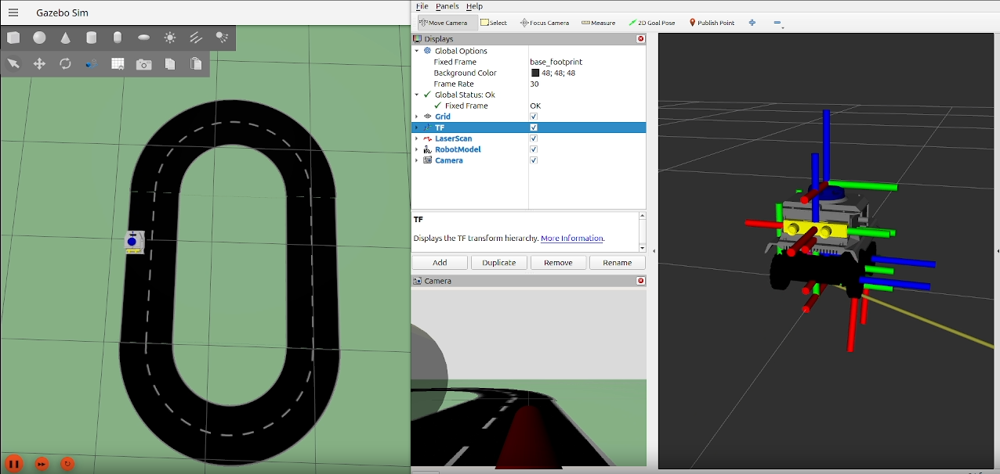
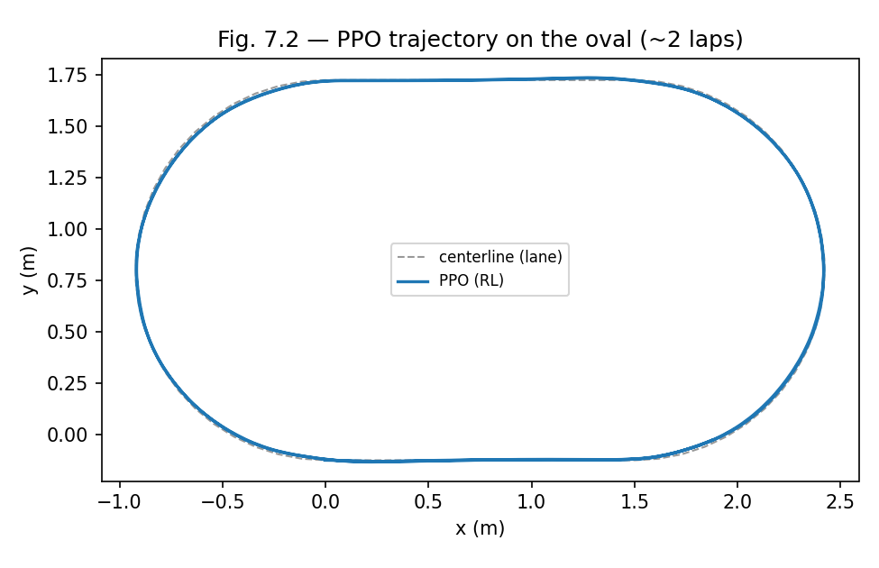
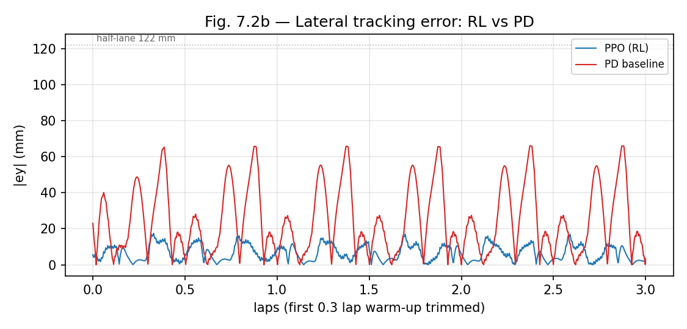

<h1 align="center">Safety Cages and Safe RL within an SE4AI Framework for Autonomous Driving</h1>

<p align="center">
  <i>A master's thesis on wrapping a Reinforcement-Learning lane-follower in a runtime safety cage —<br>
  engineered, traced and validated end-to-end, from hazard to logged evidence.</i>
</p>

<p align="center">
  
  
  
  
  
  
  
</p>

---

## See it in action

<p align="center">
  <a href="manuscript/media/eval_11_lap.mp4">
    
  </a>
  <br>
  <sub>The trained PPO policy lane-keeping on the oval in <b>Gazebo</b> (left), the live <b>RViz</b> state view (centre) and the vehicle TF tree (right).
  <b>▶ Click to play</b> the 11-lap evaluation run.<br>
  Demo clips <code>eval_11_lap.mp4</code> and <code>training_1_lap.mp4</code> live under <a href="manuscript/media/"><code>manuscript/media/</code></a> — local artefacts, not tracked in git due to size.</sub>
</p>

---

## What this is

This repository holds the full research artefacts of a master's thesis investigating how a **runtime safety cage** can constrain a **Reinforcement-Learning** agent driving an autonomous vehicle. The work is built on a **Systems Engineering for AI (SE4AI)** methodology: every design decision is traceable from a formal hazard down to the experimental evidence that closes it.

Everything is exercised in **Gazebo** simulation and is being carried toward the **CobraFlex 1:14** scale physical platform.

| Pillar | What it means here |
| --- | --- |
| **Hazard analysis** | 9 hazards (`H-01…H-09`) systematically identified and rated |
| **Safety requirements** | 11 requirements (`SR-001…SR-011`) derived from those hazards |
| **Runtime safety cage** | 6 rules (`C-01…C-06`) that filter the RL policy's action *before* it reaches the car |
| **RL policy** | A PPO lane-follower trained and evaluated under cage supervision |
| **Validation scenarios** | Nominal, edge-case and perturbed scenarios for systematic testing |
| **Full traceability** | Every hazard reaches a verdict through an auditable, mechanically-checked chain |

The central commitment of the whole project is **traceability** — every hazard must reach a final verdict through a chain of explicitly linked artefacts:

```text
Hazard → Safety Requirement → Cage Rule → Scenario → Metric → Logged Evidence → Verdict
```

The absence of orphans on either side of this chain is verified mechanically before every Gate review.

---

## The idea: a runtime safety cage

A standard RL agent learns a policy by interacting with its environment. We keep that loop intact and **wrap the agent in a cage**: every action the policy proposes is filtered into a *safe action* that provably respects the safety rules before it ever reaches the actuators.

<table>
<tr>
<td width="50%" valign="top">

<br><sub><b>Standard RL loop.</b> The agent observes a state, acts, and receives a reward from the environment.</sub>
</td>
<td width="50%" valign="top">

<br><sub><b>…wrapped in a cage.</b> The raw action is filtered to a <i>safe action</i> before it reaches the environment.</sub>
</td>
</tr>
</table>

The cage ([`cage/`](cage/)) is **pure Python** and importable without ROS 2, so its rules can be unit-tested in isolation. It chains six rules in a fixed order — `C-06 → C-04 → C-02 → C-03 → C-01 → C-05` — covering rate limiting, speed, heading, time-to-lane-crossing, lane boundary and emergency stop. At runtime a thin ROS 2 wrapper exposes it as a node in the perception → policy → **cage** → control pipeline:

```text
/odom ─▶ lane_perception ─▶ /state_obs ─▶ pd_baseline | ppo_policy ─▶ /raw_action
                                  └────────────┬─────────────────────────┘
                                               ▼
                          cage_node ─▶ /safe_action ─▶ vehicle_control ─▶ /cmd_vel
                                    └─▶ /cage_status ─▶ logger ─▶ CSV evidence
```

---

## Results at a glance

The definitive F3 training cycle (`ppo_train_42_200k` — seed 42, 200 k steps, reward v1.2) **saturates**: the policy learns to complete full laps and then refines its smoothness on the plateau.

<p align="center">
  <b>11.2 continuous laps&nbsp;·&nbsp; 0 emergencies&nbsp;·&nbsp; 6.5 mm mean lateral error&nbsp;·&nbsp; 0 % cage intervention</b>
</p>

<table>
<tr>
<td width="50%"></td>
<td width="45%"></td>
</tr>
</table>

<p align="center">
  
</p>

**Training** — `ep_rew_mean` climbs 24.8 → **535.2**, `ep_len_mean` reaches the **500-step** cap (saturated by ~71 k steps), and `explained_variance` settles at **0.63** (above the 0.5 threshold).

**Evaluation** (`rl_eval_42_200k_4k4`, scenario `SC-NOM-01`) — the policy drives **11.2 continuous laps** with a mean lateral error of **6.5 mm**, against **23 mm** for the PD baseline on the same scenario (~3.5× tighter, see the tracking-error figure). Crucially the cage records **0 % interventions**: under reward v1.2 the policy already steers within every cage rule, so the raw action *equals* the safe action at every step — the cage stays silent because the policy is well-behaved, not because it is switched off.

> Earlier F2 milestone — the PD baseline **+ cage** closed-loop demo (`ros_run_20260523T153003Z`) drove 9.91 laps over 845 s with 0 emergencies, validating the runtime pipeline end-to-end before the RL policy existed.

*All figures are regenerated from logged runs by [`tools/plot_f3_figures.py`](tools/plot_f3_figures.py); the underlying numbers live under [`experiments/`](experiments/).*

---

## Methodology — SE4AI and the adapted V-model

The project follows a V-model **adapted for an AI component**: the classical left/right arms are kept, but the implementation tier is split into a **cage side** (specified, then unit-tested) and a **learned side** (a training specification, then behavioural evaluation), with a **runtime-monitoring** layer running underneath all of it. Compulsory traceability links each left-arm artefact to its right-arm counterpart.

<p align="center">
  
</p>

The work advances through gated phases. Each Gate is blocked until traceability passes with no orphans.

| Phase | Focus | Gate | Status |
| --- | --- | :---: | --- |
| **F0** | Foundation & workspace | G0 | complete |
| **F1** | Hazard analysis + safety requirements (9 H / 11 SR) | G1 | complete |
| **F2** | Safety cage (`C-01…C-06`) + ROS 2 pipeline | G2 | complete — passed 2026-05-23 |
| **F3** | PPO training & policy | G3 | **in progress** |
| F4 | Simulation-based scenario evaluation | G4 | planned |
| F5 | Physical CobraFlex platform | G5 | planned |
| F6 | Closure & defence | G6 | planned |

---

## The platform

<table>
<tr>
<td width="32%" valign="middle">

</td>
<td width="68%" valign="middle">

**CobraFlex 1:14** is a scale ground vehicle with a 360° lidar, a stereo camera and a differential / skid-steer drive (four fixed wheels, no steering angle — the sim's DiffDrive plugin is faithful to this). The thesis develops and validates the safety cage in Gazebo first, on an oval lane-following circuit, then transfers it to the physical car. The URDF/SDF, Gazebo worlds, road assets and perception/control nodes all live in [`src/cobraflex`](src/cobraflex/).

</td>
</tr>
</table>

<p align="center">
  
  <br><sub>The oval lane-following circuit used for training and evaluation in Gazebo.</sub>
</p>

---

## Repository layout

```text
.
├── docs/           Living engineering documents (HARA, SRS, cage spec, metrics, ODD, …)
├── cage/           Pure-Python safety cage (rules C-01…C-06) + ROS 2 helpers — importable without ROS 2
├── policy/         RL pipeline: PD baseline, PPO training, checkpoints
├── scenarios/      Scenario library (nominal / edge / perturbed)
├── experiments/    Calibration data, ODD inspection, sim + physical run outputs
├── tools/          Traceability check, manuscript→CSV sync, figure generation
├── manuscript/     Thesis chapters, figures and demo media
├── scripts/        Workspace bootstrap (mesh download, track generators)
└── src/            ROS 2 colcon workspace (cobraflex + cobraflex_rl + safety_cage)
```

Every top-level subdirectory carries its own `README.md` explaining its internal organisation. The cage's pure-Python logic deliberately lives **outside** the ROS 2 workspace so its test suite (`pytest cage/tests/`) runs without a ROS 2 toolchain.

---

## Identifier conventions

Every artefact follows a strict naming scheme so traceability can be checked automatically.

| Prefix | Meaning | Example |
| --- | --- | --- |
| `H-XX` | Hazard | `H-01` |
| `SR-XXX` | Safety Requirement | `SR-001` |
| `C-XX` | Cage rule | `C-03` |
| `SC-*` | Scenario | `SC-NOM-01` |
| `M-*` | Metric | `M-S1` |
| `F-X` | Phase | `F3` |
| `G-X` | Gate review | `G2` |
| `D-NN` | Architectural decision | `D-34` |

Full specification in [`docs/01_id_conventions.md`](docs/01_id_conventions.md).

---

## Getting started

### Python side — cage + policy (no ROS 2 needed)

```bash
pip install -e .                 # editable install (pyproject.toml exposes cage, cage.rules, policy)
pip install -r requirements.txt
pytest                           # runs cage/tests + policy/tests
python tools/check_traceability.py   # hard gate — must pass before any review
```

### ROS 2 side — simulator + platform

Built and run on **Ubuntu 24.04 + ROS 2 Jazzy** (`/opt/ros/jazzy`).

```bash
# 1. Resolve ROS 2 dependencies and fetch large meshes (87 MB lidar visual, git-ignored)
rosdep install --from-paths src --ignore-src -r -y
./scripts/download_meshes.sh

# 2. Build the workspace (--symlink-install makes Python edits visible without rebuilding)
source /opt/ros/jazzy/setup.bash
colcon build --symlink-install
source install/setup.bash

# 3. Launch
ros2 launch cobraflex lane_keeper_gazebo.launch.py   # full perception→policy→cage→control loop
ros2 launch cobraflex bringup.launch.py              # platform in a Gazebo world
ros2 launch cobraflex_rl train.launch.py             # an RL training episode
```

> Run `pip install -e .` **once before** `colcon build` — the ROS 2 nodes import `cage` via a path-walk bootstrap that relies on the editable install.

The M-1 / M-2 calibration loggers currently live as standalone scripts under [`cage/ros2/`](cage/ros2/) (invoke via `python -m cage.ros2.<logger>` from a ROS 2-sourced shell); they are not yet a colcon package. Third-party drivers `sllidar_ros2` and `zed-ros2-wrapper` are intentionally **not** tracked (decision [`D-32`](docs/DECISIONS.md)) — install them externally if your physical setup needs them.

---

## How to read this repository

Suggested order for a newcomer:

1. [`docs/00_v_model_adapted.md`](docs/00_v_model_adapted.md) — the methodological framework that organises everything else.
2. [`docs/01_id_conventions.md`](docs/01_id_conventions.md) — the naming conventions for every identifier above.
3. [`docs/02_hazard_register.md`](docs/02_hazard_register.md) — the nine hazards and their analysis.
4. [`docs/03_safety_requirements.md`](docs/03_safety_requirements.md) — the eleven safety requirements.
5. [`docs/04_cage_specification.md`](docs/04_cage_specification.md) — the design of the runtime cage.
6. [`docs/05_scenario_library.md`](docs/05_scenario_library.md) — the validation scenarios.
7. [`docs/06_metrics_catalogue.md`](docs/06_metrics_catalogue.md) — the metrics computed on every run.
8. [`docs/07_traceability_matrix.md`](docs/07_traceability_matrix.md) — the master matrix that connects everything.
9. [`docs/08_odd_specification.md`](docs/08_odd_specification.md) — the Operational Design Domain.
10. [`docs/09_environment_design.md`](docs/09_environment_design.md) and [`docs/10_reward_function.md`](docs/10_reward_function.md) — the RL environment and reward (F3).

The documents under `docs/` are **living**: every change is recorded in [`docs/CHANGELOG.md`](docs/CHANGELOG.md) with its rationale and triggers a re-run of the traceability check. A document is *closed* only when its Gate review approves it.

---

## Traceability gate

Before every Gate review (G0–G6) this command must pass with no errors:

```bash
python tools/check_traceability.py
```

It verifies that every hazard is covered by a safety requirement, every requirement by a cage rule, every cage rule by a scenario, every scenario back to a requirement — and that **no orphan artefacts** exist on either side. If it fails, the Gate cannot proceed.

---

## Reproducibility

Every run under `experiments/sim/` or `experiments/physical/` carries metadata recording the **git commit**, the **cage YAML hash**, the **policy checkpoint hash**, the **scenario YAML hash**, the **random seed** and a **timestamp / platform** identifier. Reproducing a run means checking out the recorded commit, recovering the same configuration files and re-running with the recorded seed. This reproducibility check is part of every Gate review.

---

## Author & supervision

| Role | Name |
| --- | --- |
| **Author** | Ing. Samuel Sanchez |
| **Supervisor** | Prof. Dr.-Ing. Ralf Schüler |
| **Institution** | Hochschule Esslingen |
| **Programme** | Automotive Systems M.Sc. |

Released under the **MIT License**.
