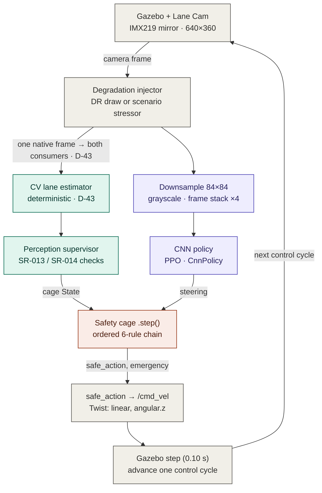

# Camera RL Training — End-to-End Front-Camera PPO (Track 'E')

| Field | Value |
| --- | --- |
| Artifact | Track 'E' training implementation (the camera counterpart of `docs/09`) |
| Version | **0.2** (2026-06-18 — complex_b training + self-approach off-road fix + RViz viz) |
| Phase / Gate | F3 training infrastructure, reused by track 'E' (GE3 train, GE4 eval) |
| Author | Samuel Sanchez |
| Date | 2026-06-18 |
| Status | CONFIRMED — implemented in `cobraflex_rl/train_ppo.py` + the camera branch of `cobraflex_rl/gazebo_lane_env.py` |
| Normative spec | Training Specification Ch.7 §7.2 (loop) + §7.7 (camera track). **This document is supporting rationale, not the normative source**: on any numeric discrepancy, §7.2/§7.7 prevails. |
| Decisions cited | D-41 (end-to-end camera architecture), D-43 (cage reads its own CV estimator), D-34 (cage in the training loop / TS-01), D-36 (main seed 2024), D-32 (external drivers) |
| Sibling documents | `docs/09_environment_design.md` (obs/action/wrapper), `docs/10_reward_function.md` (reward), `docs/12_cv_lane_keeper.md` (the classical CV baseline this agent is measured against) |

> Purpose: document *how* the end-to-end front-camera RL agent is trained — the
> entry-point script, the algorithm (PPO + CNN over a frame stack), the camera
> observation path, the H-10 visual domain randomisation, and the evidence the
> run emits — and *why* each piece is built this way. It complements the thesis
> prose (Ch.7 §7.7) with the engineering detail the committee may ask for. The
> companion `docs/12` documents the deterministic CV controller used as the fair
> baseline.

> **This is the verdict-bearing E-track path, in Gazebo.** The E-track evaluation that
> closes the thesis verdict (GE4, the 425k re-run) runs on **this** Gazebo stack —
> `docs/07` and ch.8 §8.9 score it. The Isaac-Sim migration
> ([docs/13](13_isaacsim_environment.md)) is a **separate, posterior** thread (a sim-to-real
> bridge) that **does not supersede** these results; a Gazebo checkpoint does not transfer to
> Isaac, so any Isaac E-policy is a future retrain, not a re-do of the 425k run documented here.

---

## 1. What "camera training" is, in one paragraph

Track 'E' (decision **D-41**) replaces the privileged ground-truth observation
of the F-track policy with the **raw front camera**: the policy is a CNN that
maps an 84×84 grayscale image (frame-stacked ×4) directly to a steering command.
Everything else in the loop — the fixed cruise speed, the in-process safety cage,
the reward, the episode logic, the spawn perturbation, the reproducibility
evidence — is **identical** to the state-vector training of `docs/09`. This is the
*minimal-delta* point of the E-design: the only things that change are the
observation block (image + `CnnPolicy` + frame stack) and the addition of visual
**domain randomisation**. The safety cage no longer reads ground truth either; it
reads a dedicated **deterministic CV lane-estimator** on the same camera frame
(decision **D-43**, see `docs/12` §4). Ground truth survives only as the
simulator-only reward/termination/metrics oracle — never an input to either the
policy or the cage.



*Figure — the E-track control loop (source: [`manuscript/figures/etrack_camera_control_loop.mmd`](../manuscript/figures/etrack_camera_control_loop.mmd)). The degraded frame splits to **two parallel consumers**: the CV estimator (teal) feeds the cage, the downsample/stack (purple) feeds the CNN policy — they are not in series. Ground truth is the sim-only reward/metrics oracle (§6), never an input to policy or cage.*

The degradation is applied **once, to the native frame, before both consumers** —
the D-43 *common-cause* design: the policy CNN and the cage's CV detector see the
same (possibly corrupted) world, so a camera fault can blind both at once and the
designed answer is the cage's open-loop controlled stop (SR-013/SR-014 → C-05
Trigger 8).

---

## 2. Entry point and orchestration (`train_ppo.py`)

The training script is `src/cobraflex_rl/cobraflex_rl/train_ppo.py`, exposed as
the console script **`train_ppo`** (`setup.py`) and wrapped by
`launch/train_lane.launch.py` (which brings up headless Gazebo, `gui:=false`,
then the node). It is a **single, modality-agnostic** entry point: the same
`main()` trains the F-track `MlpPolicy` and the track-'E' `CnnPolicy`; the
`observation.type` field of the config decides which.

`main()` runs one training session end-to-end:

1. **Load configs.** The centerline YAML (`oval_right_lane_centerline.yaml`) and
   the training config (`--train-config`, default `train_ppo.yaml`; the camera
   run passes `train_ppo_camera.yaml`). `camera_obs = (observation.type ==
   "camera")` is the single switch that selects the camera path everywhere below.
2. **Bring up the ROS↔Gazebo bridge.** `RosGazeboInterface` is constructed with
   the camera topic (`/camera/image_raw_lane`) only when `camera_obs`; it waits
   for the first `/odom` sample (10 s timeout).
3. **Unthrottle the sim clock** for headless runs (`sim_real_time_factor`). For
   the camera config this is set to **`1`** (real-time): camera rendering is
   real-time-bound in Gazebo, so a faster-than-real clock starves the image
   stream. The state-vector config can run "as fast as possible" (`0`).
4. **Build the env.** `GazeboLaneEnv(ros_interface, centerline, lane_width,
   road_width, cfg)` (see §3). `check_env` runs SB3's Gym-API conformance check.
5. **Wrap for the policy class** (see §4): camera → `VecFrameStack(DummyVecEnv([
   Monitor(env)]), n_stack=4)`; state → the raw env.
6. **Construct or resume PPO** with the config's hyperparameters and `seed`.
7. **Compose callbacks** (progress bar, learning curve, action samples,
   checkpoints — see §7) and call `model.learn(total_timesteps, callback,
   reset_num_timesteps=not resume)`.
8. **Persist evidence (always, even on failure):** the final `.zip`, the
   `experiments/sim/training/<run_id>/metadata.json`, the learning-curve and
   action-sample CSVs, periodic checkpoints under `policy/checkpoints/`, and a
   `checkpoint_registry.csv` row on success.

`--resume-from <ckpt.zip>` continues a saved policy (`PPO.load`,
`reset_num_timesteps=False`), so the run adds the config's `total_timesteps`
*on top of* the checkpoint's step count — used to extend a run without losing the
optimiser/normalisation state.

---

## 3. The training environment in camera mode (`GazeboLaneEnv`)

`GazeboLaneEnv` (`gazebo_lane_env.py`) is the single environment for both tracks;
the camera mode is the branch taken when `observation.type == "camera"`.

### 3.1 Observation space

```text
Box(low=0, high=255, shape=(84, 84, 1), dtype=uint8)   # grayscale; (84,84,3) if RGB kept
```

84×84 grayscale is fixed at E2 (`docs/09` §10) — the canonical Atari-CNN input
size, large enough to resolve the near-field lane markings, small enough to keep
the CNN cheap. **A single frame loses velocity/rate cues** (it is one snapshot of
a Markov-incomplete state); the trainer recovers them with a frame stack of
**k = 4** (§4), not by inflating the per-frame resolution.

### 3.2 The shared camera pipeline (`CameraPipeline`)

Each cycle, one native frame flows through `camera_pipeline.py`:

```text
raw frame ─► injector(frame)  ─►  degraded native frame ──► (a) CV lane-estimator → cage state
                                                        └──► (b) to_observation(): grayscale + INTER_AREA resize to 84×84 → policy obs
```

`process(frame)` returns `(consumer_frame, observation)`: the **native-resolution**
(possibly degraded) frame for the cage's CV estimator, and the **downsampled**
policy observation. The single `injector` callable is the per-episode degradation
(§5); applying it once before the split is the D-43 common-cause guarantee. The
module also hosts `decode_image()`, the pure ROS-image→BGR decoder, so the ROS
node and the env bridge share one proven decoder.

### 3.3 The cage on the CV estimate (D-43), not ground truth

In camera mode `_camera_cage_state()` feeds the cage from the
`CagePerceptionSupervisor` wrapping the deterministic `CvLaneEstimator` (the same
estimator the deployment node uses — `docs/12` §4). Per cycle it:

- samples the freshest frame (so the cage is not one control cycle behind — a bug
  found live at E2 that tripped the staleness budget and C-05 Trigger 3),
- runs the supervisor (health + plausibility checks, SR-013/SR-014),
- on a trustworthy estimate, builds a cage `State` stamped with the frame's
  **age** (so C-05's staleness trigger still measures real latency in episode
  time); otherwise passes `state=None` plus `perception_invalid=True` so the cage
  takes its missing-state path and, once persistence elapses, Trigger 8.

The per-cycle CV diagnostics (`cv_ey`, `cv_epsi`, `cv_confidence`,
`cv_state_available`, `cv_perception_invalid`, health/plausibility reasons) are
written into the step `info` for the evidence CSVs. **Reset priming:** on
`reset()` the supervisor is run on the settled spawn view until it accepts one
frame, so the cage's first cycle starts from an accepted state — without priming,
one bad first frame put the cage on its no-state-ever path → instant emergency →
1-step episodes.

### 3.4 Everything else is shared with `docs/09`

The action space (`Box([-1,1]`, steering only), the fixed cruise speed
(`fixed_speed = 0.20`), the in-process cage wiring (`_apply_cage`,
`safe_action_to_cmd`, enforcement vs monitoring), the reward (`compute_reward`,
`docs/10` — unchanged for the camera track, it scores the **ground-truth** state),
the emergency termination, the random spawn perturbation, and the F4 scenario
hooks (`reset(options=...)`) are byte-for-byte the F-track code. The camera branch
only swaps *what the policy sees* and *where the cage's state comes from*. The one
piece that is **no longer** identical is the off-road termination geometry on
self-approaching circuits — see §3.5.

### 3.5 Off-road termination on self-approaching circuits (complex_b)

The F-track oval terminates an episode on `abs(track_state.ey) > road_width/2`:
the **perpendicular** cross-track error to the (stateful) nearest centerline
segment. That is sound on a convex loop, but it **fails on a circuit that
approaches itself** — the complex_b kidney/scalloped track, where two parts of
the road pass within a road-width of each other. When the agent leaves its lane
there (typically driving straight off a curve), the nearest centerline point can
*leap to a different track section* and the cross-track error collapses, so the
episode never terminates even as the vehicle crosses the painted edge. Verified
in `policy/tests` and live: a global nearest-point search exhibits the same
collapse, so it is geometric, not a tracking-radius artefact.

The fix is **opt-in and gated** so the convex F-track oval is untouched:

- **Off-road by road-centre distance.** When a *road-centre* centerline is
  supplied (`--road-centerline-config`, env arg `road_centerline`), off-road is
  judged by the **global** distance from the vehicle to that centerline vs
  `road_width/2` (the painted edge) — `PolylineTracker.distance_to`, a stateless
  full sweep immune to the fold-back. The reward centerline stays the **right
  lane** (offset, `docs/09`); "left the road" is a property of the *road*, which
  is centred on the road centre, so the two centerlines play different roles
  (reward target vs containment edge). Verified: catches 28/28 straight-off
  departures to the grass on complex_b, 0 false positives in-lane.
- **Progress-bounded projection** (`PolylineTracker(max_advance_m=…)`, env flag
  `progress_bounded_tracking`) is a complementary, weaker mitigation that caps how
  far the projection's arc-length may advance per step to the real along-track
  travel; left **off** now that the road-centre check supersedes it.

Both default to legacy behaviour (no road centerline → perpendicular `ey`; flag
off → unbounded projection), so F-track runs are byte-for-byte unchanged.

---

## 4. The algorithm: PPO + `CnnPolicy` over a frame stack

The learner is **Stable-Baselines3 PPO** (Proximal Policy Optimization, the
clipped-surrogate actor-critic). Camera mode changes three things versus the
F-track `MlpPolicy`:

| Aspect | State track | Camera track |
| --- | --- | --- |
| Policy | `MlpPolicy` (2×64 MLP) | **`CnnPolicy`** (SB3 NatureCNN feature extractor → MLP heads) |
| Input | 6-D float vector | 84×84×4 uint8 image tensor |
| Vec wrapping | raw env | `VecFrameStack(DummyVecEnv([Monitor(env)]), n_stack=4)` |

```mermaid
flowchart LR
    OBS["Camera obs<br/>84&times;84&times;4"]
    subgraph TRUNK ["NatureCNN feature extractor (shared trunk)"]
        direction LR
        C1["Conv 8&times;8 s4<br/>32 &rarr; 20&sup2;"]
        C2["Conv 4&times;4 s2<br/>64 &rarr; 9&sup2;"]
        C3["Conv 3&times;3 s1<br/>64 &rarr; 7&sup2;"]
        FC["Flatten &middot; FC<br/>&rarr; 512 ReLU"]
        C1 --> C2 --> C3 --> FC
    end
    OBS --> C1
    FC --> PH["Policy head<br/>mean &mu; &amp; log &sigma;"]
    FC --> VH["Value head<br/>V(s) baseline"]
    PH --> ACT["Action: steer<br/>[&minus;1,1] &rarr; cage"]
    REW["Reward (sim oracle)<br/>ey, epsi, progress &middot; train only"]
    PPO["PPO clipped-surrogate update<br/>advantage = r + &gamma;V(s&prime;) &minus; V(s)"]
    VH -. "V(s)" .-> PPO
    REW -. .-> PPO
    PPO -. "&nabla;&theta;" .-> TRUNK

    classDef policy fill:#EEEDFE,stroke:#534AB7,color:#26215C,stroke-width:1.2px;
    classDef cage   fill:#FAECE7,stroke:#993C1D,color:#4A1B0C,stroke-width:1.2px;
    classDef sim    fill:#F1EFE8,stroke:#5F5E5A,color:#2C2C2A,stroke-width:1.2px;
    class OBS,C1,C2,C3,FC,PH policy;
    class ACT cage;
    class VH,REW,PPO sim;
```

*Figure — the camera policy network (source: [`manuscript/figures/camera_cnn_ppo_architecture.mmd`](../manuscript/figures/camera_cnn_ppo_architecture.mmd)). The conv dims are for the 84×84 input; the policy head's steering action is the only thing actuated, the value head and reward exist for PPO training alone.*

Three wrapper details, each load-bearing:

- **`VecFrameStack(n_stack=4)`** stacks the last 4 observations on the channel
  axis (84×84×1 → 84×84×4) so the CNN can infer motion/rate from the temporal
  difference between frames — the cues a single frame drops (§3.1). SB3 then adds
  **`VecTransposeImage`** automatically (channels-first for PyTorch conv layers),
  so the actual network input is 4×84×84.
- **`Monitor(env)`** must wrap the raw env *before* the vec wrappers: SB3
  auto-wraps a non-vectorised env with `Monitor`, but not a vec env, and without
  it `ep_rew_mean`/`ep_len_mean` stay `NaN` in the learning curve.
- **`DummyVecEnv`** (single env, in-process) — not `SubprocVecEnv`: there is one
  Gazebo server per run, so parallel envs would contend for one simulator.

### 4.1 Hyperparameters (`train_ppo_camera.yaml`)

```yaml
total_timesteps: 1000000    # 1M main run (~34 h at ~8 steps/s)
learning_rate:  0.0003
lr_schedule:    linear      # anneal the LR to 0 over training (stability)
gamma:          0.99
gae_lambda:     0.95
n_steps:        1024        # rollout length before each PPO update
batch_size:     64
n_epochs:       10
clip_range:     0.2
ent_coef:       0.0
vf_coef:        0.5
max_grad_norm:  0.5
target_kl:      0.5         # trust-region KL early-stop (stability brake)
normalize_reward: true      # VecNormalize(norm_reward, norm_obs=False) (stability)
clip_range_vf:  0.2         # value-fn clip; only meaningful with normalize_reward
device:         auto        # CNN uses CUDA when present, else CPU
seed:           2024        # E-main seed, mirrors the F-track main run (D-36)
policy:         CnnPolicy
control_dt:     0.10
fixed_speed:    0.20
sim_real_time_factor: 1     # camera rendering is real-time-bound
```

The **base** PPO hyperparameters (learning rate, `gamma`, `n_steps`, `batch_size`)
stay matched to the F-track so the camera↔state comparison isolates the
observation modality. The **stability levers** are the deliberate exception —
added after the first 1M camera run exposed an instability the F-track 200k run
never reached:

- **`target_kl: 0.5`** — without a trust-region brake, `approx_kl` ran away to ~2.7
  at ~105k steps and destroyed the policy + value function. SB3 now early-stops the
  update once a minibatch's `approx_kl` exceeds `1.5·target_kl`.
- **`normalize_reward: true` + `clip_range_vf: 0.2`** — even with the brake, the large
  reward scale (returns ~700) destabilised the critic (`value_loss` spiking to ~470),
  giving recoverable *sawtooth* crashes. `VecNormalize(norm_reward, norm_obs=False)`
  keeps the critic's targets ~O(1); `clip_range_vf` bounds its per-update move on
  that normalised scale.
- **`lr_schedule: linear`** — anneals the LR to 0, easing late-training instability.

These are *optimiser-stability* levers, not modality changes: `norm_obs` stays
`False` (the CNN consumes raw frames, so eval/inference are untouched) and
`ep_rew_mean` is logged **raw** (Monitor sits inside `VecNormalize`), so the
learning curve stays comparable to the F-track. Configs without these keys (the
frozen F-track `train_ppo.yaml`) get the SB3 defaults — F-track behaviour is
unchanged. The Isaac in-process trainer (`tools/isaac_train.py`) reads the same
config and honours the same levers ([docs/13](13_isaacsim_environment.md)).
`seed` propagates to Python/NumPy/Torch, the action space, *and*
`env.reset(seed=...)` so the spawn perturbation and the per-episode domain-
randomisation draw are reproducible (§7.2.7).

---

## 5. Visual domain randomisation (H-10 mitigation, SR-012)

The one *additive* element of camera training. `domain_randomization` in the
config turns it on:

```yaml
domain_randomization:
  enabled: true
  p_degrade: 0.5             # P(episode is degraded at all)
  level_range: [0.2, 0.8]    # intensity drawn uniformly in this band
  # modes: defaults to the H-10 trio
```

At each `reset()`, `VisualDomainRandomizer.sample(self.np_random)` draws a
per-episode `DegradationSpec` — with probability `p_degrade` a `(mode, level)`,
otherwise a clean episode. The spec becomes the episode's frame injector
(`_resolve_visual_injector`), applied by `CameraPipeline` to every frame. The
modes are the **H-10 trio** (`visual_degradation.MODES`), deterministic numpy
kernels:

| Mode | Models | Kernel (level ∈ [0,1]) |
| --- | --- | --- |
| `glare_overexposure` | sun glare / specular saturation | multiplicative gain (→2×) + additive wash toward white (→+160) |
| `low_light_underexposure` | dusk / deep shadow | brightness gain down (→0.15×) + contrast compression toward the mean |
| `motion_blur` | rolling-shutter smear at speed | horizontal box blur, window grows to 15 px |

**Why only these three at training time.** `occlusion` (SC-PERT-07, H-11) and
`false_lane` (SC-PERT-08, H-12) are **eval-only** stressors (`EVAL_ONLY_MODES`).
Training on them would teach the policy to *ignore exactly the cues whose loss
must trigger* the SR-013/SR-014 controlled stop — the cage's job, not the
policy's. The randomiser draws per-episode (not per-frame) so a degradation
persists across an episode the way a real lighting condition would, and it is
disabled for deterministic evaluation (a harsh draw at spawn would blind
perception before the run even starts).

---

## 6. Reward, cage and actuation — inherited unchanged

These are **not** re-specified here; they are the F-track artifacts the camera
track reuses verbatim:

- **Reward** — `rewards.py` / `docs/10`. Computed on the **ground-truth** state
  (`ey`, `epsi`, `progress`) plus the **raw** policy steering delta; observation-
  agnostic, so no new term for the camera. There is **no reward at evaluation** —
  the trained policy drives from the camera alone.
- **Cage in the loop (D-34/TS-01)** — the same `SafetyCageNode`/`cage.yaml` that
  `cage_ros_node` wraps in deployment, invoked in-process in `step()`. A fresh
  cage per episode (no latched C-05). `enforcement` = safe action actuated;
  `monitoring` = raw action actuated, cage shadow-logged for the counterfactual.
- **Actuation** — `safe_action_to_cmd` mirrors `vehicle_control_node` so the env
  emits the same `/cmd_vel` mapping (`yaw_gain`, `min_speed_scale`,
  `throttle_nominal`) the policy will face at deployment.

---

## 7. Callbacks and the evidence the run emits (`callbacks.py`)

Four SB3 callbacks compose the run's instrumentation (§7.2.8):

1. **`ProgressBarCallback`** — a live tqdm bar under a TTY, a periodic one-line
   log under `ros2 launch` (where tqdm's carriage-return redraw is swallowed).
2. **`LearningCurveCallback`** → `learning_curve.csv`, one row per rollout: the
   episode aggregates (`ep_rew_mean`, `ep_len_mean`), the PPO health scalars
   (`explained_variance`, `value_loss`, `entropy`, `approx_kl`, `clip_fraction`,
   `std`) and the **per-rule cage activity** (`intervention_rate`,
   `emergency_rate`, `int_rate_C-0x`). The cage series is what lets the
   co-adaptation and PPO-health figures be drawn from a re-trained run.
3. **`ActionSampleCallback`** → `action_samples.csv`, the raw steering subsampled
   every `action_sample_every` steps, for the early-vs-late action-distribution
   figure.
4. **`CheckpointCallback`** → periodic `cobraflex_ppo_lane_*.zip` under
   `policy/checkpoints/`, so a long camera run is resumable and a *peak*
   checkpoint can be selected post-hoc (see §8).

### 7.1 Reproducibility metadata

`metadata.json` is written for **every** run (success or failure): `run_id`,
`git_commit`, `cage_yaml` + hash, scenario/centerline hash, the saved policy
checkpoint + hash, `seed`, the hyperparameters, and the track-'E' provenance
block — `policy` (`CnnPolicy`), the `observation` block, and the
`domain_randomization` envelope. This is the reproducibility contract of the
CLAUDE.md "Reproducibility metadata" rule, instantiated for the camera run.

---

## 8. The current E-main run (newcam, 425k peak)

The training implementation above produced the current E-main checkpoint
(Ch.7 §7.7.8; CHANGELOG 2026-06-15):

- **Run** `ppo_newcam_train_2024_750k` — seed 2024, `CnnPolicy`, the DR envelope
  above (`p_degrade = 0.5`, level 0.2–0.8), over the **dedicated Lane Cam**
  (IMX219-160 mirror, 640×360, HFOV ≈ 90°, mounted 5 cm lower at the body front;
  `camera_geometry` h ≈ 0.077 m, pitch 0.30 rad — see `docs/12` §5).
- **Learning curve:** `ep_rew_mean` peaks **≈ 335.6 at ≈ 425k** steps (above the
  old `cam` peak of 288.5), then degrades to ~256 by 750k — hence
  **checkpoint-on-peak** selection.
- **E-main checkpoint** `cobraflex_ppo_newcam_lane_2024_425k_peak.zip`
  (hash `953ba930…`, **gitignored** per the binary-checkpoint policy — sync
  manually).
- **Nominal eval** (SC-NOM-01, seed 2024, 4400 steps, DR off): enforcement
  `rl_cam_eval_2024_425k_4k4` = **11.16 laps, mean |ey| 12.4 mm, 0 emergencies**;
  the F-track signature returns — the cage is **latent in-ODD** in both modes
  (M-S2 = 0), and the old 139k curve-apex SR-014/Trigger-8 controlled stop is
  **gone** (4.69 → 11+ laps).

> **Scope note.** This document covers the *training* implementation. The 425k
> **GE4 re-run is prepared + dry-run-validated but NOT yet launched** (≈ 16–17 h
> wall, single-seed — measured from the completed 139k E-campaign: 1660 runs in
> 16.5 h, ~31 s/run; N=5 multi-seed ≈ 80–85 h); `docs/07`, Ch.8 §8.9 and
> `experiments/sim/campaign_e/` still
> report the **139k** campaign until the re-run lands. Do not cite a 425k campaign
> verdict from this document.

---

## 9. How to run

**Command summary** (detail + rationale below; all on **Ubuntu 24.04 + ROS2 Jazzy**, source
ROS2 first). `CFG=$(ros2 pkg prefix cobraflex_rl)/share/cobraflex_rl/config`:

```bash
# ── State-track (F-track) PPO — launch wires headless Gazebo + the bare train node ──
ros2 launch cobraflex_rl train_lane.launch.py            # complex_b, STATE config (train_ppo.yaml)

# ── Track-'E' camera PPO — two-step: own Gazebo, then the node (see §9 for why) ──────
ros2 launch cobraflex gazebo_mesh.launch.py world:=lane_following_oval_complex gui:=false

export CFG=$PWD/src/cobraflex_rl/config     # PC CAST  

ros2 run cobraflex_rl train_ppo \
  --train-config           $CFG/train_ppo_camera.yaml \
  --centerline-config      $CFG/complex_b_right_lane_centerline.yaml \
  --road-centerline-config $CFG/complex_b_centerline.yaml \
  --world-name lane_following_complex_b --run-id ppo_newcam_complex_b_2024

# ── Resume a checkpoint (adds the config's total_timesteps on top, §2) ───────────────
ros2 run cobraflex_rl train_ppo --train-config $CFG/train_ppo_camera.yaml \
  --resume-from policy/checkpoints/<ckpt>.zip --run-id <run>

# ── Live RViz cage/agent view (needs viz: true in train_ppo_camera.yaml, §9.1) ───────
ros2 run rviz2 rviz2 -d src/cobraflex/rviz/cage_viz.rviz --ros-args -p use_sim_time:=true
```

> Long-lived runs: launch Gazebo **headless** (`gui:=false`) and detach with `setsid` —
> closing the GUI tears down the bridge/`robot_state_publisher` and orphans `gz sim -s`,
> starving the env's `/odom_truth` wait. For the Isaac (Gazebo-free) trainer, see
> [docs/13 §Command reference](13_isaacsim_environment.md#command-reference-what-launches-what).

**Why the camera run is two-step** (the commands are in the summary above).
`train_lane.launch.py` defaults to the **complex_b** circuit and wires the three things that
must agree — `world=lane_following_oval_complex.world`,
`world_name=lane_following_complex_b` (the SDF name the gz teleport services are namespaced
by), `centerline=complex_b_right_lane_centerline.yaml` (reward target) and
`road_centerline=complex_b_centerline.yaml` (off-road geometry, §3.5) — but it runs
`train_ppo` **bare → the STATE config**. So the **camera** policy is run as two steps: bring
up Gazebo (`gui:=false`), then launch the node explicitly with `train_ppo_camera.yaml`
against that already-running world (the summary block). To **revert to the oval**, swap
`world:=lane_following_oval`, both centerlines to `oval_right_lane_centerline.yaml`, and
`--world-name lane_following_oval`.

**Live RViz view (`viz: true` in `train_ppo_camera.yaml`).** The env can publish
what the cage and agent see — off by default so headless campaigns pay nothing;
see §9.1.

> Host: **Ubuntu 24.04 + ROS2 Jazzy**. The commands above **were executed on this
> host** — a full 20k-step camera smoke run on complex_b completed clean
> (`ep_rew_mean` 34→90, `ep_len_mean` 72→141, 0 errors), exercising the §3.5
> off-road fix (the `setsid`/headless caveat is in the summary note above). The
> pure-Python pieces (`camera_pipeline`, `camera_geometry`, `visual_degradation`,
> `visual_domain_randomization`, `cv_lane_estimator`, `polyline_tracker`) are
> host-testable without ROS (`policy/tests/`).

### 9.1 RViz visualisation of the cage + agent (`cage_viz.py`)

When `viz: true`, each control step the env publishes (via `CageViz`):

- **`/cage/markers`** (`visualization_msgs/MarkerArray`) — the road-centre line,
  the painted **road edges** (the §3.5 off-road boundary, centre ± road_width/2),
  the reward (right-lane) target line, and the vehicle marker + status text,
  colour-coded **green** = on-road / **orange** = cage intervention / **red** =
  emergency or off-road.
- **`/agent/obs_image`** (`sensor_msgs/Image`, mono8) — the exact 84×84 grayscale
  frame the CNN policy sees this step.

```bash
ros2 run rviz2 rviz2 -d src/cobraflex/rviz/cage_viz.rviz --ros-args -p use_sim_time:=true
```

Markers are stamped with **time 0** on purpose: the train node runs on the wall
clock (it is not launched with `use_sim_time`) while RViz runs on sim time, so a
real stamp is decades in RViz's future and the frame transform fails (the markers
streak); a zero stamp makes RViz resolve against the latest transform. Fixed Frame
= `odom`. The per-episode teleport back to the spawn (a `reset()`) makes the
vehicle marker "jump" — that is the episode boundary, not a fault.

<!---

## 10. Anticipated defense questions

**Q1. Why a CNN over a frame stack and not a recurrent policy?**
A 4-frame stack gives the policy the short temporal window it needs (motion/rate
cues) at a fraction of the training cost and instability of a recurrent net, and
it keeps the architecture comparable to the well-understood Atari-CNN baseline.
The state track already showed first-order memory (`prev_steer`) suffices for the
regulation task; the stack is its image analogue.

**Q2. The cage reads a CV estimator that can fail on the same frame that fools
the CNN. Isn't that a single point of failure?**
Yes — and it is a *deliberate, documented* common cause (D-43): on a real road
the cage cannot have privileged ground truth, so it must perceive independently
of the policy but from the same sensor. The mitigation is not redundancy of input
but a redundant *response*: when perception is untrustworthy the cage does not
trust a possibly-wrong estimate — it executes the open-loop controlled stop
(SR-013/SR-014 → C-05 Trigger 8). The eval-only `occlusion`/`false_lane`
stressors exist precisely to verify that response.

**Q3. Why train on glare/low-light/motion-blur but not occlusion/false-lane?**
Because SR-012 asks the policy to be *robust* across the H-10 nuisance envelope
(it should keep driving through glare), whereas H-11/H-12 are *perception-loss*
hazards whose correct answer is the cage stop, not continued driving. Training the
policy to "see through" an occlusion would train it to ignore the very signal the
safety case relies on.

**Q4. Why is `sim_real_time_factor` 1 for the camera but 0 for the state track?**
The Gazebo camera sensor renders in real time; an unthrottled clock starves the
image stream and produces stale/dropped frames. The state track has no rendered
sensor, so it runs as fast as the physics allows. Physics fidelity and
reproducibility are unchanged either way (the factor touches neither the `.world`
nor `max_step_size`).

**Q5. The reward uses ground truth — isn't that cheating for a "camera" agent?**
No. The reward is a *training-time* signal that exists only in simulation; it
shapes learning but is never an input to the policy. At evaluation there is no
reward and no ground truth in the loop — the policy drives from the camera alone
and the cage from its CV estimate. Ground truth's only runtime role is as the
metrics oracle that scores the verdict (Ch.8 §8.2.3).

**Q6. How is the run reproducible given a stochastic simulator and DR?**
One `seed` seeds Python/NumPy/Torch, the action space, the env's spawn
perturbation, and the DR draw; `metadata.json` pins the git commit and the
cage/scenario/checkpoint hashes. Two runs with the same seed and commit reproduce
the same learning curve up to Gazebo's own timing nondeterminism (the reason a
multi-seed N=5 confirmation is the planned robustness check).

--->

## Version log

- **v0.3 (2026-06-21):** **PPO stability levers** added to `train_ppo_camera.yaml`
  (§4.1) after the first 1M camera run collapsed (`approx_kl` runaway at ~105k) then
  *sawtoothed* (critic chasing the ~700 reward scale): `target_kl`, `lr_schedule:
  linear`, `normalize_reward` (`VecNormalize`, reward-only), `clip_range_vf`, plus the
  full PPO hyperparameter set now explicit. Also hardened the gz `set_pose` reset
  path (timeout 2000→3500 ms, 2→4 retries) and propagated the same levers to the
  Isaac trainer (`tools/isaac_train.py`), whose defaults now target complex_b camera
  ([docs/13](13_isaacsim_environment.md)). Inert defaults keep the F-track unchanged.
- **v0.2 (2026-06-18):** training moved to the **complex_b** circuit. Added: the
  self-approaching-circuit **off-road fix** (§3.5 — off-road by global distance to
  the road-centre centerline via `PolylineTracker.distance_to`; reward stays on the
  right lane; opt-in progress-bounded projection as a weaker complement, left off);
  the `world_name` wiring for gz teleport services on the renamed world; the
  **camera pitch 0.25 → 0.30 rad** alignment to the URDF mount (§8, `camera_geometry`);
  and the **RViz cage/agent view** (§9.1 — `cage_viz.CageViz`, `/cage/markers` +
  `/agent/obs_image`, `viz` flag). §9 rewritten for the complex_b two-step run and
  confirmed executed on the Ubuntu host (20k smoke completed clean). F-track oval
  behaviour is unchanged (all new paths are opt-in / gated).
- **v0.1 (2026-06-15):** first freeze. Documents the camera-training
  implementation as it stands after the Lane-Cam switch + 425k retrain
  (§7.7.8): `train_ppo.py` entry point, the `GazeboLaneEnv` camera branch,
  `CnnPolicy` + `VecFrameStack(k=4)`, the H-10 domain randomisation, the callback
  evidence, and the newcam main run. The GE4 campaign on 425k is prepared but not
  launched; this document is training-only and makes no 425k verdict claim.
