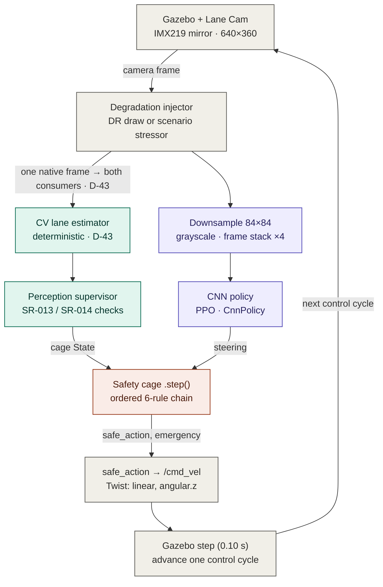

# Camera RL Training — End-to-End Front-Camera PPO + Posterior SAC (Track 'E')

| Field | Value |
| --- | --- |
| Artifact | Track 'E' training implementation (the camera counterpart of `docs/09`) |
| Version | **0.8** (2026-07-20 — Gazebo 2-D qualification contract and D-43/SC-PERT execution gates added; GE4-V2 remains frozen) |
| Phase / Gate | F3 training infrastructure, reused by track 'E' (GE3 train, GE4 eval) |
| Author | Samuel Sanchez |
| Date | 2026-07-20 |
| Status | CONFIRMED — the shared `cobraflex_rl/train_ppo.py` entry point trains PPO or SAC; the verdict-bearing E-main remains PPO |
| Normative spec | Training Specification Ch.7 §7.2 (loop) + §7.7 (camera track). **This document is supporting rationale, not the normative source**: on any numeric discrepancy, §7.2/§7.7 prevails. |
| Decisions cited | D-41 (end-to-end camera architecture), D-43 (cage reads its own CV estimator), D-34 (cage in the training loop / TS-01), D-36 (main seed 2024), D-49/D-59 (1-D verdict vs posterior 2-D), D-60 (PPO/SAC switch), D-32 (external drivers) |
| Sibling documents | `docs/09_environment_design.md` (obs/action/wrapper), `docs/10_reward_function.md` (reward), `docs/12_cv_lane_keeper.md` (the classical CV baseline this agent is measured against) |

> Purpose: document *how* the end-to-end front-camera RL agent is trained — the
> entry-point script, the verdict algorithm (PPO) and posterior comparator (SAC),
> both using a CNN over a frame stack, the camera
> observation path, the H-10 visual domain randomisation, and the evidence the
> run emits — and *why* each piece is built this way. It complements the thesis
> prose (Ch.7 §7.7) with the engineering detail the committee may ask for. The
> companion `docs/12` documents the deterministic CV controller used as the fair
> baseline.
> **This is the verdict-bearing E-track path, in Gazebo.** The E-track evaluation that
> closes the thesis verdict — **GE4-V2 on the 297k E-main, complete 28.06.2026 (§8.4)** — ran on
> **this** Gazebo stack; `docs/07` and ch.8 §8.9 score it, and **G4 is closed** on it (docs/07,
> 02.07.2026). The Isaac-Sim migration
> ([docs/13](13_isaacsim_environment.md)) is a **separate, posterior** thread (a sim-to-real
> bridge) that **does not supersede** these results; a Gazebo checkpoint does not transfer to
> Isaac. The posterior Isaac policies are independent retrains, not transfers or a re-do of
> the 297k campaign documented here; any new Isaac variant likewise requires retraining.

---

## 1. What "camera training" is, in one paragraph

Track 'E' (decision **D-41**) replaces the privileged ground-truth observation
of the F-track policy with the **raw front camera**: the policy is a CNN that
maps an 84×84 grayscale image (frame-stacked ×4) directly to a steering command.
Everything else in the loop — the fixed cruise speed, the in-process safety cage,
the reward, the episode logic, the spawn perturbation, the reproducibility
evidence — is **identical** to the state-vector training of `docs/09`. This is the
*minimal-delta* point of the E-design: the only things that change are the
observation block (image + `CnnPolicy` + frame stack) and the addition of visual
**domain randomisation**. The safety cage no longer reads ground truth either; it
reads a dedicated **deterministic CV lane-estimator** on the same camera frame
(decision **D-43**, see `docs/12` §4). Ground truth survives only as the
simulator-only reward/termination/metrics oracle — never an input to either the
policy or the cage.



*Figure — the E-track control loop (source: [`manuscript/figures/etrack_camera_control_loop.mmd`](../manuscript/figures/etrack_camera_control_loop.mmd)). The degraded frame splits to **two parallel consumers**: the CV estimator (teal) feeds the cage, the downsample/stack (purple) feeds the CNN policy — they are not in series. Ground truth is the sim-only reward/metrics oracle (§6), never an input to policy or cage.*

The degradation is applied **once, to the native frame, before both consumers** —
the D-43 *common-cause* design: the policy CNN and the cage's CV detector see the
same (possibly corrupted) world, so a camera fault can blind both at once and the
designed answer is the cage's open-loop controlled stop (SR-013/SR-014 → C-05
Trigger 8).

---

## 2. Entry point and orchestration (`train_ppo.py`)

The training script is `src/cobraflex_rl/cobraflex_rl/train_ppo.py`, exposed as
the console script **`train_ppo`** (`setup.py`) and wrapped by
`launch/train_lane.launch.py` (which brings up headless Gazebo, `gui:=false`,
then the node). It is a **single, modality-agnostic** entry point: the same
`main()` trains the F-track `MlpPolicy` and the track-'E' `CnnPolicy`; the
`observation.type` field of the config decides which.

`main()` runs one training session end-to-end:

1. **Load configs.** The centerline YAML (`oval_right_lane_centerline.yaml`) and
   the training config (`--train-config`, default `train_ppo.yaml`; the camera
   run passes `train_ppo_camera.yaml`). `camera_obs = (observation.type ==
   "camera")` is the single switch that selects the camera path everywhere below.
2. **Bring up the ROS↔Gazebo bridge.** `RosGazeboInterface` is constructed with
   the camera topic (`/camera/image_raw_lane`) only when `camera_obs`; it waits
   for the first `/odom` sample (10 s timeout).
3. **Unthrottle the sim clock** for headless runs (`sim_real_time_factor`). For
   the camera config this is set to **`1`** (real-time): camera rendering is
   real-time-bound in Gazebo, so a faster-than-real clock starves the image
   stream. The state-vector config can run "as fast as possible" (`0`).
4. **Build the env.** `GazeboLaneEnv(ros_interface, centerline, lane_width,
   road_width, cfg)` (see §3). `check_env` runs SB3's Gym-API conformance check.
5. **Wrap for the policy class** (see §4): camera → `VecFrameStack(DummyVecEnv([
   Monitor(env)]), n_stack=4)`; state → the raw env.
6. **Construct or resume PPO** with the config's hyperparameters and `seed`.
7. **Compose callbacks** (progress bar, learning curve, action samples,
   checkpoints — see §7) and call `model.learn(total_timesteps, callback,
   reset_num_timesteps=not resume)`.
8. **Persist evidence (always, even on failure):** the final `.zip`, the
   `experiments/sim/training/<run_id>/metadata.json`, the learning-curve and
   action-sample CSVs, periodic checkpoints under `policy/checkpoints/`, and a
   `checkpoint_registry.csv` row on success.

`--resume-from <ckpt.zip>` continues a saved policy (`PPO.load`,
`reset_num_timesteps=False`), so the run adds the config's `total_timesteps`
*on top of* the checkpoint's step count — used to extend a run without losing the
optimiser/normalisation state.

---

## 3. The training environment in camera mode (`GazeboLaneEnv`)

`GazeboLaneEnv` (`gazebo_lane_env.py`) is the single environment for both tracks;
the camera mode is the branch taken when `observation.type == "camera"`.

### 3.1 Observation space

```text
Box(low=0, high=255, shape=(84, 84, 1), dtype=uint8)   # grayscale; (84,84,3) if RGB kept
```

84×84 grayscale is fixed at E2 (`docs/09` §10) — the canonical Atari-CNN input
size, large enough to resolve the near-field lane markings, small enough to keep
the CNN cheap. **A single frame loses velocity/rate cues** (it is one snapshot of
a Markov-incomplete state); the trainer recovers them with a frame stack of
**k = 4** (§4), not by inflating the per-frame resolution.

### 3.2 The shared camera pipeline (`CameraPipeline`)

Each cycle, one native frame flows through `camera_pipeline.py`:

```text
raw frame ─► injector(frame)  ─►  degraded native frame ──► (a) CV lane-estimator → cage state
                                                        └──► (b) to_observation(): grayscale + INTER_AREA resize to 84×84 → policy obs
```

`process(frame)` returns `(consumer_frame, observation)`: the **native-resolution**
(possibly degraded) frame for the cage's CV estimator, and the **downsampled**
policy observation. The single `injector` callable is the per-episode degradation
(§5); applying it once before the split is the D-43 common-cause guarantee. The
module also hosts `decode_image()`, the pure ROS-image→BGR decoder, so the ROS
node and the env bridge share one proven decoder.

### 3.3 The cage on the CV estimate (D-43), not ground truth

In camera mode `_camera_cage_state()` feeds the cage from the
`CagePerceptionSupervisor` wrapping the deterministic `CvLaneEstimator` (the same
estimator the deployment node uses — `docs/12` §4). Per cycle it:

- samples the freshest frame (so the cage is not one control cycle behind — a bug
  found live at E2 that tripped the staleness budget and C-05 Trigger 3),
- runs the supervisor (health + plausibility checks, SR-013/SR-014),
- on a trustworthy estimate, builds a cage `State` stamped with the frame's
  **age** (so C-05's staleness trigger still measures real latency in episode
  time); otherwise passes `state=None` plus `perception_invalid=True` so the cage
  takes its missing-state path and, once persistence elapses, Trigger 8.

The per-cycle CV diagnostics (`cv_ey`, `cv_epsi`, `cv_confidence`,
`cv_state_available`, `cv_perception_invalid`, health/plausibility reasons) are
written into the step `info` for the evidence CSVs. **Reset priming:** on
`reset()` the supervisor is run on the settled spawn view until it accepts one
frame, so the cage's first cycle starts from an accepted state — without priming,
one bad first frame put the cage on its no-state-ever path → instant emergency →
1-step episodes.

### 3.4 Everything else is shared with `docs/09`

The action space (`Box([-1,1]`, steering only), the fixed cruise speed
(`fixed_speed = 0.20`), the in-process cage wiring (`_apply_cage`,
`safe_action_to_cmd`, enforcement vs monitoring), the reward (`compute_reward`,
`docs/10` — unchanged for the camera track, it scores the **ground-truth** state),
the emergency termination, the random spawn perturbation, and the F4 scenario
hooks (`reset(options=...)`) are byte-for-byte the F-track code. The camera branch
only swaps *what the policy sees* and *where the cage's state comes from*. The one
piece that is **no longer** identical is the off-road termination geometry on
self-approaching circuits — see §3.5.

### 3.5 Off-road termination on self-approaching circuits (complex_b)

The F-track oval terminates an episode on `abs(track_state.ey) > road_width/2`:
the **perpendicular** cross-track error to the (stateful) nearest centerline
segment. That is sound on a convex loop, but it **fails on a circuit that
approaches itself** — the complex_b kidney/scalloped track, where two parts of
the road pass within a road-width of each other. When the agent leaves its lane
there (typically driving straight off a curve), the nearest centerline point can
*leap to a different track section* and the cross-track error collapses, so the
episode never terminates even as the vehicle crosses the painted edge. Verified
in `policy/tests` and live: a global nearest-point search exhibits the same
collapse, so it is geometric, not a tracking-radius artefact.

The fix is **opt-in and gated** so the convex F-track oval is untouched:

- **Off-road by road-centre distance.** When a *road-centre* centerline is
  supplied (`--road-centerline-config`, env arg `road_centerline`), off-road is
  judged by the **global** distance from the vehicle to that centerline vs
  `road_width/2` (the painted edge) — `PolylineTracker.distance_to`, a stateless
  full sweep immune to the fold-back. The reward centerline stays the **right
  lane** (offset, `docs/09`); "left the road" is a property of the *road*, which
  is centred on the road centre, so the two centerlines play different roles
  (reward target vs containment edge). Verified: catches 28/28 straight-off
  departures to the grass on complex_b, 0 false positives in-lane.
- **Progress-bounded projection** (`PolylineTracker(max_advance_m=…)`, env flag
  `progress_bounded_tracking`) is a complementary, weaker mitigation that caps how
  far the projection's arc-length may advance per step to the real along-track
  travel; left **off** now that the road-centre check supersedes it.

Both default to legacy behaviour (no road centerline → perpendicular `ey`; flag
off → unbounded projection), so F-track runs are byte-for-byte unchanged.

---

## 4. The algorithm: PPO + `CnnPolicy` over a frame stack

The learner is **Stable-Baselines3 PPO** (Proximal Policy Optimization, the
clipped-surrogate actor-critic). Camera mode changes three things versus the
F-track `MlpPolicy`:

| Aspect | State track | Camera track |
| --- | --- | --- |
| Policy | `MlpPolicy` (2×64 MLP) | **`CnnPolicy`** (SB3 NatureCNN feature extractor → MLP heads) |
| Input | 6-D float vector | 84×84×4 uint8 image tensor |
| Vec wrapping | raw env | `VecFrameStack(DummyVecEnv([Monitor(env)]), n_stack=4)` |

```mermaid
flowchart LR
    OBS["Camera obs<br/>84&times;84&times;4"]
    subgraph TRUNK ["NatureCNN feature extractor (shared trunk)"]
        direction LR
        C1["Conv 8&times;8 s4<br/>32 &rarr; 20&sup2;"]
        C2["Conv 4&times;4 s2<br/>64 &rarr; 9&sup2;"]
        C3["Conv 3&times;3 s1<br/>64 &rarr; 7&sup2;"]
        FC["Flatten &middot; FC<br/>&rarr; 512 ReLU"]
        C1 --> C2 --> C3 --> FC
    end
    OBS --> C1
    FC --> PH["Policy head<br/>mean &mu; &amp; log &sigma;"]
    FC --> VH["Value head<br/>V(s) baseline"]
    PH --> ACT["Action: steer<br/>[&minus;1,1] &rarr; cage"]
    REW["Reward (sim oracle)<br/>ey, epsi, progress &middot; train only"]
    PPO["PPO clipped-surrogate update<br/>advantage = r + &gamma;V(s&prime;) &minus; V(s)"]
    VH -. "V(s)" .-> PPO
    REW -. .-> PPO
    PPO -. "&nabla;&theta;" .-> TRUNK

    classDef policy fill:#EEEDFE,stroke:#534AB7,color:#26215C,stroke-width:1.2px;
    classDef cage   fill:#FAECE7,stroke:#993C1D,color:#4A1B0C,stroke-width:1.2px;
    classDef sim    fill:#F1EFE8,stroke:#5F5E5A,color:#2C2C2A,stroke-width:1.2px;
    class OBS,C1,C2,C3,FC,PH policy;
    class ACT cage;
    class VH,REW,PPO sim;
```

*Figure — the camera policy network (source: [`manuscript/figures/camera_cnn_ppo_architecture.mmd`](../manuscript/figures/camera_cnn_ppo_architecture.mmd)). The conv dims are for the 84×84 input; the policy head's steering action is the only thing actuated, the value head and reward exist for PPO training alone.*

Three wrapper details, each load-bearing:

- **`VecFrameStack(n_stack=4)`** stacks the last 4 observations on the channel
  axis (84×84×1 → 84×84×4) so the CNN can infer motion/rate from the temporal
  difference between frames — the cues a single frame drops (§3.1). SB3 then adds
  **`VecTransposeImage`** automatically (channels-first for PyTorch conv layers),
  so the actual network input is 4×84×84.
- **`Monitor(env)`** must wrap the raw env *before* the vec wrappers: SB3
  auto-wraps a non-vectorised env with `Monitor`, but not a vec env, and without
  it `ep_rew_mean`/`ep_len_mean` stay `NaN` in the learning curve.
- **`DummyVecEnv`** (single env, in-process) — not `SubprocVecEnv`: there is one
  Gazebo server per run, so parallel envs would contend for one simulator.

### 4.1 Hyperparameters (`train_ppo_camera.yaml`)

```yaml
total_timesteps: 1000000    # 1M main run (~34 h at ~8 steps/s)
learning_rate:  0.0003
lr_schedule:    linear      # anneal the LR to 0 over training (stability)
gamma:          0.99
gae_lambda:     0.95
n_steps:        1024        # rollout length before each PPO update
batch_size:     64
n_epochs:       10
clip_range:     0.2
ent_coef:       0.0
vf_coef:        0.5
max_grad_norm:  0.5
target_kl:      0.5         # trust-region KL early-stop (stability brake)
normalize_reward: true      # VecNormalize(norm_reward, norm_obs=False) (stability)
clip_range_vf:  0.2         # value-fn clip; only meaningful with normalize_reward
device:         auto        # CNN uses CUDA when present, else CPU
seed:           2024        # E-main seed, mirrors the F-track main run (D-36)
policy:         CnnPolicy
control_dt:     0.10
fixed_speed:    0.20
sim_real_time_factor: 1     # camera rendering is real-time-bound
```

The **base** PPO hyperparameters (learning rate, `gamma`, `n_steps`, `batch_size`)
stay matched to the F-track so the camera↔state comparison isolates the
observation modality. The **stability levers** are the deliberate exception —
added after the first 1M camera run exposed an instability the F-track 200k run
never reached:

- **`target_kl: 0.5`** — without a trust-region brake, `approx_kl` ran away to ~2.7
  at ~105k steps and destroyed the policy + value function. SB3 now early-stops the
  update once a minibatch's `approx_kl` exceeds `1.5·target_kl`.
- **`normalize_reward: true` + `clip_range_vf: 0.2`** — even with the brake, the large
  reward scale (returns ~700) destabilised the critic (`value_loss` spiking to ~470),
  giving recoverable *sawtooth* crashes. `VecNormalize(norm_reward, norm_obs=False)`
  keeps the critic's targets ~O(1); `clip_range_vf` bounds its per-update move on
  that normalised scale.
- **`lr_schedule: linear`** — anneals the LR to 0, easing late-training instability.

These are *optimiser-stability* levers, not modality changes: `norm_obs` stays
`False` (the CNN consumes raw frames, so eval/inference are untouched) and
`ep_rew_mean` is logged **raw** (Monitor sits inside `VecNormalize`), so the
learning curve stays comparable to the F-track. Configs without these keys (the
frozen F-track `train_ppo.yaml`) get the SB3 defaults — F-track behaviour is
unchanged. The Isaac in-process trainer (`tools/isaac_train.py`) reads the same
config and honours the same levers ([docs/13](13_isaacsim_environment.md)).
`seed` propagates to Python/NumPy/Torch, the action space, *and*
`env.reset(seed=...)` so the spawn perturbation and the per-episode domain-
randomisation draw are reproducible (§7.2.7).

### 4.2 Algorithm switch — `algorithm: ppo | sac` (posterior, 15.07.2026; D-60)

The trainer is no longer PPO-only: a single **`algorithm:`** key in the training
config selects the SB3 class (`ppo`, the default, or `sac`), keeping **everything
else shared verbatim** — env, wrappers (`Monitor`/`VecFrameStack`/`VecNormalize`),
reward, cage wiring, seed handling, LR (+ linear schedule), device, and the whole
evidence pipeline. Two configs differing only in `algorithm:` are therefore a
like-for-like algorithm comparison on the frozen 1-D camera architecture; a
separate SAC entry point was rejected because it would duplicate (and let drift)
that shared stack (rationale: D-60). `train_sac_camera.yaml` is the SAC mirror of
`train_ppo_camera.yaml`; `train_{ppo,sac}_camera_pilot25k.yaml` are the 25k
verification pair (seed 2024).

Mechanics worth knowing:

- **SAC block.** Off-policy knobs live in an optional `sac:` block
  (`buffer_size`, `learning_starts`, `tau`, `train_freq`, `gradient_steps`,
  `ent_coef: auto`, `target_update_interval`). All SB3-standard defaults except
  `buffer_size`: one 84×84×4 uint8 transition holds ~56 KB in the replay buffer,
  so SB3's 1M default would demand ~56 GB RAM — the trainer caps the default at
  100k (≈5.6 GB) and camera configs must keep the key explicit. PPO-only keys
  (`n_steps`, `clip_range`, `target_kl`, `clip_range_vf`, …) are ignored under
  SAC (kept in the SAC configs so a diff against the PPO twin shows only the
  switch).
- **Wrapper-order fix (SB3 incompatibility).** With SAC + image obs +
  `VecNormalize`, SB3 adds `VecTransposeImage` *outside* `VecNormalize`, but the
  off-policy replay buffer stores VecNormalize's *original* (channels-last) obs
  — a shape crash. On the SAC+camera path only, the trainer applies the
  transpose *inside* the normalizer; the PPO wrapper stack stays byte-identical
  to the frozen runs.
- **Evidence schema unchanged.** `learning_curve.csv` keeps the exact PPO column
  set under SAC (`value_loss` ← `train/critic_loss`, `entropy` ←
  `train/ent_coef` — the auto-tuned temperature, SAC's "exploration is
  contracting" series; `approx_kl`/`clip_fraction`/`std`/`explained_variance`
  stay NaN), with rows throttled to one per 1024-step window (SAC ends an SB3
  "rollout" every `train_freq` steps). Every curve reader stays
  algorithm-agnostic. `metadata.json` records `algorithm` + the per-algorithm
  hyperparameter block; the checkpoint registry id becomes
  `cobraflex_<algo>_lane`.
- **Eval.** `eval_policy` resolves the SB3 class from the config's `algorithm`
  key (override: `--algorithm sac`) — same scored harness, same cage.
- **Launch.** `train_lane.launch.py` now exposes `train_config:=` / `run_id:=` /
  `model_path:=` (the algorithm is selected by pointing `train_config` at the
  SAC YAML; a bare launch is unchanged).

**25k verification pilots — the four-curve battery** (complex_b, seed 2024,
enforcement, DR on; two pairs, each pair's configs identical except
`algorithm:`; reward scales comparable *within* a pair, not across — the 2-D
family adds `throttle_delta`/`stall_penalty` terms, random spawns and a
2048-step episode cap):

- **1-D pair** (`train_{ppo,sac}_camera_pilot25k.yaml`): both learn healthily
  from pixels; SAC overtakes PPO from ~15k and ends `ep_rew_mean` **161.7 vs
  131.7** (+23%), `ep_len_mean` 186 vs 162, slightly lower cage-intervention
  rate (0.85 vs 0.91, C-06-dominated as usual early), ~0 emergencies in both,
  identical wall-clock (~7 steps/s — rendering-bound; the GPU absorbs SAC's
  per-step gradient update).
- **2-D pair** (`train_{ppo,sac}_camera_2d_pilot25k.yaml`; the D-60 switch and
  the D-59 2-D `action:` block compose with zero code change): PPO ends
  **113.0** (flattening at its 114 peak ≈24.5k) vs SAC **90.0** — but SAC is
  still *accelerating* at cutoff (7 → 19 → 67 → 90 at 5k/12k/20k/25k, the
  steepest end-slope of the four curves) and drives the longest episodes of
  the battery (`ep_len` 198 vs 154 — slower, more survivable driving). The
  off-policy warmup (1k random steps + auto-temperature) delays SAC's takeoff
  by design; the 25k cutoff could not establish whether it would beat the 2-D
  PPO ceiling (planned-1M baseline peak 654 ≪ 1-D 823, §8.5). The longer tuned
  SAC run was subsequently executed to 251k and is reported below.

- **Tuned 2-D SAC variant (fifth curve, outside the pair).** The paired SAC
  arms inherit two PPO-shared values that are non-canonical for SAC —
  `batch_size 64` (canonical 256) and `lr_schedule: linear` (canonical
  constant; the anneal switches learning off when the buffer is richest).
  `train_sac_camera_2d_tuned.yaml` (+ its 25k pilot) restores SAC-canonical
  values and adds `gradient_steps 2` (UTD 2 — free wall-clock: the render caps
  collection at ~7 steps/s while the GPU idles) and `learning_starts 5000`.
  Pilot result: **107.4** with only ~20k learning steps — passes the untuned
  arm (90.0) at ~16k, nearly catches PPO (113.0) at cutoff with the steepest
  late slope (31 → 76 → 107 at 15k/20k/25k), and drives *faster* (`ep_len` 131
  vs 198, PPO-like profile; emergencies up slightly, 0.011). The
  PPO-inherited values were handicapping SAC. This recommendation was followed
  in the planned-1M tuned run reported below.

- **Planned-1M 1-D SAC run, stopped at 307k (17.07.2026) — the follow-up the pilots called for.**
  `sac_newcam_complex_b_2024_1M` (seed 2024 restored in both config twins — the
  multiseed leftover `seed: 23` contradicted the D-36 comment — and
  `checkpoint_freq: 25000` added to both, the 03.07 ckpt-volume lesson): peak
  **`ep_rew_mean` 720.0 @ ~89k** (~87% of the PPO peak in ~30% of the steps),
  slow decay, then an abrupt **entropy-collapse dip @ ~143k** (540 → 23 in ~3k
  steps; auto-temperature ~4e-4 — the same exploration-collapse family as the
  PPO 297k run), a genuine **recovery** to ~635 @ 262k (observed, but not
  attributable to retention of the 89k peak era in a 100k buffer), then oscillation
  540–640; stopped manually at ~307k (budget comparable to the PPO peak) and the
  peak zone rescued to `checkpoints_peak/` (75k hash `58631022…`). Deterministic
  SC-NOM-01 evals (4400 steps, DR off): **75k enforcement 5.12 laps / |ey|
  19.8 mm / 0 emergencies / 48.3% C-06-only; monitoring 5.13 laps / 23.3 mm /
  0 emergencies** → cage latent in-ODD in both modes, the E-main signature; 100k
  (5.14 laps, 27.5 mm, 93.3% C-06) confirms 75k as peak-of-record. Reading vs
  the PPO 297k (4.88 laps, 10.9 mm): SAC completes more laps on a tighter line
  but with ~2× the lateral error; safety-equivalent on SC-NOM-01. Evidence:
  `experiments/sim/training/sac_newcam_complex_b_2024_1M/` (+
  `ppo_vs_sac_1d_1M_curve.png`), `experiments/sim/runs/rl_sacnewcam_eval_*`.
  See CHANGELOG 17.07.

- **Planned-1M 2-D tuned SAC run, stopped at 251k (18.07.2026).** `sac_gz2d_tuned_complex_b_2024_1M`
  (tuned recipe, 0.25 cap, D-58 random spawns): **collapse-recover cycles**
  from the same auto-temperature pinning as the 1-D run (α ≈ 7e-4 from ~62k;
  UTD 2 adapts α twice as fast; 2-D manifestation is throttle-greedy — mean
  raw throttle 0.86, ~25% saturated). Cycle peaks **214 @ 54k → 527 @ 154k**
  (vs PPO 2-D 654 @ 511k — ~80% of the PPO peak with 3.3× fewer steps); cycle
  3 never recovered → stopped at ~251k, peak flanked by the 150k/175k ckpts
  (175k hash `e8934d51…`). Deterministic SC-NOM-01 evals: **175k
  peak-of-record — monitoring 4.31 laps / |ey| 32.3 mm / 0 emergencies (full
  4400, slows for curves, mean speed 0.182)**; enforcement 3.45 laps / 34.8 mm
  then a C-02→C-05 stop on the D-43 confident curve heading over-read
  (cv_epsi −0.45 rad, car centred); 150k flank 2.85 laps, stopped by the
  zero-margin speed envelope (odom 0.2502 vs the 0.25 C-04 curve ceiling —
  the action cap equals the cage ceiling; D-59 item, now quantified). Same
  verdict pattern as 2-D PPO (mon competent / enf stopped by cage–CV or
  speed margin), but 2.3× further in enforcement. Across both planned-1M runs:
  **`ent_coef: auto` collapses in this env in both action spaces** — this result
  motivated the fixed-temperature variants reported immediately below; both
  1-D and 2-D entfix were subsequently executed. Evidence:
  `experiments/sim/training/sac_gz2d_tuned_complex_b_2024_1M/`
  (+ `ppo_vs_sac_2d_curve.png`), `experiments/sim/runs/rl_sacgz2d_eval_*`.
  See CHANGELOG 18.07.

- **Entfix variant, 1-D (18.07.2026) — mechanism isolation.**
  `sac_newcam_entfix_complex_b_2024_1M` (single delta: `sac.ent_coef: 0.005`
  fixed): peak **722.5 @ 83k** (== auto), **no cliff anywhere in 260k** (the
  auto run's 143k collapse window passes flat at ~470) → the abrupt collapse
  *was* the α→0 exploitation spiral. The slow post-peak decay to a 445–550
  band survives the floor → a second mechanism, with the bounded 200k-buffer
  probe strongly supporting **eviction of early replay data**, not the
  temperature mechanism. **75k peak eval: enf 5.04 laps / |ey| 21.6 mm /
  0 emergencies / 9.1% C-06-only — the lowest cage engagement then measured
  for seed 2024** (SAC auto 48.3%, PPO 43.5%); monitoring matches laps/error
  and has 10.6% counterfactual C-06. The
  entropy floor buys a much smoother policy with a small nominal task trade-off
  (5.12→5.04 laps and 19.8→21.6 mm vs SAC-auto 75k), and no safety cost. The 2-D twin
  `train_sac_camera_2d_tuned_entfix.yaml` was then executed (next bullet). Evidence:
  `experiments/sim/training/sac_newcam_entfix_complex_b_2024_1M/`,
  `experiments/sim/runs/rl_sacentfix_eval_*`; three-curve figure in the auto
  run dir. See CHANGELOG 18.07.

- **Entfix variant, 2-D + cap-margin probes (19.07.2026).**
  `sac_gz2d_tuned_entfix_2024_1M` (2-D tuned + the 0.005 floor): the floor
  removes the 2-D cycles too — monotonic climb to **558.7 @ 78k, the 2-D SAC
  record** (auto 527 @ 154k) — then the familiar slow decay; stopped 176k.
  **75k peak eval: the first FULL-horizon 2-D enforcement eval of the
  programme — 4.32 laps / |ey| 17.1 mm / 0 emergencies / 17.1% C-06-only**;
  monitoring also completes (4.31 laps / 16.3 mm / 0 emergencies / 18.0%
  counterfactual C-06). The policy self-limits to 0.244 m/s, never touching
  the 0.25 C-04 ceiling. Cap probes (eval-time 0.22) close the D-59 evidence:
  the auto-150k zero-margin stop **vanishes with 0.03 m/s of margin** (full
  4400, 0 emergencies), while the auto-175k stop persists under both tested caps (D-43
  CV heading over-read — the true residual 2-D risk). Evidence:
  `experiments/sim/training/sac_gz2d_tuned_entfix_2024_1M/`,
  `experiments/sim/runs/rl_sacgz2dentfix_eval_*`, `…capprobe022_*`; the 2-D
  figure is three-curve now. See CHANGELOG 19.07.

- **Entfix seed-robustness replicas (19.07.2026, N=3).** Bounded 120k runs with
  seeds 42 and 666 alongside the 2024 original. Seed 42: curve within ~3% of
  2024 throughout, peak 744.3 @ 87k, no cliff; its 75k eval is the **best SAC
  enforcement tracking/C-06 result in the N=3 battery** (4.63 laps, |ey| 12.3 mm
  max 35, 0 emergencies, **2.3% C-06**; nominal monitoring pending). Seed 666 —
  the E5 hard seed, *cage-dependent under PPO* —
  keeps the regime (no cliff, peak 606.9 @ 81k, ~16% lower) and its 75k evals
  are clean in BOTH modes (5.00 laps, 14.0 mm, 0 emerg, 5.3%/6.2%):
  **the entfix recipe rescues the bad seed**. The supported nominal statement is:
  **3/3 clean in enforcement**, and **2/2 of the seeds tested in both nominal
  modes** (2024/666) are constraint-respecting, vs PPO's 3/5 (§8.5). A nominal
  monitoring run for seed 42 is still missing; its two-mode SC-PERT campaign
  does not substitute for SC-NOM-01. 2-D replica (seed 42, bounded
  120k): curve magnitude strongly seed-dependent (peak 271 @ 47k vs 559) but
  the eval overrules the curve again — its 50k ckpt is the **second
  full-horizon 2-D enforcement eval** (4.97 laps, 18.2 mm, 0 emerg, 46.4%
  C-06; mon full-horizon with 39 would-be-emergency steps — this seed's bare
  policy grazes the envelope). See CHANGELOG 19.07 (seed-robustness entry +
  addenda).
- **SC-PERT subset campaign on the entfix peak (19.07.2026) — algorithm-independence
  of the cage flip.** SC-PERT-04/09/11/12/13 × {enf, mon} × 10 reps on the 1-D
  entfix 75k (`experiments/sim/campaign_sac_pert/`, 100 runs, 0 errors;
  `scenarios_complex_b` overlay REQUIRED). **Enforcement 50/50 PASS — the cage
  protection result replicates exactly**; monitoring 33/50 (PERT-11 0/10, PERT-13 5/10,
  PERT-09 8/10, PERT-04/12 10/10) vs PPO's 27%. The flip's direction is
  observed under both PPO and SAC (enforcement removes every bare-policy failure); *which*
  scenarios the bare policy fails is policy-dependent — SC-PERT-11 is the
  strongest observed cross-policy discriminator (0% both algorithms). Replicated on the seed-42 entfix 75k
  (20.07, `campaign_sac_pert_s42/`, 100 runs, 0 errors): enf 50/50 again, mon
  35/50 with PERT-11 0/10 and PERT-13 5/10 — the profile is seed-stable and
  **SC-PERT-11 is 0% for a third independent policy**. See CHANGELOG 19.07
  (campaign entry + 20.07 addendum). **Provenance caveat:** the per-run metadata
  pins seed 42 and checkpoint hash `4d09e43c…`, but the generated run IDs and
  `campaign_runs.csv` retained the label `seed2024`; normalise that generated
  labelling before treating the directory name as an evidence key.

- **Replay-buffer mechanism probe (20.07.2026) — second mechanism isolated over a bounded horizon.**
  Single knob `buffer_size` 100k→200k on the entfix config
  (`sac_newcam_entfix_buf200_2024_180k`, bounded 180k): identical to the 100k
  twin to ~86k, then **no decay** — 690–745 band held through 180k (sustained
  744.7 @ 155.6k) where the twin fell to ~470. Decay onset with 100k ==
  buffer-full-and-evicting → the evidence attributes the **observed slow decay
  to replay eviction of the founding era**. Full observed chain: cliff = α→0
  (entfix floor cures); bounded slow decay = eviction (a buffer longer than the
  180k probe prevents it within that window). Hypothesis for a future full SAC
  run: entfix + buffer sized to the budget. 150k ckpt eval: full horizon, 4.94 laps,
  26.9 mm, 0 emerg, 14.4% C-06 (not better than the 75k peaks — the
  eval-overrules-curve lesson). See CHANGELOG 20.07.

25k is far below the 1-D convergence regime (PPO ~823 @ ~297k), so the five
pilot curves are implementation sanity checks + early signal, **not** algorithm
verdicts; the four SAC runs above with a **planned 1M budget** (all stopped once
their mechanism/peak was characterised) are the algorithm-level data points. Evidence: `experiments/sim/training/{ppo,sac}_cam_pilot25k_2024/`,
`{ppo,sac}_gz2d_pilot25k_2024/` and `sac_gz2d_pilot25k_tuned_2024/` + the
battery figure (`ppo_vs_sac_pilot25k_battery.png`) and `summary.json` under
`experiments/sim/training/pilot25k_ppo_vs_sac_2024/`. The GE4-V2 verdict
chain, every frozen 1-D PPO artefact and the planned-1M 2-D PPO baseline are untouched
(`algorithm` defaults to `ppo`).

#### 4.2.1 Evidence boundary and next actions (20.07.2026)

These posterior runs answer an algorithm/action-space question; they do **not**
constitute a replacement verdict. GE4-V2 remains the PPO 297k campaign. In
particular, each `campaign_sac_pert*` report says global `INCOMPLETE` because it
intentionally covers only five SC-PERT scenarios; that value is expected and
must not be quoted as a failed SAC verdict.

The evidence now supports a narrow next-step order:

1. **Close provenance before more compute:** run the missing seed-42 nominal
   monitoring cell; archive the exact pilot/current config snapshots; normalise
   the seed-42 campaign labels; and register rescued-checkpoint hashes in the
   training metadata (the eval metadata already pins them).
2. **Qualification infrastructure is now prepared, but the campaign remains
   blocked:** `train_sac_camera_2d_tuned_entfix_margin022.yaml` preregisters a
   **bounded 75k**, fresh-training-only 0.22 m/s action map, leaving 0.03 m/s
   below C-04's 0.25 m/s curve ceiling. Its 150k replay buffer covers the 75k
   parent plus the preregistered 50k fine-tune without eviction; the historical
   0.25 checkpoints/config remain unchanged and cannot be reinterpreted under
   it. `tools/d43_preflight.py`
   gates centred-vehicle CV/oracle disagreement and false C-01/02/03/C-05
   behaviour. On the four existing enforcement references, entfix-2024/42
   pass individually, while auto-175k at 0.25 and its 0.22 sensitivity probe
   block; the aggregate reference is therefore `BLOCKED`. This cleanly
   separates the speed margin from the independent D-43 heading over-read.
   A future campaign needs a **fresh 0.22-trained checkpoint** and a D-43
   preflight input `PASS` bound to that checkpoint **and train-config hash**;
   `run_campaign.py` enforces this before launching Gazebo. The separate
   GE4-V2 SC-EDGE-02 audit measures 3573 lateral under-read cycles in 27/60
   runs, but is `INVALID` as an authorisation artifact because the reconstructed
   E-main metadata lacks `train_config_hash`.
3. **SC-PERT-03 is preregistered, not executed:** `lambda_stall = 4.0`, a fixed
   50 000-step continuation, `M-P6 > 50.0` for the stall arm, and 20 runs per
   arm/mode. The one-shot preparation tool and campaign arm grouping/hash
   chain are implemented. The earlier `> 0.50` YAML value mixed fraction and
   percentage units and was 100× too permissive; it changed no result because
   the arm had never run. Execute this cell only after item 2 qualifies its
   released parent.
4. **The next 2-D retrain is now bounded rather than open-ended:** the margin022
   parent fixes `ent_coef: 0.005`, 75k steps and a 150k buffer; with the 50k
   stall continuation the full 125k history remains resident. This implements
   the planned hypothesis without authorising an unattended 1M run. The buffer
   mechanism itself is still observed only in the bounded 1-D seed-2024 probe;
   transfer to 2-D remains a hypothesis until this parent is trained/evaluated.
   A hard-seed replica is a later decision, after the seed-2024 qualification
   chain; more 1-D auto-temperature runs have little information value.

---

## 5. Visual domain randomisation (H-10 mitigation, SR-012)

The one *additive* element of camera training. `domain_randomization` in the
config turns it on:

```yaml
domain_randomization:
  enabled: true
  p_degrade: 0.5             # P(episode is degraded at all)
  level_range: [0.2, 0.8]    # intensity drawn uniformly in this band
  # modes: defaults to the H-10 trio
```

At each `reset()`, `VisualDomainRandomizer.sample(self.np_random)` draws a
per-episode `DegradationSpec` — with probability `p_degrade` a `(mode, level)`,
otherwise a clean episode. The spec becomes the episode's frame injector
(`_resolve_visual_injector`), applied by `CameraPipeline` to every frame. The
modes are the **H-10 trio** (`visual_degradation.MODES`), deterministic numpy
kernels:

| Mode | Models | Kernel (level ∈ [0,1]) |
| --- | --- | --- |
| `glare_overexposure` | sun glare / specular saturation | multiplicative gain (→2×) + additive wash toward white (→+160) |
| `low_light_underexposure` | dusk / deep shadow | brightness gain down (→0.15×) + contrast compression toward the mean |
| `motion_blur` | rolling-shutter smear at speed | horizontal box blur, window grows to 15 px |

**Why only these three at training time.** `occlusion` (SC-PERT-07, H-11) and
`false_lane` (SC-PERT-08, H-12) are **eval-only** stressors (`EVAL_ONLY_MODES`).
Training on them would teach the policy to *ignore exactly the cues whose loss
must trigger* the SR-013/SR-014 controlled stop — the cage's job, not the
policy's. The randomiser draws per-episode (not per-frame) so a degradation
persists across an episode the way a real lighting condition would, and it is
disabled for deterministic evaluation (a harsh draw at spawn would blind
perception before the run even starts).

---

## 6. Reward, cage and actuation — inherited unchanged

These are **not** re-specified here; they are the F-track artifacts the camera
track reuses verbatim:

- **Reward** — `rewards.py` / `docs/10`. Computed on the **ground-truth** state
  (`ey`, `epsi`, `progress`) plus the **raw** policy steering delta; observation-
  agnostic, so no new term for the camera. There is **no reward at evaluation** —
  the trained policy drives from the camera alone.
- **Cage in the loop (D-34/TS-01)** — the same `SafetyCageNode`/`cage.yaml` that
  `cage_ros_node` wraps in deployment, invoked in-process in `step()`. A fresh
  cage per episode (no latched C-05). `enforcement` = safe action actuated;
  `monitoring` = raw action actuated, cage shadow-logged for the counterfactual.
- **Actuation** — `safe_action_to_cmd` mirrors `vehicle_control_node` so the env
  emits the same `/cmd_vel` mapping (`yaw_gain`, `min_speed_scale`,
  `throttle_nominal`) the policy will face at deployment.

---

## 7. Callbacks and the evidence the run emits (`callbacks.py`)

Four SB3 callbacks compose the run's instrumentation (§7.2.8):

1. **`ProgressBarCallback`** — a live tqdm bar under a TTY, a periodic one-line
   log under `ros2 launch` (where tqdm's carriage-return redraw is swallowed).
2. **`LearningCurveCallback`** → `learning_curve.csv`, one row per rollout: the
   episode aggregates (`ep_rew_mean`, `ep_len_mean`), the PPO health scalars
   (`explained_variance`, `value_loss`, `entropy`, `approx_kl`, `clip_fraction`,
   `std`) and the **per-rule cage activity** (`intervention_rate`,
   `emergency_rate`, `int_rate_C-0x`). The cage series is what lets the
   co-adaptation and PPO-health figures be drawn from a re-trained run.
3. **`ActionSampleCallback`** → `action_samples.csv`, the raw steering subsampled
   every `action_sample_every` steps, for the early-vs-late action-distribution
   figure.
4. **`CheckpointCallback`** → periodic `cobraflex_ppo_lane_*.zip` under
   `policy/checkpoints/`, so a long camera run is resumable and a *peak*
   checkpoint can be selected post-hoc (see §8).

### 7.1 Reproducibility metadata

`metadata.json` is written for **every** run (success or failure): `run_id`,
`git_commit`, `cage_yaml` + hash, scenario/centerline hash, the saved policy
checkpoint + hash, `seed`, the hyperparameters, and the track-'E' provenance
block — `policy` (`CnnPolicy`), the `observation` block, and the
`domain_randomization` envelope. This is the reproducibility contract of the
CLAUDE.md "Reproducibility metadata" rule, instantiated for the camera run.

---

## 8. The E-main run (newcam, complex_b 297k peak)

The **final camera policy of record** (the E-main) is the **complex_b 297k peak**.
It supersedes the oval 425k peak and the 139k campaign policy (§8.3) and is the
camera counterpart of the F-track ground-truth baseline — the policy a committee
should read as *what the end-to-end front-camera agent achieves*.

### 8.1 Training (the planned-1M complex_b run, stopped at 662k)

After the Lane-Cam switch, training moved to the **complex_b** circuit (§3.5; the
self-approaching scalloped track, perimeter **19.22 m** — 2.2× the 8.79 m oval).
The main run `ppo_newcam_complex_b_2024_1M` — seed 2024, `CnnPolicy`, the DR
envelope above, with the **v3 stability stack** (`target_kl = 0.5` trust-region
brake + `lr_schedule: linear` + `VecNormalize(norm_reward=True, norm_obs=False)` +
`clip_range_vf = 0.2`) added after the first complex_b pilot collapsed at ~105k
(§7 config rationale) — was **stopped manually at ≈ 662k of the 1M plan**.

- **Learning curve:** `ep_rew_mean` peaks **≈ 822.9 at ≈ 297k** steps (`ep_len_mean`
  ≈ 791, near the 1024-step cap → near-complete episodes), holds the 700–800 band
  from ~120k to ~490k, then **decays to ~113 by ~662k** as the policy `std`
  over-anneals (0.034 → 0.018). `value_loss` stays tiny (~0.003–0.07) the whole
  run — **not** the v2 value-function sawtooth; the late decay is exploration
  collapse, so the **peak is the policy to keep** (checkpoint-on-peak).
- **Peak checkpoint** `cobraflex_ppo_newcam_complex_b_2024_297k_peak.zip` under
  `experiments/sim/training/ppo_newcam_complex_b_2024_1M/checkpoints_peak/` (hash
  `44c8e912…`, **gitignored** via the `checkpoints_peak/` rule — sync manually).
  Verified: `num_timesteps == 296960` inside the zip matches the peak rollout.
- **Run-record** `…/ppo_newcam_complex_b_2024_1M/metadata.json` reconstructed
  post-hoc (the interrupted run never fired the trainer's end-of-run writer);
  carries the reproducibility pins, flagged `status: interrupted`.

> **Reward is not comparable across tracks.** The 822.9 peak dwarfs the oval 425k
> peak (335.6) and the F3 state-vector run (536.8), but complex_b is longer and
> tighter (different reward integral) — the number alone says nothing about
> lap-keeping quality. The eval below is what establishes it.

### 8.2 Nominal eval (SC-NOM-01) — the cage is latent and the policy beats CV

Single-episode SC-NOM-01, seed 2024, 4400 steps (440 s), DR off, on complex_b,
both cage modes. Evidence:
`experiments/sim/runs/rl_newcam_eval_2024_cb297k_4k4{,_mon}/` (checkpoint hash
`44c8e912…`, centerline `f04a04e6…`).

| Controller (complex_b, SC-NOM-01) | laps | mean \|ey\| | max \|ey\| | emergencies | interventions |
| --- | --- | --- | --- | --- | --- |
| **RL 297k — enforcement** | 4.88 | **10.9 mm** | 48.2 mm | **0** | 43.5 % (C-06 only) |
| RL 297k — monitoring | 4.89 | 12.9 mm | 46.2 mm | 0 | 45.7 % (C-06 only) |
| CV baseline `cv_ctrl_eval_newcam_4k4` | 4.85 | 17.2 mm | 57.3 mm | 0 | 0 % |

Three readings:

1. **The cage is latent in-ODD, both modes.** 0 emergencies, and *no* C-01/C-02/
   C-03/C-05 — only C-06 (rate limiter) fires. Enforcement and monitoring give
   the same laps/|ey| (4.88 vs 4.89; 10.9 vs 12.9 mm): the **F-track signature** —
   the policy drives itself and the cage never acts on safety. The 139k
   curve-apex SR-014 / Trigger-8 controlled stop is **gone**, and — unlike the
   425k — this is on the *harder* circuit.
2. **The RL agent beats the CV baseline on tracking** — 10.9 vs 17.2 mm mean |ey|
   (≈ 37 % tighter), same distance, 0 emergencies both. This **reverses the oval
   nominal finding** (where CV was the more accurate: 9–10.5 vs 12.4–14.2 mm). On
   complex_b's tight, self-approaching geometry the pure-pursuit CV look-ahead
   degrades while the CNN holds the line — the first nominal evidence that the
   learned agent earns its keep against the classical baseline.
3. **Laps are not comparable across tracks.** 4.88 laps × 19.22 m ≈ 94 m in 440 s
   — the same distance as the 425k's 11.16 laps × 8.79 m ≈ 98 m on the oval. The
   lower lap *count* is purely the 2.2× longer perimeter, not worse driving; the
   only apples-to-apples lap comparison is the CV row above (same track).

The cost side: RL's 43–46 % C-06 vs CV's 0 % — the CNN commands jerkier steering
that the rate limiter continuously smooths (benign; not a safety intervention).
The RL agent is thus **tighter but jerkier** than CV; C-06 absorbs the jerk
without hurting accuracy (enforcement |ey| is even slightly *better* than
monitoring).

> **Scope: this is the nominal eval, not the GE4 campaign.** It establishes the
> in-ODD competence of the E-main policy; the full perturbation/degradation/edge
> verdicts come from the **GE4-V2 campaign on this same 297k policy** (§8.4) —
> **1970 runs, the verdict of record**, scored in `docs/07` and Ch.8 §8.9, on which
> **G4 closed 02.07.2026**. The 139k campaign this replaces is retained only as
> history (§8.3).

### 8.3 Superseded predecessors (oval 425k, 139k)

Earlier E-main checkpoints, kept for history; **not** the camera state of record:

- **425k (oval)** — `ppo_newcam_train_2024_750k`,
  `cobraflex_ppo_newcam_lane_2024_425k_peak.zip` (hash `953ba930…`). `ep_rew_mean`
  peaked ≈ 335.6 @ ≈ 425k on the oval; nominal eval `rl_cam_eval_2024_425k_4k4` =
  11.16 laps, |ey| 12.4 mm, 0 emergencies, cage latent. Its GE4 re-run was prepared
  but never launched.
- **139k** — `cobraflex_ppo_cam_lane_2024_139k_peak.zip`; the **only** policy with a
  completed GE4 campaign (1660 runs, global `NOT SATISFIED` = an availability cost:
  safe controlled stops under perturbation). That campaign is the current evidence
  in `docs/07` + Ch.8 §8.9; it now scores a superseded policy. The complex_b 297k
  nominal signature (cage latent, beats CV) already supersedes the 139k's nominal
  curve-apex stop (4.69 laps).

### 8.4 GE4 evaluation verdict — the complex_b 297k campaign (V2, 2026-06-28)

The GE4 verdict campaign (V2) was run on the **297k E-main** over the full
`scenarios_complex_b/` library: **1970 runs**, seed 2024, 28 scenarios ×
{enforcement, monitoring}, **0 errors**. Roll-up
`experiments/sim/campaign_e_v2/campaign_report.json`; failure-mode breakdown
`…/failure_mode_breakdown.json`; figures `…/figures/`. V2 supersedes the V1 run
(`experiments/sim/campaign_e_297k/`); the V1→V2 changes are in §8.4.1.

**Global verdict (enforcement): `NOT SATISFIED`** (verdict of record, literal) —
blocking SR-CL-A: **SR-002, SR-003 only**. But both fail *only* on SC-EDGE-01's oval-legacy
`time_to_recovery_heading < 2.0 s` clause; on their own documented criteria (M-P4 ≤ θ_max,
TTLC ≥ t_min) they are **Satisfied** (D-47), so the literal `NOT SATISFIED` is a
scenario-criterion technicality, **not a safety breach**. Critically, **SR-001 — the most
important requirement — is now SATISFIED** (ruta-1, §8.4.1), and **SR-012/013/014 reach D-29
coverage** (no longer INCOMPLETE). So every SR-CL-A *safety predicate* holds; the global is
held at NOT SATISFIED only by the SR-002/003 recovery-time clause.

| family | result | reading |
| --- | --- | --- |
| **SC-NOM-01/02/03** | **all PASS** (enf+mon), 0 road-edge, cage latent | in-ODD lane-keeping is clean |
| **SC-PERT-01..13** | **all PASS in enforcement** (SC-PERT-03 indeterminate, D-38) | robust to every perturbation; the curve-extended (40 s) re-runs hold *through* the first scallop |
| **— cage value** | **PERT-04/09/11/12/13: enf PASS vs mon FAIL** | the cage **prevents** perception-degradation failures the no-cage policy commits (glare, worn, gaps): the SR-013/Trigger-8 stop is the in-ODD safety mechanism under camera |
| **SC-EDGE-02 (SR-001)** | **PASS 28/30 (0.93)** | ruta-1 in-ODD IC clip: 0 OOD spawns; the 2 residual fails spawn at 0.118 / 0.121 m (the recovery-basin edge ~0.120 m, against the painted edge). **SR-001 Satisfied** |
| **SC-EDGE-01 (SR-002/003)** | 17/30 enf, **reconciled PASS** (D-47) | the 13 "fails" are recovery-time-only (max M-P4 = 14.4° ≤ 25°, M-S1 ≈ 0.035 m, 0 emergency); SR-002/003 satisfied on own criterion |
| **SC-EDGE-05** (grid, SR-010) | **FAIL** | grid split: **30/85 in-ODD** co-activation M-S1 breaches (genuine CL-B) + 10/15 OOD bracket points (out of scope) |
| **SC-FRONT-01/03/04/06** | **FAIL** | extreme OOD lateral starts (past the painted lane); the camera cage cannot recover. Contrast-only — *not* in any SR-CL-A's verifying set, so they do not veto |
| **SC-FRONT-07** (flip) | **PASS** | generalises to the flipped straights; the cage controlled-stops the flipped curve safely |

#### 8.4.1 What changed V1 → V2 (and why SR-001 closed)

V1 (1940 runs) blocked on **SR-001 + SR-002/003**, with SR-012/014 INCOMPLETE. Three *validated,
no-retrain* changes produced V2:

- **Ruta-1 — SC-EDGE-02 in-ODD IC clip.** V1's randomisation band (±0.02 m on the 0.12 m seed)
  spilled **9/30 reps out-of-ODD** (> 0.1225 m, past the painted lane), which SR-001 ("under the
  ODD") must not be charged for. Clipped to [0.10, 0.1225]. **Result: SC-EDGE-02 passes 28/30
  (0.93) → SR-001 Satisfied.** The only residual is 2 reps spawning at 0.118 / 0.121 m — the
  recovery-basin edge (~0.120 m), right against the painted edge — that still diverge. **Ruta-1
  alone closed SR-001**; the abandoned ruta-2b estimator change was unnecessary (and regressed in
  closed loop → reverted, D-48).
- **SC-PERT-08/09/10 reps 20 → 25** — closes the D-29 run-count gate → **SR-012/013/014 Satisfied**.
- **SR-006 scored out-of-band** (D-39, aggregator) and **SC-EDGE-05 grid in-ODD/OOD split** (D-48).

#### 8.4.2 The D-43 under-read — a real but in-ODD-marginal limitation

The mechanism behind the 2 residual SC-EDGE-02 breaches (and the SC-EDGE-05 in-ODD breaches) is
genuine. The cage reads its **own CV lane-estimator**, not ground truth (D-43). When the vehicle is
off-centre the estimator **confidently under-reads**: it locks onto the wrong (neighbour) line pair
and reports `cv_ey ≈ 0.04 m` while the true `ey` reaches ~0.30 m (`cv_ok` stays True; SR-014 cannot
catch a *self-consistent* wrong estimate — an **H-12** realization). The cage is fed a false
"in-band" state, C-01 never fires, the vehicle diverges. The **F-track (ground-truth-state) cage
recovered the same starts**, isolating the cause as the **camera perception** (the controlled F-vs-E
comparison the thesis is built to make). But once the spawn band is scoped to the ODD (ruta-1), only
the final ~2 mm against the painted edge fails — so the under-read is a **real but boundary-marginal**
cost, **not** a wholesale SR-001 failure. It is **not cheaply patchable** (D-48): a single-frame
"read the larger offset" rule cannot tell a centred vehicle under a heading error from a genuinely
off-centre one, and fires spurious C-01/C-05 emergencies on normal centred / recovering / curving
driving (confirmed in a closed-loop smoke → reverted). The honest closure is **better perception**
(a temporal estimator, or the 2-D-action Isaac retrain, D-49) — not a single-frame patch.

**What the cage still buys, and where it doesn't.** In-ODD (NOM + PERT) the cage is a net
positive and a *safety asset*: 0 road-edge, and it removes failures the bare policy commits
under perception degradation (the `cage↑` PERT column). Out-of-ODD its lateral-recovery
efficacy collapses under shared perception (D-43); its residual value there is the
controlled stop (SC-FRONT-02/05 enf 1.00 vs mon 0.00 — the cage stops before the edge when
it can still see). So the GE4 story is two-sided: **the cage is effective in-ODD and at the
ODD boundary, but cannot substitute for perception once the vehicle is deep out-of-ODD.**

#### 8.4.3 Per-SR reconciled verdict (record = `NOT SATISFIED`, literal; reconciliation annotated)

The verdict of record is the literal campaign global — **`NOT SATISFIED`**, blocking SR-002/003 —
reported with the reconciliation annotated (not claimed as SATISFIED). On the SR **safety
predicates**:

- **SR-001 — Satisfied** (SC-EDGE-02 28/30; 2 boundary-edge breaches residual, §8.4.2). The most
  important requirement is met in-ODD.
- **SR-002 / SR-003 — blocking (literal); Satisfied on own criterion (D-47).** The 13/30 SC-EDGE-01
  fails are recovery-time-only (max M-P4 = 14.4° ≤ θ_max = 25°, TTLC unbreached, M-S1 ≈ 0.035 m, 0
  emergency). The literal global `NOT SATISFIED` rests **entirely** on this oval-legacy
  `time_to_recovery_heading < 2.0 s` clause — neither SR's documented satisfaction criterion.
- **SR-004 / 005 / 007 / 008 / 013 — Satisfied; SR-012 / 014 — Satisfied** (coverage closed).
- **SR-006 — scored_out_of_band** (D-39); **SR-009 —** stall sub-mode N/A for the steering-only
  action (D-49), M-S2-monitoring arm covered; **SR-010 —** genuine CL-B (30 in-ODD co-activation
  breaches, §8.4.2); **SR-011 —** Satisfied on own criterion (M-P7 σ_θ = 3° < 5°).

So **every SR-CL-A safety predicate holds**; the global is held at `NOT SATISFIED` purely by the
SR-002/003 recovery-time clause. The defensible reading: under the camera the cage **meets its safety
requirements in-ODD and at the ODD boundary**, with one documented boundary-marginal residual (the 2
SC-EDGE-02 breaches, D-43 under-read) and one genuine CL-B co-activation finding (SR-010). Whether to
re-state the global as SATISFIED after applying D-47 (as already done for SR-006/012/014) is the open
**verdict-framing** decision; it is reported here conservatively as **literal `NOT SATISFIED` +
reconciliation**.

**Figures** (`experiments/sim/campaign_e_v2/figures/`, regenerated for V2 with `tools/plot_frontier.py`
and `tools/plot_camera_comparison.py`): `fig_frontier_excursion.png` + `fig_frontier_cage_benefit.png`
(cage-efficacy enf-vs-mon contrast); `fig_cam_cage_value.png`, `fig_cam_failure_modes.png`,
`fig_cam_cage_regimes.png` (V2 decomposition); `fig_cam_cost_of_camera.png` (F-vs-E per scenario —
**caveat: F4 is oval, V2 is complex_b, so this bar pair mixes the track change with the perception
change**); `fig_sr001_edge02_offset.png` (SC-EDGE-02 spawn-offset vs verdict — the ruta-1 in-ODD clip
and the 2 boundary-edge residuals). Captions read "297k / 1970 / complex_b (V2)".

**GE4 closure status (G4 closed 02.07.2026, docs/07).** The verdict-framing decision is
**resolved as recorded**: literal `NOT SATISFIED` + reconciliation annotated (§8.4.3; user decision,
CHANGELOG 28.06). SC-PERT-03 is **N/A** for the steering-only action space (D-49), not a gap.
SR-012/013/014 are **no longer INCOMPLETE** (coverage closed by the SC-PERT-08/09/10 run bump).
Carried into the posterior work, documented and non-vetoing: (a) SR-010's in-ODD co-activation
breaches (a real CL-B finding, plausibly improved by better perception); (b) multi-seed N=5
(**closed — 5/5 trained + per-seed nominal evals, E5 13.07.2026**, §8.5 below + ch.7 §7.5.3;
the verdict of record stays the seed-2024 run); (c) the D-43 under-read closure via better
perception — a temporal estimator or the 2-D-action retrain (D-49, docs/13–14) — **now with two
in-vivo nominal instances** (§8.5: the seed-23/666 stops at the s≈13.4 recovery-basin edge and
the 2-D 500k false-belief stop) **and both mechanisms measured in-situ by the 13.07 weak-section
oracle probe** (420 poses; the H-12 flip is heading-gated at ey≈+0.12, and a second confident
heading over-read lives in tight curves — full numbers in docs/12 §4.4,
`cv_probe_weak_sections_20260713T084230Z`).

### 8.5 E5 robustness results — multi-seed N=5 and the seed-2024 variants (13.07.2026)

Posterior robustness pass on the E-main configuration; **nothing here touches the GE4-V2
verdict of record** (seed 2024, 297k). Full numbers + per-seed footnotes: ch.7 §7.5.3
(battery table) and §7.5.4 (variants); figures Fig. 7.8 (5 seeds) / Fig. 7.9 (variants);
runs `experiments/sim/runs/rl_newcam_eval_{123_cb139k,666_cb226k,23_cb350k,2024v2_cb234k}_4k4{,_mon}`
and `experiments/sim/eval_gz2d/rl_gz2d_eval_2024_{525k,500k}_4k4*` (+ `*_r2` replication
runs for 666/23 and both 2-D ckpts, same day).

- **Training (5/5):** every seed rises → peaks → decays (exploration collapse; none converge
  over the 1M plan) — peak `ep_rew_mean` ∈ [713, 823] @ [120k, 350k]; checkpoint-on-peak is
  the selection protocol, seed-independently. Training cage signal is C-06-only for all five.
- **Eval verdict (SC-NOM-01, enf+mon per seed):** **3/5 constraint-respecting** (2024, 42,
  123 — ~4.9 laps, 0 emergencies, C-06 the only material rule; C-06's tracking contribution
  grows with seed jerkiness: 12.9→10.9 / 16.5→13.3 / 26.2→17.4 mm mon→enf). **666 =
  cage-dependent** (the F-track basin reappears under camera, on a different seed: bare it
  drives off-lane — mean |ey| 178.8 mm, max 312 mm — enforcement escalates C-03→C-05 into a
  controlled stop at ey 0.122 m, no contact). **23 = cage–CV conflict, a new case**: bare it
  drives the full horizon clean (max |ey| 53.6 mm), but enforcement *degrades* it — C-02/C-03
  overrides on a confident-but-wrong CV read steer against the policy's corrective command in
  the hard section until C-05 stops it (safe, but counterproductive). **Replicated 13.07
  (r2 runs):** 666 reproduces tightly (stop s=13.5–13.7, ey 0.116–0.122 both runs; mon
  178.3/178.8 mm — deterministic); 23 is **intermittent** — its replica drove 2.44 clean
  laps then C-05 fired on a *centered* car at s=8.75 (true ey 0.033), the same CV false
  positive its monitoring logs stably at that section (first flag s=8.86/8.77 across both
  mon runs). 3 of the 4 observed 1-D stops land at **s≈13.4, ey≈0.12 m — the D-43/H-12
  recovery-basin edge** — while the three healthy seeds clear that section ~5×/eval: the
  section is complex_b's per-seed discriminator, and the GE4-V2 under-read residual is now
  an *active mechanism* observed (and replicated) in nominal runs. Methodological: the
  training curve alone misclassified both (C-06-only, "healthy") — **basin classification
  needs the eval, not the curve** (D-36 extended).
- **Monitoring C-05 counters are counterfactual and latch** (once flagged, they stay on):
  report/read the *first-flag* step, not the count (666-mon first flag s=13.64 @ true
  ey 0.110 = real drift; 23-mon first flag s=8.86 @ true ey 0.040 = CV false positive).
- **v2 (random_start_s, D-58):** completes, constraint-respecting both modes (5.12 laps, 0
  emergencies), but worse tracking (16.7 vs 10.9 mm) + heavier C-06 (77.6 vs 43.5 %) and a
  lower peak (773 vs 823). D-58 is a tool for *under-visited blocking sections* (the Isaac
  case); where fixed-spawn already learns the full circuit it buys nothing.
- **2-D (steer+throttle):** reward peak clearly below 1-D (654 @ 510k) — throttle didn't pay
  on complex_b (fixed 0.2 m/s is kinematically sufficient here, unlike Isaac D-54). Driving
  competence is real and replicated (monitoring 525k: 4.66 laps, 21.0 mm, speed 0–0.38 m/s,
  slows for curves; r2 4.52/20.0 mm same speed profile; 500k mon: 3.83 laps, 18.0 mm, slower
  at 0.156 mean), but **no 2-D enforcement run completes the horizon** (4 runs across both
  ckpts: 26 steps / 0.62 / 0.91 / 1.52 laps) — every stop has the C-04+C-05 signature on a
  *centered* car (ey ≤ 0.03) at >0.25 m/s, at varying track positions. Two mechanisms, one
  root: direct envelope crossing (525k: 0.438 m/s > v_warning 0.4 on the opening straight)
  and C-05 fires on marginal CV reads that stay sub-threshold at 0.2 m/s (500k: stop at
  ey 0.013; the 525k monitoring pins that false belief stably at s≈12.3–12.4) —
  `[provisional]` thresholds calibrated for the 0.2 m/s 1-D regime. First real activation
  of the longitudinal C-04/C-06 arbitration (285–526 throttle-corrected steps per 500k run).
  Confirms D-59: **review the cage speed thresholds + scenario `vehicle.speed_mps`
  assumptions before any 2-D campaign**.

**Command summary** (detail + rationale below; all on **Ubuntu 24.04 + ROS2 Jazzy**, source
ROS2 first). `CFG=$(ros2 pkg prefix cobraflex_rl)/share/cobraflex_rl/config`:

```bash
# ── State-track (F-track) PPO — launch wires headless Gazebo + the bare train node ──
ros2 launch cobraflex_rl train_lane.launch.py            # complex_b, STATE config (train_ppo.yaml)

# ── Track-'E' camera PPO — two-step: own Gazebo, then the node (see §9 for why) ──────
ros2 launch cobraflex gazebo_mesh.launch.py world:=lane_following_oval_complex gui:=false

export CFG=/home/admit/Samuel/thesis_repo/src/cobraflex_rl/config     # PC CAST  

ros2 run cobraflex_rl train_ppo \
  --train-config           $CFG/train_ppo_camera_s123.yaml \
  --centerline-config      $CFG/complex_b_right_lane_centerline.yaml \
  --road-centerline-config $CFG/complex_b_centerline.yaml \
  --world-name lane_following_complex_b \
  --run-id     ppo_newcam_complex_b_123 \
  --model-path policy/checkpoints/cobraflex_ppo_newcam_lane_123

# ── Track-'E' 2-D camera PPO (posterior; steering + throttle) — same two-step, 2-D config ─
ros2 run cobraflex_rl train_ppo \
  --train-config           $CFG/train_ppo_camera_2d.yaml \
  --centerline-config      $CFG/complex_b_right_lane_centerline.yaml \
  --road-centerline-config $CFG/complex_b_centerline.yaml \
  --world-name lane_following_complex_b --run-id ppo_gz2d_complex_b_123

# ── Track-'E' camera SAC (posterior; same frozen 1-D architecture, algorithm: sac — §4.2/D-60) ─
#    Same two-step as the camera PPO; only the config changes. One-step alternative:
#    the launch now takes train_config:= / run_id:= / model_path:= directly.
ros2 run cobraflex_rl train_ppo \
  --train-config           $CFG/train_sac_camera.yaml \
  --centerline-config      $CFG/complex_b_right_lane_centerline.yaml \
  --road-centerline-config $CFG/complex_b_centerline.yaml \
  --world-name lane_following_complex_b --run-id sac_newcam_complex_b_<seed>
ros2 launch cobraflex_rl train_lane.launch.py \
  train_config:=$CFG/train_sac_camera.yaml run_id:=sac_newcam_complex_b_<seed>
#    (eval: same eval_policy command below with --train-config $CFG/train_sac_camera.yaml —
#     the SB3 class is resolved from the config's `algorithm` key, or force --algorithm sac.)

# ── Resume a checkpoint (adds the config's total_timesteps on top, §2) ───────────────
ros2 run cobraflex_rl train_ppo --train-config $CFG/train_ppo_camera.yaml \
  --resume-from policy/checkpoints/<ckpt>.zip --run-id <run>

# ── Evaluate a specific checkpoint on SC-NOM-01 (deterministic, DR off; ~11-lap horizon) ─
#    Bring up Gazebo first (the camera two-step above), then point --model-path at the .zip.
#    Same scored harness as the CV baseline — see docs/12 §8 for the CV-vs-RL pairing.
#    (2-D checkpoint: swap --train-config to $CFG/train_ppo_camera_2d.yaml — same env.)
ros2 run cobraflex_rl eval_policy \
  --train-config           $CFG/train_ppo_camera.yaml \
  --centerline-config      $CFG/complex_b_right_lane_centerline.yaml \
  --road-centerline-config $CFG/complex_b_centerline.yaml \
  --world-name lane_following_complex_b \
  --model-path policy/checkpoints/<ckpt>.zip \
  --max-steps 4400 --mode enforcement \
  --run-id <eval_run> --output-root experiments/sim/eval_cv

# ── Live RViz cage/agent view (needs viz: true in train_ppo_camera.yaml, §9.1) ───────
ros2 run rviz2 rviz2 -d src/cobraflex/rviz/cage_viz.rviz --ros-args -p use_sim_time:=true
```

> Long-lived runs: launch Gazebo **headless** (`gui:=false`) and detach with `setsid` —
> closing the GUI tears down the bridge/`robot_state_publisher` and orphans `gz sim -s`,
> starving the env's `/odom_truth` wait. For the Isaac (Gazebo-free) trainer, see
> [docs/13 §Command reference](13_isaacsim_environment.md#command-reference-what-launches-what).

**2-D posterior variant (`train_ppo_camera_2d.yaml`).** Swaps the frozen 1-D steering-only
action for the 2-D `[steer, throttle]` (throttle → cage scale `u` →
`speed = max_speed_mps·u`; a true stop is commandable — SR-009 well-posed).
`max_speed_mps` was **revised 0.5 → 0.25 (13.07.2026)** after the full-authority run's
enforcement evals never completed under the canonical (0.2-regime-calibrated,
`[provisional]`) speed envelope (§8.5); the 0.5 full-authority variant returns after the
D-59 speed-envelope calibration. It ports only the **backend-agnostic** Isaac 2-D findings —
the 2-D action (D-50), `ent_coef 0.01` (D-52), and the `throttle_delta` / `stall_penalty`
reward terms (D-50/D-56) — and deliberately **drops** the Isaac-renderer/kinematic
calibrations (`yaw_gain 2.4` D-54, `cage_isaac.yaml` 40° D-55, heading de-bias D-57): Gazebo's
DiffDrive delivers ~1:1 yaw and its CV estimator is 25°-calibrated, so it keeps the **canonical
cage + `yaw_gain 0.8`**. Same two-step launch (Gazebo up, then the node) and same eval harness —
only `--train-config` changes. A policy trained with it is a **new posterior baseline**, not a
re-run of the frozen GE4-V2 verdict (D-49); the config header enumerates each kept/dropped
finding. It is the clean Gazebo counterpart to the Isaac 2-D track (no yaw/perception confounds),
useful for isolating the 2-D action + reward shaping + spawn curriculum.

**Why the camera run is two-step** (the commands are in the summary above).
`train_lane.launch.py` defaults to the **complex_b** circuit and wires the three things that
must agree — `world=lane_following_oval_complex.world`,
`world_name=lane_following_complex_b` (the SDF name the gz teleport services are namespaced
by), `centerline=complex_b_right_lane_centerline.yaml` (reward target) and
`road_centerline=complex_b_centerline.yaml` (off-road geometry, §3.5) — but it runs
`train_ppo` **bare → the STATE config**. So the **camera** policy is run as two steps: bring
up Gazebo (`gui:=false`), then launch the node explicitly with `train_ppo_camera.yaml`
against that already-running world (the summary block). To **revert to the oval**, swap
`world:=lane_following_oval`, both centerlines to `oval_right_lane_centerline.yaml`, and
`--world-name lane_following_oval`.

**Live RViz view (`viz: true` in `train_ppo_camera.yaml`).** The env can publish
what the cage and agent see — off by default so headless campaigns pay nothing;
see §9.1.

> Host: **Ubuntu 24.04 + ROS2 Jazzy**. The commands above **were executed on this
> host** — a full 20k-step camera smoke run on complex_b completed clean
> (`ep_rew_mean` 34→90, `ep_len_mean` 72→141, 0 errors), exercising the §3.5
> off-road fix (the `setsid`/headless caveat is in the summary note above). The
> pure-Python pieces (`camera_pipeline`, `camera_geometry`, `visual_degradation`,
> `visual_domain_randomization`, `cv_lane_estimator`, `polyline_tracker`) are
> host-testable without ROS (`policy/tests/`).

### 9.1 RViz visualisation of the cage + agent (`cage_viz.py`)

When `viz: true`, each control step the env publishes (via `CageViz`):

- **`/cage/markers`** (`visualization_msgs/MarkerArray`) — the road-centre line,
  the painted **road edges** (the §3.5 off-road boundary, centre ± road_width/2),
  the reward (right-lane) target line, and the vehicle marker + status text,
  colour-coded **green** = on-road / **orange** = cage intervention / **red** =
  emergency or off-road.
- **`/agent/obs_image`** (`sensor_msgs/Image`, mono8) — the exact 84×84 grayscale
  frame the CNN policy sees this step.

```bash
ros2 run rviz2 rviz2 -d src/cobraflex/rviz/cage_viz.rviz --ros-args -p use_sim_time:=true
```

Markers are stamped with **time 0** on purpose: the train node runs on the wall
clock (it is not launched with `use_sim_time`) while RViz runs on sim time, so a
real stamp is decades in RViz's future and the frame transform fails (the markers
streak); a zero stamp makes RViz resolve against the latest transform. Fixed Frame
= `odom`. The per-episode teleport back to the spawn (a `reset()`) makes the
vehicle marker "jump" — that is the episode boundary, not a fault.

### 9.2 GE4 evaluation campaign — visual pilot + full run (`run_campaign.py`)

The GE4 (track-'E') verdict campaign scores the 297k E-main over the whole
`scenarios_complex_b/` library (28 scenarios × {enforcement, monitoring}) through the
pure-Python driver + Gazebo executor (`tools/run_campaign.py`; see
[`scenarios_complex_b/README.md`](../scenarios_complex_b/README.md) for the per-scenario
status). Before committing the full campaign (~1970 runs at the recommended reps), run a
**visual pilot** (`--gui`, 1–2 reps/scenario) to eyeball that every scenario spawns on-lane,
the camera bridges, and the cage behaves.

```bash
cd <repo> && source /opt/ros/jazzy/setup.bash && export DISPLAY=:0
export PEAK=experiments/sim/training/ppo_newcam_complex_b_2024_1M/checkpoints_peak/cobraflex_ppo_newcam_complex_b_2024_297k_peak.zip
export TRAINCFG=$(ros2 pkg prefix cobraflex_rl)/share/cobraflex_rl/config/train_ppo_camera.yaml
ls -l "$PEAK" "$TRAINCFG"     # both MUST print a file — an empty $TRAINCFG (ROS not sourced) breaks every run

# Preview the matrix (no Gazebo):
python3 tools/run_campaign.py --scenario-dir scenarios_complex_b --model-path "$PEAK" \
  --train-config "$TRAINCFG" --seeds 2024 --modes enforcement --reps 1 \
  --out /tmp/pilot_297k --dry-run

# Visual pilot — one Gazebo window per scenario (28 runs, ~25-40 min). --reps 2 for a couple each.
python3 tools/run_campaign.py --scenario-dir scenarios_complex_b --model-path "$PEAK" \
  --train-config "$TRAINCFG" --seeds 2024 --modes enforcement --reps 1 \
  --gui --retries 0 --out /tmp/pilot_297k
```

> **Do NOT add `--rviz`** alongside `--gui`: RViz + the camera render exhausts the 8 GB GPU
> (Ogre GL vertex-buffer OOM, observed 2026-06-25). `--gui` alone is fine. If a `gz sim`
> window lingers between runs, reap with `bash tools/reap_sim.sh` (never `pkill -f` — it
> matches its own shell). Quick command check: add `--scenarios SC-NOM-01,SC-EDGE-05,SC-FRONT-07,SC-PERT-09`.

**What "going well" looks like, by family** — emergencies in the adverse / edge / frontier
families are the cage *working*, not a fault:

| Family | Correct behaviour |
| --- | --- |
| `SC-NOM-*` | spawn on the straight, drives the lane clean, **no** emergency |
| `SC-PERT-09/10/11/12/13` (worn / particles / gaps / glare) | drives, or a **safe controlled stop** when perception degrades (emergency OK, no road-edge) |
| `SC-PERT-07` (occlusion) | controlled stop — emergency **required** |
| `SC-EDGE-05` (grid) | spawn offset by the anchor (lateral/heading, or **on a curve** for the `kappa_seed` anchors), cage co-activates |
| `SC-FRONT-*` incl. **07 (flip)** | OOD: the policy may drift and the **cage stops it off the road edge** (emergency expected) |

Red flags: spawn **off** the lane, a black camera frame, or `road_edge_contact == True`.
Inspect verdicts after the pilot:

```bash
python3 - <<'EOF'
import json, glob
for d in sorted(glob.glob("/tmp/pilot_297k/runs/*/")):
    try:
        c = json.load(open(d+"summary.json")).get("campaign") or {}; v = c.get("values", {})
        print(f"{c.get('scenario_id','?'):14s} verdict={str(c.get('verdict')):5} "
              f"emerg={v.get('emergency')} edge={v.get('road_edge_contact')} M-S1={round(v.get('M-S1') or 0,3)}")
    except FileNotFoundError: pass
EOF
```

**Full verdict campaign** (the run of record was **1970 runs** — host it **off this machine**
per the ≤1 h rule): drop `--gui`, run both modes, with `--resume` so an interrupted run
continues. The per-scenario reps come from each scenario's `n_runs_recommended` (`--reps` only
*caps* them for a subset). The verdict-of-record output lives in `campaign_e_v2/`; the earlier
V1 attempt (1940 runs) is retained at `campaign_e_297k/` (§8.4.1 V1→V2 delta).

```bash
python3 tools/run_campaign.py --scenario-dir scenarios_complex_b --model-path "$PEAK" \
  --train-config "$TRAINCFG" --seeds 2024 --modes enforcement,monitoring \
  --resume --out experiments/sim/campaign_e_v2
```

The frontier scenarios are scored as a paired enforcement-vs-monitoring contrast (the cage
counterfactual), not by `fraction_pass` aggregation; the eight adverse-safety scenarios use
the D-45 "safe controlled stop = pass" criterion. Both are detailed in
`scenarios_complex_b/README.md`.

<!---

## 10. Anticipated defense questions

**Q1. Why a CNN over a frame stack and not a recurrent policy?**
A 4-frame stack gives the policy the short temporal window it needs (motion/rate
cues) at a fraction of the training cost and instability of a recurrent net, and
it keeps the architecture comparable to the well-understood Atari-CNN baseline.
The state track already showed first-order memory (`prev_steer`) suffices for the
regulation task; the stack is its image analogue.

**Q2. The cage reads a CV estimator that can fail on the same frame that fools
the CNN. Isn't that a single point of failure?**
Yes — and it is a *deliberate, documented* common cause (D-43): on a real road
the cage cannot have privileged ground truth, so it must perceive independently
of the policy but from the same sensor. The mitigation is not redundancy of input
but a redundant *response*: when perception is untrustworthy the cage does not
trust a possibly-wrong estimate — it executes the open-loop controlled stop
(SR-013/SR-014 → C-05 Trigger 8). The eval-only `occlusion`/`false_lane`
stressors exist precisely to verify that response.

**Q3. Why train on glare/low-light/motion-blur but not occlusion/false-lane?**
Because SR-012 asks the policy to be *robust* across the H-10 nuisance envelope
(it should keep driving through glare), whereas H-11/H-12 are *perception-loss*
hazards whose correct answer is the cage stop, not continued driving. Training the
policy to "see through" an occlusion would train it to ignore the very signal the
safety case relies on.

**Q4. Why is `sim_real_time_factor` 1 for the camera but 0 for the state track?**
The Gazebo camera sensor renders in real time; an unthrottled clock starves the
image stream and produces stale/dropped frames. The state track has no rendered
sensor, so it runs as fast as the physics allows. Physics fidelity and
reproducibility are unchanged either way (the factor touches neither the `.world`
nor `max_step_size`).

**Q5. The reward uses ground truth — isn't that cheating for a "camera" agent?**
No. The reward is a *training-time* signal that exists only in simulation; it
shapes learning but is never an input to the policy. At evaluation there is no
reward and no ground truth in the loop — the policy drives from the camera alone
and the cage from its CV estimate. Ground truth's only runtime role is as the
metrics oracle that scores the verdict (Ch.8 §8.2.3).

**Q6. How is the run reproducible given a stochastic simulator and DR?**
One `seed` seeds Python/NumPy/Torch, the action space, the env's spawn
perturbation, and the DR draw; `metadata.json` pins the git commit and the
cage/scenario/checkpoint hashes. Two runs with the same seed and commit reproduce
the same learning curve up to Gazebo's own timing nondeterminism (the reason a
multi-seed N=5 confirmation was run as the robustness check — closed at E5,
13.07.2026, §8.5 + ch.7 §7.5.3: all five collapse late, none converge to 1M, and
the per-seed nominal evals split the battery 3/5 constraint-respecting, 1/5
cage-dependent (666), 1/5 cage–CV conflict (23)).

--->

## Version log

- **v0.8 (2026-07-20):** implemented the next-step qualification surface without generating new run evidence: bounded fresh 75k SAC-entfix parent at 0.22 m/s, 150k replay covering the parent + fixed 50k continuation, final VecNormalize/replay capture, hash-bound D-43 preflight and preregistered/arm-wise SC-PERT-03 runner. The historical reference matrix remains aggregate `BLOCKED`; execution is pending.
- **v0.7 (2026-07-20):** posterior Gazebo evidence consolidation. Header retargeted from
  PPO-only wording to the shared PPO/SAC trainer while preserving PPO 297k as the sole
  GE4-V2 policy; stale "not launched / runs next" statements reconciled with the completed
  entfix runs; replay eviction replaces the earlier provisional critic-overfit reading;
  evidence boundary + ordered next actions added. Audit correction: entfix is 3/3 clean in
  nominal enforcement but only 2/2 have matched nominal monitoring (seed 42 monitoring is
  missing); the seed-42 SC-PERT campaign's generated `seed2024` labels are flagged against
  its authoritative seed-42 metadata/checkpoint hash.
- **v0.6.11 (2026-07-20):** **§4.2 — replay-buffer mechanism probe (buffer 200k, 180k).**
  The bounded probe supports a replay-eviction explanation: 2× buffer holds the 690-745 band 90k+
  steps past the peak (sustained 744.7) where the 100k twin fell to ~470; decay onset ==
  buffer-full. The observation is limited to seed 2024 through 180k. CHANGELOG 20.07.
- **v0.6.10 (2026-07-19):** **§4.2 — entfix seed-robustness replicas (N=3, bounded 120k).**
  No-cliff + peak-zone replicates on seeds 42/666 (<3% deviation for 42; 666 ~16% lower peak,
  same regime); seed-42 75k = best N=3 enforcement tracking/C-06 result (4.63 laps,
  12.3 mm, 2.3% C-06; nominal monitoring pending); seed-666 75k
  clean both modes → **the entfix recipe rescues the PPO-cage-dependent seed**; audit update:
  3/3 enforcement-clean, 2/2 with matched nominal monitoring (seed-42 monitoring pending),
  vs PPO 3/5. CHANGELOG 19.07 (seed-robustness entry + addendum).
- **v0.6.9 (2026-07-19):** **§4.2 — SC-PERT subset campaign on the entfix peak.** Enforcement
  50/50 PASS (the protection direction replicates from PPO to SAC); SAC bare policy 66% mon-pass vs PPO 27%;
  SC-PERT-11 the strongest observed cross-policy discriminator (0% both). CHANGELOG 19.07 (campaign entry).
- **v0.6.8 (2026-07-19):** **§4.2 — 2-D entfix run + cap-margin probes (D-59 evidence closed).**
  The 0.005 floor removes the 2-D cycles (peak 558.7 @ 78k, 2-D SAC record); 75k peak = first
  full-horizon 2-D enforcement eval (4.32 laps, 0 emerg, 17.1% C-06, self-limits to 0.244).
  Cap probes: the zero-margin stop vanishes at 0.22 (auto-150k full horizon); the CV heading
  over-read stop is cap-independent (auto-175k). CHANGELOG 19.07.
- **v0.6.7 (2026-07-18):** **§4.2 — 1-D entfix variant (mechanism isolation).** The fixed
  0.005 temperature floor removes the collapse cliff (peak 722.5 @ 83k == auto, no cliff in
  260k) but not the slow post-peak decay; 75k peak eval = cleanest SAC profile (5.04 laps,
  9.1% C-06, 0 emergencies, both modes). CHANGELOG 18.07 (entfix entry).
- **v0.6.6 (2026-07-18):** **§4.2 — planned-1M 2-D tuned SAC run executed (stopped 251k).**
  Collapse-recover cycles from auto-temperature pinning (peaks 214→527 @ 154k, ~80% of the
  PPO 2-D peak with 3.3× fewer steps); 175k peak-of-record evals — mon 4.31 laps / 0
  emergencies full-horizon, enf stopped by the two known 2-D mechanisms (D-43 heading
  over-read; zero-margin 0.25 cap vs C-04 ceiling, D-59 now quantified). `ent_coef: auto`
  collapses in both action spaces (cross-run finding). CHANGELOG 18.07.
- **v0.6.5 (2026-07-17):** **§4.2 — planned-1M 1-D SAC run executed (stopped 307k).** Peak 720 @ 89k,
  entropy-collapse dip @ 143k with an observed partial recovery,
  stopped at a PPO-peak-comparable budget; 75k peak checkpoint evals clean (5.12 laps,
  0 emergencies, cage latent both modes; ~2× PPO lateral error on a tighter line). Config
  twins: seed 23→2024 restore + `checkpoint_freq: 25000`. CHANGELOG 17.07.
- **v0.6.4 (2026-07-15):** **§4.2 extended — 2-D wired for SAC + five-curve pilot battery.**
  The D-60 algorithm switch composes with the D-59 2-D `action:` block with zero code change;
  new configs `train_sac_camera_2d.yaml` + `train_{ppo,sac}_camera_2d_pilot25k.yaml`. 2-D 25k
  pair: PPO 113.0 (flattening) vs SAC 90.0 (still accelerating, longest episodes of the
  battery); neither near a "good point" at 25k. Same-day follow-on: **tuned SAC recipe**
  (`train_sac_camera_2d_tuned.yaml` + pilot — batch 256, constant LR, warmup 5k, UTD 2)
  reaches 107.4 with ~20k learning steps and the steepest late slope → the PPO-inherited
  values were handicapping SAC; this recommendation was later used for the
  planned-1M 2-D SAC run (stopped at 251k; v0.6.6).
- **v0.6.3 (2026-07-15):** **§4.2 added — `algorithm: ppo|sac` config switch (D-60).** The
  shared trainer now builds SB3 PPO *or* SAC from the same entry point (single config key;
  env/wrappers/reward/cage/seed/LR shared verbatim; SAC knobs in an optional `sac:` block,
  `buffer_size` must stay explicit on camera obs). SB3 wrapper-order incompatibility (SAC +
  image obs + VecNormalize vs the replay buffer's original-obs storage) found and fixed —
  transpose applied inside the normalizer on the SAC path only; PPO path byte-identical.
  §9 command block gains the SAC variant + the launch's new `train_config:=`/`run_id:=`/
  `model_path:=` args. 25k verification pilot pair (seed 2024): SAC 161.7 vs PPO 131.7
  `ep_rew_mean` (+23%), same wall-clock; sanity check, not an algorithm verdict. GE4-V2 and
  all frozen PPO artefacts untouched.
- **v0.6.2 (2026-07-13):** **§8.5 added — E5 robustness closed (verdicts replicated, `*_r2`).**
  Multi-seed N=5 complete (5/5 trained + per-seed SC-NOM-01 evals): 3/5 constraint-respecting,
  666 cage-dependent (F-basin reappears under camera; stop reproduces deterministically at
  s≈13.5), 23 cage–CV conflict (first observed negative cage interference; intermittent
  between the two CV-weak sections s≈8.8/13.4); training curves don't
  classify the basin — the eval does. Seed-2024 variants evaluated: v2 random-start (D-58
  buys nothing on Gazebo) and 2-D steer+throttle (competent in monitoring, stopped by the
  canonical C-04/C-05 speed envelope in enforcement — D-59 review confirmed as prerequisite
  for a 2-D campaign). GE4-V2 verdict of record untouched.
- **v0.6.1 (2026-07-07):** doc-consistency pass — reconciled two stale run-data references left
  from before the §8.4 GE4-V2 rewrite. §8.2's scope note claimed the GE4 campaign had **not**
  been re-run on 297k and that `docs/07` / Ch.8 §8.9 still carried the 139k verdict; it now
  points forward to the GE4-V2 verdict of record (§8.4, 1970 runs, G4 closed 02.07.2026). §9.2's
  full-campaign figures updated to the actual run of record (~1970 runs, `--out campaign_e_v2`;
  V1's `campaign_e_297k` noted as the retained predecessor). No verdict changed.
- **v0.6 (2026-06-28; annotated 02.07.2026):** **§8.4 rewritten to GE4-V2 — the verdict of
  record** (supersedes the V1 text of v0.5): 1970 runs, 0 errors, global **`NOT SATISFIED`
  (literal), blocking SR-002/003 only** (their SC-EDGE-01 fails are the oval-legacy 2.0 s
  recovery-time clause; Satisfied on own criterion, D-47). **SR-001 closed by ruta-1** (SC-EDGE-02
  in-ODD IC clip → 28/30; the ruta-2b conservative lane-selection was unnecessary and reverted
  after a closed-loop regression, D-48); SR-012/013/014 Satisfied (D-29 coverage closed);
  SR-010 genuine CL-B (30/85 in-ODD grid breaches). §8.4.1–8.4.3 added (V1→V2 delta, the D-43
  under-read mechanism, per-SR reconciliation). V2 figures regenerated under
  `experiments/sim/campaign_e_v2/figures/` (+ `fig_sr001_edge02_offset.png`). **G4 closed
  02.07.2026** on F4 + GE4-V2 (docs/07); next thread is the Isaac / sim-to-real posterior work
  (docs/13–14, D-44/D-49).
- **v0.5 (2026-06-27):** **§8.4 — GE4 evaluation verdict on the 297k E-main** (complex_b,
  1940 runs, 0 errors). Global **`NOT SATISFIED`**: in-ODD (NOM+PERT) clean and the cage adds
  value, but the camera cage cannot recover deep out-of-ODD lateral starts (**125 enf road-edge
  contacts vs 0 in the 139k oval** — the D-43 common-cause cost, F4→E PASS→FAIL flips). SC-EDGE-05
  now determinate (grid wired this session); SC-FRONT-07 flip PASS. Evidence + 6 figures under
  `experiments/sim/campaign_e_297k/`. Roll-up via `tools/run_campaign.py`,
  `campaign_e_failure_modes.py`, `plot_frontier.py`, `plot_camera_comparison.py` (now takes
  `--campaign-dir`).
- **v0.4 (2026-06-25):** added **§9.2 — GE4 evaluation campaign (visual pilot + full run)**:
  the `run_campaign.py` pilot/`--gui` workflow, the per-family "what going well looks like"
  table, the verdict-inspection snippet and the full enf+mon campaign command. Documents the
  `--rviz`+`--gui` GPU-OOM caveat and points at `scenarios_complex_b/README.md` for per-scenario
  status (worn/particles/gaps worlds, SC-EDGE-05 grid wiring, SC-FRONT-07 flip — all Gazebo-validated this session).
- **v0.3 (2026-06-21):** **PPO stability levers** added to `train_ppo_camera.yaml`
  (§4.1) after the first 1M camera run collapsed (`approx_kl` runaway at ~105k) then
  *sawtoothed* (critic chasing the ~700 reward scale): `target_kl`, `lr_schedule:
  linear`, `normalize_reward` (`VecNormalize`, reward-only), `clip_range_vf`, plus the
  full PPO hyperparameter set now explicit. Also hardened the gz `set_pose` reset
  path (timeout 2000→3500 ms, 2→4 retries) and propagated the same levers to the
  Isaac trainer (`tools/isaac_train.py`), whose defaults now target complex_b camera
  ([docs/13](13_isaacsim_environment.md)). Inert defaults keep the F-track unchanged.
  §9 also gains the `eval_policy` checkpoint-eval command (previously only in docs/12 §8).
- **v0.2 (2026-06-18):** training moved to the **complex_b** circuit. Added: the
  self-approaching-circuit **off-road fix** (§3.5 — off-road by global distance to
  the road-centre centerline via `PolylineTracker.distance_to`; reward stays on the
  right lane; opt-in progress-bounded projection as a weaker complement, left off);
  the `world_name` wiring for gz teleport services on the renamed world; the
  **camera pitch 0.25 → 0.30 rad** alignment to the URDF mount (§8, `camera_geometry`);
  and the **RViz cage/agent view** (§9.1 — `cage_viz.CageViz`, `/cage/markers` +
  `/agent/obs_image`, `viz` flag). §9 rewritten for the complex_b two-step run and
  confirmed executed on the Ubuntu host (20k smoke completed clean). F-track oval
  behaviour is unchanged (all new paths are opt-in / gated).
- **v0.1 (2026-06-15):** first freeze. Documents the camera-training
  implementation as it stands after the Lane-Cam switch + 425k retrain
  (§7.7.8): `train_ppo.py` entry point, the `GazeboLaneEnv` camera branch,
  `CnnPolicy` + `VecFrameStack(k=4)`, the H-10 domain randomisation, the callback
  evidence, and the newcam main run. The GE4 campaign on 425k is prepared but not
  launched; this document is training-only and makes no 425k verdict claim.
