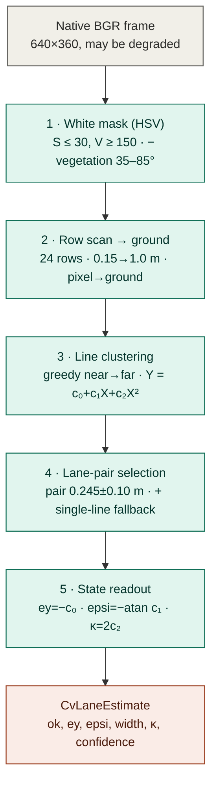

# Classical CV Camera Lane-Keeper — `lane_keeper_gazebo_node` (Track 'E' baseline)

| Field | Value |
| --- | --- |
| Artifact | The logical (non-learned) camera lane-keeper: deployment node + shared control law + CV estimator |
| Version | **0.6** (2026-07-13 — §4.4: both estimator limitations **measured in-situ** by the 420-pose weak-section oracle probe: the H-12 flip quantified (≈ −1 lane width at ey ≈ +0.12, everywhere) + NEW confident heading over-read in tight curves (−0.2…−0.45 rad on a centred car → crosses the 25° envelope); mechanisms of the E5 multi-seed / 2-D enforcement stops) |
| Phase / Gate | Track 'E' (camera) — the fair baseline for the RL camera agent (GE4 eval) |
| Author | Samuel Sanchez |
| Date | 2026-06-19 |
| Status | CONFIRMED — implemented in `cobraflex/lane_keeper_gazebo_node.py`, `cobraflex_rl/cv_lane_controller.py`, `cobraflex_rl/cv_lane_estimator.py`, `cobraflex_rl/camera_geometry.py` |
| Normative spec | Training Specification Ch.7 §7.7 (track 'E'); ODD-1 lane geometry (`docs/08`) |
| Decisions cited | D-43 (cage/baseline read a dedicated deterministic CV estimator), D-41 (end-to-end camera architecture) |
| Sibling documents | `docs/11_camera_rl_training.md` (the RL agent this is compared against), `docs/04_cage_specification.md` (the cage that reuses the same CV estimator), `docs/08_odd_specification.md` (lane geometry) |

> Purpose: document *how* the classical, hand-coded camera lane-keeper works — the
> ROS2 deployment node `lane_keeper_gazebo_node.py`, the deterministic CV lane
> estimator it reads, and the pure-pursuit look-ahead control law it closes —
> and *why* it is built this way. This is the **fair baseline** against which the
> RL camera agent of `docs/11` is measured: same camera, same perception front-end
> as the safety cage (D-43), no learning. It complements the thesis prose (Ch.7
> §7.7) with the engineering detail the committee may ask for.

---

## 1. Role: a like-for-like classical baseline

The RL camera agent (track 'E') must be compared against a **camera** baseline,
not against the F-track PD that reads perfect ground-truth state — comparing a
real-perception policy to a controller with privileged state is meaningless. The
classical lane-keeper is that camera baseline:

- it reads the **same raw camera** stream the RL CNN consumes (`/camera/
  image_raw_lane`), never ground truth;
- its perception front-end is the **same deterministic CV lane-estimator the
  safety cage reads** (`CvLaneEstimator`, D-43), so "what the classical controller
  can perceive" equals "what the cage can perceive";
- it closes a transparent, inspectable control law (pure-pursuit look-ahead),
  so any performance gap with the RL agent is attributable to *control*, not to a
  perception asymmetry.

There are **two front-ends sharing one implementation** (§6): the ROS2 deployment
node `lane_keeper_gazebo_node` (live driving / RViz) and the scored evaluation
driver `eval_cv_controller` (the GE4 campaign), both driving through the
**identical** `CVLaneController`. This is the single source of truth for the
baseline: the node you watch and the number in the results table come from the
same control law.

---

## 2. The deployment node (`lane_keeper_gazebo_node.py`)

A thin ROS2 node (`rclpy`) that wires the camera to `/cmd_vel`:

```text
/camera/image_raw_lane  ──►  _image_callback  ──►  CVLaneController.compute(frame)  ──►  /cmd_vel (Twist)
        (sensor QoS)                                                                └──►  /lane/image_overlay (debug, optional)
                          ┌──────────────┐
   create_timer(0.2 s) ──►│ _watchdog    │──► /cmd_vel = 0  if no frame for watchdog_timeout_sec
                          └──────────────┘
```

### 2.1 Interfaces and parameters

| Item | Value / topic | Note |
| --- | --- | --- |
| Subscribe | `camera/image_raw_lane` (`sensor_msgs/Image`, `qos_profile_sensor_data`) | bridged Gazebo image |
| Publish | `/cmd_vel` (`geometry_msgs/Twist`) | the drive command |
| Publish | `/lane/image_overlay` (`Image`, reliable depth-1) | optional debug overlay |
| `linear_speed` | **0.20** m/s | cruise speed; the native baseline speed is 0.10, 0.20 is the RL-comparison speed |
| `look_ahead_m` | **0.40** m | pure-pursuit aim-point distance (§3) |
| `pursuit_gain` | **1.0** | pure-pursuit yaw-rate scale |
| `kp_ey` / `kd_epsi` / `kff_curv` | 6.0 / 1.6 / 1.0 | legacy PD/FF gains — declared for back-compat, **ignored** by the controller |
| `max_angular_z` | **0.90** rad/s | yaw-rate saturation |
| `stop_on_no_lane` | **True** | stop (vs coast straight) when no lane is found |
| `watchdog_timeout_sec` | **1.5** s | publish zero `cmd_vel` if no frame arrives |

### 2.2 Per-frame control tick (`_image_callback`)

1. Decode the ROS image to BGR (`_ros_image_to_bgr`, supports mono8/bgr8/rgb8/
   bgra8/rgba8 with a stride-aware unpack — the same proven decoder mirrored in
   `camera_pipeline.decode_image`).
2. Stamp `last_frame_time` (feeds the watchdog).
3. `angular, detected = controller.compute(frame_bgr)` (§3).
4. Build the `Twist`: if a lane is detected, `linear.x = linear_speed`,
   `angular.z = angular`; if not detected and `stop_on_no_lane`, publish a **zero**
   Twist (controlled stop); if not detected and `stop_on_no_lane = False`, coast
   straight at cruise speed.
5. Optionally render/publish the debug overlay (white-mask blend + the CV state
   and command text).

### 2.3 Watchdog

A 5 Hz timer (`_watchdog_callback`) publishes a zero `Twist` whenever no camera
frame has arrived within `watchdog_timeout_sec` — a liveness safeguard so a
stalled image bridge halts the robot rather than latching the last command. This
is the node-level analogue of the cage's staleness response; in the scored runs
the safety cage provides the equivalent guarantee.

---

## 3. The shared control law (`CVLaneController`)

`cv_lane_controller.py` is the **single** control law shared by the node and the
scored eval. Given a frame it returns `(angular_z, detected)`:

```text
est = CvLaneEstimator.estimate(frame)          # the D-43 CV front-end (§4)
if not est.ok:  return (0.0, False)            # no usable lane this frame

c0,c1,c2 = est.center_coeffs                    # lane-centre polynomial Y(X)
y_L      = c0 + c1·L + c2·L²                     # lane centre at look-ahead X=L
angular  = pursuit_gain · speed · 2·y_L / (L² + y_L²)   # pure-pursuit yaw rate
angular  = clip(angular, −max_angular_z, +max_angular_z)
return (angular, True)
```

So the law is **pure pursuit**: aim at the lane-centre point a fixed look-ahead
distance `L` ahead and command the yaw rate that arcs to it.

- `y_L` (+left) is read from the estimator's **lane-centre polynomial** evaluated
  *within* the observed band (`L = 0.40 m`), so it is an interpolation — robust
  even when the polynomial's bare coefficients are noisy on a tight curve.
- On a bend `y_L` grows naturally and commands exactly the turn the curve needs:
  **no curvature estimate is required** — which matters because monocular curvature
  on a short arc is irrecoverably noisy (§4.7).
- The single aim point regulates lateral offset *and* heading together.

This **supersedes the earlier PD + curvature-feedforward law** (`kff·v·κ`), which
under-steered tight curves: its feedforward depended on that unusable curvature
estimate, so the car ran wide (dumped frames, `cv_ctrl_eval_20260618T175028Z`).

**Sign conventions** (shared with `PolylineTracker`, the sim oracle that validates
the estimator): `ey > 0` = vehicle left of lane centre; `epsi > 0` = yawed left;
`κ > 0` = left bend; `y_L > 0` = lane centre to the left; `Twist.angular.z > 0` =
turn left (so `y_L > 0` → positive yaw rate, turn left).

Parameters (`look_ahead_m=0.40, pursuit_gain=1.0, max_angular_z=0.90`) are recorded
in each run's `metadata.json` (`controller_params`) so the exact law that drove a
run is reproducible. The legacy gain kwargs (`kp_ey/kd_epsi/kff_curv`) are still
accepted by the constructor (the node passes them) but ignored.

---

## 4. The deterministic CV lane estimator (`CvLaneEstimator`, D-43)

The perception front-end — **the same module the safety cage reads** (D-43). It
is fully classical and inspectable (no learning); `estimate(frame) →
CvLaneEstimate(ok, ey, epsi, lane_width, curvature, confidence, …)`. Five stages:



*Figure — the five-stage estimator (source: [`manuscript/figures/cv_lane_estimator_pipeline.mmd`](../manuscript/figures/cv_lane_estimator_pipeline.mmd)). The same `CvLaneEstimate` output feeds both the safety cage and the classical CV controller of §3.*

### 4.1 White mask
HSV threshold: saturation `≤ 30` **and** value `≥ 150` → white-marking candidate.
A **vegetation exclusion** removes green-hued pixels (OpenCV H ∈ [35, 85]) with
any saturation, because under glare wash-out the pale grass beside the road drops
under the saturation cap and would otherwise merge with the road-edge line and
bias `ey`/`epsi` (found in the GE2 oracle validation). The cap is tighter than the
node's legacy 70 for exactly this reason. On a grayscale input it degrades to a
value-only threshold; without OpenCV a numpy max/min S–V approximation is used.

### 4.2 Row scan → ground points
Sample `n_scan_rows = 24` image rows between a near (`0.15 m`) and far (`1.00 m`)
ground look-ahead. Per row, run-length-encode the white pixels; a white run whose
**metric** width (via the per-row lateral resolution) is plausible for a marking
(`0.004–0.10 m`) becomes a candidate, projected pixel→ground by the camera model
(§5). Candidates more than `1.5 m` off to the side are discarded.

### 4.3 Line clustering
Greedy **near-to-far** clustering: candidates are sorted by forward distance `X`
(most metrically reliable first) and each joins the cluster whose running
polynomial prediction `Y = c0 + c1·X + c2·X²` is nearest at its `X` (within
`cluster_tol = 0.08 m`); otherwise it seeds a new cluster. The per-cluster fit
**adapts to the evidence**: quadratic once the cluster spans enough look-ahead to
constrain curvature (the oval's `κ_max ≈ 1.25 1/m` bends a line ~0.9 m over the
1.2 m scan band — a linear model would both miss the curvature and bias the
intercept), linear for short spans, constant for near-degenerate ones. Clusters
with fewer than `4` points are dropped.

### 4.4 Lane selection
Order the surviving lines right→left by their intercept `c0` (the `Y` at the
vehicle, `X=0`). Among **adjacent pairs** whose separation matches the ODD-1 lane
width (`0.245 ± 0.10 m`), pick the pair whose centre is **nearest the vehicle** —
the driven lane.

> **Known limitation — the H-12 confident under-read (D-48, GE4-V2 finding).** When the
> vehicle departs its lane past ~half a lane width, a neighbouring-lane line forms a
> *competing* plausible pair whose centre is marginally nearer: nearest-centre selection
> then reports the vehicle near-centred in the **wrong** lane (`cv_ey ≈ 0.04 m` while true
> `ey` → 0.30 m, `cv_ok` True), so C-01/C-05 are never triggered — a self-consistent wrong
> estimate SR-014's plausibility check cannot catch. An opt-in
> `conservative_lane_selection` rule (pick the larger-offset interpretation when two
> plausible pairs straddle the vehicle) was implemented as **ruta-2b** and **reverted to
> default `False`**: a single frame cannot distinguish a genuinely off-centre vehicle from
> a *centred* one under a small heading error (both split into the same opposite-sign
> pairs), so it fires spurious C-01/C-05 emergencies on centred / recovering / curving
> views (closed-loop smoke: SC-EDGE-01 emergency at step 8; SC-NOM-02 regressed). There is
> **no robust single-frame fix**; the honest closure is temporal lane tracking or the Isaac
> retrain (D-49). Scoped to the ODD (ruta-1's SC-EDGE-02 IC clip) the under-read costs only
> 2/30 boundary-edge breaches in GE4-V2 — SR-001 still closes. The flag is kept True-capable
> for the opt-in regression tests (`policy/tests/test_cv_lane_estimator.py`).
>
> **Quantified in-situ (13.07.2026 probe — `experiments/sim/runs/cv_probe_weak_sections_20260713T084230Z/`,
> 420-pose oracle grid on `complex_b` with the Lane Cam;** `tools/validate_cv_estimator.py
> --s-range` section mode). The flip fires **anywhere on the circuit** once the vehicle sits
> ≈ +0.12 m outward (over the dashed centre line) and is **gated by heading, not section**:
> nose-inward (−0.1 rad) it **never** fires (0/35 poses), straight-ahead 17/35, nose-outward
> (+0.1 rad) 30/35 — i.e. exactly the departing-vehicle geometry. Error is ≈ **−1 lane
> width** (ey_true +0.120 → est −0.135 ± 0.005, `n_lines` 3, confidence 0.46–0.52, `cv_ok`
> True); at ey ≤ +0.06 the read is clean (≤ ~25 mm), so the good/flipped boundary sits
> between +0.06 and +0.12. The saved frames show the geometry: at +0.12 the camera sits over
> the centre line and pair selection latches the centre line + the *left* lane's outer line.
> **Offline replay of the 105 saved +0.12 frames confirms the D-48 revert quantitatively:**
> `conservative_lane_selection: true` fixes only 4 of the 47 baseline flips (43 persist) —
> in most flipped frames only *one* plausible pair survives (the wrong one), so there is no
> opposite-sign ambiguity for the rule to resolve. This is the measured mechanism behind the
> E5 multi-seed enforcement stops of seeds 23/666 (drift past +0.10 with the nose outward →
> the cage believes ey ≈ −0.13 → C-02/C-03 steer *outward* → runaway → C-05; docs/11 §8.5,
> ch.7 §7.5.3 note ¹).
>
> **Second, distinct limitation — confident heading over-read in tight curves (same probe).**
> In the tight-curve section (s ≈ 8.0–9.8 of `complex_b`) the estimator reads **epsi −0.11 …
> −0.36 rad (mean −0.22) on a *centred*, straight vehicle** (true epsi ≈ 0) with **high**
> confidence (mean 0.77), and curvature 0.8–1.5 (true ≈ 1.0); the control straight reads
> 0.000 under the identical protocol. The strongly curved boundary line dominates the
> near-field rows and its local tangent is read as heading error (the curve-geometry
> counterpart of the known mid-curve kappa over-read, §5). With a real outward heading
> offset (−0.1 rad) the centred-car estimate reaches **−0.45 rad, past the 25° (0.436 rad)
> C-02/C-05 envelope** — the measured mechanism of the false C-05 beliefs / stops at
> s ≈ 8.8 (seed-23 monitoring flags + its r2 stop) and of the 2-D enforcement stops at
> speed (docs/11 §8.5). Section B's gentler curve shows the same effect milder (mean +0.05,
> worst ±0.24). Like the flip, this is confident-and-wrong (SR-014 cannot gate it); the
> closure is the same temporal estimator (D-49 posterior).

### 4.5 State
The lane-centre polynomial is the mean of the selected pair's fits; the state is
read off it at the vehicle (`X=0`):

```text
ey        = −c0                         # +left of lane centre
epsi      = −arctan(c1)                 # +yawed left
lane_width= (c0_left − c0_right)·cos(heading)
curvature = 2·c2                        # only when the span supports it, else 0
confidence= min(1, n_pair_points / (2·n_scan_rows))
```

`confidence` and `feature_count` feed the **SR-013 perception-health monitor** and
the **SR-014 plausibility check** (the cage's gate on this estimate).

### 4.6 Single-line fallback
In the tight oval curves the dashed inner separator drops out of the scan band
while the solid outer edge survives. Rather than report perception loss, the
estimator infers the lane centre from the **single** surviving line nearest a
half-lane offset, using a running lane-width EMA, at **halved confidence**. It is
slack-bounded (the line must sit roughly half a lane to one side); a wrong-side
lock is the H-12 case the SR-014 temporal check backstops. This mirrors the
node's original single-side precedent.

> **Tunables** live in `CvLaneEstimatorConfig` (frozen dataclass), defaulting to
> the proven `lane_keeper_gazebo_node` thresholds and the ODD-1 geometry, so the
> estimator behaves identically whether instantiated by the node, the eval driver,
> or the cage. Synthetic-frame unit tests (`policy/tests/test_cv_lane_estimator.py`)
> render known lane geometries through the same camera model and verify recovery.

### 4.7 Curvature boundary — the monocular heading limit (scenario-design frontier)

**Finding (2026-06-18).** The cage's heading reading (`epsi`, feeding C-02 and
C-05 Trigger-7) has an **irreducible curvature bias** with this monocular front
camera, which bounds how tight a curve a track may contain before the cage
emits *false* emergencies. This is the central perception-cost result of the
camera track against the F-track ground-truth baseline (where the cage stayed
latent), and it must be respected when authoring harder scenarios.

*Mechanism.* `epsi` is the lane tangent at the vehicle, but the camera only sees
the lane from `near_distance_m` (≈ 0.15 m) outward, so the heading is read from a
short near-field secant centred at `X_c ≈ 0.225 m`. On a curve of curvature `κ`
the lane has already turned by `≈ κ·X_c` there, so the *reported* heading carries
a bias

```text
epsi_bias ≈ κ · X_c        (X_c ≈ 0.225 m, the near-window centroid)
```

At the old `complex_b` radii (`R_min ≈ 0.43 m`, `κ ≈ 2.3`) this is ≈ 0.52 rad —
**past C-02's `theta_max` = 0.4363 rad (25°)** — so the cage latched an emergency
*while the car tracked the lane to millimetres* (true `epsi ≈ 0`; runs
`experiments/sim/runs/cv_ctrl_eval_20260618T18*`).

*Why it cannot simply be "corrected".* The curve's apparent heading and a **real**
heading fault are indistinguishable in the near-field lane slope. Subtracting an
estimated curvature removes the false positives **and** blinds the cage to genuine
heading excursions on curves (validated: a curvature-corrected `epsi` masked a real
end-of-lap loss-of-control, true `epsi → 0.56`, reading it as 0.17 — a false
negative, unacceptable for a safety monitor). So the heading estimate is kept as a
short near-field secant (`heading_window_m = 0.15`, §4.5), which is the least-biased
form that does **not** hide real faults — and the residual bias is a hard limit, not
a bug to remove. (The *controller* sidesteps this entirely: its pure-pursuit law,
§3, reads the lane-centre point at a look-ahead — an interpolation that needs no
curvature estimate — so it tracks curves the cage cannot certify.)

*Design rule (frontier for new scenarios).* Keep the **driven-lane** curve radius
above the bound that holds the perceived heading under `theta_max` with margin:

```text
R_min ≳ X_c / (theta_max − margin)      ⇒  R_min ≳ ~0.9 m  (κ ≲ 1.1)
```

at which `epsi_bias ≲ 0.25 rad` — comfortably below `theta_max`. Tracks tighter
than this are *outside* the camera ODD for the heading rule: either soften them, or
treat the resulting emergencies as the documented cost (not a defect) and gate the
scenario accordingly. **`complex_b` was reshaped to honour this** (2026-06-18): its
3-curve top serpentine became a 2-hump **"M"** (middle hump removed) with a
**pronounced central valley** (the loop's main counter-steer — the only opposite-
handed turn, kept deep enough to exercise it: ~40 driven-lane steps), and all
curves were opened to `R_min ≈ 0.86 m` (driven right-lane `R_min ≈ 0.97 m`,
`epsi_bias ≲ 0.23`). Generator: `scripts/generate_complex_track.py` (`complex_b`
waypoints); regenerate the right lane with `scripts/offset_lane_centerline.py` and
the Isaac mesh with `scripts/export_track_mesh.py`.

### 4.8 D-43 to C-02 controlled-heading calibration (21.07.2026)

A bounded Gazebo calibration used the real Lane Cam renderer, `CvLaneEstimator`,
perception supervisor and canonical `cage/cage.yaml`; Gazebo ground truth was an
offline oracle only. The 28-cell matrix separated seed 2024 calibration from
seed 42 validation and covered straight, representative curve and the maximum
`complex_b` curvature, 0.10/0.22 m/s, glare/motion blur, and controlled
`+/-0.48 rad` spawn-heading injections. Evidence is under
`experiments/sim/eval_gz2d/d43_c02_calibration_20260721T073151Z/`.

**Result: BLOCKED.** The held-out centred band had 0 false C-02, 0 false C-05,
0 road-edge contacts and maximum M-S1 0.0722 m. Nevertheless only 3 of 5 cells
that actually crossed the physical 0.4363 rad heading boundary were detected;
the positive-heading injections on the representative (`kappa = 0.516 1/m`) and
maximum (`kappa = 1.031 1/m`) curves were missed by both C-02 and C-05. Safe
and faulty `|epsi_cv|` overlap (safe maximum 0.25295 rad; fault minimum
0.23104 rad; separation margin -0.02190 rad), so no scalar global threshold
separates them. The centred CV-GT heading error also changes with curvature:
mean -0.0016 rad on the straight, -0.1201 rad at 0.516 1/m and -0.1741 rad at
1.031 1/m in the held-out split. This is not a stable renderer-wide offset.

Therefore no Gazebo correction is accepted and the physical C-02 limit remains
25 degrees. A curvature subtraction is still rejected because the controlled
fault cells demonstrate the same masking mechanism described above. Before the
posterior margin022 checkpoint may qualify, D-43 needs either (a) a heading
estimator with an independently observable vehicle-vs-tangent quantity, validated
on the same held-out injections, or (b) an explicit certified radius/curvature
validity envelope whose violation raises `perception_invalid` and produces the
C-05 controlled stop within SR-005/SR-008. The present evidence supports neither
a correction nor a complete validity boundary, so the D-43 prerequisite remains
fail-closed. GE4/G4 and all canonical cage thresholds are unchanged.

### 4.9 Improved heading readout and dynamic held-out validation (21.07.2026)

The §4.8 result was used as a failing baseline, not hidden by a threshold
change. The estimator was changed behind an opt-in configuration switch:
`joint_pair_quadratic` fits both selected markings simultaneously as

```text
Y_right(X) = a_right + b X + c X^2
Y_left (X) = a_left  + b X + c X^2,
```

so lane width/lateral position stay in the two intercepts while the local
vehicle-to-lane tangent `b` is observed jointly. This removes the legacy
near-secant curvature subtraction. A global Gazebo measurement gain of `1.60`
was then selected from calibration-only safe/fault separation. It multiplies
the measured tangent; it does not change C-02's 25-degree physical limit and is
not a function of curvature.

The final 28-cell campaign improved the injector as well: all six `+/-0.48 rad`
fault cells per split began nominally, reached the commanded speed, and received
a calibration-only yaw impulse during motion. Runs continued after emergency so
the controlled stop and lateral excursion were observable. The final evidence is
`experiments/sim/eval_gz2d/d43_c02_calibration_20260721T082128Z/`.

| Held-out metric (seed 42) | Result |
| --- | ---: |
| Cycles / centred safe cycles | 560 / 392 |
| Real heading-fault cells detected | **6/6** |
| False C-02 / C-05 in centred band | **0 / 0** |
| Minimum pre-injection speed | 0.220 m/s |
| Maximum detection delay | 0.10 s |
| Controlled-stop upper bound | 0.10 s |
| M-S1 / M-S2 | 0.03177 m / **0 cycles** |
| Road-edge contacts | **0** |
| Safe max / fault min `|epsi_cv|` | 0.30861 / 0.38299 rad |
| Safe/fault separation | +0.07438 rad |

**Decision: PASS, scoped to the hash-bound Gazebo Lane Cam + `complex_b`
envelope through the most demanding driven-lane anchor (`|kappa_anchor| =
1.031 1/m`; exact per-cycle local GT maximum 0.978 1/m).**
The lowest fault read occurred at that maximum-curvature positive injection;
the next read was 0.725 rad and C-02/C-05 fired within one 0.10 s cycle. The
retained safe maximum remained 0.0405 rad below `theta_warning = 0.3491 rad`.
Thus the correction maintains sensitivity to real positive and negative faults
without adding false stops. Curves/renderers/cameras outside the recorded hashes
remain uncertified; in particular no Isaac parameter is reused.

The frozen estimator default remains `near_secant`, so historical GE4/G4
artefacts are bit-identical. Only the untrained posterior margin022 contract
opts into `joint_pair_quadratic` + `1.60`; its new checkpoint must still pass the
checkpoint-bound nominal D-43 preflight before a campaign. No checkpoint exists
yet, so this PASS qualifies the measurement interface, not a learned policy.

---

## 5. Camera geometry (`camera_geometry.py`)

The estimator turns detected pixels into metres with a **pitch-only pinhole
ground-plane projection** — closed-form and auditable because the camera has no
roll and no yaw relative to the vehicle:

- each image row `v` below the horizon maps to a single forward ground distance
  `X(v)` (`row_to_distance`, and its inverse `distance_to_row`);
- within a row, the column `u` maps linearly to the lateral ground coordinate `Y`
  (`pixel_to_ground`); `lateral_resolution(v)` gives metres-per-pixel at that row
  (used for the marking-width test in §4.2).

Parameters mirror the Gazebo sensor + URDF mount (the single source of truth for
the physical numbers): the **dedicated Lane Cam** — IMX219-160 mirror, 640×360,
HFOV ≈ 90° (1.5708 rad) — at height **h ≈ 0.077 m** above ground with pitch
**0.30 rad** down (the `camera_link_lane` joint `rpy="0 0.30 0"` of the mesh
variant). The intrinsics are
derived from HFOV and width (`fx = (W/2)/tan(HFOV/2)`, square pixels). The mount
geometry is the same one `docs/11` §8 describes for the newcam retrain — the
estimator and the policy share one camera.

---

## 6. The shared-driver principle: node == scored eval

`eval_cv_controller.py` runs the **identical** `CVLaneController` inside the same
`GazeboLaneEnv` + scoring harness as the RL eval (`eval_policy`):

- it pulls the env's raw camera frame (`ros_interface.get_camera_frame()`), calls
  `controller.compute(frame)`, and feeds the resulting `angular` to
  `env.step([angular])` — and because the env publishes `angular.z = action` at a
  fixed cruise speed, **this is exactly what the deployment node commands**;
- it scores it identically to the RL/PD runs (`ey`/`epsi` vs the right-lane
  centreline, completed laps, cage interventions, the SC-* campaign verdict), so
  the baseline lands in the **same results table** as the RL agent for a
  like-for-like comparison;
- it writes the run with full reproducibility metadata, recording the controller
  as `"cv_lane_controller (CvLaneEstimator D-43 + pure-pursuit look-ahead)"` with
  its parameters and a source hash — there is no learned checkpoint, the "policy"
  is the deterministic law.

**Speed-fairness.** The controller's native cruise is 0.10 m/s; the RL camera eval
ran at 0.20 m/s. The eval driver exposes `--fixed-speed` so the baseline can be
run at either, and **mean |ey| is the speed-fair comparison** across the two.

---

## 7.5 Results: the authoritative CV baseline (complex_b + Lane Cam)

This run is **the** control reference the RL camera agent is compared against from
here on; it **supersedes** the earlier oval CV evals. Track `complex_b`, Lane Cam
(IMX219-160, 640×360, §7.7.8), SC-NOM-01, seed 2024, 0.2 m/s, 4 400 steps,
enforcement; cage v0.6.1.

| Metric | CV pure-pursuit (complex_b, enf) | Requirement |
| --- | --- | --- |
| Completed laps | 4.85 | — |
| mean \|ey\| | **17.2 mm** | — |
| max \|ey\| | **57.3 mm** | < 160 (`d_max`) |
| mean \|epsi\| | 0.025 rad | — |
| emergencies | 0 | — |
| cage intervention | 0 % | — |

Run: `experiments/sim/runs/cv_ctrl_eval_newcam_4k4/`. The controller holds the lane
to ~17 mm mean lateral error (max 57 mm, well under `d_max`) with 0 emergencies on a
markedly twistier circuit than the oval; fewer laps (4.85 in 440 s) only because the
perimeter is longer at fixed speed. Re-run live with the tracker fix in place (seed
2024 → near-identical trajectory; the native `summary.json` matches the offline
re-derivation to 4 decimals). The RL-vs-CV head-to-head on `complex_b` is **closed
(2026-06-22)**: the 297k E-main beats this baseline on tracking (mean |ey| **10.9 vs
17.2 mm**, same track/camera/seed/horizon, 0 emergencies both), reversing the oval
finding — see ch.8 §8.9.5 and `experiments/sim/runs/rl_newcam_eval_2024_cb297k_4k4{,_mon}/`
+ `baseline_cv_vs_rl_nominal.json`.

> **Measurement note (geometry fix).** This run's original `summary.json` reported
> 1.68 m mean \|ey\| and 1.73 laps — a **scoring artifact, not a controller failure**.
> `complex_b` is a self-approaching circuit whose right-lane centreline did **not**
> duplicate its closing seam point (gap 0.060 m vs 0.052 m mean segment), so
> `PolylineTracker` treated it as *open* and could not wrap at the start/finish line:
> from lap 2 on, the stateful nearest-segment search pinned to the final segment and
> `ey` exploded. Fixed by auto-closing loops whose endpoints sit within ~one segment
> (`polyline_tracker.py`; regression test in `policy/tests/test_polyline_tracker.py`).
> The run above is the **clean live re-run** with the fix in place — confirmed against
> an offline re-derivation from the original logged pose (identical to 4 decimals). The
> complex_b loop is genuinely closed (the generator samples it with `endpoint=False`, so
> the "gap" is one normal segment, not a hole). The F-track oval (exact closure, gap 0)
> is **unaffected** — F4 results stand.

---

## 7. History: what this replaced

The current CV pure-pursuit law **supersedes the original histogram pure-P
controller**, whose set-point was "lane centre = image centre" in *pixels*. That
set-point carried an uncalibrated, perspective-dependent steady-state offset and
understeered the curves, so it could not hold the lane above ~0.1 m/s. Replacing the
histogram-peak heuristic with the calibrated ground-plane CV estimator (metric
lane-centre polynomial) and a look-ahead pursuit law is what lets it track the
nominal oval to **RMSE ~10 mm at 0.2 m/s** (requirement < 50 mm) and hold tight
curves the earlier PD + curvature-feedforward law ran wide on (§3) — on par with the
RL agent, a genuine like-for-like reference rather than a strawman. The authoritative
baseline is now the `complex_b` + Lane Cam run (§7.5: ~17 mm mean \|ey\|).

> **Doc-string note.** The module docstring of `eval_cv_controller.py` still
> describes the *old* "histogram lane peaks → proportional steering" front-end;
> the code it runs is the CV+PD law documented here (it imports `CVLaneController`,
> not the histogram controller). Treat this section, not that docstring, as
> authoritative.

---

## 8. How to run

`eval_cv_controller.launch.py` now **defaults to the complex_b circuit** and wires
the three artefacts that must agree (reward/lane-target `centerline`, road-centre
`road_centerline` for off-road geometry, and the SDF `world_name` the gz teleport
services are namespaced by — see `docs/11` §3.5/§9). The launch is a single
blocking run that shuts down on node exit, so its output sits alongside the RL
runs for a like-for-like comparison.

```bash
# Live deployment node (Gazebo + RViz + the lane keeper):
ros2 launch cobraflex lane_keeper_gazebo.launch.py
```

### 8.1 CV baseline on complex_b (the baseline for the RL camera agent)

```bash
# Speed-matched to the RL camera eval (cruise 0.20 m/s) — the apples-to-apples
# baseline: same track, same speed, same metrics, no learning. Watch it in RViz.
ros2 launch cobraflex_rl eval_cv_controller.launch.py \
  gui:=true rviz:=true mode:=enforcement fixed_speed:=0.20 max_steps:=4400 \
   output_root:=experiments/sim/runs

# Controller's native speed (0.10 m/s) — its best-case lateral accuracy:
ros2 launch cobraflex_rl eval_cv_controller.launch.py \
  gui:=false mode:=enforcement fixed_speed:=0.10 max_steps:=4400 \
   output_root:=experiments/sim/runs

# A perturbed scenario run, scored into a campaign verdict (complex_b defaults):
ros2 launch cobraflex_rl eval_cv_controller.launch.py \
  scenario:=scenarios/perturbed/sc_pert_04.yaml mode:=enforcement rep:=0

# Revert to the oval — override all four together:
RL=$(ros2 pkg prefix cobraflex_rl)/share/cobraflex_rl/config
ros2 launch cobraflex_rl eval_cv_controller.launch.py \
  world:=lane_following_oval world_name:=lane_following_oval \
  centerline:=$RL/oval_right_lane_centerline.yaml \
  road_centerline:=$RL/oval_right_lane_centerline.yaml
```

### 8.2 Baseline vs the trained RL policy (later)

When the RL camera policy is trained, score it on the **same** track / speed /
metrics with `eval_policy`, so the CV run above is the non-learned control arm:

```bash
RL=$(ros2 pkg prefix cobraflex_rl)/share/cobraflex_rl/config
# 1) sim (headless + setsid for stability — closing the Gazebo GUI tears down the
#    bridge and starves /odom_truth; see docs/11 §9):
setsid ros2 launch cobraflex gazebo_mesh.launch.py \
  world:=lane_following_oval_complex gui:=false < /dev/null &
# 2) the RL eval, same wiring as training:
ros2 run cobraflex_rl eval_policy \
  --train-config $RL/train_ppo_camera.yaml \
  --centerline-config $RL/complex_b_right_lane_centerline.yaml \
  --road-centerline-config $RL/complex_b_centerline.yaml \
  --world-name lane_following_complex_b \
  --model-path policy/checkpoints/<your_rl_camera_checkpoint>.zip \
  --run-id rl_eval_complex_b --output-root experiments/sim/eval_cv
```

Both write a run dir under `output_root/<run_id>` with the same scored metrics
(laps, mean |ey|, emergencies, off-road, per-rule cage activity) and reproducibility
hashes — **compare the RL run against `cv_baseline_complex_b_v020`** (the speed-matched
CV arm). The fair accuracy metric is **mean |ey|** (laps depend on cruise speed).

Host: the **Ubuntu 24.04 + ROS2 Jazzy** path (Gazebo + camera bridge). The pure
pieces — `cv_lane_estimator`, `cv_lane_controller`, `camera_geometry`,
`polyline_tracker` — are host-testable without ROS (`policy/tests/`).

---

## 9. Anticipated defense questions

**Q1. Why is the classical controller a fair baseline and not a strawman?**
Because it shares the RL agent's *perception ceiling*: same camera, same
deterministic CV estimator the cage trusts. The only difference is the control
policy (a transparent pure-pursuit law vs a learned CNN), so the comparison isolates
the contribution of learning. And it is *competent* — ~17 mm mean |ey| at 0.2 m/s on
complex_b (§7.5), the same order as the RL agent — not a deliberately weak reference.

**Q2. Why does the cage read this CV estimator instead of the policy's CNN, or
ground truth?** Ground truth is impossible on a real road (D-43 supersedes the
earlier ground-truth-cage D-42). Reading the policy's CNN would couple the safety
monitor to the very controller it supervises (a learned, opaque, co-trained
component). A dedicated *deterministic, inspectable* estimator gives the cage an
independent, auditable view — the same one this baseline uses, which is why the
baseline doubles as a sanity check on the cage's perception.

**Q3. Why pure pursuit and not a PD on `ey`/`epsi` (with a curvature feedforward)?**
The PD form was tried and **ran wide on tight curves**: its feedforward needs an
explicit curvature estimate, and monocular curvature on a short arc is irrecoverably
noisy (it swung sign frame-to-frame), so the car under-steered (§3, §4.7). Pure
pursuit aims at the lane-centre point a look-ahead ahead — read by interpolation
*within* the observed band, so it needs **no** curvature estimate and turns exactly
as much as the visible bend demands, regulating offset and heading through one aim
point.

**Q4. What happens when the camera momentarily loses the lane?**
`compute` returns `(0.0, False)`; the node stops (`stop_on_no_lane=True`) and the
watchdog backs it up if frames stop entirely. In the scored runs the safety cage
provides the equivalent guarantee (SR-013/SR-014 → controlled stop). The
single-line fallback (§4.6) keeps brief separator dropouts in the curves from
counting as loss, with the SR-014 temporal check guarding against a wrong-side
lock.

**Q5. The eval driver's docstring mentions a histogram controller — which is
real?** The CV pure-pursuit law in this document. The driver imports
`CVLaneController` (CV estimator + pure-pursuit look-ahead); the docstring is stale
from the histogram era (§7). The recorded `controller` field in every run's
`metadata.json` confirms the law that actually drove it.

**Q6. If the goal is an unknown circuit, why is the track centreline fed to the
PD and the RL agent at all?** Because the centreline has **two distinct roles**,
and conflating them is the trap:

1. **As a control *input*** — only on the **F-track**: the PD baseline and the
   state-vector RL policy drive on `ey/epsi` derived from the *mapped centreline +
   true pose*. This is exactly why they are **known-track baselines**, not the
   deployable artefact (they need a prior map and a privileged pose — neither
   exists on an unknown road). The camera variants (RL-cam, this CV controller)
   take **no centreline as input**: they drive from pixels / detected lane lines.
2. **As a reward + scoring *oracle*** — for **everyone**, but only inside the
   simulator. `GazeboLaneEnv` treats the ground-truth centreline as the
   *"reward/termination/metrics oracle only"* (its own words): it is the *teacher*
   that shapes the reward at **training** time and the *ruler* that scores `ey` at
   **evaluation** time. The **deployed artefact carries no map** — the CNN weights
   (or this CV estimator) learned to extract from pixels what the centreline-based
   reward rewarded. At inference there is no teacher and no ruler, only
   image → action.

So "feeding the centreline" is literally true for the F-track (hence: known-track
reference) and false-as-an-input for the camera agent you would deploy. The
centreline you see in a camera-agent evaluation is the *measuring stick*, not
something the car consumes. (On a real unknown track you would also lose the
ruler — you would measure performance differently — but that changes how you
*evaluate*, not how the car *drives*.) The cage mirrors this split: F-track cage
reads centreline-derived state (baseline); track-E cage reads the CV estimator
(deployable, D-43).

---

## Version log

- **v0.5 (2026-07-02):** §4.4 gains the **H-12 confident under-read** note (D-48, the
  GE4-V2 SR-001 mechanism): nearest-centre lane selection locks onto a neighbouring-lane
  pair when the vehicle departs past ~half a lane, feeding the cage a falsely-centred
  state. Documents the **ruta-2b revert** — `conservative_lane_selection` exists in
  `CvLaneEstimatorConfig` but defaults **False** (spurious C-01/C-05 on centred/recovering/
  curving views; no robust single-frame fix; temporal tracking / Isaac retrain is the real
  closure, D-49). §7.5 head-to-head updated: **closed 2026-06-22**, the 297k RL camera agent
  beats this baseline (10.9 vs 17.2 mm mean |ey|), reversing the oval finding (ch.8 §8.9.5).
- **v0.4 (2026-06-19):** authoritative complex_b + Lane Cam baseline run (§7.5) and the
  `PolylineTracker` lap-seam fix (measurement note): auto-close loops whose endpoints sit
  within ~one segment; clean live re-run confirmed against the offline re-derivation.
- **v0.3 (2026-06-18):** §3 control law **switched PD + curvature-feedforward →
  pure-pursuit look-ahead** (the FF needed an unrecoverable monocular curvature
  estimate and under-steered tight curves; pure pursuit reads the lane-centre
  point at `L=0.40 m`, no curvature needed). §4.5 heading now a short near-field
  secant (`heading_window_m=0.15`); §4.7 added — the **curvature boundary**
  finding: the cage's monocular `epsi` over-reads `≈ κ·0.225` and exceeds
  `theta_max` on curves tighter than `R ≈ 0.9 m`, a frontier for scenario design
  (curve-induced apparent heading and a real heading fault are indistinguishable,
  so it cannot be corrected without blinding the cage). **`complex_b` softened**
  accordingly: top serpentine 3 curves → 2-hump "M", `R_min 0.43 → 0.86 m`
  (driven lane 0.97 m). Estimator gains `center_coeffs`; controller + estimator
  unit tests updated.
- **v0.2 (2026-06-18):** §5 camera geometry **pitch corrected 0.25 → 0.30 rad** to
  match the `camera_link_lane` joint `rpy="0 0.30 0"` in the mesh URDF (the value
  Gazebo actually renders). The CV estimator's ground-plane projection was
  systematically biased while pinned at 0.25 (it under-/over-stated metric `ey`);
  the cage reads this estimate (D-43), so the bias shifted its trigger timing.
  `DEFAULT_CAMERA_PITCH_RAD` in `camera_geometry.py` and `test_camera_geometry.py`
  updated; re-run `tools/validate_cv_estimator.py` on the host to re-confirm
  accuracy at 0.30. §8 (How to run) rewritten: `eval_cv_controller` (and
  `eval_policy`) gained `--road-centerline-config` and `--world-name`, and
  `eval_cv_controller.launch.py` now **defaults to complex_b** (world + both
  centerlines + `world_name`); added the speed-matched (0.20 m/s) CV baseline
  command and the matching `eval_policy` command for the RL-vs-baseline comparison.
- **v0.1 (2026-06-15):** first freeze. Documents the logical camera lane-keeper as
  the track-'E' baseline: the `lane_keeper_gazebo_node` ROS2 node, the shared
  `CVLaneController` (PD + curvature feedforward), the deterministic
  `CvLaneEstimator` (D-43, the cage's own front-end), the pitch-only camera
  geometry, and the shared-driver equivalence between the live node and the scored
  `eval_cv_controller`. Records the supersession of the histogram pure-P
  controller and flags the stale `eval_cv_controller` docstring.
