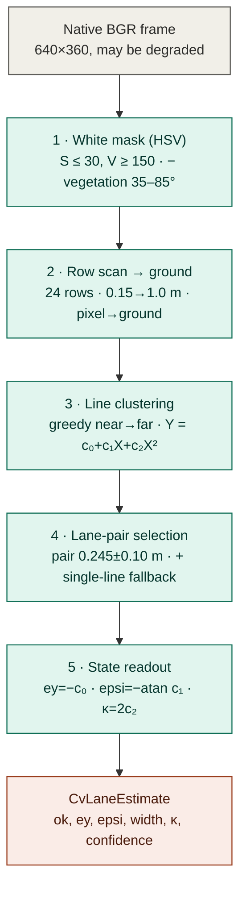

# Classical CV Camera Lane-Keeper — `lane_keeper_gazebo_node` (Track 'E' baseline)

| Field | Value |
| --- | --- |
| Artifact | The logical (non-learned) camera lane-keeper: deployment node + shared control law + CV estimator |
| Version | **0.2** (2026-06-18 — camera pitch aligned to the URDF mount, 0.25 → 0.30 rad) |
| Phase / Gate | Track 'E' (camera) — the fair baseline for the RL camera agent (GE4 eval) |
| Author | Samuel Sanchez |
| Date | 2026-06-18 |
| Status | CONFIRMED — implemented in `cobraflex/lane_keeper_gazebo_node.py`, `cobraflex_rl/cv_lane_controller.py`, `cobraflex_rl/cv_lane_estimator.py`, `cobraflex_rl/camera_geometry.py` |
| Normative spec | Training Specification Ch.7 §7.7 (track 'E'); ODD-1 lane geometry (`docs/08`) |
| Decisions cited | D-43 (cage/baseline read a dedicated deterministic CV estimator), D-41 (end-to-end camera architecture) |
| Sibling documents | `docs/11_camera_rl_training.md` (the RL agent this is compared against), `docs/04_cage_specification.md` (the cage that reuses the same CV estimator), `docs/08_odd_specification.md` (lane geometry) |

> Purpose: document *how* the classical, hand-coded camera lane-keeper works — the
> ROS2 deployment node `lane_keeper_gazebo_node.py`, the deterministic CV lane
> estimator it reads, and the PD + curvature-feedforward control law it closes —
> and *why* it is built this way. This is the **fair baseline** against which the
> RL camera agent of `docs/11` is measured: same camera, same perception front-end
> as the safety cage (D-43), no learning. It complements the thesis prose (Ch.7
> §7.7) with the engineering detail the committee may ask for.

---

## 1. Role: a like-for-like classical baseline

The RL camera agent (track 'E') must be compared against a **camera** baseline,
not against the F-track PD that reads perfect ground-truth state — comparing a
real-perception policy to a controller with privileged state is meaningless. The
classical lane-keeper is that camera baseline:

- it reads the **same raw camera** stream the RL CNN consumes (`/camera/
  image_raw_lane`), never ground truth;
- its perception front-end is the **same deterministic CV lane-estimator the
  safety cage reads** (`CvLaneEstimator`, D-43), so "what the classical controller
  can perceive" equals "what the cage can perceive";
- it closes a transparent, inspectable control law (PD + curvature feedforward),
  so any performance gap with the RL agent is attributable to *control*, not to a
  perception asymmetry.

There are **two front-ends sharing one implementation** (§6): the ROS2 deployment
node `lane_keeper_gazebo_node` (live driving / RViz) and the scored evaluation
driver `eval_cv_controller` (the GE4 campaign), both driving through the
**identical** `CVLaneController`. This is the single source of truth for the
baseline: the node you watch and the number in the results table come from the
same control law.

---

## 2. The deployment node (`lane_keeper_gazebo_node.py`)

A thin ROS2 node (`rclpy`) that wires the camera to `/cmd_vel`:

```text
/camera/image_raw_lane  ──►  _image_callback  ──►  CVLaneController.compute(frame)  ──►  /cmd_vel (Twist)
        (sensor QoS)                                                                └──►  /lane/image_overlay (debug, optional)
                          ┌──────────────┐
   create_timer(0.2 s) ──►│ _watchdog    │──► /cmd_vel = 0  if no frame for watchdog_timeout_sec
                          └──────────────┘
```

### 2.1 Interfaces and parameters

| Item | Value / topic | Note |
| --- | --- | --- |
| Subscribe | `camera/image_raw_lane` (`sensor_msgs/Image`, `qos_profile_sensor_data`) | bridged Gazebo image |
| Publish | `/cmd_vel` (`geometry_msgs/Twist`) | the drive command |
| Publish | `/lane/image_overlay` (`Image`, reliable depth-1) | optional debug overlay |
| `linear_speed` | **0.20** m/s | cruise speed; the native baseline speed is 0.10, 0.20 is the RL-comparison speed |
| `kp_ey` | **6.0** | proportional gain on lateral offset |
| `kd_epsi` | **1.6** | derivative-like gain on heading error |
| `kff_curv` | **1.0** | curvature feedforward gain |
| `max_angular_z` | **0.90** rad/s | yaw-rate saturation |
| `stop_on_no_lane` | **True** | stop (vs coast straight) when no lane is found |
| `watchdog_timeout_sec` | **1.5** s | publish zero `cmd_vel` if no frame arrives |

### 2.2 Per-frame control tick (`_image_callback`)

1. Decode the ROS image to BGR (`_ros_image_to_bgr`, supports mono8/bgr8/rgb8/
   bgra8/rgba8 with a stride-aware unpack — the same proven decoder mirrored in
   `camera_pipeline.decode_image`).
2. Stamp `last_frame_time` (feeds the watchdog).
3. `angular, detected = controller.compute(frame_bgr)` (§3).
4. Build the `Twist`: if a lane is detected, `linear.x = linear_speed`,
   `angular.z = angular`; if not detected and `stop_on_no_lane`, publish a **zero**
   Twist (controlled stop); if not detected and `stop_on_no_lane = False`, coast
   straight at cruise speed.
5. Optionally render/publish the debug overlay (white-mask blend + the CV state
   and command text).

### 2.3 Watchdog

A 5 Hz timer (`_watchdog_callback`) publishes a zero `Twist` whenever no camera
frame has arrived within `watchdog_timeout_sec` — a liveness safeguard so a
stalled image bridge halts the robot rather than latching the last command. This
is the node-level analogue of the cage's staleness response; in the scored runs
the safety cage provides the equivalent guarantee.

---

## 3. The shared control law (`CVLaneController`)

`cv_lane_controller.py` is the **single** control law shared by the node and the
scored eval. Given a frame it returns `(angular_z, detected)`:

```text
est = CvLaneEstimator.estimate(frame)          # the D-43 CV front-end (§4)
if not est.ok:  return (0.0, False)            # no usable lane this frame

ff      = kff_curv · speed · est.curvature                       # curvature feedforward
angular = −(kp_ey · est.ey + kd_epsi · est.epsi) + ff            # PD + FF
angular = clip(angular, −max_angular_z, +max_angular_z)
return (angular, True)
```

So the law is a **PD on the lane-relative error with a curvature feedforward**:

- the **proportional** term `kp_ey·ey` steers back toward the lane centre;
- the **`kd_epsi·epsi`** term damps the approach by reacting to the heading error
  (it plays the role a derivative-of-`ey` term would, but read directly from the
  estimator's heading rather than differentiated numerically);
- the **feedforward** `kff_curv·v·κ` injects the steady-state yaw rate a curve of
  curvature `κ` demands at speed `v` (`yaw_rate = v·κ` for a path-following
  kinematic model), so the PD terms are left to correct the *residual* error
  rather than to generate the whole turn — this is what lets the controller hold
  the tight oval apex instead of understeering it.

**Sign conventions** (shared with `PolylineTracker`, the sim oracle that validates
the estimator): `ey > 0` = vehicle left of lane centre; `epsi > 0` = yawed left;
`κ > 0` = left bend; `Twist.angular.z > 0` = turn left. The leading minus on the
PD term is the negative feedback (positive `ey`/`epsi` → steer right, i.e.
negative `angular.z`); the feedforward adds with `κ`'s sign because a left bend
needs a left yaw rate.

The gains (`kp_ey=6.0, kd_epsi=1.6, kff_curv=1.0, max_angular_z=0.90`) are recorded
in each run's `metadata.json` (`controller_params`) so the exact law that drove a
run is reproducible.

---

## 4. The deterministic CV lane estimator (`CvLaneEstimator`, D-43)

The perception front-end — **the same module the safety cage reads** (D-43). It
is fully classical and inspectable (no learning); `estimate(frame) →
CvLaneEstimate(ok, ey, epsi, lane_width, curvature, confidence, …)`. Five stages:



*Figure — the five-stage estimator (source: [`manuscript/figures/cv_lane_estimator_pipeline.mmd`](../manuscript/figures/cv_lane_estimator_pipeline.mmd)). The same `CvLaneEstimate` output feeds both the safety cage and the classical CV controller of §3.*

### 4.1 White mask
HSV threshold: saturation `≤ 30` **and** value `≥ 150` → white-marking candidate.
A **vegetation exclusion** removes green-hued pixels (OpenCV H ∈ [35, 85]) with
any saturation, because under glare wash-out the pale grass beside the road drops
under the saturation cap and would otherwise merge with the road-edge line and
bias `ey`/`epsi` (found in the GE2 oracle validation). The cap is tighter than the
node's legacy 70 for exactly this reason. On a grayscale input it degrades to a
value-only threshold; without OpenCV a numpy max/min S–V approximation is used.

### 4.2 Row scan → ground points
Sample `n_scan_rows = 24` image rows between a near (`0.15 m`) and far (`1.00 m`)
ground look-ahead. Per row, run-length-encode the white pixels; a white run whose
**metric** width (via the per-row lateral resolution) is plausible for a marking
(`0.004–0.10 m`) becomes a candidate, projected pixel→ground by the camera model
(§5). Candidates more than `1.5 m` off to the side are discarded.

### 4.3 Line clustering
Greedy **near-to-far** clustering: candidates are sorted by forward distance `X`
(most metrically reliable first) and each joins the cluster whose running
polynomial prediction `Y = c0 + c1·X + c2·X²` is nearest at its `X` (within
`cluster_tol = 0.08 m`); otherwise it seeds a new cluster. The per-cluster fit
**adapts to the evidence**: quadratic once the cluster spans enough look-ahead to
constrain curvature (the oval's `κ_max ≈ 1.25 1/m` bends a line ~0.9 m over the
1.2 m scan band — a linear model would both miss the curvature and bias the
intercept), linear for short spans, constant for near-degenerate ones. Clusters
with fewer than `4` points are dropped.

### 4.4 Lane selection
Order the surviving lines right→left by their intercept `c0` (the `Y` at the
vehicle, `X=0`). Among **adjacent pairs** whose separation matches the ODD-1 lane
width (`0.245 ± 0.10 m`), pick the pair whose centre is **nearest the vehicle** —
the driven lane.

### 4.5 State
The lane-centre polynomial is the mean of the selected pair's fits; the state is
read off it at the vehicle (`X=0`):

```text
ey        = −c0                         # +left of lane centre
epsi      = −arctan(c1)                 # +yawed left
lane_width= (c0_left − c0_right)·cos(heading)
curvature = 2·c2                        # only when the span supports it, else 0
confidence= min(1, n_pair_points / (2·n_scan_rows))
```

`confidence` and `feature_count` feed the **SR-013 perception-health monitor** and
the **SR-014 plausibility check** (the cage's gate on this estimate).

### 4.6 Single-line fallback
In the tight oval curves the dashed inner separator drops out of the scan band
while the solid outer edge survives. Rather than report perception loss, the
estimator infers the lane centre from the **single** surviving line nearest a
half-lane offset, using a running lane-width EMA, at **halved confidence**. It is
slack-bounded (the line must sit roughly half a lane to one side); a wrong-side
lock is the H-12 case the SR-014 temporal check backstops. This mirrors the
node's original single-side precedent.

> **Tunables** live in `CvLaneEstimatorConfig` (frozen dataclass), defaulting to
> the proven `lane_keeper_gazebo_node` thresholds and the ODD-1 geometry, so the
> estimator behaves identically whether instantiated by the node, the eval driver,
> or the cage. Synthetic-frame unit tests (`policy/tests/test_cv_lane_estimator.py`)
> render known lane geometries through the same camera model and verify recovery.

---

## 5. Camera geometry (`camera_geometry.py`)

The estimator turns detected pixels into metres with a **pitch-only pinhole
ground-plane projection** — closed-form and auditable because the camera has no
roll and no yaw relative to the vehicle:

- each image row `v` below the horizon maps to a single forward ground distance
  `X(v)` (`row_to_distance`, and its inverse `distance_to_row`);
- within a row, the column `u` maps linearly to the lateral ground coordinate `Y`
  (`pixel_to_ground`); `lateral_resolution(v)` gives metres-per-pixel at that row
  (used for the marking-width test in §4.2).

Parameters mirror the Gazebo sensor + URDF mount (the single source of truth for
the physical numbers): the **dedicated Lane Cam** — IMX219-160 mirror, 640×360,
HFOV ≈ 90° (1.5708 rad) — at height **h ≈ 0.077 m** above ground with pitch
**0.30 rad** down (the `camera_link_lane` joint `rpy="0 0.30 0"` of the mesh
variant). The intrinsics are
derived from HFOV and width (`fx = (W/2)/tan(HFOV/2)`, square pixels). The mount
geometry is the same one `docs/11` §8 describes for the newcam retrain — the
estimator and the policy share one camera.

---

## 6. The shared-driver principle: node == scored eval

`eval_cv_controller.py` runs the **identical** `CVLaneController` inside the same
`GazeboLaneEnv` + scoring harness as the RL eval (`eval_policy`):

- it pulls the env's raw camera frame (`ros_interface.get_camera_frame()`), calls
  `controller.compute(frame)`, and feeds the resulting `angular` to
  `env.step([angular])` — and because the env publishes `angular.z = action` at a
  fixed cruise speed, **this is exactly what the deployment node commands**;
- it scores it identically to the RL/PD runs (`ey`/`epsi` vs the right-lane
  centreline, completed laps, cage interventions, the SC-* campaign verdict), so
  the baseline lands in the **same results table** as the RL agent for a
  like-for-like comparison;
- it writes the run with full reproducibility metadata, recording the controller
  as `"cv_lane_controller (CvLaneEstimator D-43 + PD + curvature FF)"` with its
  gains and a source hash — there is no learned checkpoint, the "policy" is the
  deterministic law.

**Speed-fairness.** The controller's native cruise is 0.10 m/s; the RL camera eval
ran at 0.20 m/s. The eval driver exposes `--fixed-speed` so the baseline can be
run at either, and **mean |ey| is the speed-fair comparison** across the two.

---

## 7. History: what this replaced

The current CV+PD law **supersedes the original histogram pure-P controller**,
whose set-point was "lane centre = image centre" in *pixels*. That set-point
carried an uncalibrated, perspective-dependent steady-state offset and understeered
the curves, so it could not hold the lane above ~0.1 m/s. Replacing the
histogram-peak heuristic with the calibrated ground-plane CV estimator (metric
`ey`/`epsi`/`κ`) and adding the curvature feedforward is what lets the CV+PD law
track the nominal oval to **RMSE ~10 mm at 0.2 m/s** (requirement < 50 mm) — on par
with the RL agent, a genuine like-for-like reference rather than a strawman.

> **Doc-string note.** The module docstring of `eval_cv_controller.py` still
> describes the *old* "histogram lane peaks → proportional steering" front-end;
> the code it runs is the CV+PD law documented here (it imports `CVLaneController`,
> not the histogram controller). Treat this section, not that docstring, as
> authoritative.

---

## 8. How to run

`eval_cv_controller.launch.py` now **defaults to the complex_b circuit** and wires
the three artefacts that must agree (reward/lane-target `centerline`, road-centre
`road_centerline` for off-road geometry, and the SDF `world_name` the gz teleport
services are namespaced by — see `docs/11` §3.5/§9). The launch is a single
blocking run that shuts down on node exit, so its output sits alongside the RL
runs for a like-for-like comparison.

```bash
# Live deployment node (Gazebo + RViz + the lane keeper):
ros2 launch cobraflex lane_keeper_gazebo.launch.py
```

### 8.1 CV baseline on complex_b (the baseline for the RL camera agent)

```bash
# Speed-matched to the RL camera eval (cruise 0.20 m/s) — the apples-to-apples
# baseline: same track, same speed, same metrics, no learning. Watch it in RViz.
ros2 launch cobraflex_rl eval_cv_controller.launch.py \
  gui:=true rviz:=true mode:=enforcement fixed_speed:=0.20 max_steps:=4400 \
  run_id:=cv_baseline_complex_b_v020 output_root:=experiments/sim/eval_cv

# Controller's native speed (0.10 m/s) — its best-case lateral accuracy:
ros2 launch cobraflex_rl eval_cv_controller.launch.py \
  gui:=false mode:=enforcement fixed_speed:=0.10 max_steps:=4400 \
  run_id:=cv_baseline_complex_b_v010 output_root:=experiments/sim/eval_cv

# A perturbed scenario run, scored into a campaign verdict (complex_b defaults):
ros2 launch cobraflex_rl eval_cv_controller.launch.py \
  scenario:=scenarios/perturbed/sc_pert_04.yaml mode:=enforcement rep:=0

# Revert to the oval — override all four together:
RL=$(ros2 pkg prefix cobraflex_rl)/share/cobraflex_rl/config
ros2 launch cobraflex_rl eval_cv_controller.launch.py \
  world:=lane_following_oval world_name:=lane_following_oval \
  centerline:=$RL/oval_right_lane_centerline.yaml \
  road_centerline:=$RL/oval_right_lane_centerline.yaml
```

### 8.2 Baseline vs the trained RL policy (later)

When the RL camera policy is trained, score it on the **same** track / speed /
metrics with `eval_policy`, so the CV run above is the non-learned control arm:

```bash
RL=$(ros2 pkg prefix cobraflex_rl)/share/cobraflex_rl/config
# 1) sim (headless + setsid for stability — closing the Gazebo GUI tears down the
#    bridge and starves /odom_truth; see docs/11 §9):
setsid ros2 launch cobraflex gazebo_mesh.launch.py \
  world:=lane_following_oval_complex gui:=false < /dev/null &
# 2) the RL eval, same wiring as training:
ros2 run cobraflex_rl eval_policy \
  --train-config $RL/train_ppo_camera.yaml \
  --centerline-config $RL/complex_b_right_lane_centerline.yaml \
  --road-centerline-config $RL/complex_b_centerline.yaml \
  --world-name lane_following_complex_b \
  --model-path policy/checkpoints/<your_rl_camera_checkpoint>.zip \
  --run-id rl_eval_complex_b --output-root experiments/sim/eval_cv
```

Both write a run dir under `output_root/<run_id>` with the same scored metrics
(laps, mean |ey|, emergencies, off-road, per-rule cage activity) and reproducibility
hashes — **compare the RL run against `cv_baseline_complex_b_v020`** (the speed-matched
CV arm). The fair accuracy metric is **mean |ey|** (laps depend on cruise speed).

Host: the **Ubuntu 24.04 + ROS2 Jazzy** path (Gazebo + camera bridge). The pure
pieces — `cv_lane_estimator`, `cv_lane_controller`, `camera_geometry`,
`polyline_tracker` — are host-testable without ROS (`policy/tests/`).

---

## 9. Anticipated defense questions

**Q1. Why is the classical controller a fair baseline and not a strawman?**
Because it shares the RL agent's *perception ceiling*: same camera, same
deterministic CV estimator the cage trusts. The only difference is the control
policy (a transparent PD+FF vs a learned CNN), so the comparison isolates the
contribution of learning. And it is *competent* — RMSE ~10 mm at 0.2 m/s, the same
order as the RL agent — not a deliberately weak reference.

**Q2. Why does the cage read this CV estimator instead of the policy's CNN, or
ground truth?** Ground truth is impossible on a real road (D-43 supersedes the
earlier ground-truth-cage D-42). Reading the policy's CNN would couple the safety
monitor to the very controller it supervises (a learned, opaque, co-trained
component). A dedicated *deterministic, inspectable* estimator gives the cage an
independent, auditable view — the same one this baseline uses, which is why the
baseline doubles as a sanity check on the cage's perception.

**Q3. Why PD + feedforward and not just a high-gain P controller?**
A high-gain P alone oscillates and still understeers curves (the feedforward error
is a function of curvature, which a P term only sees *after* it has produced
lateral error). The `epsi` damping term and the `v·κ` feedforward let the
controller anticipate the bend and hold a small steady-state error — exactly the
deficiency that sank the histogram pure-P predecessor (§7).

**Q4. What happens when the camera momentarily loses the lane?**
`compute` returns `(0.0, False)`; the node stops (`stop_on_no_lane=True`) and the
watchdog backs it up if frames stop entirely. In the scored runs the safety cage
provides the equivalent guarantee (SR-013/SR-014 → controlled stop). The
single-line fallback (§4.6) keeps brief separator dropouts in the curves from
counting as loss, with the SR-014 temporal check guarding against a wrong-side
lock.

**Q5. The eval driver's docstring mentions a histogram controller — which is
real?** The CV+PD law in this document. The driver imports `CVLaneController`
(CV estimator + PD + feedforward); the docstring is stale from the histogram era
(§7). The recorded `controller` field in every run's `metadata.json` confirms the
CV+PD law actually drove it.

---

## Version log

- **v0.2 (2026-06-18):** §5 camera geometry **pitch corrected 0.25 → 0.30 rad** to
  match the `camera_link_lane` joint `rpy="0 0.30 0"` in the mesh URDF (the value
  Gazebo actually renders). The CV estimator's ground-plane projection was
  systematically biased while pinned at 0.25 (it under-/over-stated metric `ey`);
  the cage reads this estimate (D-43), so the bias shifted its trigger timing.
  `DEFAULT_CAMERA_PITCH_RAD` in `camera_geometry.py` and `test_camera_geometry.py`
  updated; re-run `tools/validate_cv_estimator.py` on the host to re-confirm
  accuracy at 0.30. §8 (How to run) rewritten: `eval_cv_controller` (and
  `eval_policy`) gained `--road-centerline-config` and `--world-name`, and
  `eval_cv_controller.launch.py` now **defaults to complex_b** (world + both
  centerlines + `world_name`); added the speed-matched (0.20 m/s) CV baseline
  command and the matching `eval_policy` command for the RL-vs-baseline comparison.
- **v0.1 (2026-06-15):** first freeze. Documents the logical camera lane-keeper as
  the track-'E' baseline: the `lane_keeper_gazebo_node` ROS2 node, the shared
  `CVLaneController` (PD + curvature feedforward), the deterministic
  `CvLaneEstimator` (D-43, the cage's own front-end), the pitch-only camera
  geometry, and the shared-driver equivalence between the live node and the scored
  `eval_cv_controller`. Records the supersession of the histogram pure-P
  controller and flags the stale `eval_cv_controller` docstring.
