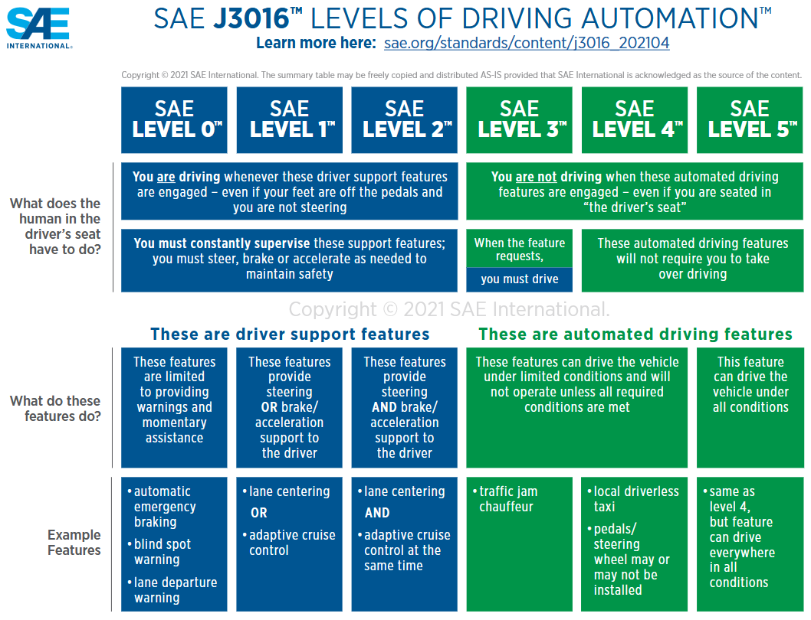

# Capítulo 1 — Introducción

<!--
Estado: PRIMERA REDACCIÓN (D9 de Fase 0).
Extensión objetivo: 8–12 páginas.
Convención: las secciones marcadas [LISTO] están redactadas a nivel borrador maduro.
Las marcadas [PLACEHOLDER] requieren cifras concretas que se cierran en Fase 1.
-->

## 1.1 Contexto y motivación  [LISTO]

La conducción autónoma ha pasado en una década de demostración de laboratorio a
producto comercial parcial. Los sistemas avanzados de asistencia al conductor
(ADAS) están desplegados a millones de unidades, y los proyectos de nivel 4
operan ya en flotas restringidas en varias ciudades del mundo (Kootbally
et al., 2024). En este movimiento, dos tendencias técnicas se han consolidado
en paralelo. La primera es la incorporación creciente de componentes basados
en aprendizaje automático —redes neuronales profundas (Kuutti et al., 2019a),
y más recientemente políticas entrenadas por refuerzo (García y Fernández,
2015)— en módulos críticos de percepción, predicción y decisión. La segunda
es el endurecimiento de los marcos normativos de seguridad funcional, que
establecen requisitos cada vez más exigentes sobre cómo se diseña, verifica y
valida cualquier función con consecuencias sobre la integridad física de los
ocupantes y otros usuarios de la vía.

*Ilustración 1 — SAE’s six levels of driving automation.*

Estas dos tendencias, individualmente sólidas, presentan una tensión estructural
cuando confluyen. Los marcos de seguridad funcional clásicos —ISO 26262:2018 a
la cabeza— fueron diseñados para sistemas cuyo comportamiento es derivable de
una especificación escrita a priori, verificable mediante tests con salidas
esperadas, y validable estáticamente antes del despliegue. Los componentes
aprendidos rompen los tres supuestos: su comportamiento emerge de un proceso
de optimización estocástico, su salida no admite la noción clásica de
"respuesta correcta", y su robustez fuera de la distribución de entrenamiento
solo puede caracterizarse empíricamente (Wäschle et al., 2022; Paterson
et al., 2025). El análisis sistemático más temprano de esta tensión es el de
Salay, Queiroz y Czarnecki (2017), quienes identificaron cinco áreas concretas
donde el uso de aprendizaje automático impacta a ISO 26262 —desde la
identificación de nuevos tipos de hazards hasta la inaplicabilidad de
aproximadamente el 40% de las técnicas de software prescritas en su Parte 6—,
y que constituye el antecedente conceptual directo de esta tesis. La industria
ha respondido a esta tensión con dos estrategias parciales —contención
mediante arquitecturas de monitor-actuador (*safety cages*) (Kuutti et al.,
2019b, 2021) y caracterización mediante validación basada en escenarios
(De Gelder et al., 2024)— pero la integración coherente de ambas estrategias
dentro de un ciclo de desarrollo trazable continúa siendo un problema abierto.

En el plano normativo, la respuesta institucional a este problema se encuentra
en plena maduración. ISO 21448 (SOTIF) reconoce desde 2022 que la validación
estática es insuficiente cuando el dominio operacional no puede especificarse
exhaustivamente (ISO 21448:2022; Wang et al., 2024). ISO/IEC TR 5469, publicado
en 2024, ofrece la primera guía sistemática sobre el uso de IA en funciones de
seguridad y clasifica los elementos de tecnología IA en clases I y II según su
verificabilidad (ISO/IEC TR 5469:2024). UL 4600 formaliza la noción de *safety
case* como mecanismo central de evidencia para productos autónomos (Koopman,
2023). Estos tres documentos, sin embargo, son guías de alto nivel: enuncian
principios pero no prescriben un ciclo de vida concreto que integre todas sus
exigencias en una metodología única, ejecutable, y aplicable a un proyecto
académico o industrial.

Esta tesis se sitúa exactamente en esa brecha.

---

## 1.2 Planteamiento del problema  [LISTO]

El problema que aborda esta tesis se enuncia en tres niveles de granularidad
creciente.

**Nivel general.** Las metodologías de ingeniería de seguridad funcional
canónicas en automoción —singularmente el V-Model adoptado por ISO 26262— no
pueden aplicarse sin modificaciones a sistemas que incorporan componentes
aprendidos por refuerzo. Aplicarlas tal cual conduce a uno de dos fracasos
predecibles: o bien se fuerza al componente RL a una especificación que no
puede satisfacer (rompiendo la honestidad del proceso), o bien se le exime del
proceso (rompiendo la trazabilidad). Ninguno de los dos es aceptable en un
sistema con consecuencias de seguridad.

**Nivel específico.** Las adaptaciones puntuales propuestas en la literatura
—safety cages para contener policies (Kuutti et al., 2019b, 2021), filtros
predictivos de seguridad para control basado en aprendizaje (Tearle et al.,
2021), evaluación basada en escenarios (De Gelder et al., 2024)— atacan
facetas individuales del problema, pero no se integran de oficio en un ciclo
de vida unificado con trazabilidad bidireccional explícita entre niveles.
Existen propuestas más recientes que sí abordan el ciclo de vida completo
—notablemente Ullrich et al. (2025) sobre la expansión del V-Model clásico
para sistemas complejos con IA, así como los trabajos previos sobre adaptación
específica de ISO 26262 a ML (Salay et al., 2017; Vasudevan et al., 2021)—
pero permanecen en un plano abstracto, sin operacionalización ejecutable
y sin caso de aplicación documentado de extremo a extremo. El espacio que
esta tesis ocupa es la materialización ejecutable de un marco de ese tipo,
validada por aplicación a un caso concreto.

**Nivel concreto.** Para que un marco metodológico de este tipo sea evaluable,
debe ser ejecutado sobre un caso real, suficientemente complejo como para
exhibir los problemas característicos —especificación de comportamiento
aprendido, gap sim-to-real, runtime monitoring— y suficientemente acotado como
para ser abordable por un único investigador en el horizonte de un proyecto de
máster. El caso elegido en esta tesis es un sistema de seguimiento de carril
(*lane-following*) implementado sobre un vehículo a escala 1:14, entrenado en
simulación Gazebo mediante PPO sobre una interfaz gymnasium-Gazebo-ROS2 que
reutiliza un entorno previamente construido por el autor en un trabajo de
investigación anterior, y desplegado físicamente bajo la supervisión de una
cage de reglas determinista.

La pregunta de investigación principal se formula como sigue:

> **¿Es posible adaptar el V-Model canónico de ISO 26262 mediante un conjunto
> finito y trazable de modificaciones, de modo que acomode componentes
> entrenados por refuerzo dentro de un ciclo de desarrollo con safety case,
> sin abandonar los principios de correspondencia bidireccional
> especificación↔V&V que dan al estándar su valor?**

Y, subordinada a ella, una pregunta de validación:

> **Cuando el marco resultante se aplica a un caso concreto de seguimiento
> de carril con policy PPO + cage de reglas, ¿produce evidencia coherente y
> trazable sobre el comportamiento del sistema, incluyendo una caracterización
> honesta del gap sim-to-real?**

---

## 1.3 Hipótesis  [LISTO]

La tesis sostiene tres hipótesis encadenadas:

- **H1 (de constructo).** Es posible identificar un conjunto pequeño y
  enumerable de adaptaciones al V-Model clásico —en esta tesis, cinco— que
  cubran los modos de fallo característicos de los componentes RL/IA sin
  romper la estructura general del estándar.

- **H2 (de operatividad).** Cada una de esas adaptaciones es operacionalizable
  como un conjunto concreto de artefactos —documentos, tests, validadores
  automáticos— que pueden producirse y mantenerse con esfuerzo proporcional al
  resto del proyecto, no como una sobrecarga prohibitiva.

- **H3 (de utilidad).** El marco resultante, cuando se aplica al caso de
  estudio, produce evidencia trazable que permite emitir un veredicto
  fundamentado sobre el comportamiento del sistema, incluyendo los límites de
  validez de dicho veredicto.

Las tres hipótesis se evalúan al cierre de la tesis (Capítulo 11). H1 se
evalúa por inspección estructural del marco; H2 por el coste de adopción
documentado en `DECISIONS.md` a lo largo del proyecto; H3 por el nivel de
cobertura de los Safety Requirements alcanzado al cierre experimental.

---

## 1.4 Objetivos  [LISTO]

### 1.4.1 Objetivo general

Diseñar, implementar y evaluar un marco metodológico —el *V-Model adaptado*—
para el desarrollo de sistemas de conducción autónoma que incorporan
componentes entrenados por refuerzo, articulando dentro de un ciclo único las
prácticas de safety cage, validación basada en escenarios, runtime monitoring
y trazabilidad bidireccional, en coherencia con ISO 26262, ISO 21448, ISO/IEC
TR 5469 y UL 4600.

### 1.4.2 Objetivos específicos

- **OE1.** Caracterizar formalmente los supuestos implícitos del V-Model
  clásico que fallan cuando se introduce un componente entrenado por refuerzo
  en un módulo de seguridad. *(Capítulo 3, §3.3.)*

- **OE2.** Proponer y justificar un conjunto finito de adaptaciones al
  V-Model que ataquen sistemáticamente los supuestos quebrados, manteniendo la
  coherencia con los estándares de referencia. *(Capítulo 3, §3.4.)*

- **OE3.** Operacionalizar cada adaptación en términos de artefactos concretos
  (especificaciones, tests, validadores, métricas) y definir su flujo de
  producción a lo largo de un proyecto. *(Capítulo 3, §3.5; capítulos
  4–8 como ejecución.)*

- **OE4.** Aplicar el marco a un caso de estudio —lane-following con PPO y
  cage sobre coche RC 1:14 en Gazebo— hasta producir un sistema funcional,
  evaluable y con trazabilidad completa. *(Capítulos 4–8.)*

- **OE5.** Caracterizar cuantitativamente el gap entre el entorno de
  entrenamiento (simulación) y el entorno operacional (físico), cumpliendo
  con la adaptación A5 del marco. *(Capítulo 9.)*

- **OE6.** Emitir un veredicto fundamentado sobre el cumplimiento de los
  Safety Requirements por parte del sistema resultante, con declaración
  explícita de los límites de validez de dicho veredicto. *(Capítulo 10.)*

- **OE7.** Evaluar el propio marco metodológico: su coste de adopción, su
  cobertura, y los criterios bajo los cuales se considera exitoso o
  insuficiente. *(Capítulo 11.)*

---

## 1.5 Aportaciones  [LISTO]

La aportación principal de esta tesis es **metodológica**, no técnica. El
sistema lane-following resultante no constituye una contribución relevante por
sí mismo —existen variantes mejor entrenadas, sobre vehículos más capaces, en
la literatura reciente—. Lo que esta tesis aporta es el marco que ese sistema
materializa y la evidencia documentada de su aplicación.

Las aportaciones específicas son cinco:

- **A1 — Marco metodológico unificado.** Un V-Model adaptado con cinco
  modificaciones explícitas (desdoblamiento de L4 en Cage Spec / Training
  Spec; desdoblamiento de L4' en Cage Unit Tests / Policy Behavioral
  Evaluation; introducción de un nivel de Runtime Monitoring; trazabilidad
  bidireccional como restricción dura; reformulación de L1' como Operational
  Validation con caracterización del gap sim-to-real), articuladas en una
  estructura coherente con los estándares vigentes.

- **A2 — Operacionalización ejecutable.** Cada modificación del marco se
  acompaña de los artefactos concretos que la materializan, con plantillas
  reutilizables y validadores automáticos (en particular, el script
  `check_traceability.py` que aplica la trazabilidad como restricción dura).

- **A3 — Caso de estudio completo y reproducible.** Aplicación del marco a un
  sistema de lane-following implementado de cero hasta despliegue físico,
  con artefactos versionados, scripts de entrenamiento y evaluación, y datos
  de runtime publicados como conjunto reutilizable.

- **A4 — Caracterización empírica del gap sim-to-real.** Cuantificación
  documentada del gap entre simulación Gazebo y plataforma física a escala
  1:14, en términos de las métricas definidas en el marco.

- **A5 — Auto-evaluación del marco.** Discusión razonada sobre el coste de
  adopción del V-Model adaptado, los puntos donde funcionó como se esperaba,
  y los puntos donde reveló limitaciones, contribuyendo evidencia para
  futuras refinaciones por terceros.

---

## 1.6 Alcance y limitaciones  [LISTO]

Antes de continuar, conviene declarar con honestidad qué hace y qué no hace
esta tesis, para evitar expectativas mal calibradas.

### 1.6.1 Alcance

- **Caso único.** El marco se aplica a un único sistema —lane-following con
  PPO + cage— sobre una única plataforma —vehículo RC 1:14 en pista
  controlada—. No se aborda comparación con un sistema baseline desarrollado
  con V clásico.

- **Tarea acotada.** La función objetivo es seguimiento de carril en pista
  delimitada con condiciones de iluminación y meteorología controladas. No
  se aborda planificación, interacción con otros vehículos, ni operación en
  vía pública.

- **Nivel SAE 2.** El sistema se enmarca conceptualmente en el espacio de
  funciones de nivel SAE 2 (asistencia continua bajo supervisión humana).
  La extensión a niveles 4–5 queda fuera del alcance.

### 1.6.2 Limitaciones reconocidas

- **Sesgo del autor.** Una misma persona diseña el marco, lo implementa y lo
  evalúa. Esto introduce sesgo de confirmación. Mitigación parcial mediante
  trazabilidad estricta auditable y registro de decisiones en
  `DECISIONS.md`.

- **N=1.** No es posible derivar conclusiones generales sobre la utilidad del
  marco a partir de un único caso. La generalización se argumenta por
  *plausibilidad estructural* (las adaptaciones atacan supuestos que fallan
  en cualquier sistema con componente aprendido), no por evidencia
  estadística.

- **Coste de adopción no comparado.** Se documenta el esfuerzo dedicado a los
  artefactos del marco, pero no se compara con un grupo de control donde se
  hubiera usado V clásico o ningún marco.

- **Adaptaciones no exhaustivas.** Las cinco adaptaciones propuestas (A1–A5)
  son las que el autor considera más relevantes para el caso, pero otras
  serían defendibles. La discusión de adaptaciones alternativas queda como
  trabajo futuro.

- **Plataforma a escala.** Los hallazgos sobre el gap sim-to-real son
  específicos de la dinámica de un vehículo 1:14 en pista controlada y no
  trasladables sin más al gap sim-to-real de un vehículo de calle.

Estas limitaciones se desarrollan con mayor detalle en el capítulo de
metodología (§3.9) y en el capítulo de discusión final (Capítulo 11).

---

## 1.7 Estructura del documento  [LISTO]

La tesis se organiza en doce capítulos agrupados en cuatro bloques.

**Bloque I — Marco.**

- *Capítulo 1 (presente).* Introducción, problema, hipótesis, objetivos,
  aportaciones y estructura.
- *Capítulo 2.* Estado del arte: revisión sistemática de la literatura sobre
  RL aplicado a conducción autónoma, safety cages, validación basada en
  escenarios, y estándares aplicables.
- *Capítulo 3.* Metodología: presentación detallada del V-Model adaptado y
  sus cinco modificaciones. Constituye la aportación académica central de
  la tesis.

**Bloque II — Especificación.**

- *Capítulo 4.* Definición del dominio operacional (ODD), análisis HARA y
  derivación de Safety Requirements.
- *Capítulo 5.* Diseño arquitectónico: grafo ROS2, especificación de la cage,
  interfaces entre nodos.

**Bloque III — Implementación y evaluación.**

- *Capítulo 6.* Implementación y verificación: nodos ROS2, cage funcional,
  suite de tests unitarios, integración.
- *Capítulo 7.* Entrenamiento: definición de la *Training Specification*,
  función de recompensa, hiperparámetros, criterios de convergencia,
  ejecución del entrenamiento PPO en Gazebo.
- *Capítulo 8.* Evaluación de la policy: caracterización estadística sobre
  la *scenario library*, análisis de modos de fallo y comparación
  policy-sola / policy+cage.
- *Capítulo 9.* Caracterización del gap sim-to-real: despliegue físico,
  métricas comparativas y análisis de las divergencias significativas.

**Bloque IV — Cierre.**

- *Capítulo 10.* Validación operacional: tabla de verdictos por SR,
  evidencia consolidada y declaración de validación acotada.
- *Capítulo 11.* Discusión: evaluación del propio marco metodológico frente
  a los criterios de §3.7, lecciones aprendidas, comparación con prácticas
  alternativas.
- *Capítulo 12.* Conclusiones y trabajo futuro.

Los anexos recogen la matriz de trazabilidad completa, las plantillas de
documentación, los scripts de validación automática y los datos de runtime.

---

<!--
APÉNDICE INTERNO — TRABAJO PENDIENTE EN ESTE CAPÍTULO

D9 (segunda redacción):
  [x] Estructura de secciones 1.1–1.7
  [x] Redacción borrador maduro de 1.1 a 1.7
  [x] Citas bibliográficas básicas añadidas en §1.1 y §1.2
  [x] Incorporación de Salay et al. (2017) como antecedente fundacional
       del análisis de impacto ML sobre ISO 26262 en §1.1
  [x] Reconocimiento de Vasudevan et al. (2021) como precedente directo
       de framework ISO 26262 + ML en §1.2

Fase 1 (D15–D19):
  [ ] Cerrar la cifra exacta de SRs en §1.4 cuando termine el HARA
  [ ] Confirmar que los siete OE encajan con el plan de fases definitivo
  [ ] Ajustar §1.3 si las hipótesis se reformulan tras Gate 0

Fase 6 (consolidación):
  [ ] Pulido final de prosa, conectores, ritmo
  [ ] Verificar coherencia de referencias cruzadas a capítulos
       (números de capítulo, secciones, anexos)
  [ ] Verificar entradas BibTeX y formato definitivo cuando se fije
       el estilo de citación de la tesis (IEEE numérico vs APA autor-año)
  [ ] Confirmar autoría y año exactos de Tearle et al. (2021) — paper
       sobre Predictive Safety Filter para control de carreras basado
       en aprendizaje (PDF en `/mnt/project/`)
  [ ] Decisión: ¿añadir una figura de "panorama" de la tesis al final
       de §1.7 mostrando el flujo entre capítulos?

REFERENCIAS USADAS EN ESTE CAPÍTULO (D9):
  Surveys / reviews:
  - García y Fernández, 2015 (Safe RL survey)
  - Kuutti et al., 2019a (Survey of DL applications to AV control)
  - Wäschle et al., 2022 (Review of AI Safety in highly automated driving)
  - Wang et al., 2024 (Survey on SOTIF)
  - Kootbally et al., 2024 (Standards and performance metrics for AVs)
  - Paterson et al., 2025 (Safety assurance of ML for autonomous systems)

  Trabajos puntuales sobre safety cages / filters / scenarios:
  - Kuutti et al., 2019b (Safety cages para AVs)
  - Kuutti et al., 2021 (Weakly supervised RL via virtual safety cages)
  - Tearle et al., 2021 (Predictive Safety Filter — verificar autoría)
  - De Gelder et al., 2024 (Coverage metrics for scenario database)

  V-Model y AI / Frameworks ISO 26262 + ML:
  - Salay, Queiroz y Czarnecki, 2017 (Análisis fundacional ISO 26262 + ML;
       arXiv:1709.02435 — antecedente directo de los supuestos S1–S5
       desarrollados en Cap. 3)
  - Vasudevan, Abdullatif, Kabir, Campean, 2021 (Framework para
       incertidumbres ML conforme ISO 26262; UKCI 2021,
       DOI 10.1007/978-3-030-87094-2_45)
  - Ullrich et al., 2025 (Expanding the Classical V-Model for AI)
  - Koopman, 2023 (UL 4600 What to Include)

  Estándares:
  - ISO 26262:2018
  - ISO 21448:2022 (SOTIF)
  - ISO/IEC TR 5469:2024
  - UL 4600 (citado vía Koopman, 2023)

  Recursos:
  - https://www.sae.org/news/blog/sae-levels-driving-automation-clarity-refinements
-->
