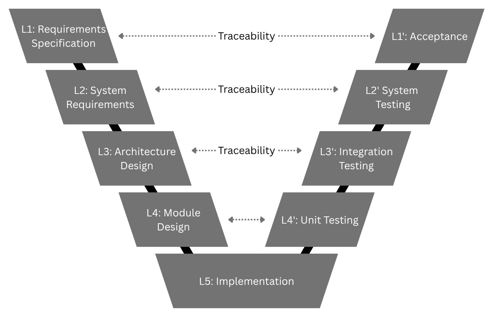
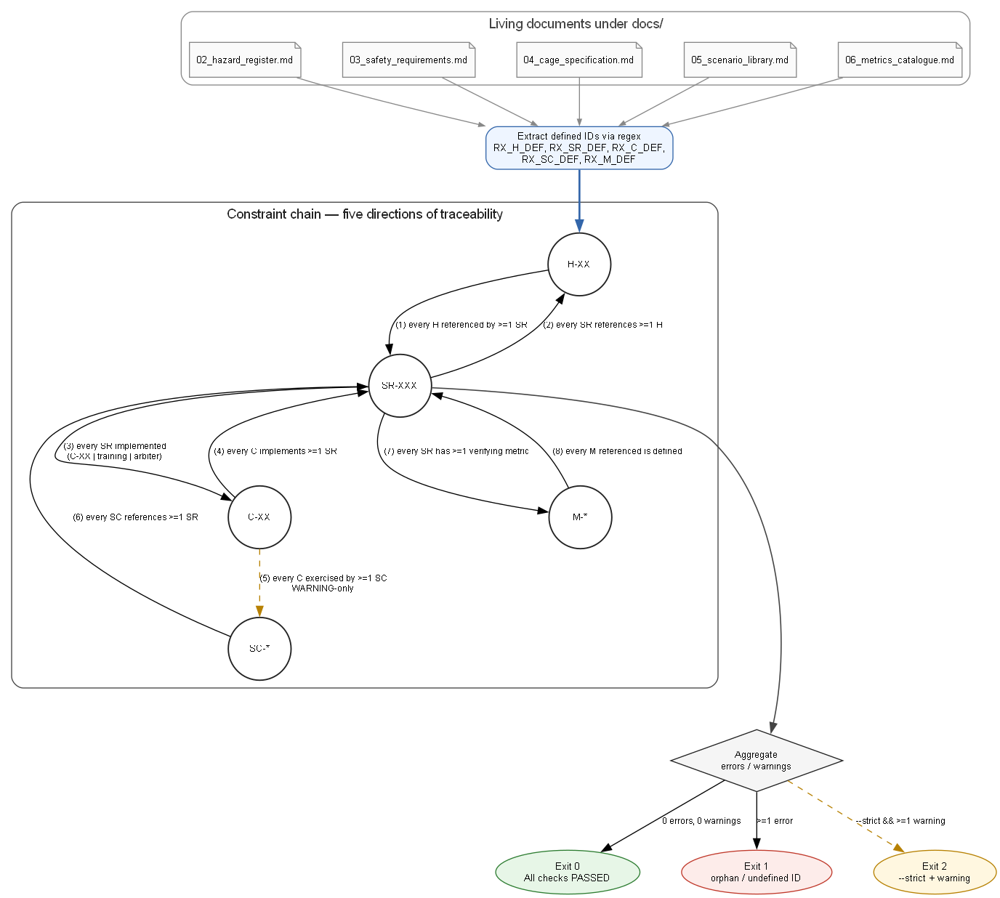
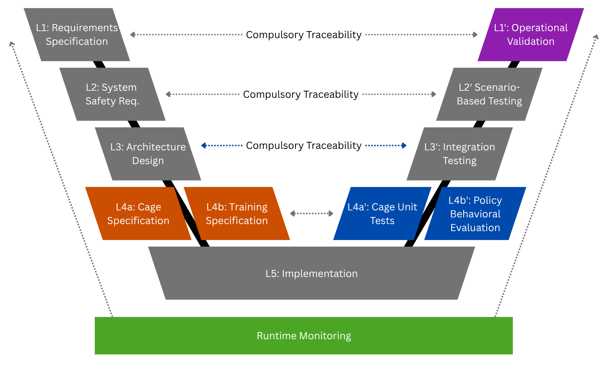
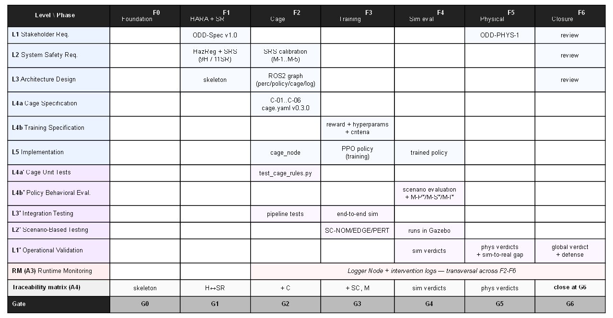
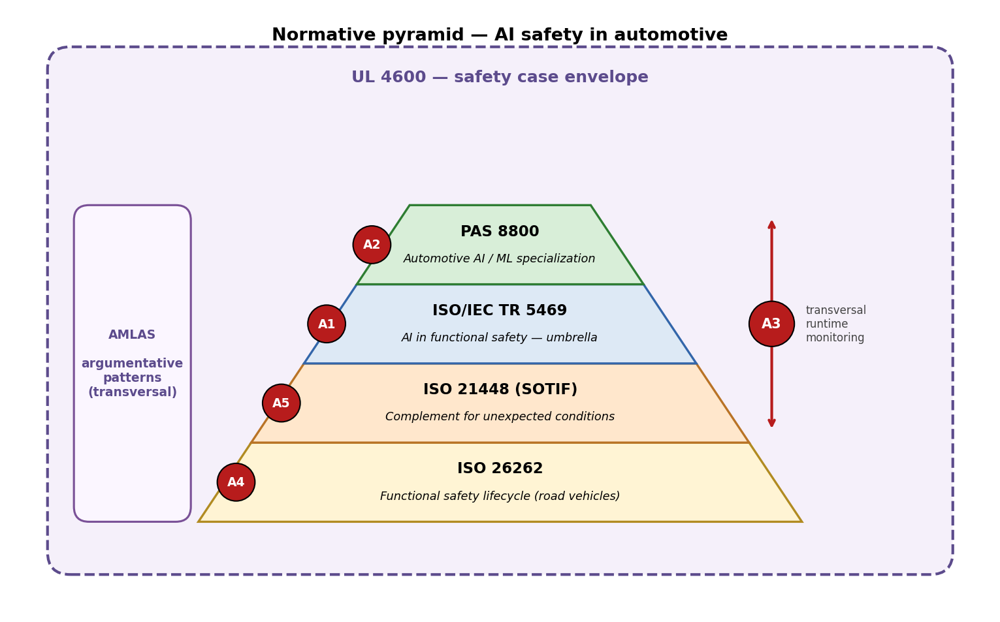

# Capítulo 3 — Metodología

<!--
Estado: SEGUNDA REDACCIÓN D9 (Fase 0).
Extensión objetivo: 14–18 páginas.
Convención: las secciones marcadas [LISTO D9] tienen prosa madura a nivel borrador
de Fase 0. Las marcadas [PULIDO FASE 6] requieren retoques estilísticos al cierre.
Las marcadas [COMPLETAR FASE 1] dependen de artefactos cuyo cierre se difiere
(HARA, Cage Spec, Training Spec).
-->

## 3.1 Introducción del capítulo  [LISTO D9]

Este capítulo presenta la aportación metodológica central de la tesis: el
*V-Model adaptado*, un marco de ciclo de vida concebido para sistemas que
incorporan componentes entrenados por refuerzo dentro de funciones con
implicaciones de seguridad. Conviene declarar de entrada qué hace y qué no
hace este capítulo. Establece el marco metodológico que rige el resto del
trabajo, justifica las decisiones que lo configuran, y sitúa cada decisión
en relación con los estándares aplicables y la literatura revisada en el
Capítulo 2; no presenta resultados experimentales ni detalles de
implementación, que se desarrollan a partir del Capítulo 4.

Una distinción inicial es útil para evitar ambigüedades. La tesis combina
dos niveles de metodología que conviene mantener separados conceptualmente.
Por un lado, la *metodología de investigación* —cómo se produce conocimiento
académico generalizable a partir del trabajo realizado—, que se discute en
§3.2 desde la perspectiva del *design science*. Por otro lado, la
*metodología de ingeniería del sistema* —cómo se produce el artefacto
técnico concreto a partir de los requisitos hasta el despliegue—, que se
desarrolla en §3.3 a §3.7. Las dos metodologías están entrelazadas pero no
son la misma cosa; la primera es la respuesta a "¿qué aporta esta tesis al
conocimiento?", la segunda a "¿cómo se construye el sistema lane-following?".

La aportación académica central de la tesis vive en este capítulo. Los
capítulos 4 a 10 constituyen la materialización experimental de lo que aquí
se define, y el Capítulo 11 evalúa el propio marco a la luz de esa
materialización. La estructura del capítulo es la siguiente. La sección 3.2
posiciona epistemológicamente el trabajo. La sección 3.3 caracteriza el
V-Model clásico y los supuestos implícitos que fallan al introducir
componentes RL. La sección 3.4 desarrolla las cinco adaptaciones que
constituyen el corazón del marco propuesto. La sección 3.5 operacionaliza el
marco sobre el caso lane-following. La sección 3.6 documenta las elecciones
de instrumento. La sección 3.7 establece cómo se evaluará el propio marco
metodológico al cierre del trabajo. La sección 3.8 articula la relación con
los estándares vigentes. La sección 3.9 declara honestamente las
limitaciones, y la sección 3.10 cierra con una transición al Capítulo 4.

---

## 3.2 Posicionamiento epistemológico y enfoque de investigación  [LISTO D9]

Esta sección responde a una pregunta que rara vez se hace explícita en
trabajos de ingeniería pero que un tribunal académico legítimamente puede
plantear: ¿qué tipo de conocimiento produce esta tesis y cómo se justifica
que ese conocimiento sea válido?

### 3.2.1 Tipo de investigación

El trabajo se inscribe en la tradición del *design science research*
(Hevner et al., 2004) o, en una formulación próxima, *constructive research*
(March y Smith, 1995). En esta tradición, la contribución académica no es
una proposición empírica que se contrasta contra la realidad —como en las
ciencias naturales—, ni una proposición lógica que se demuestra
deductivamente —como en matemáticas—, sino un *artefacto* que aborda un
problema previamente identificado en la literatura o en la práctica, y cuya
utilidad se evalúa mediante uno o varios casos de aplicación.

El artefacto producido por esta tesis es un marco metodológico: el V-Model
adaptado, articulado en cinco adaptaciones (A1–A5) sobre el V-Model clásico
de ISO 26262 (ISO 26262:2018), junto con el conjunto de plantillas,
validadores y artefactos derivados que lo materializan. El problema que
aborda quedó establecido en el Capítulo 1 y documentado en el Capítulo 2:
ningún trabajo previo articula simultáneamente entrenamiento seguro,
contención runtime, validación basada en escenarios, ciclo de vida con
trazabilidad bidireccional verificable, y caracterización del gap
sim-to-real, dentro de un marco operacionalizable y aplicado de extremo a
extremo (Ullrich et al., 2025; Wang et al., 2024; Paterson et al., 2025).

Esta caracterización tiene tres consecuencias prácticas. Primera: la tesis
no busca ni puede pretender la contribución típica de una tesis empírica
—descubrir un fenómeno, refutar una hipótesis estadística—, sino la
contribución típica de una tesis constructiva: producir un artefacto útil y
demostrar su funcionamiento. Segunda: la evaluación del trabajo se hace
sobre el artefacto y no solo sobre el sistema construido con él, lo que
exige un capítulo dedicado (Capítulo 11) a evaluar el marco en sí, no
solo el lane-following resultante. Tercera: la generalización de las
conclusiones se argumenta no por inducción estadística sobre múltiples
casos, sino por *plausibilidad estructural*: las adaptaciones A1–A5
atacan supuestos del V-Model que fallan para cualquier sistema con
componente aprendido, no solo para lane-following.

### 3.2.2 Estrategia de evaluación: caso de estudio único

El marco propuesto se evalúa mediante un único caso de aplicación: un
sistema de seguimiento de carril (*lane-following*) implementado sobre un
vehículo radio-controlado a escala 1:14, entrenado mediante PPO (Schulman
et al., 2017) en simulador Gazebo (Koenig y Howard, 2004) sobre una
interfaz gymnasium-Gazebo-ROS2 que reutiliza un entorno previamente
construido por el autor en un trabajo de investigación anterior, y
desplegado físicamente bajo la supervisión de una *safety cage* de reglas
determinista (Kuutti et al., 2019b). La elección de un único caso, frente
a un estudio multi-caso o a una evaluación comparativa contra un grupo de
control, es una decisión consciente con motivos y costes que conviene
declarar.

El motivo principal es de viabilidad. Un caso de aplicación que cubra el
ciclo completo —desde el análisis HARA hasta el despliegue físico con
caracterización del gap sim-to-real— es ya un compromiso ambicioso para una
tesis de máster. Multiplicarlo introduciría una superficialidad incompatible
con el rigor que el propio marco exige. Es preferible un caso profundo que
varios casos superficiales.

El coste es de validez externa. La generalización del marco a sistemas
distintos —otros niveles SAE, otras tareas de conducción, otros dominios
robóticos— no puede ser establecida empíricamente desde un solo caso. La
tesis lo asume y mitiga mediante dos mecanismos: el argumento de
plausibilidad estructural mencionado en §3.2.1, que sostiene que las
adaptaciones atacan problemas comunes a cualquier sistema con componentes
RL; y el reconocimiento explícito en el Capítulo 12 de qué partes del marco
son razonablemente trasladables y cuáles requieren replanteamiento para
otros dominios.

### 3.2.3 Rol del autor y posición frente al objeto

Una circunstancia inherente a una tesis individual y que el rigor
metodológico exige reconocer: el autor de este trabajo es a la vez
diseñador del marco metodológico, implementador del sistema lane-following
sobre el que se aplica, y evaluador del resultado. Esta triple condición
introduce un sesgo de confirmación estructural —el evaluador tiene
incentivos para no encontrar fallos en el marco propuesto por el
diseñador—, y conviene reconocerlo antes de neutralizarlo.

La mitigación adoptada se articula en tres niveles. Primero: la trazabilidad
bidireccional como restricción dura (adaptación A4), aplicada por el
validador automatizado `check_traceability.py`, hace que cualquier huérfano
o decisión sin justificación quede expuesto sin intervención del autor; el
script actúa como un auditor externo de bajo coste. Segundo: las decisiones
de diseño se registran a lo largo del proyecto en un fichero `DECISIONS.md`
que documenta no solo qué se decidió, sino qué alternativas se consideraron
y por qué se descartaron; este registro es auditable a posteriori por
terceros. Tercero: las limitaciones del marco se declaran explícitamente en
§3.9 y se discuten en el Capítulo 11 con la misma honestidad que se
reservaría para una solución de la competencia.

Estos tres mecanismos no eliminan el sesgo del autor —ningún mecanismo
puede—, pero lo acotan al elevarlo a la auditabilidad de un tercero
independiente que repitiera el ejercicio sobre los artefactos versionados
del proyecto.

---

## 3.3 V-Model clásico y sus supuestos implícitos  [LISTO D9]

El V-Model clásico, formalizado en IEEE 1220, ISO/IEC/IEEE 15288 y adoptado
por ISO 26262 para automoción, estructura el proceso de ingeniería en cinco
niveles jerárquicos, con correspondencia bidireccional entre especificación
(rama izquierda descendente) y verificación/validación (rama derecha
ascendente).

*Figura 4 — V-Model adoptado por ISO 26262 simplificado, instanciado sobre el caso lane-following.*

### 3.3.1 Supuestos implícitos del V-Model clásico

El V-Model clásico opera sobre cinco supuestos que rara vez se hacen
explícitos pero que sostienen toda su estructura. La identificación
sistemática de estos supuestos —y de los puntos donde se quiebran ante
componentes ML— tiene un antecedente fundacional en el análisis de Salay,
Queiroz y Czarnecki (2017), que examinó cinco áreas de impacto del
aprendizaje automático sobre ISO 26262: identificación de hazards, modos
de fallo, uso de training sets en sustitución de especificaciones, nivel
arquitectónico vs. unidad, y aplicabilidad de las técnicas software de la
Parte 6. Los cinco supuestos S1–S5 que se enuncian a continuación son
una reformulación operativa de aquel análisis, articulada de modo que
cada supuesto admite, en §3.4, una adaptación A1–A5 correspondiente:

- **S1.** Cada módulo tiene una especificación completa y determinista
  escrita a priori.
- **S2.** El comportamiento del módulo es fielmente derivable de su
  especificación.
- **S3.** Los tests unitarios pueden verificar cumplimiento de
  especificación con cobertura finita.
- **S4.** La verificación estática es suficiente para garantizar
  propiedades funcionales y no funcionales.
- **S5.** El entorno operacional es suficientemente similar al entorno de
  testing como para que la validación estática sea válida.

### 3.3.2 Fallos de los supuestos para sistemas con componentes RL/IA

Cuando uno de los módulos del sistema es una *policy* aprendida por
refuerzo, los cinco supuestos fallan de manera estructural:

| Supuesto | Por qué falla en RL/IA |
| --- | --- |
| S1 | La policy RL no tiene una especificación pre-diseñada. Emerge del entrenamiento. No existe un documento "módulo X, cuando entrada es Y, produce salida Z". |
| S2 | El comportamiento de la policy no es derivable de un spec. Es observable post hoc pero no predecible analíticamente. |
| S3 | Los tests unitarios sobre la policy son imposibles en sentido clásico: no hay salida "correcta" definida por entrada. Solo hay salidas estadísticamente plausibles. |
| S4 | La policy puede comportarse correctamente en testing y fallar en operación por distribuciones de estado no cubiertas. La verificación estática es necesaria pero no suficiente. |
| S5 | El gap entre el entorno de entrenamiento (simulación) y el entorno operacional (real) puede ser grande y silente. La validación clásica no lo caracteriza. |

*Tabla 3 — Fallos de los supuestos para sistemas con componentes RL/IA.*

Más allá del análisis cualitativo de los supuestos, el alcance cuantitativo
del problema queda ilustrado por el hallazgo de Salay et al. (2017) sobre
las 75 técnicas software prescritas en la Parte 6 de ISO 26262:
aproximadamente el 40% no es aplicable a componentes ML sin modificación,
distribuidas entre técnicas directamente reutilizables (categoría "OK",
típicamente técnicas *black box* como análisis de valores frontera),
técnicas adaptables con modificación (categoría "Adapt", como
*walk-through* sobre redes no transparentes), y técnicas fundamentalmente
inaplicables (categoría "N/A", típicamente prescripciones orientadas a
lenguajes imperativos sin equivalente en modelos aprendidos). Este vacío
operativo —no solo conceptual— es lo que motiva la necesidad de un marco
metodológico complementario.

Estos cinco fallos no son un argumento para abandonar el V-Model, sino
para adaptarlo. La sección siguiente desarrolla cinco adaptaciones, cada
una atacando uno o varios de los supuestos quebrados. El núcleo
metodológico del trabajo consiste precisamente en mantener la estructura
del V —y con ella la coherencia con ISO 26262— mientras se introducen las
modificaciones mínimas necesarias para que la *policy* aprendida quepa
dentro del ciclo sin romper la trazabilidad ni la honestidad del proceso.

---

## 3.4 V-Model adaptado: las cinco adaptaciones  [LISTO D9 — pulir prosa en Fase 6]

### 3.4.1 A1 — Desdoblamiento del nivel Module Design

**Problema en el V clásico.** El nivel L4 (Module Design) asume que cada
módulo tiene una especificación completa, determinista y escribible a
priori. En un sistema con *policy* RL, este supuesto se rompe para el
módulo *policy*. No es posible escribir "la policy debe producir acción
a = f(s) tal que..." porque f es el resultado de la optimización, no su
input.

**Adaptación propuesta.** L4 se desdobla en dos sub-niveles conceptualmente
distintos:

- **L4a — Cage Specification.** Especificación clásica, determinista,
  modular. Cada regla de la cage (C1..Cn) es una función pura, testeable,
  con entradas y salidas definidas. La cage se diseña en sentido
  tradicional, siguiendo la línea de Kuutti et al. (2019b, 2021).
- **L4b — Training Specification.** Meta-especificación. No se especifica
  el comportamiento de la *policy*, se especifica el proceso que la
  produce: función de recompensa, espacios de estado y acción, ODD de
  entrenamiento, criterios de convergencia, algoritmo RL, restricciones
  activas durante entrenamiento.

**Operacionalización en la tesis.** La Cage Spec y el Training Spec son dos
documentos separados. La Cage Spec sigue una estructura clásica de
especificación de módulo. El Training Spec se presenta explícitamente como
*meta-design*: el autor diseña el proceso, no el producto. Esta separación
es coherente con el *three-stage realization principle* introducido en la
cláusula 7 de ISO/IEC TR 5469:2024, que distingue las fases de adquisición
desde entradas, inducción de conocimiento desde datos, y procesamiento y
generación de salidas; A1 articula esta distinción en el nivel de proceso
de diseño.

**Artefactos producidos.** `cage_specification.md` (con C1–C6 formalmente
definidas), `training_specification.md` (función de recompensa,
hiperparámetros, ODD, criterios de convergencia).

### 3.4.2 A2 — Sustitución de Unit Testing por Cage Unit Tests + Policy Behavioral Evaluation

**Problema en el V clásico.** L4' (Unit Testing) verifica un módulo contra
su especificación mediante casos de test concretos con salidas esperadas.
Para la *policy* RL, no existe "salida esperada" para un estado dado: solo
hay distribuciones plausibles de acción condicionadas al estado.

**Adaptación propuesta.** L4' se desdobla correspondientemente con A1:

- **L4a' — Cage Unit Tests.** Tests unitarios clásicos sobre cada regla de
  cage. Vectores de estado sintéticos, comportamiento determinista
  esperado, *pass/fail* binario. Idénticos en filosofía a los unit tests
  del V clásico.
- **L4b' — Policy Behavioral Evaluation.** Evaluación estadística sobre
  distribuciones de estado. Se evalúa, por ejemplo, "en N estados muestreados
  del ODD operacional, la *policy* produce acciones que satisfacen la
  propiedad X con frecuencia Y". No es verificación en sentido lógico, es
  *caracterización estadística del comportamiento*.

**Operacionalización en la tesis.** Los Cage Unit Tests son una suite
automatizada de pytest con un mínimo de tres vectores por regla. La
Policy Behavioral Evaluation se realiza sobre la *scenario library*
(definida en Cap. 6) con análisis estadístico explícito (medias, varianzas,
percentiles, intervalos de confianza). Las métricas de comportamiento del
ego del Capítulo 8 se inspiran en QED (Gao et al., 2021) y en *Behavior
Metrics* (Paniego et al., 2024), instrumentos abiertos para evaluación
cuantitativa de tareas de conducción autónoma.

**Artefactos producidos.** Suite `tests/cage/test_rules.py` (determinista);
Capítulo 8 de la tesis como Policy Behavioral Evaluation estructurada.

**Nota filosófica.** Esta adaptación reconoce que la verificación en
sentido clásico no es aplicable a componentes aprendidos. La tesis no
intenta forzar la metáfora; la sustituye por una herramienta apropiada
—caracterización estadística— mientras mantiene la verificación clásica
allí donde sigue siendo aplicable, la cage. Esta asimetría es coherente con
la distinción de elementos Clase I / Clase II de ISO/IEC TR 5469:2024:
la cage opera como elemento Clase I (verificación tradicional aplicable),
la *policy* opera como elemento Clase II (técnicas específicas requeridas).

### 3.4.3 A3 — Nuevo nivel: Runtime Monitoring como Validación Continua

**Problema en el V clásico.** El V-Model asume que la validación se
completa en L1' (Acceptance Testing) antes del despliegue. Una vez
validado, el sistema se despliega y se mantiene en operación. No hay nivel
dedicado a validación continua post-despliegue.

**Adaptación propuesta.** Se añade un nuevo nivel horizontal al V-Model
—**Runtime Monitoring**— que se alimenta de los logs de intervención de la
cage durante la operación y realimenta el proceso de validación de forma
continua. Este nivel reconoce que en sistemas con componentes IA:

- La distribución operacional puede diferir de la distribución de testing.
- Pueden emerger modos de fallo no anticipados en la HARA.
- La evidencia de seguridad debe acumularse con el tiempo.

**Operacionalización en la tesis.** El Logger Node de la arquitectura ROS2
no es un componente auxiliar: es el instrumento primario del nivel Runtime
Monitoring. Los logs que produce durante los experimentos de Fase 4 y
Fase 5 son evidencia de validación continua dentro de la ventana
experimental de la tesis. En un despliegue real, este mismo mecanismo
generaría evidencia indefinidamente.

**Artefactos producidos.** El Logger Node como implementación; la tabla de
verdictos por SR como síntesis de evidencia de runtime; la sección del
Capítulo 10 dedicada al concepto de "validación continua como sustituto
parcial de validación estática completa".

**Conexión con normas existentes y antecedentes técnicos.** Esta adaptación
es coherente con la filosofía de ISO 21448:2022 (SOTIF), que reconoce
explícitamente que la validación estática es insuficiente para sistemas que
operan en entornos no completamente especificados, y con la reformulación
del V-Model propuesta por Wang et al. (2024) que incorpora una "fase de
operación" continua. La categorización del *runtime monitoring* como
respuesta sistemática a un gap normativo —no como práctica recomendada
genérica— tiene un antecedente técnico directo en Mohseni et al. (2019),
que identifican la *monitoring function* como una categoría arquitectónica
propia y revisan tres familias de técnicas para implementarla
(uncertainty estimation, in-distribution error detectors, OOD detectors).
A3 hereda esa categorización y lleva su consecuencia un paso más allá:
eleva el runtime monitoring de mecanismo técnico a nivel arquitectónico
explícito del ciclo de vida, con artefactos versionados (Logger Node,
intervention logs) y un papel definido en la matriz de trazabilidad. La
versión inicial del marco se acota a una cage basada en reglas más logging
agregado, dejando la incorporación de detectores de incertidumbre o de
distribución como línea de extensión natural (Capítulo 12).

### 3.4.4 A4 — Trazabilidad Obligatoria como Restricción Dura

**Problema en el V clásico.** La trazabilidad entre niveles es recomendada
pero, en la práctica, no estrictamente exigida. Puede existir *glue code*
—lógica que pega componentes entre sí— sin un requerimiento padre
explícito. En sistemas clásicos esto es aceptable porque el comportamiento
del sistema es inspeccionable en su totalidad.

**Problema específico en RL/IA.** Cuando un componente es aprendido, la
tentación de atribuir comportamientos a "propiedades emergentes" del
aprendizaje es alta. Sin trazabilidad estricta, cualquier comportamiento
puede justificarse retrospectivamente como "algo que la *policy* aprendió".
Esto vacía de contenido el concepto de responsabilidad ingenieril.

**Adaptación propuesta.** En el V-Model adaptado, la trazabilidad
bidireccional es una restricción dura, no una buena práctica:

- Toda regla de cage Cᵢ debe tener al menos un SR referenciado.
- Todo SR debe tener al menos una regla de cage que lo implemente, o un
  argumento explícito de por qué no requiere cage (con hazard de baja
  severidad).
- Todo hazard Hᵢ debe tener al menos un SR que lo mitigue, o un argumento
  de riesgo aceptado.
- Todo escenario SCᵢ debe referenciar al menos un SR que está diseñado a
  verificar.
- Toda métrica Mᵢ debe referenciar al menos un SR al que aporta evidencia.

**Operacionalización en la tesis.** Un script automatizado
(`check_traceability.py`) se ejecuta en cada commit y diariamente, fallando
si detecta huérfanos en cualquier dirección. La matriz de trazabilidad es
un artefacto vivo, actualizado en cada fase del proyecto.

**Figura 5 — Diagrama de flujo del validador `check_traceability.py`.**
La figura representa el flujo del script en cuatro capas: (a) carga de
los cinco documentos vivos bajo `docs/` (`02_hazard_register.md`,
`03_safety_requirements.md`, `04_cage_specification.md`,
`05_scenario_library.md`, `06_metrics_catalogue.md`); (b) extracción de
identificadores definidos mediante expresiones regulares sobre las
cabeceras Markdown (`RX_H_DEF`, `RX_SR_DEF`, `RX_C_DEF`, `RX_SC_DEF`,
`RX_M_DEF`); (c) cadena de *constraints* sobre cinco direcciones de
comprobación a lo largo del grafo `H ↔ SR ↔ C ↔ SC` con el subgrafo
`SR ↔ M` colgando del *hub* SR —las ocho *constraints* numeradas del
script se distribuyen sobre esas cinco aristas, donde la *constraint*
(5) es la única que produce *warning* en lugar de *error* porque admite
cobertura indirecta vía la cadena SR—; y (d) agregación final con tres
salidas posibles: *exit 0* (todas las checks pasan), *exit 1* (huérfanos
o referencias inválidas) y *exit 2* (modo `--strict` con al menos un
*warning*).

**Artefactos producidos.** `traceability_matrix.csv` (o base de datos
equivalente); `check_traceability.py` (validador automatizado); Anexo F de
la tesis.

**Consecuencia de diseño.** Esta restricción simplifica la Fase 1 (HARA +
SR), porque obliga al autor a pensar "¿qué cage rule voy a tener para
esto?" desde el primer SR. El resultado son SRs más operativos y menos
abstractos. La filosofía es próxima a la de los patrones GSN
(*Goal Structuring Notation*) de AMLAS (Paterson et al., 2025), pero A4 va
un paso más allá al convertir la trazabilidad en propiedad verificable por
herramienta automatizada en lugar de en práctica documental revisable.

### 3.4.5 A5 — Validación Operacional Acotada y Caracterización Explícita del Gap Sim-to-Real

**Problema en el V clásico.** L1' (Acceptance Testing) asume que el
testing del sistema final valida contra los requerimientos de stakeholder
de forma binaria (satisface / no satisface). Implícitamente asume que las
condiciones de testing son representativas de las condiciones
operacionales.

**Problema específico en RL/IA.** Para un sistema entrenado en simulación,
las condiciones de testing en simulación NO son representativas de las
condiciones operacionales físicas. El gap es un riesgo de primer orden. Un
"acceptance test passed" en simulación no implica operación segura en el
mundo real.

**Adaptación propuesta.** L1' se reformula como **Operational Validation**
con dos componentes obligatorios:

- **L1'-a — Scenario-Based System Validation.** Equivalente al acceptance
  testing clásico, pero estructurado por escenarios ligados a SRs, con
  métricas de cobertura sobre el ODD en la línea de De Gelder et al.
  (2024).
- **L1'-b — Sim-to-Real Gap Characterization.** Caracterización explícita
  y cuantitativa del gap entre el entorno de entrenamiento y el entorno
  operacional, para cada métrica y cada modo de fallo relevante.

La conclusión de validación NO es "el sistema es seguro". Es "el sistema
satisface los SRs bajo las condiciones del ODD X con un gap medido de Y
respecto a las condiciones de entrenamiento, y con los siguientes riesgos
residuales documentados".

**Operacionalización en la tesis.** El Capítulo 9 está dedicado
explícitamente al gap sim-to-real. Las métricas M-T1 a M-T4 cuantifican el
gap. Las conclusiones del Capítulo 10 están formuladas con límites
explícitos sobre qué se ha validado y qué no.

**Artefactos producidos.** Capítulo 9 completo; tabla de riesgos
residuales (Anexo H); declaración de validación acotada al cerrar el
Capítulo 10.

### 3.4.6 Tabla resumen de adaptaciones

| ID | Adaptación | Problema del V clásico | Solución | Artefacto producido |
| --- | --- | --- | --- | --- |
| A1 | Desdoblamiento L4 | La policy no admite especificación a priori | Cage Spec (clásica) + Training Spec (meta-design) | Cage Spec v1.0 + Training Spec |
| A2 | Desdoblamiento L4' | La policy no admite unit testing clásico | Cage Unit Tests (clásicos) + Policy Behavioral Evaluation (estadística) | Test suite + Capítulo 8 |
| A3 | Nuevo nivel Runtime Monitoring | Validación estática insuficiente para sistemas IA | Logger + intervention log como evidencia continua | Logger Node + log datasets |
| A4 | Trazabilidad obligatoria | Huérfanos ocultan propiedades emergentes | Restricción dura bidireccional H↔SR↔C↔SC↔M | Matriz de trazabilidad + validador automático |
| A5 | L1' acotada con gap characterization | Testing en sim no representa operación | Validación con límites + gap cuantificado | Capítulo 9 + riesgos residuales |

*Tabla 4 — Resumen de las 5 adaptaciones tomadas del V-model clasico.*

---

*Ilustración 6 — V-Model adaptado a IA. Los elementos en gris son heredados del V clásico; los elementos en color son nuevos o modificados por las adaptaciones A1–A5.*

---

## 3.5 Operacionalización en el proyecto lane-following  [LISTO D9 — completar §3.5.2 en Fase 1]

Esta sección establece el puente entre el marco abstracto presentado en
§3.4 y el caso concreto sobre el que se aplica. Sin este puente, el
Capítulo 3 sería una propuesta metodológica desconectada de su evidencia.
Los detalles técnicos completos —arquitectura, sensores, nodos, parámetros—
se desarrollan en los capítulos correspondientes; esta sección se limita a
mostrar cómo cada nivel del V-Model adaptado se materializa en un artefacto
concreto del proyecto.

### 3.5.1 Definición del sistema bajo estudio

El sistema bajo estudio es un vehículo radio-controlado a escala 1:14
configurado para realizar la tarea de seguimiento de carril en una pista
controlada. La instrumentación incluye una cámara frontal monocular como
sensor primario de percepción, una IMU para estimación de actitud, y un
encoder en el motor para velocidad longitudinal. El cómputo embebido se
realiza sobre una plataforma SBC (placa de cómputo de gama alta) con
soporte ROS2.

El sistema se desarrolla en dos plataformas paralelas. La plataforma
*simulada*, sobre la que se realiza el entrenamiento PPO y la evaluación
sistemática mediante *scenario library*, es Gazebo (Koenig y Howard,
2004) con integración ROS2 nativa y operación a través de una interfaz
gymnasium-Gazebo-ROS2. Esta plataforma reutiliza un entorno construido
por el autor en un trabajo de investigación anterior, en el que se
modeló un vehículo aproximando la dinámica del 1:14 real y un mapa de
pista controlada que reproduce la geometría del escenario físico. La
justificación detallada de esta elección frente a alternativas
—notablemente CARLA, dominante en investigación reciente de conducción
autónoma— se desarrolla en §3.6.1; aquí basta señalar que la decisión
está motivada principalmente por la integración ROS2 nativa, la
reutilización del trabajo previo, la disponibilidad de la interfaz
gymnasium-Gazebo-ROS2 para el bucle de entrenamiento y la coherencia con
el resto del stack del proyecto. La plataforma *física* es el coche RC
mencionado, sobre una pista cerrada con condiciones de iluminación y
meteorología controladas. La especificación detallada del Operational
Design Domain (ODD) es objeto del Capítulo 4 y se difiere a esa sección
para no duplicar contenido; aquí basta señalar que el ODD está
intencionalmente acotado: trayectoria sobre pista delimitada, sin
interacción con otros agentes, condiciones diurnas, sin perturbaciones
meteorológicas significativas.

Una decisión arquitectónica relevante para la metodología, no solo para
el sistema, es la elección consciente de **no adoptar una aproximación
*end-to-end*** en la que una única red neuronal mapeara directamente
píxeles a comandos de actuación. La arquitectura del sistema mantiene una
descomposición modular explícita —percepción, *policy* PPO, cage de
reglas, actuación, logger— donde el componente aprendido por refuerzo
ocupa una posición acotada dentro del grafo ROS2. Esta elección se
alinea explícitamente con la recomendación de Salay, Queiroz y Czarnecki
(2017) de evitar el uso de ML a nivel arquitectónico y limitarlo al nivel
de unidad, por dos razones que el análisis original articula con
claridad: las arquitecturas *end-to-end* desafían el supuesto de
descomposición jerárquica estable que sostiene buena parte de las
técnicas de seguridad funcional, y suelen requerir conjuntos de
entrenamiento exponencialmente mayores que las arquitecturas modulares
para alcanzar prestaciones equivalentes. Esta decisión se documenta en
`DECISIONS.md` como decisión D-01 del proyecto.

### 3.5.2 Mapeo del framework al caso

La tabla siguiente proyecta cada nivel del V-Model adaptado sobre el
artefacto específico que lo materializa en el proyecto. Los
identificadores quedaron cerrados al término de la Fase 1 con los
valores definitivos `SR-001..SR-008` para los Safety Requirements y
`C-01..C-06` para las cage rules; la estructura del mapeo había
quedado fijada desde D9 y los rangos numéricos definitivos al cierre
del HARA (D13) y de la Cage Specification (D19).

| Nivel V-Model adaptado | Artefacto en lane-following | Capítulo |
| --- | --- | --- |
| L1 — Stakeholder Req. | ODD + caso de uso | Cap. 4 |
| L2 — System Safety Req. | SR-001..SR-008 (HARA + derivación) | Cap. 4 |
| L3 — Architecture Design | Grafo ROS2 (perception, policy, cage, actuation, logger) | Cap. 5 |
| L4a — Cage Specification | Reglas C-01..C-06 | Cap. 5 |
| L4b — Training Specification | Reward + ODD entrenamiento + hiperparámetros + criterios | Cap. 7 |
| L5 — Implementation | ROS2 cage node + PPO policy | Cap. 6, Cap. 7 |
| L4a' — Cage Unit Tests | `tests/cage/test_rules.py` | Cap. 6 |
| L4b' — Policy Behavioral Evaluation | Análisis estadístico sobre scenario library | Cap. 8 |
| L3' — Integration Testing | Tests de integración de pipeline | Cap. 6 |
| L2' — Scenario-Based Testing | Library SC-NOM / SC-EDGE / SC-PERT | Cap. 6, Cap. 8 |
| L1' — Operational Validation | Sim (Cap. 9) + Sim-to-Real Gap (Cap. 9) + verdicto SR (Cap. 10) | Cap. 9, Cap. 10 |
| Runtime Monitoring (A3) | Logger Node + intervention logs (transversal) | Cap. 5–10 |

*Tabla 5 — Mapeo del framework al caso Lane-Following.*

Este mapeo es la primera comprobación de que el marco metodológico es
operacionalizable: cada nivel del V tiene un artefacto identificable, un
capítulo donde se desarrolla, y una posición clara en la matriz de
trazabilidad.

### 3.5.3 Estructura por fases del proyecto

El proyecto se organiza en siete fases secuenciales (Fase 0 a Fase 6), cada
una con un conjunto definido de entregables (D-N) y un *gate* de revisión
(G0 a G6) al cierre que decide si se procede a la siguiente fase. La estructura por
fases es ortogonal al V-Model: una fase produce artefactos pertenecientes a
varios niveles del V simultáneamente, y un nivel del V puede ir
construyéndose a lo largo de varias fases.

A nivel de resumen para este capítulo: la **Fase 0** establece marco,
plantillas y este capítulo de metodología; la **Fase 1** produce HARA,
SRs, ODD formal y arquitectura preliminar (rama izquierda superior del V);
la **Fase 2** desarrolla la Cage Specification y su unit testing
(mitad inferior izquierda del V, vertiente clásica); la **Fase 3** define
la Training Specification y la *scenario library*; la **Fase 4** ejecuta
el entrenamiento PPO en Gazebo y la Policy Behavioral Evaluation; la
**Fase 5** despliega físicamente y caracteriza el gap sim-to-real
(rama derecha del V, niveles L2'–L1'); las fases finales consolidan
evidencia, redactan capítulos y cierran la matriz de trazabilidad.

**Figura 7 — Fases del proyecto vs niveles del V-Model adaptado.**
La figura presenta una matriz de doble entrada cuyo eje vertical
enumera los niveles del V-Model adaptado —la rama izquierda
descendente (L1 Stakeholder Requirements, L2 System Safety
Requirements, L3 Architecture Design, L4a Cage Specification, L4b
Training Specification, L5 Implementation), la rama derecha
ascendente (L4a' Cage Unit Tests, L4b' Policy Behavioral Evaluation,
L3' Integration Testing, L2' Scenario-Based Testing, L1' Operational
Validation), la adaptación transversal A3 (Runtime Monitoring), y la
adaptación A4 (matriz de trazabilidad) como banda inferior— y cuyo
eje horizontal enumera las siete fases del proyecto F0–F6
(Fundación, HARA + SR, Cage, Training, Sim eval, Físico, Cierre) con
sus *gates* de revisión G0–G6 en la fila inferior. Cada celda
indica el artefacto principal producido en esa intersección
fase × nivel, con el código de color identificando la fase
generadora; las celdas vacías marcan intersecciones sin artefacto
asignado. La banda de Runtime Monitoring se extiende horizontalmente
desde F2 hasta F6 porque es una adaptación transversal cuya
operatividad arranca en cuanto el *cage node* existe (F2) y persiste
hasta el cierre de la tesis. La banda de la matriz de trazabilidad
muestra cómo la cadena `H ↔ SR ↔ C ↔ SC ↔ M` se va completando fase
por fase: esqueleto en F0, primera arista H↔SR en F1, incorporación
de C en F2, completado con escenarios y métricas en F3, llenado de
veredictos sim en F4, veredictos físicos en F5, y cierre formal en
G6.

### 3.5.4 Instanciación de la rama izquierda superior en Fase 1  [AMPLIADO FASE 1 — D15/D19]

La Fase 1 del proyecto materializa la *rama izquierda superior* del
V-Model adaptado: los niveles L1 (Stakeholder Requirements) y L2
(System Safety Requirements). El contenido sustantivo —ODD formalizado,
hazards identificados, derivación de Safety Requirements— es objeto
del Capítulo 4. Esta subsección no anticipa ese contenido: documenta
cómo el método HARA simplificado adoptado por la tesis se integra
dentro del V-Model adaptado y qué adaptaciones específicas del marco
entran efectivamente en juego durante esta fase.

**Mapeo de la fase sobre los niveles del V.** El nivel L1 se concreta
en la formalización del *Operational Design Domain*, cerrado en Fase 1
como artefacto versionado (`docs/08_odd_specification.md`) con
dimensiones explícitas —pista, iluminación, velocidad operativa,
agentes presentes, condiciones ambientales— y con sus límites
declarados como restricción dura de validez para todo lo que sigue. El
nivel L2 se concreta en dos artefactos encadenados: el *Hazard
Register* (`docs/02_hazard_register.md`), que enumera los peligros
identificados por HARA simplificado con su clasificación de riesgo y,
sobre los hazards de mayor criticidad, un análisis STPA-light
complementario; y la *Safety Requirements Specification*
(`docs/03_safety_requirements.md`), derivada sistemáticamente de los
hazards bajo cuatro criterios obligatorios —falsabilidad, operatividad,
trazabilidad y atomicidad—. El gate G1 de cierre de fase es la primera
revisión formal del proyecto donde los tres artefactos (ODD, hazards,
SRs) se consolidan simultáneamente, junto con la primera versión
ejecutable de la matriz de trazabilidad H↔SR
(`docs/07_traceability_matrix.md`).

**Integración del HARA simplificado en el marco.** El HARA simplificado
se inscribe como instrumento del nivel L2 del V-Model adaptado: es el
método por el que el espacio operacional definido en L1 se proyecta
sobre un catálogo discreto de hazards, y por el que cada hazard se
traduce en uno o más SRs operativos. La justificación detallada de las
simplificaciones respecto a la norma se difiere a §3.8.7; aquí basta
señalar que el método no se desarrolla en paralelo al V, sino *dentro*
de él, en sustitución del HARA formal que ISO 26262 prescribe para
este mismo nivel. La integridad metodológica del marco se mantiene
porque la salida del HARA simplificado —hazards clasificados y SRs
derivados— ocupa exactamente la posición que el V-Model reserva para
la salida del HARA formal.

**Adaptaciones efectivamente activas en Fase 1.** De las cinco
adaptaciones A1–A5, la distribución del trabajo por fase deja a una en
operación plena, a una en preparación explícita, a una en activación
parcial, y a dos en estado latente:

- **A4 (trazabilidad obligatoria) entra plenamente en vigor desde
  D15.** El validador `check_traceability.py` se ejecuta sobre cada
  commit del Hazard Register y del SRS, exigiendo que cada Hᵢ enlace
  con al menos un SRⱼ que lo mitigue —o con un argumento explícito de
  riesgo aceptado documentado en `DECISIONS.md`— y que cada SRⱼ enlace
  con al menos un Hᵢ del que se derive. La matriz de trazabilidad H↔SR
  se materializa como artefacto vivo desde el primer entregable y se
  consolida progresivamente hasta D19. Esta es la primera fase del
  proyecto donde la trazabilidad se aplica como restricción dura sobre
  artefactos reales: el ciclo "documentar → enlazar → validar" deja
  de ser una propuesta del Capítulo 3 y pasa a ser práctica ejecutada
  en cada commit.

- **A1 (desdoblamiento de L4) se prepara en Fase 1, aunque sus
  entregables vivan en Fases 2 y 3.** Cada SR se anota provisionalmente
  con su *vía de implementación esperada* —regla determinista (Cage
  Spec, L4a, Fase 2), restricción durante entrenamiento (Training
  Spec, L4b, Fase 3), o ambas—. El criterio de *operatividad* listado
  en la plantilla del SRS hace exigible esta anotación, lo que obliga
  al autor a pensar la implementación desde el momento de redactar el
  SR. El resultado son SRs orientados a una vía concreta de
  materialización, no enunciados genéricos sobre el comportamiento
  deseable del sistema.

- **A5 (validación operacional acotada) deja huella en Fase 1 sin
  materializarse aún.** El ODD formalizado en L1 actúa como límite
  explícito de la validación operacional que A5 reformula: lo que está
  dentro del ODD se validará en fases posteriores; lo que está fuera
  se documenta como exclusión declarada, no como ausencia. La
  declaración acotada del veredicto de validación que cerrará el
  Capítulo 10 hereda directamente las fronteras fijadas en este
  artefacto.

- **A2 (Cage Unit Tests + Policy Behavioral Evaluation) y A3 (Runtime
  Monitoring) quedan latentes durante Fase 1.** Su activación
  corresponde a fases posteriores —Fase 2 para los Cage Unit Tests,
  Fases 4–5 para la Policy Behavioral Evaluation y para el runtime
  monitoring sobre logs—. Su mera presencia en el marco influye, sin
  embargo, sobre la redacción de los SRs en Fase 1: cada SR debe ser
  formulado de modo que admita evaluación posterior por alguno de los
  tres mecanismos (test determinista, análisis estadístico, monitoreo
  en operación), y la elección entre ellos se anota junto con la vía
  de implementación.

**Consecuencia metodológica del cierre de Fase 1.** Fase 1 no es solo
"redactar HARA y SRs": es el punto donde el V-Model adaptado pasa de
propuesta documental (Fase 0) a marco operacional con validador
automatizado. La adaptación A4 se hace visible aquí porque su
mecanismo de aplicación —el script `check_traceability.py`— se ejecuta
por primera vez sobre artefactos reales del proyecto. Cualquier
huérfano detectado en Fase 1 es deuda metodológica que se arrastra a
fases posteriores; por ello, la condición de cierre del gate G1
incluye explícitamente la ejecución del validador sin huérfanos como
criterio de paso, al mismo nivel que la firma del supervisor sobre el
ODD y la coherencia interna del SRS.

---

## 3.6 Herramientas, entornos e instrumentos  [LISTO D9]

Esta sección documenta las elecciones de instrumento que articulan el marco
metodológico sobre el caso de estudio. La intención no es enumerar
herramientas, sino justificar cada elección frente a las alternativas
descartadas, dejando registro auditable de decisiones que de otro modo
quedarían implícitas. Cada subsección sigue un patrón uniforme:
herramienta elegida, justificación, alternativas descartadas con motivo
del descarte.

### 3.6.1 Simulador

**Elección: Gazebo** (Koenig y Howard, 2004), en su variante moderna con
integración ROS2 nativa, operada a través de una interfaz
gymnasium-Gazebo-ROS2 que reutiliza un entorno previamente construido por
el autor en un trabajo de investigación anterior. La elección se
justifica por cuatro razones que conviene articular con honestidad, dado
que difiere de la práctica dominante en investigación de conducción
autónoma —donde CARLA es el simulador de referencia—.

Primero, *integración ROS2 nativa*. Gazebo es co-desarrollado con ROS por
Open Robotics y comparte primitivas (tópicos, transformadas, herramientas
de visualización) sin necesidad de capas de bridge intermedias. Toda la
arquitectura del proyecto descrita en el Capítulo 5 —percepción, policy,
cage, actuación, logger— es ROS2 desde su concepción; alojar el simulador
en el mismo grafo elimina superficie de falla y reduce la ambigüedad
sobre dónde ocurren latencias o desincronizaciones, lo que tiene
consecuencias directas para la fidelidad de las métricas de integración
(M-I).

Segundo, *reutilización del trabajo previo del autor*. El autor dispone
de un entorno Gazebo previamente construido para una tarea afín, con el
vehículo a escala modelado y la pista controlada configurada.
Reutilizar este entorno, en lugar de reconstruirlo desde cero en otra
plataforma, libera tiempo de proyecto para concentrarse en el aporte
metodológico —las adaptaciones A1–A5 y su materialización—, que es el
verdadero objeto de la tesis. Esta decisión es coherente con el enfoque
*design science* explicitado en §3.2.1: la contribución no está en el
simulador sino en el marco, y la elección de instrumento debe minimizar
el coste accidental.

Tercero, *interfaz gymnasium-Gazebo-ROS2 para entrenamiento*. La
interfaz que une el bucle de entrenamiento (Stable-Baselines3 sobre
gymnasium) con el simulador (Gazebo, vía ROS2) está disponible como
tooling abierto y permite una separación limpia entre algoritmo, entorno
y sistema. Esto facilita el cumplimiento de la adaptación A1 (Training
Specification como meta-design): los hiperparámetros, la función de
recompensa y el ODD de entrenamiento se especifican en un módulo Python
separado, sin acoplamiento al simulador subyacente.

Cuarto, *requisitos de cómputo más modestos*. Gazebo opera sobre
hardware menos exigente que CARLA, lo que es relevante para una tesis
individual sin acceso a infraestructura de cómputo dedicada y permite
acelerar el ciclo de iteración durante el desarrollo del Training Spec.

Esta elección lleva consigo dos compromisos que conviene reconocer
abiertamente. Por un lado, la fidelidad visual de Gazebo es inferior a
la que ofrece el motor Unreal Engine subyacente a CARLA; para una policy
basada en cámara monocular, esto puede traducirse en un gap sim-to-real
más pronunciado de lo que se observaría con un simulador fotorrealista.
La adaptación A5 del marco —caracterización empírica del gap— está
precisamente diseñada para hacer este efecto visible y medirlo, no para
ocultarlo (cf. §3.9 y Capítulo 9). Por otro lado, la comunidad de
investigación específica de conducción autónoma usa mayoritariamente
CARLA, lo que limita la disponibilidad inmediata de scenario libraries
reutilizables en formato Gazebo; esto supone que la scenario library del
proyecto debe construirse explícitamente, lo cual queda dentro del
alcance del Capítulo 6.

Alternativas consideradas y descartadas. **CARLA** (Dosovitskiy et al.,
2017) es el candidato más fuerte y la elección por defecto en
investigación de conducción autónoma reciente; ofrece fidelidad
sensorial superior y un ecosistema maduro de benchmarks, pero requiere
*bridge* ROS2 con sus propias complicaciones, y su mayor coste de cómputo es un freno
operativo para una tesis individual. **Highway-Env** y otros entornos
derivados de Gym, sin sensores realistas, con espacio de observación
abstracto, no adecuados para políticas basadas en cámara. **LGSVL**,
proyecto discontinuado en 2022 con ecosistema en descomposición.
**AirSim**, foco aeroespacial con soporte automotriz secundario y
desarrollo en pausa.

### 3.6.2 Middleware

**Elección: PPO** —*Proximal Policy Optimization*— (Schulman et al.,
2017). PPO se impone por cuatro motivos coherentes con el marco
metodológico. Primero, *estabilidad de entrenamiento*: el *clipped
surrogate objective* limita la divergencia de actualización sin requerir
restricción explícita de KL, lo que reduce la sensibilidad a
hiperparámetros y mejora la reproducibilidad —propiedad importante para un
trabajo individual con limitada compute para *sweeps* exhaustivos—.
Segundo, *interpretabilidad del Training Spec*: al ser *on-policy*, los
hiperparámetros tienen un significado semántico relativamente directo
(tamaño de rollout, épocas por update, ratio de clipping, coeficiente de
entropía), lo que facilita escribir el Training Spec del nivel L4b como
documento legible. Tercero, *soporte en herramientas abiertas*: la
implementación de Stable-Baselines3 está madura, ampliamente usada, y
admite integración directa con Gazebo a través de la interfaz
gymnasium-Gazebo-ROS2 mencionada en §3.6.1. Cuarto,
*compatibilidad con extensiones*: si en futuras iteraciones la tesis
explorase *constrained RL* (al estilo de RECPO de Zhao et al., 2024),
PPO admite extensión natural a CMDP.

Alternativas consideradas y descartadas: **SAC** (Haarnoja et al., 2018)
es competitivo en eficiencia de muestras y en robustez a hiperparámetros,
pero su carácter *off-policy* hace el Training Spec menos interpretable
—la noción de "qué política produjo qué experiencia" se difumina en el
*replay buffer*—, y su naturaleza estocástica con *temperature tuning*
añade complejidad al diseño del experimento; **DDPG / TD3** (deterministas
*off-policy*) son más inestables que SAC y han sido superados por este en
casi todos los benchmarks; **A3C / A2C** son menos eficientes en muestras
y han sido virtualmente abandonados a favor de PPO desde 2018.

### 3.6.4 Bucle de aprendizaje y herramientas de implementación

- **Stable-Baselines3** como implementación de PPO. Justificación:
  estabilidad, comunidad, integración con *gym* / *gymnasium*, código
  auditable.
- **PyTorch** como backend de redes neuronales. Justificación: estándar
  en investigación contemporánea, integración nativa con
  Stable-Baselines3, herramientas de profiling maduras.
- **pytest** como framework de testing para Cage Unit Tests (L4a' del
  V-Model adaptado) y para la suite de regresión general.
- **Python 3.10+** con herramientas de calidad: `ruff` (linting),
  `mypy` (type checking), `pre-commit` para automatización en commits.

### 3.6.5 Plataforma física

El vehículo radio-controlado a escala 1:14 se selecciona sobre alternativas
de otras escalas por tres motivos: *coste* —un 1:14 es manipulable, las
piezas son asequibles y el riesgo de daño en operación es acotado—;
*seguridad de operación* —velocidades bajas, energía cinética baja, riesgo
para terceros despreciable en pista cerrada—; y *transferibilidad de la
simulación* —la dinámica de un 1:14 admite aproximación razonable en
Gazebo mediante un modelo vehicular plugin-based con parámetros
ajustables (masa, distribución de carga, fricción de neumáticos,
parámetros de actuación), mientras que escalas mayores (1:5, 1:1)
introducirían discrepancias dinámicas que dominarían el gap
sim-to-real—. Las especificaciones detalladas del coche (motor, ESC,
controlador de bajo nivel, cámara, plataforma de cómputo embebido) se
documentan en el Capítulo 5 y en el Anexo correspondiente.

*Figura 8 — fotografía/diagrama del vehículo RC 1:14 instrumentado con la cámara, IMU, encoder y SBC, con etiquetas sobre cada componente.*

### 3.6.6 Instrumentación de medida

El instrumento primario de captura de evidencia es el Logger Node de la
arquitectura ROS2, ya descrito en la adaptación A3 (§3.4.3). El Logger
Node graba todas las interacciones relevantes en el bus —observaciones,
acciones de *policy*, decisiones de cage, intervenciones, estados del
vehículo— con marcas de tiempo que permiten reconstrucción posterior.

Las métricas concretas que se computan a partir de los logs se definen
formalmente en el Capítulo 4 y se agrupan en cinco familias por su
naturaleza: M-P (performance: error de seguimiento, completitud de
trayectoria), M-S (safety: tasa de intervención de cage, número de
violaciones por SR), M-I (integración: latencias, jitter, throughput),
M-C (comportamiento: estabilidad lateral, suavidad de control), y M-T
(transfer: divergencia sim-vs-real para cada métrica anterior, métricas
específicas del gap A5). El detalle se difiere al Capítulo 4.

Para evaluación cuantitativa adicional sobre la *scenario library* se
considera la métrica compuesta QED (Gao et al., 2021) como inspiración
conceptual: una métrica compuesta calibrada contra evaluadores humanos
para tareas de conducción autónoma. La adopción directa requiere
matización porque QED fue desarrollada y calibrada sobre CARLA, mientras
que el simulador adoptado en esta tesis es Gazebo; la fórmula conceptual
puede transferirse, pero los pesos calibrados deberían recomputarse para
el escenario lane-following en Gazebo si se quiere una métrica con
significado equivalente. *Behavior Metrics* (Paniego et al., 2024) se
considera como herramienta auxiliar de evaluación cuantitativa, dado
que su diseño es relativamente agnóstico al simulador subyacente. La
decisión sobre adopción definitiva como métrica oficial del proyecto se
difiere a Fase 4, cuando se cuente con la *policy* entrenada y se pueda
calibrar contra el evaluador humano del autor.

### 3.6.7 Documentación, control de versiones y reproducibilidad

Todos los artefactos del proyecto —documentos, código, plantillas,
matriz de trazabilidad, scripts de validación— viven en un único
repositorio Git con la siguiente filosofía: el repositorio *es* el
proyecto. La elección consciente es de *plain text first*: los
artefactos se redactan en Markdown con extensiones mínimas (citas en
formato `[Apellido (año)]`, ecuaciones LaTeX, figuras como SVG/PNG en
carpeta dedicada), no en herramientas MBSE industriales del estilo de
Cameo o Capella.

Esta elección difiere de la propuesta MBSE de Sprockhoff et al. (2023)
para sistemas con componentes IA, que defiende SysML y herramientas
estructuradas como columna vertebral del ciclo de vida. La diferencia es
de *coste de adopción*: una tesis individual sin acceso a licencias
industriales obtiene mejor relación coste/beneficio con archivos de
texto versionados, manteniendo equivalencia funcional en cuanto a
trazabilidad (vía `traceability_matrix.csv` + `check_traceability.py`)
y consistencia (vía revisión por pares automatizada en cada commit).
La decisión se documenta en `DECISIONS.md` con su justificación
explícita y la conjetura de que escalar el marco a un equipo
industrial mediano sí motivaría el cambio a MBSE.

---

## 3.7 Estrategia de validación de la propia metodología  [LISTO D9 — completar en Cap. 11]

Esta sección establece el meta-nivel del marco: cómo se evaluará al
cierre de la tesis si el V-Model adaptado funcionó como framework, en
términos independientes de si el sistema lane-following resultante
alcanzó sus métricas técnicas. Dicho de otra forma: la pregunta es si la
metodología propuesta resultó útil para producir el sistema, no si el
sistema resultó útil. Las dos preguntas son separables porque podría
darse el caso de un marco metodológico exitoso aplicado a un sistema
modesto, o el caso opuesto de un sistema brillante producido a pesar
del marco.

### 3.7.1 Criterios de evaluación del marco

La evaluación del marco se articula en cinco criterios, cada uno con un
indicador concreto medible al cierre del proyecto:

- **Integridad de la trazabilidad.** Indicador: número de huérfanos
  detectados por `check_traceability.py` en la última ejecución sobre la
  matriz consolidada al cierre. Criterio de éxito: cero huérfanos.
- **Cobertura de SRs por evidencia experimental.** Indicador: porcentaje
  de SRs con al menos un veredicto *pass/fail* respaldado por evidencia
  cuantitativa. Criterio de éxito: 100% de SRs tienen veredicto, aunque
  el veredicto pueda ser *fail* o *parcial*. Es preferible un veredicto
  honesto a una omisión.
- **Grado de anticipación de hazards.** Indicador: proporción de hazards
  identificados en HARA que efectivamente se manifestaron durante
  operación, frente a hazards no anticipados que emergieron. Criterio de
  éxito: la mayoría de hazards observados estaban anticipados; los no
  anticipados son auditables y categorizables.
- **Coste de adopción.** Indicador: tiempo dedicado a artefactos
  específicos del marco (matriz, validador, plantillas, Capítulo 3) vs.
  tiempo dedicado a artefactos técnicos puros (código, entrenamiento,
  experimentos). Registro continuo en `DECISIONS.md`. Criterio de éxito:
  el coste es proporcional al beneficio observado, no
  desproporcionadamente alto.
- **Productividad de la matriz.** Indicador: número de cambios técnicos
  durante el proyecto cuyo análisis de impacto fue acelerado por la
  matriz de trazabilidad. Registro en `DECISIONS.md`. Criterio de éxito:
  al menos algunos casos documentados donde la matriz aportó valor
  observable.

### 3.7.2 Reconocimiento de límites de esta evaluación

La evaluación del marco propuesta tiene tres límites que conviene
declarar para evitar lecturas optimistas:

- **N=1.** La evaluación es interna a un único proyecto. No hay grupo de
  control donde se hubiera aplicado el V clásico al mismo sistema, lo
  que impediría comparación causal estricta. La inferencia es por
  plausibilidad, no por experimentación controlada.
- **Sesgo del autor (cf. §3.2.3).** El mismo individuo es diseñador,
  implementador y evaluador. La mitigación —trazabilidad estricta
  auditable, registro de decisiones— acota el sesgo pero no lo
  elimina.
- **Ventana experimental finita.** La adaptación A3 (Runtime Monitoring)
  se evalúa solo durante la ventana experimental de Fase 4–5; sus
  beneficios reales se manifestarían en horizontes temporales mucho
  mayores que los de la tesis.

El Capítulo 11 retoma estos cinco criterios al cierre del trabajo y
emite un veredicto fundamentado sobre cada uno, con la honestidad de
declarar fallos cuando los haya.

---

## 3.8 Relación con estándares existentes  [LISTO D9 — base completa, ampliable]

El V-Model adaptado se relaciona con el estado del arte normativo en
seguridad de sistemas IA. Esta sección sitúa cada adaptación en el
ecosistema regulatorio, distinguiendo qué es coherente con cada
estándar y qué va más allá. La revisión sigue el orden cronológico de
publicación, que coincide aproximadamente con el orden de adopción
industrial.

### 3.8.1 ISO 26262:2018 — Functional Safety for Road Vehicles

ISO 26262:2018 establece el V-Model clásico aplicado a automoción. La
tesis lo toma como punto de partida y como marco al que pretende
mantenerse fiel en su estructura general.

- **Coherente:** la columna vertebral de cinco niveles L1–L5, la noción
  de safety requirement, el principio de correspondencia bidireccional
  especificación↔V&V, la derivación de requisitos a partir del HARA con
  asignación de niveles ASIL.
- **Más allá:** ISO 26262 no contempla módulos aprendidos. Las
  adaptaciones A1, A2 y A3 son extensiones explícitas para acomodar
  componentes RL sin romper la estructura general del estándar. La
  filosofía es de *tailoring* aditivo: nada se elimina; se añade lo
  estrictamente necesario.

### 3.8.2 ISO 21448:2022 — SOTIF (Safety Of The Intended Functionality)

ISO 21448:2022 introduce la noción de seguridad más allá de fallos,
incluyendo uso de funciones en condiciones no anticipadas, y es la
respuesta institucional al hecho de que sistemas con percepción y
decisión basada en ML pueden comportarse incorrectamente sin que
ningún componente haya "fallado" en sentido clásico (Wang et al.,
2024).

- **Coherente:** la adaptación A5 (validación operacional acotada y
  caracterización del gap sim-to-real) es directamente consistente con
  la filosofía SOTIF de que la validación estática es insuficiente
  cuando el ODD no está completamente especificado. La adaptación A3
  (runtime monitoring continuo) es coherente con el principio SOTIF
  de gestión de *triggering conditions* descubiertas en operación.
- **Más allá:** A3 propone runtime monitoring como nivel
  arquitectónico explícito del lifecycle, no solo como práctica
  recomendada en operación.

### 3.8.3 ISO/IEC TR 5469:2024 — AI Functional Safety

ISO/IEC TR 5469:2024 es el documento normativo más específico
publicado hasta la fecha sobre uso de IA en funciones de seguridad.
Su aportación principal para el marco propuesto es triple:
clasificación de elementos en Clase I y II, *three-stage realization
principle* (cláusula 7) y propiedades deseables de los componentes IA
(robustez, especificabilidad, verificabilidad, interpretabilidad).

- **Coherente:** la *policy* PPO de la tesis clasifica como elemento
  Clase II del TR 5469 —no admite verificación clásica completa—, y
  la adaptación A2 (Policy Behavioral Evaluation estadística) es
  congruente con esta clasificación. La trazabilidad bidireccional
  obligatoria (A4) operacionaliza el principio de *specifiability* del
  TR. El desdoblamiento Cage Spec / Training Spec (A1) articula a
  nivel de proceso de diseño la distinción del *three-stage realization
  principle* entre fases de adquisición, inducción y procesamiento.
- **Más allá:** la separación explícita entre Cage Spec (elemento
  Clase I) y Training Spec (meta-design para elemento Clase II) en
  documentos versionados separados es un refinamiento operativo del
  TR, no presente en el documento normativo en esa granularidad.

### 3.8.4 ISO/PAS 8800:2024 — Road Vehicles, Safety and AI

ISO/PAS 8800:2024 es la especialización automotriz del marco
genérico de TR 5469. Indica qué cláusulas de ISO 26262 se mantienen,
cuáles se *tailor* y cuáles se sustituyen cuando hay un componente
de IA. Su aplicación temprana a un caso real (BSI/CAM, 2024 sobre un
detector de señales de stop) constituye la primera plantilla pública
para articular ISO 26262 + SOTIF + ISO/PAS 8800.

- **Coherente:** la filosofía de *tailoring* aditivo del V-Model
  adaptado coincide con la de ISO/PAS 8800. Las cinco adaptaciones
  A1–A5 son razonablemente alineables con las áreas que el estándar
  identifica como críticas (definición de operating environment,
  análisis sistemático de insuficiencias, monitoring post-despliegue).
- **Más allá:** la operacionalización del marco en un caso completo
  desde HARA hasta despliegue físico, con caracterización empírica
  del gap, excede en concreción a los ejemplos publicados hasta la
  fecha.

### 3.8.5 UL 4600 — Standard for Safety for the Evaluation of Autonomous Products

UL 4600 (Koopman, 2023) enfatiza la noción de *safety case* y
evidencia estructurada como mecanismo central de assurance para
productos autónomos.

- **Coherente:** la Matriz de Trazabilidad H↔SR↔C↔SC↔M es un
  micro-safety-case en la línea de UL 4600: cada *claim* de seguridad
  se respalda con un argumento explícito (la regla de cage, el
  escenario, la métrica) y con evidencia trazable (los logs, los
  resultados experimentales).
- **Más allá:** A4 convierte la trazabilidad en restricción dura
  aplicada por herramienta automatizada (`check_traceability.py`), no
  en buena práctica documental revisable.

### 3.8.6 AMLAS — Assurance of Machine Learning for Autonomous Systems

AMLAS, consolidado por Paterson et al. (2025), no es un estándar
formal sino una metodología con patrones GSN (*Goal Structuring
Notation*) específicos para construir argumentos de safety sobre
componentes ML. Se está incorporando como insumo a estándares
emergentes, en particular ISO/PAS 8800.

- **Coherente:** la filosofía claim-argument-evidence de AMLAS
  coincide con la trazabilidad bidireccional propuesta como A4. El
  ciclo de vida data-céntrico que AMLAS articula (definición de
  requisitos, gestión de datos, aprendizaje, verificación,
  despliegue, monitorización) coincide a grandes rasgos con la
  estructura por fases del proyecto descrita en §3.5.3.
- **Más allá:** AMLAS está principalmente probado sobre modelos
  supervisados; el marco propuesto en esta tesis es una articulación
  explícita para *policies* RL, dominio aún poco cubierto por
  AMLAS.

### 3.8.7 HARA simplificado y su relación con la versión formal de la norma  [AMPLIADO FASE 1 — D15/D19]

La cláusula 6 de la Parte 3 de ISO 26262:2018 prescribe el método HARA
formal aplicado a *items* de automoción: análisis de situación,
identificación sistemática de hazards asociados a las funciones del
item, clasificación de cada hazard por tres ejes —severidad (S, escala
S0–S3), exposición (E, escala E0–E4) y controlabilidad (C, escala
C0–C3)— y derivación del *ASIL* (Automotive Safety Integrity Level,
QM/A/B/C/D) mediante una tabla de combinación de S×E×C. El ASIL
determina el rigor exigible al resto del ciclo de vida, incluyendo
medidas de diseño, técnicas de verificación y cobertura de tests.

La versión adoptada en esta tesis se denomina explícitamente *HARA
simplificado* y se documenta como tal en el encabezado del Hazard
Register. Las diferencias respecto a la norma formal son tres y se
enuncian aquí con honestidad:

- **Escalas S/E/C preservadas pero reinterpretadas para el contexto
  escalado.** Las tres escalas se mantienen con la granularidad de la
  norma (S1–S3, E1–E4, C1–C3), pero las definiciones cualitativas de
  cada nivel se reinterpretan para un vehículo a escala 1:14 sobre
  pista cerrada: S3 deja de significar "lesión mortal" y pasa a
  significar "pérdida total de la integridad de la plataforma", E3
  conserva el significado de "10–50% del tiempo operativo" pero
  referido al ODD declarado, y C2 mantiene el significado de
  "controlable en >90% de los casos" referido a la cage de reglas en
  lugar de al conductor humano. La rúbrica reinterpretada se versiona
  junto con el registro y queda auditable.

- **No se emite ASIL formal; se sustituye por una "Criticality"
  cualitativa.** El producto del HARA simplificado es, para cada
  hazard, una etiqueta cualitativa de criticidad en cuatro niveles
  (Low, Medium, Medium-High, High), derivada por agregación
  cualitativa del trío S/E/C y utilizada exclusivamente para
  priorización del trabajo de mitigación. La elección de no emitir
  un ASIL letra reconoce que el ASIL es una construcción
  legal-normativa orientada a la certificación industrial, no a la
  demostración metodológica que persigue la tesis. Emitir un
  "ASIL B" sobre un coche a escala introduciría una falsa precisión
  que el marco prefiere evitar; la criticidad cualitativa es honesta
  sobre lo que se está midiendo y sobre el uso que se le dará.
  Los Safety Requirements derivados, por separado, llevan su propia
  rúbrica de criticidad de tres niveles SR-CL-A/B/C definida en
  §4.7.1 del Capítulo 4 con consecuencias operativas distintas
  (rigor mínimo de implementación y de verificación).

- **Complemento con STPA-light sobre hazards seleccionados.** El HARA
  simplificado se complementa con un análisis *STPA-light* aplicado a
  los hazards de criticidad alta, acotado a las cuatro categorías de
  *unsafe control actions* —acción no provista cuando se necesita,
  provista cuando no debe, provista con magnitud inadecuada, provista
  en el momento equivocado—. Este complemento captura modos de fallo
  de tipo sistémico que un HARA puro, centrado en consecuencias,
  tiende a infrarrepresentar. La incorporación de STPA es un préstamo
  metodológico habitual en la práctica reciente de seguridad de
  sistemas con componentes IA y se documenta como tal, no como parte
  del HARA formal de ISO 26262.

Lo que el HARA simplificado *preserva* es lo metodológicamente
esencial: la enumeración sistemática de hazards a partir del análisis
del item, la clasificación previa a la derivación de requisitos, la
trazabilidad bidireccional desde cada hazard a sus SRs mitigantes
(adaptación A4), y la documentación auditable de cada decisión de
clasificación. La estructura del proceso —situación → hazards →
clasificación → SRs— es idéntica a la de la norma; lo que se modula
es la naturaleza del producto final (criticidad cualitativa en lugar
de ASIL) y la complementación con STPA-light sobre los hazards de
mayor severidad relativa.

La división del trabajo respecto a ISO 21448 (SOTIF) se mantiene
coherente con la repartición usual en la práctica industrial: el
HARA simplificado identifica fallos sistemáticos del sistema —foco
tradicional de ISO 26262—, mientras que las *insuficiencias de la
función intencionada* —comportamientos correctos respecto a la
especificación pero peligrosos en operación, foco de SOTIF— quedan
recogidas mediante la adaptación A5 (caracterización empírica del
gap sim-to-real) y la adaptación A3 (runtime monitoring sobre logs
de intervención), no por el HARA en sí. Esta repartición se hace
explícita en la matriz de trazabilidad: los hazards H↔SR cubren la
componente ISO 26262 del problema, y la columna de "modo de evidencia
esperado" (test / análisis estadístico / runtime) cubre la componente
SOTIF cuando aplica.

*Figura 9 — diagrama de la pirámide normativa: ISO26262 en la base como ciclo de vida, SOTIF como complemento para condiciones no anticipadas, TR 5469 como paraguas IA, PAS 8800 como especialización automotriz, UL 4600 como safety case envolvente, AMLAS como patrones argumentativos transversales. Sobre esa pirámide, las cinco adaptaciones A1–A5 marcadas con su ámbito de aplicación. Posición sugerida: cierre de §3.8 Pendiente para Fase 6.*

---

## 3.9 Limitaciones de la metodología  [LISTO D9 — completar al cierre Fase 6]

Cualquier marco metodológico tiene limitaciones, y las del V-Model
adaptado conviene declararlas en frío en este capítulo, antes de que
el lector las identifique en caliente al final de la tesis. Lo que
sigue es un inventario honesto de los puntos donde el marco se
sostiene con argumento débil, donde su validez está acotada, o donde
admite revisiones legítimas. Cada limitación se desarrolla con su
mitigación cuando existe.

- **Validez de constructo limitada por caso único.** El marco se
  prueba sobre lane-following con coche RC 1:14. La generalización a
  otros sistemas con componentes RL se sostiene por plausibilidad
  estructural (§3.2.2), no por evidencia empírica multi-caso.
  Mitigación: el Capítulo 12 distingue qué partes del marco son
  razonablemente trasladables a otros dominios y cuáles requieren
  replanteamiento.

- **Dependencia de la simulación durante el entrenamiento, con
  fidelidad visual moderada.** El bucle PPO se ejecuta enteramente en
  Gazebo, simulador de fidelidad razonable pero inferior a la que
  ofrecen plataformas con motor de renderizado fotorrealista (CARLA,
  Unreal Engine). Esta elección, justificada en §3.6.1, tiene como consecuencia que el
  gap sim-to-real puede ser, en el caso particular de las
  características visuales captadas por la cámara, más pronunciado
  que en una alternativa fotorrealista. La adaptación A5 está
  precisamente diseñada para hacer este efecto visible y caracterizar
  el gap empíricamente, no para eliminarlo. Mitigación: el Capítulo 9
  cuantifica el gap, y el Capítulo 10 emite un veredicto acotado en
  consecuencia. Una línea de extensión natural (Capítulo 12) consiste
  en replicar el experimento sobre CARLA para comparar magnitudes del
  gap entre simuladores.

- **Las cinco adaptaciones A1–A5 no son exhaustivas.** Otras
  adaptaciones serían defendibles: por ejemplo, un nivel dedicado a
  *data engineering* (curación de datasets, gestión de versiones de
  datos), siguiendo la filosofía data-céntrica del TR 5469 y de
  AMLAS. Las cinco adoptadas se justifican individualmente pero no se
  argumenta que sean las únicas posibles.

- **Coste de adopción no medido contra baseline.** Se documenta el
  esfuerzo dedicado a artefactos del marco (cf. §3.7.1) pero no se
  compara contra un proyecto equivalente sin el marco. El coste real
  del marco solo es comparable consigo mismo.

- **El cage como mecanismo de seguridad asume invariantes
  escribibles.** Para tareas con goal abierto —planificación de alto
  nivel, decisión multi-agente compleja, navegación en entornos no
  estructurados— el supuesto de que las propiedades de seguridad son
  expresables como reglas pre-condición/post-condición se debilita.
  Mitigación: la tesis se acota explícitamente a tareas con
  invariantes claras (lane-following, frenado de emergencia,
  velocidad límite).

- **Generalización a otros niveles SAE.** El proyecto se acota al
  espacio de funciones de nivel SAE 2 (asistencia continua bajo
  supervisión). La extensión a niveles 4–5, donde no hay supervisor
  humano, requiere repensar A1 (necesidad de safety cases más
  exhaustivos) y A4 (trazabilidad debe extenderse a runtime
  reasoning, no solo a artefactos de diseño).

- **Validez del runtime monitoring acotada al horizonte
  experimental.** A3 propone Runtime Monitoring como nivel
  permanente del lifecycle, pero solo se evalúa durante la ventana
  experimental de la tesis (Fases 4–5). Sus beneficios reales —
  detección de drift, descubrimiento de modos de fallo no
  anticipados, evidencia acumulada— se manifestarían en horizontes
  de meses o años, fuera del alcance del trabajo.

---

## 3.10 Síntesis y transición al Capítulo 4  [LISTO D9]

El marco metodológico que estructura esta tesis es el V-Model adaptado:
una modificación mínima del ciclo de vida canónico de ISO 26262 que
introduce cinco adaptaciones (A1–A5) para acomodar componentes RL sin
romper la trazabilidad ni la coherencia con los estándares vigentes. La
adaptación A1 desdobla el nivel de *module design* en Cage Specification
y Training Specification; A2 desdobla simétricamente el nivel de unit
testing en Cage Unit Tests y Policy Behavioral Evaluation; A3 introduce
un nivel transversal de Runtime Monitoring; A4 eleva la trazabilidad
bidireccional a restricción verificable por herramienta; A5 reformula la
validación operacional en términos acotados con caracterización
explícita del gap sim-to-real. El marco se evalúa al cierre del trabajo
con cinco criterios meta (§3.7) que son independientes del éxito técnico
del sistema lane-following.

Establecido el marco, los capítulos siguientes lo materializan sobre el
caso de estudio. El **Capítulo 4** desarrolla la rama izquierda superior
del V-Model adaptado (niveles L1 y L2): el dominio operacional
formalizado, el análisis HARA con identificación sistemática de hazards,
y la derivación de Safety Requirements asignados a niveles de criticidad,
junto con la primera versión consolidada de la matriz de trazabilidad. El
**Capítulo 5** desciende al nivel L3 con el diseño arquitectónico (grafo
de nodos ROS2) y al nivel L4a con la primera versión de la Cage
Specification. El **Capítulo 6** completa la rama izquierda inferior con
la implementación y los Cage Unit Tests, y articula la integración (L3').
El **Capítulo 7** desarrolla la Training Specification (L4b) y ejecuta el
entrenamiento PPO en CARLA. El **Capítulo 8** caracteriza
estadísticamente el comportamiento de la *policy* sobre la *scenario
library* (L4b'). El **Capítulo 9** caracteriza empíricamente el gap
sim-to-real durante el despliegue físico (L1'-b). El **Capítulo 10**
consolida la evidencia en la tabla de verdictos por SR y emite el
veredicto de validación acotada. El **Capítulo 11** evalúa el propio
marco metodológico con los criterios de §3.7. El **Capítulo 12** discute
trabajo futuro y conclusiones.

La trazabilidad obligatoria (A4) actúa como hilo conductor entre todos
estos capítulos: cada artefacto producido se vincula a sus padres y a
sus hijos en la matriz, y el script `check_traceability.py` se ejecuta
al cierre de cada fase para garantizar que la cadena permanece sin
huérfanos.

---

<!--
APÉNDICE INTERNO — TRABAJO PENDIENTE EN ESTE CAPÍTULO
  [ ] Confirmar adopción definitiva de QED como métrica oficial
       (decisión diferida en §3.6.6)

Fase 6 (consolidación):
  [ ] Pulido de prosa: pasar §3.4 de tono "explicativo-técnico" a tono
       "tesis académica" (tercera persona, suavizar imperativos,
       conectores académicos)
  [ ] Verificación de coherencia con Capítulos 4–10 (IDs, métricas,
       referencias cruzadas a fechas y números de capítulo)
  [ ] Verificar formato bibliográfico definitivo (IEEE numérico vs.
       APA autor-año) y aplicar a todas las citas inline
  [ ] Revisar §3.9 con los hallazgos reales del Capítulo 11
       (algunas limitaciones podrían haberse mitigado, otras
       agudizado)

REFERENCIAS USADAS EN ESTE CAPÍTULO (D9):
  Metodología de investigación:
  - Hevner et al., 2004 (Design Science in IS Research)
  - March y Smith, 1995 (Design and Natural Science Research on IT)

  Algoritmos y simulador:
  - Schulman et al., 2017 (PPO)
  - Haarnoja et al., 2018 (SAC — descartado)
  - Koenig y Howard, 2004 (Gazebo — simulador adoptado en esta tesis,
       reutilizando entorno previo del autor)
  - Dosovitskiy et al., 2017 (CARLA — alternativa considerada y descartada
       en §3.6.1; sigue presente en §2.4 del Cap. 2 como simulador
       dominante en la literatura de conducción autónoma)

  Safety RL / cages:
  - Kuutti et al., 2019b (Safety cages)
  - Kuutti et al., 2021 (Weakly supervised RL)

  Validación basada en escenarios:
  - De Gelder et al., 2024 (Coverage metrics)
  - Gao et al., 2021 (QED)
  - Paniego et al., 2024 (Behavior Metrics)

  V-Model, MBSE y adaptaciones ISO 26262 + ML:
  - Salay, Queiroz y Czarnecki, 2017 (arXiv:1709.02435 — análisis fundacional
       del impacto de ML sobre ISO 26262; antecedente directo de S1–S5
       y de la decisión anti-end-to-end)
  - Mohseni et al., 2019 (arXiv:1912.09630 — antecedente técnico de A3
       vía la monitoring function como categoría arquitectónica)
  - Ullrich et al., 2025 (V-Model expandido)
  - Sprockhoff et al., 2023 (MBSE for AI-Based Systems)
  - Wang et al., 2024 (V con fase de operación continua)
  - Zhao et al., 2024 (RECPO — referencia para extensión futura)

  Estándares y safety case:
  - ISO 26262:2018
  - ISO 21448:2022 (SOTIF)
  - ISO/IEC TR 5469:2024 (clase I/II + three-stage realization)
  - ISO/PAS 8800:2024
  - BSI/CAM, 2024 (use case PAS 8800)
  - UL 4600 (vía Koopman, 2023)
  - Koopman, 2023
  - Paterson et al., 2025 (AMLAS)
  