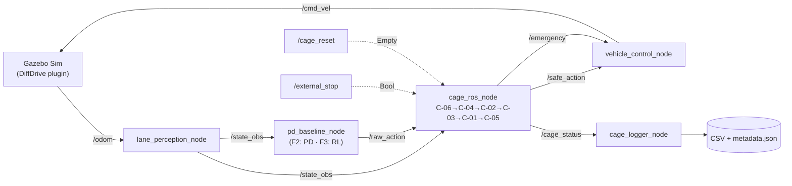

# Capítulo 5 — Diseño Arquitectónico y Especificación de la Cage

<!--
Estado: REDACCIÓN BORRADOR FASE 2 (D21–D35).
Extensión objetivo: 14–18 páginas.
Convención: las secciones marcadas [BORRADOR D22] tienen prosa en estado de
borrador maduro de Fase 2, fijada el día indicado. Las marcadas
[COMPLETAR FASE 2] dependen de números o resultados que se obtienen al
cerrar la fase (latencia medida, tests verdes, completion rate del PD).
Las marcadas [PULIDO FASE 6] requieren retoques estilísticos al cierre.
-->

## 5.1 Introducción del capítulo  [BORRADOR D22]

Este capítulo desarrolla los dos artefactos centrales de la rama izquierda
inferior del V-Model adaptado tal como se materializan en el caso de
estudio lane-following. El primero es la *Architectural Design*, que
establece la descomposición del sistema en nodos con interfaces explícitas
y modos de operación bien definidos; corresponde al nivel L3 del marco
metodológico definido en §3.5.2. El segundo es la *Cage Specification*,
primer artefacto resultante de la adaptación A1 (desdoblamiento del nivel
de module design), que traduce los Safety Requirements del Capítulo 4 en
un conjunto cerrado de reglas runtime con lógica, parámetros y trazabilidad
explícitos; corresponde al nivel L4a.

La distinción entre arquitectura y especificación de la cage merece un
comentario inicial. La arquitectura responde a la pregunta de qué
componentes existen, cómo se comunican y qué garantías ofrece el contrato
entre ellos. La especificación de la cage responde a una pregunta más
concreta: dado que existe un nodo cage en la arquitectura, qué reglas
implementa, qué hace cada regla cuando se activa, y de qué manera la
combinación de reglas convierte los Safety Requirements en un mecanismo
runtime ejecutable. Las dos preguntas están relacionadas, porque la cage
solo puede operar dentro de la arquitectura que la rodea, pero son
preguntas distintas y se desarrollan de manera relativamente independiente.

Conviene declarar también de entrada qué hace y qué no hace este capítulo.
Establece las decisiones de diseño que rigen la implementación; justifica
esas decisiones en términos de los retos conceptuales propios del diseño
de runtime shields para sistemas con componentes aprendidos; y deja fijada
la primera versión cerrada de la Cage Specification (v1.0) que servirá
como referencia para la implementación documentada en el Capítulo 6 y para
los experimentos de las Fases 4 y 5. No describe la implementación
concreta, ni los resultados de los tests unitarios, ni el comportamiento
del baseline PD: todos esos contenidos pertenecen al Capítulo 6.

La estructura del capítulo es la siguiente. La sección 5.2 presenta la
filosofía de diseño y sitúa la cage como una elección dentro del espacio
de mecanismos para safe RL discutidos en el Capítulo 2. La sección 5.3
desarrolla los siete retos conceptuales que todo diseño de safety cage
debe resolver y documenta cómo se resuelven en este caso. La sección 5.4
describe el procedimiento sistemático de derivación desde Safety
Requirements al conjunto de reglas C-01 a C-06. La sección 5.5 desarrolla
cada regla en detalle. La sección 5.6 documenta la parametrización
mediante el archivo `cage.yaml` y la política de versionado. La
sección 5.7 desarrolla la arquitectura ROS2: nodos, interfaces y modos de
operación. La sección 5.8 articula la trazabilidad bidireccional entre
hazards, SRs, reglas y escenarios, y describe cómo el script
`check_traceability.py` la verifica. La sección 5.9 cierra con una
síntesis y una transición al Capítulo 6.

---

## 5.2 Filosofía de diseño: la cage como runtime shield  [BORRADOR D22]

### 5.2.1 Espacio de mecanismos para safe RL

La revisión del Capítulo 2 caracterizó tres familias principales de
mecanismos para introducir consideraciones de seguridad en sistemas de
control basados en aprendizaje por refuerzo (García y Fernández, 2015;
Wäschle et al., 2022). La primera es el *reward shaping* con penalización
de violaciones, que actúa modificando la función de recompensa para que el
agente aprenda a evitar estados peligrosos; su debilidad es que no
proporciona garantía dura porque el agente sigue siendo libre de violar la
constraint si la recompensa esperada compensa la penalización. La segunda
es el *constrained RL*, que reformula el problema como optimización sujeta
a restricciones (CMDP, PPO-Lagrangian, RECPO en Zhao et al., 2024) y
proporciona garantías estadísticas asintóticas pero no garantías
puntuales; durante el entrenamiento las violaciones son esperables, y
durante la operación el cumplimiento depende de que la dualidad esté bien
calibrada. La tercera es el *runtime shielding* (Kuutti et al., 2019,
2021; Tearle et al., 2021; Keswani y Bhattacharyya, 2025), que coloca un
componente externo al agente, evaluado con lógica determinista y
verificable, que tiene autoridad para sobreescribir las acciones del
agente cuando estas violarían constraints.

Estas tres familias no son excluyentes y de hecho la práctica más madura
las combina (Wei et al., 2026): reward shaping sutil para guiar la policy
hacia regiones seguras, constrained RL para evitar la divergencia
sistemática durante el entrenamiento, y runtime shielding como red final
de seguridad que el sistema cruza inevitablemente en el momento de la
ejecución.

### 5.2.2 Por qué runtime shielding como mecanismo dominante

La elección que articula esta tesis es priorizar el runtime shielding como
mecanismo dominante. Esta elección tiene tres motivaciones.

La primera motivación es la auditabilidad. Un runtime shield es código
determinista cuya lógica es inspeccionable línea por línea. Frente a un
auditor o un tribunal, un argumento de seguridad construido sobre un
runtime shield es defendible porque cada decisión se puede trazar a una
regla explícita con parámetros versionados. En contraste, un argumento
construido sobre una policy entrenada con reward shaping descansa sobre
propiedades estadísticas de millones de transiciones de entrenamiento que
ningún humano puede inspeccionar directamente.

La segunda motivación es la trazabilidad. Cada regla del shield implementa
un Safety Requirement explícito y mitiga uno o más hazards explícitos. La
adaptación A4 del marco metodológico (§3.4.4) convierte esta trazabilidad
en una propiedad verificable por herramienta, lo cual es imposible cuando
la mitigación de un hazard está distribuida implícitamente en los pesos
de una red neuronal.

La tercera motivación es la separabilidad experimental. La cage puede
activarse o desactivarse en runtime mediante un flag (modo
*enforcement* / *monitoring* / *disabled*) sin tocar la policy. Esto
permite los experimentos comparativos enforcement-versus-monitoring que
son centrales para medir la contribución causal de la cage a la seguridad
del sistema (Capítulo 8). Con un mecanismo basado solo en reward shaping
o constrained RL, esa separación causal no es posible: la policy aprendida
ya tiene la consideración de seguridad incrustada en sus pesos.

La cage es, por tanto, la materialización runtime del Safety Requirements
Specification del Capítulo 4. Cada SR se instancia o bien como regla de
cage, o bien como diseño del entorno de entrenamiento (Capítulo 7), o bien
como cobertura de la scenario library (Capítulo 8); pero los SRs cuyo
incumplimiento genera consecuencias inmediatas durante la operación tienen
todos al menos una regla de cage que los implementa. Esta correspondencia
es uno de los argumentos centrales que el Capítulo 10 articulará al emitir
el verdicto de validación acotada.

### 5.2.3 Lo que la cage no es

Conviene declarar explícitamente lo que la cage no pretende ser, para
evitar que la interpretación del lector la sobredimensione.

La cage no es un controlador. No diseña la trayectoria del vehículo, no
decide qué hacer en condiciones nominales, y no compite con la policy en
el espacio de objetivos de performance. Su función es reactiva: dado un
estado y una acción raw producida por la policy (o por el baseline PD),
decidir si esa acción cumple las constraints o si debe modificarse para
que las cumpla.

La cage no es un mecanismo de aprendizaje. Sus parámetros se fijan a
partir de la física del ODD y del análisis HARA, no se aprenden de datos.
Esto es deliberado: si los parámetros de la cage se aprendieran, el
argumento de auditabilidad colapsaría sobre el mismo problema que
caracteriza a la policy.

La cage no es una garantía formal de seguridad en el sentido de los
métodos de verificación formal de control (Tearle et al., 2021, llaman
*Predictive Safety Filter* a un mecanismo conceptualmente próximo pero con
garantías matemáticas explícitas que requieren un modelo del sistema). La
cage de esta tesis es un dispositivo de ingeniería con cobertura definida
por su Hazard Register y SRS; las garantías que ofrece son estadísticas
y empíricas, no formales. Esta declaración de alcance es necesaria para
no inducir lectores a confundir el alcance de la contribución (cf. §3.9
sobre limitaciones del marco).

La cage tampoco depende del *controlador aprendido*. Evalúa sus reglas sobre un
estimador de estado **independiente de la policy**: en el F-track, el ground-truth
proyectado al centerline; en el **track 'E'** (end-to-end con cámara, D-38), un
**detector de líneas por visión propio, clásico y determinista** —distinto de la CNN
de la policy— (decisión **D-40**, que supersede a D-39). Esto sostiene el argumento A2
(cage verificable y auditable por separado: un algoritmo de visión clásico es
inspeccionable, la CNN no) y permite que la cage **generalice a cualquier carretera con
líneas visibles**, igual que la policy. El trade-off honesto de D-40: policy y cage
comparten ahora la cámara, así que una avería de cámara puede cegar a **ambos** a la vez
(causa común); la seguridad residual es la **parada controlada open-loop** (SR-013, sin
percepción), y un estimador del cage que se equivoque con confianza es el nuevo hazard
**H-12** (mitigado por SR-014). El detalle vive en `docs/04_cage_specification.md` (nota
de percepción del cage y Trigger 8 de C-05).

---

## 5.3 Retos conceptuales del diseño  [BORRADOR D22]

Esta sección articula siete decisiones de diseño que todo runtime shield
serio debe resolver y documenta cómo se resuelven en el caso de la tesis.
Las decisiones se hicieron en D21–D22 sobre papel antes de empezar a
implementar; cada una se contrastó con la literatura correspondiente y se
fijó por escrito. El Capítulo 6 las hereda y se limita a ejecutar lo
decidido aquí.

### 5.3.1 Prioridad y orden entre reglas

Cuando varias reglas pueden activarse en el mismo ciclo de control, la
decisión sobre cómo se evalúan tiene consecuencias profundas en el
comportamiento del sistema. Tres aproximaciones son defendibles:
evaluación secuencial con prioridad fija, donde cada regla toma como
entrada la salida ya modificada de la anterior; evaluación paralela con
merging, donde cada regla produce una corrección candidata y un merger
combina todas las correcciones activas; y evaluación en capas
jerárquicas, donde reglas de mayor criticidad sobreescriben a las de
menor.

La elección adoptada es **evaluación secuencial con prioridad ascendente
por criticidad**. El orden es C-06, C-04, C-02, C-03, C-01, C-05, donde
cada regla recibe como entrada la acción ya modificada por las anteriores.
Esta elección tiene tres ventajas. Es determinista: dado un estado y una
acción raw, el comportamiento de la cage es calculable a mano. Es
trazable: el log puede registrar la cadena de modificaciones aplicada en
cada ciclo. Es robusta a la composición: si C-05 (emergencia) decide
sobreescribir todo, lo hace al final de la cadena con la última palabra,
sin necesidad de coordinación explícita con las reglas anteriores.

Una sutileza del orden: C-06 (saturación de rate de actuadores) se aplica
al principio aunque sea la regla menos crítica. La razón es que C-06 no
es propiamente una constraint de seguridad sino un saneamiento previo:
las otras reglas asumen que la acción sobre la que trabajan es
físicamente realizable, y C-06 asegura esa precondición. Documentarlo así
en la Cage Specification evita que un revisor lea el orden de criticidad
y se confunda con la posición de C-06.

### 5.3.2 Diseño de la acción correctiva

Cuando una regla decide intervenir, debe producir una acción correctiva.
El espacio de estrategias es amplio. La proyección sobre el conjunto
factible es matemáticamente elegante pero requiere resolver un problema
de optimización que puede ser no trivial con múltiples constraints
activas. La corrección proporcional al exceso es simple y produce
correcciones suaves pero puede ser insuficiente si el sistema está lejos
del conjunto factible. La acción segura precomputada es la más simple
pero también la más disruptiva: la policy siente un salto cuando la cage
actúa, y eso interfiere con el entrenamiento si la cage está activa
durante el training (Kuutti et al., 2021). La estrategia híbrida combina
varias según la severidad: violaciones leves reciben corrección
proporcional, violaciones severas reciben acción segura precomputada,
violaciones extremas activan emergency stop.

La elección adoptada es **estrategia híbrida con preferencia por
proporcionalidad**. Las reglas C-01 a C-04 aplican corrección proporcional
en su régimen normal, escalando con el exceso sobre el umbral. C-05
(emergencia) aplica acción precomputada (deceleración controlada con
steering congelado). C-06 (rate limit) actúa como clipping puro. Esta
elección produce un comportamiento suave en operación nominal y reacciones
fuertes solo cuando el sistema está cerca de fallo. La consecuencia
operativa importante es que durante el entrenamiento PPO (Capítulo 7) las
intervenciones de la cage son perturbaciones de pequeña magnitud que el
agente puede acomodar, no saltos abruptos que destruyen la señal de
gradiente.

### 5.3.3 Reglas reactivas y reglas predictivas

Una regla reactiva evalúa una constraint sobre el estado actual: si la
desviación lateral *es* mayor que el umbral, actuar. Una regla predictiva
evalúa sobre un estado futuro proyectado: si la desviación lateral *será*
mayor que el umbral en t segundos, actuar. La diferencia operativa es
que la regla predictiva puede prevenir el estado peligroso, mientras la
reactiva solo puede limitar su daño.

La elección adoptada es **defensa en profundidad con un mecanismo
reactivo y un mecanismo predictivo cooperando sobre el hazard más
crítico**. C-01 es reactiva (cota directa de offset lateral); C-03 es
predictiva (Time-to-Lane-Crossing); ambas implementan la mitigación de
H-01 (salida de carril). El propósito de C-03 es disparar antes que C-01
en situaciones donde la trayectoria lleva al vehículo hacia el borde,
dando margen para una corrección suave; el propósito de C-01 es
intervenir si C-03 falla por mala estimación, por dinámica no modelada o
por estado ruidoso. El logger registra ambos eventos con etiquetas
distintas, lo que permite analizar a posteriori cuántas veces C-03
previno una situación que C-01 habría tenido que resolver.

El modelo cinemático que C-03 utiliza para proyectar es deliberadamente
simple: se aproxima la velocidad lateral por v·sin(ψ) ≈ v·ψ y se asume
heading constante durante el horizonte de proyección. Esta simplicidad es
una decisión consciente. Un modelo más sofisticado tendría más fidelidad
pero también más superficie para errores que la cage no podría detectar;
un modelo más sencillo tiene más errores residuales pero acotables, lo
cual hace la calibración del umbral `t_min` más segura.

### 5.3.4 Hysteresis y prevención de chattering

El chattering aparece cuando una regla cruza repetidamente su umbral de
activación, produciendo oscilación de alta frecuencia en las acciones
del sistema. La solución estándar es la histéresis: la regla se activa
en un umbral alto y se desactiva en uno bajo, separados por una banda.

La elección adoptada es **histéresis simétrica con cota dura preservada**.
Cada regla tiene dos umbrales, `_activate` y `_deactivate`, con
`_activate < d_max` (donde `d_max` es el límite del SR correspondiente).
Esto significa que la cage activa antes de violar el SR, lo cual deja
margen para corregir, y desactiva más tarde para evitar oscilación.
Numéricamente, en C-01 los umbrales son 0.14 m y 0.12 m frente a un
`d_max` SR-001 de 0.16 m; la banda de histéresis es 0.02 m y el margen
de activación hasta el SR es 0.02 m.

La interacción entre histéresis y log es importante: el logger registra
el flanco de activación y el flanco de desactivación separadamente, no
el estado activo en cada ciclo. Esto da economía al log y refleja
correctamente la semántica de la histéresis (la regla está "activa" como
estado, no como decisión instantánea).

### 5.3.5 Saturación y resolución de conflictos

Las reglas pueden producir correcciones que conflictúen entre sí. Por
ejemplo, C-02 (heading) puede pedir un steering fuerte que C-06 (rate
limit) considere excesivo. La pregunta es qué hace el sistema en ese
caso.

La elección adoptada es **propagación con clipping y registro explícito
del clipping en el log**. C-02 escribe la corrección que considera
necesaria; C-06 la clipa al rate máximo; el logger captura tanto el
delta deseado como el delta efectivamente aplicado. Esto produce un
comportamiento que respeta las constraints físicas del actuador
(prioridad implícita: la realizabilidad física no es negociable) sin
ocultar el conflicto: si C-06 clipa frecuentemente correcciones de C-02,
el análisis posterior revelará que los umbrales están mal calibrados.

### 5.3.6 Modo de emergencia: entrada, comportamiento y salida

C-05 tiene una característica que la diferencia de las demás reglas: es
un modo persistente, no una intervención puntual. Una vez entrado en
emergencia, el sistema permanece allí hasta que se cumplan condiciones
de salida. Tres preguntas hay que decidir: cuándo entra, qué hace
mientras está en emergencia, y cómo sale.

La elección adoptada para la entrada es la disyunción de varias
condiciones, agrupables en tres familias. Primero, fallo compuesto:
offset y heading exceden simultáneamente sus umbrales de aviso durante
más de un tiempo de persistencia, lo cual indica que el sistema está
fuera del régimen donde las reglas individuales pueden corregir; existe
una variante de baja energía y una de alta energía (cuando además la
velocidad supera un umbral), esta última con persistencia más corta
porque a mayor energía el margen cinemático para absorber la excursión
es menor. Segundo, estado inválido o no disponible: el mensaje
`/state_obs` es demasiado viejo (staleness por encima del umbral), está
fuera de rangos físicamente plausibles, o ha estado ausente durante más
de cinco ciclos consecutivos; esto materializa el hazard H-06
(operación con estado corrupto). Tercero, señales externas o de
composición: una parada externa publicada en `/external_stop`
(`std_msgs/Bool`, opcional para testing) o la detección de oscilación
inter-ciclo sostenida entre reglas que afectan al steering (SR-010
Parte 2).

La elección adoptada para el comportamiento durante la emergencia es
deceleración controlada con steering congelado en el valor del instante
de transición. Forzar steering a cero podría producir un giro abrupto si
el vehículo estaba en curva; congelarlo evita esa transición y
proporciona una desaceleración predecible. El throttle pasa a un valor
de frenado controlado, con deceleración objetivo `a_min` (provisional, a
la espera de la calibración M-3 que fijará el mapeo `a_min` → comando de
throttle).

La elección adoptada para la salida es asimétrica respecto a la entrada:
la entrada es automática en cuanto se detecta un trigger, pero la salida
exige un reset explícito (`require_explicit_reset = true`) **además** de
que la causa haya desaparecido. No hay recuperación automática. La razón
es doble: el reset explícito evita la oscilación entre modos cerca de la
frontera del trigger (decisión informada por STPA), y una emergencia es
una condición que debe inspeccionarse antes de continuar. El reset se
solicita por el método `reset()` del nodo (cableado al topic
`/cage_reset`) o por `ctx["reset"]`.

### 5.3.7 Validez del estado y cadena de confianza

La cage opera sobre el estado publicado por el nodo Perception. Si ese
estado es inválido, todas las decisiones de la cage son potencialmente
inválidas también. El principio adoptado es **fail-safe ante estado
sospechoso**: la cage no asume que el estado es correcto y, si detecta
síntomas de invalidez, fuerza al sistema a un estado conservador.

Esta lógica se integra en C-05 (no en una regla separada) para mantener
el conjunto en seis reglas. Las condiciones de detección incluyen
timestamp viejo, valores fuera de rango plausible, y ausencia prolongada
del mensaje. La acción es la entrada en modo emergencia.

Un matiz importante: la validez del estado no se evalúa solo por el
contenido del mensaje, sino también por la frescura. Esto requiere que
todos los nodos del sistema operen con relojes razonablemente
sincronizados. ROS2 maneja esto a través de su mecanismo de tiempo
simulado en Gazebo y de tiempo real en hardware; el nodo cage publica
explícitamente la versión del clock que está usando para que el logger
lo registre y los análisis posteriores sean coherentes.

---

## 5.4 Derivación de reglas desde Safety Requirements  [BORRADOR D21]

### 5.4.1 Procedimiento de mapeo

El procedimiento sistemático es: para cada Safety Requirement de la SRS
(Capítulo 4), identificar la regla o reglas de cage candidatas a
implementarlo, y para cada regla candidata identificar los SRs que
implementaría. El resultado es una matriz SR × C donde cada celda es
"sí" si la regla implementa el SR, "indirecto" si lo refuerza
parcialmente, o "no" si no participa.

La heurística práctica para identificar reglas candidatas a partir de un
SR es: leer el SR, identificar la cantidad observable que el SR limita
(offset, heading, velocidad, etc.), y construir una regla que evalúe esa
cantidad y aplique corrección si excede el límite. Si el SR habla en
términos predictivos ("antes de que ocurra X"), añadir una regla
predictiva sobre la misma cantidad. Si el SR habla en términos de
respuesta a fallo ("ante condición Y, transitar a estado seguro"), una
regla de tipo emergencia.

Aplicar este procedimiento a la SRS de SR-001 a SR-011 (Capítulo 4)
produjo un mapeo inicial de candidatas. Tras consolidación —fusionando
candidatas que verifican constraints similares y separando las que
necesitan mecanismos distintos (reactivo vs predictivo sobre la misma
variable)— el conjunto de reglas runtime se cerró en seis: C-01 a C-06.
Tres Safety Requirements no se implementan como regla de cage sino por
otras vías declaradas en la SRS (decisión D-25): SR-009 (liveness) y la
fracción correspondiente de SR-011 se resuelven en el diseño del entorno
de entrenamiento, y SR-010 (consistencia de composición) en el *arbiter*
del propio nodo cage. Menos reglas dejarían algún SR sin implementación
clara; más reglas fragmentarían sin ganancia operativa.

### 5.4.2 Conjunto consolidado y trazabilidad SR → C

La tabla 5.1 resume el mapeo cerrado de SRs a reglas de cage. Cada SR
tiene al menos una regla principal que lo implementa; algunas tienen
una regla secundaria que lo refuerza por defensa en profundidad. Cada
regla implementa al menos un SR; ninguna regla es huérfana de SR.

**Tabla 5.1 — Mapeo Safety Requirement → regla de cage.** Datos
derivados de la SRS canónica del Capítulo 4 (§4.6.3) y de
`docs/03_safety_requirements.md`. La regla principal implementa el SR;
la columna "secundaria / vía" recoge refuerzos por defensa en
profundidad o, para los SR no implementados como regla, la vía
alternativa (`training` o `arbiter`, decisión D-25).

| SR | Descripción breve | Regla principal | Secundaria / vía |
| --- | --- | --- | --- |
| SR-001 | Offset lateral `\|d\| < d_max` | C-01 | C-03 (predictiva, H-01) |
| SR-002 | Error de heading `\|θ\| < θ_max` | C-02 | — |
| SR-003 | TTLC predictivo `> t_min` | C-03 | — |
| SR-004 | Velocidad `≤ v_max(κ)` | C-04 | — |
| SR-005 | Modo emergencia ante estado compuesto | C-05 | — |
| SR-006 | Suavidad de actuador (rate limit) | C-06 | — |
| SR-007 | Validez y frescura del estado | C-05 (rama validez) | — |
| SR-008 | Parada controlada bajo demanda | C-05 (rama parada) | nodo vehicle-control |
| SR-009 | Progreso mínimo (liveness) | training (D-25) | monitoring M-S2 |
| SR-010 | Consistencia de composición de reglas | arbiter (D-25) | C-05 (trigger oscilación) |
| SR-011 | Heading sin oscilación sostenida | C-06 | training |

Las seis reglas C-01 a C-06 implementan, cada una, al menos un SR
(ninguna es huérfana). Los tres SR implementados fuera de la cage
(SR-009, SR-010, SR-011 en su fracción training) se marcan con su
*implementation_type* en la SRS para que el validador de trazabilidad
(§5.8) los reconozca como cubiertos por un mecanismo no-cage.

La trazabilidad inversa C → SR se documenta en cada regla en la sección
5.5. La trazabilidad C → H (hazards) se obtiene por composición a través
de los SRs y se materializa en la matriz de trazabilidad central
(Anexo F).

### 5.4.3 Numeración y orden

La numeración C-01 a C-06 sigue la lógica de criticidad ascendente
descrita en §5.3.1, adaptada para situar a C-06 al principio de la
cadena por su naturaleza de saneamiento previo. El orden de evaluación
es C-06, C-04, C-02, C-03, C-01, C-05; el orden de numeración es C-01,
C-02, ..., C-06 por convención de lectura. Esta separación entre orden
de evaluación y orden de numeración es deliberada y se documenta
explícitamente en la Cage Specification para evitar confusión.

---

## 5.5 Diseño detallado de las reglas C-01 a C-06  [BORRADOR D22]

Esta sección desarrolla cada regla siguiendo un formato común: SRs
implementados, hazards mitigados, variable observada, lógica de
activación, estrategia correctiva, parámetros, y consideraciones
especiales. La uniformidad del formato es deliberada: facilita la
comparación entre reglas y permite la verificación cruzada.

### 5.5.1 C-01 — Lane Boundary Hard Limit

Implementa el SR-001 (prevención reactiva de salida de carril) y mitiga
el hazard H-01. La variable observada es `state.lateral_offset`, en
metros, con signo positivo a la izquierda del eje del carril.

La lógica de activación es histerética: la regla se activa cuando
`|lateral_offset|` excede `d_activate`, permanece activa si está entre
`d_deactivate` y `d_activate` y ya estaba activa en el ciclo anterior, y
se desactiva cuando baja por debajo de `d_deactivate`. El estado de
activación es una variable interna del nodo cage que persiste entre
ciclos.

La estrategia correctiva es proporcional sobre el steering. La magnitud
es `correction_gain · (|lateral_offset| - d_deactivate) · sign(-lateral_offset)`,
es decir, proporcional al exceso respecto al umbral de desactivación y
en la dirección que devuelve el vehículo al centro del carril. La
corrección se aplica por sobreescritura del steering raw, no por suma,
para evitar que la policy y la cage compitan en el espacio del steering;
el throttle queda inalterado por C-01.

Los parámetros cuantitativos en `cage.yaml` son `d_max_m = 0.16 m`
(umbral SR-001), `h_d_m = 0.02 m` (margen de histéresis) y
`correction_gain = 1.5`, con `steering_max = ±1.0` (saturación
independiente). De ellos se derivan los umbrales de la histéresis:
`d_activate = d_max − h_d = 0.14 m` y `d_deactivate = d_max − 2·h_d =
0.12 m`. El valor de `correction_gain` es un valor inicial que se
ajustará empíricamente durante D32–D33; los umbrales están derivados del
SR-001 (`d_max = 0.16 m`) con una banda de histéresis de 0.02 m.

Una consideración especial: si C-05 está activa (modo emergencia), C-01
no actúa, porque C-05 ya domina la salida del controlador. Si el estado
es inválido (que activaría C-05 inmediatamente), C-01 tampoco actúa.
Esta dependencia entre reglas es uno de los argumentos para evaluar el
modo emergencia al final de la cadena (§5.3.1).

### 5.5.2 C-02 — Heading Error Limit

Implementa el SR-002 y mitiga el hazard H-02. La variable observada es
`state.heading_error`, en radianes.

La lógica es análoga a C-01: histéresis con `theta_activate` y
`theta_deactivate`. La estrategia correctiva es proporcional al heading
error en sentido opuesto: `correction_gain · heading_error`, saturada a
`steering_max`. El throttle no se modifica.

Los parámetros en `cage.yaml` son `theta_max_rad = 0.4363 rad` (25°,
umbral SR-002), `h_theta_rad = 0.0349 rad` (≈2° de histéresis) y
`correction_gain = 1.0`. De ellos se derivan `theta_activate = theta_max
− h_theta ≈ 0.40 rad` (≈23°) y `theta_deactivate = theta_max − 2·h_theta
≈ 0.37 rad` (≈21°); ambos quedan por debajo del límite SR-002 de 25°
para preservar margen.

C-01 y C-02 pueden activarse simultáneamente. En el orden de evaluación
elegido (C-06, C-04, C-02, C-03, C-01, C-05), C-02 se aplica antes que
C-01, lo cual significa que la corrección final de steering es la
composición de ambas correcciones. Esto es deliberado: C-01, que
implementa la cota más dura sobre la variable más crítica (posición
lateral), tiene la última palabra entre las reglas operacionales; solo
C-05 puede sobreescribir a C-01.

### 5.5.3 C-03 — Time-to-Lane-Crossing Predictive Limit

Implementa el SR-003 y mitiga el hazard H-01 de forma predictiva (y
parcialmente H-02). La variable observada no es directa sino derivada:
una predicción de TTLC basada en el estado actual.

El modelo cinemático es deliberadamente simple. Dado el estado
(*y*, *ψ*, *v*) donde *y* es el offset lateral, *ψ* es el heading error
y *v* es la velocidad longitudinal, la velocidad lateral es
*v_lat = v · sin(ψ)*. El TTLC es el tiempo que tardaría la proyección a
heading constante de *y* en alcanzar la cota dura `d_max`:

```math
TTLC = (d_max - y) / v_lat     si v_lat > 0
     = (-d_max - y) / v_lat    si v_lat < 0
     = +∞                       si |v| < v_min_estimate, |v_lat| ≈ 0,
                                  o el crossing cae fuera de [0, horizon]
```

donde `d_max` es el mismo límite que usa C-01 (las dos reglas comparten
el valor por construcción). El TTLC se considera infinito si la
velocidad lateral apunta alejándose del borde (no hay crossing en el
horizonte) o si la velocidad es demasiado baja para una estimación
fiable.

La lógica es progresiva con un único umbral. Cuando TTLC baja por
debajo de `t_min`, la regla se activa con una corrección hacia el centro
cuya magnitud (la *urgencia*) escala de forma continua como
`urgency = urgency_gain_max · (1 − TTLC / t_min)`: vale cero justo en el
umbral y crece hasta `urgency_gain_max` cuando TTLC → 0, saturando el
steering en la dirección correctiva. Esta progresión continua —en lugar
de un segundo umbral binario— evita el chattering.

Los parámetros son `t_min_s = 1.0 s`, `horizon_s = 3.0 s` (horizonte
máximo de proyección), `urgency_gain_max = 2.0`, `d_max_m = 0.16 m`
(espejo de C-01) y `v_min_estimate_mps = 0.05 m/s` (por debajo se
considera TTLC infinito para evitar división por cero en estado
casi-parado). El valor de `t_min` es deliberadamente conservador (alto)
para compensar la simplicidad del modelo cinemático; un análisis sobre
los logs del PD podrá indicar si el valor debe ajustarse.

C-03 es la única regla predictiva del conjunto. Su valor se manifiesta
en el log: cada vez que C-03 se activa sin que C-01 llegue a activarse
en los ciclos siguientes, eso es evidencia de actividad predictiva
efectiva. El Capítulo 8 explotará esa medición.

### 5.5.4 C-04 — Speed Ceiling

Implementa el SR-004 y mitiga el hazard H-03. La variable observada es
`state.speed` (velocidad longitudinal actual) y `state.curvature_ahead`
(curvatura estimada en la trayectoria adelante).

La velocidad máxima permitida no es constante sino función de la
curvatura. La formulación es

```math
v_max(κ) = max(v_max_curve, v_max_straight - k_curvature · |κ|)
```

donde *κ* es la curvatura ahead. Esta forma garantiza `v_max_curve`
como suelo absoluto y produce una transición lineal continua entre la
velocidad máxima en recta y en curva.

La estrategia correctiva es reducción proporcional del throttle:
`throttle_safe = max(0, throttle_raw - k_throttle · (speed - v_max))`
si `speed > v_max(κ)`. Si el exceso es grande y el vehículo soporta
freno activo, el throttle puede ir a cero y comandarse freno.

Los parámetros son `v_max_straight = 0.5 m/s`, `v_max_curve = 0.25 m/s`,
`k_curvature = 0.3 m/s` por unidad de curvatura, `k_throttle = 5.0`.

La consideración especial es el suministro de `curvature_ahead` por el
nodo Perception. En simulación es trivial: la geometría del mundo
Gazebo se conoce a priori. En el coche físico es estimación a partir
de detección visual o LiDAR, con ruido; el nodo Perception aplica un
filtro pasabajo ligero antes de publicar. C-04 espera curvatura ya
filtrada y no aplica filtros propios sobre la entrada.

### 5.5.5 C-05 — Emergency Mode

Implementa el SR-005 (primariamente) y, parcialmente, SR-007 y SR-008.
Mitiga los hazards H-04, H-06 y H-07. Las variables observadas son todas
las relevantes (offset, heading, speed, validez y frescura del estado),
más señales de contexto (parada externa, detección de oscilación).

La lógica de entrada es la disyunción del conjunto de triggers descrito
en §5.3.6. En la versión actual de la cage (YAML 0.5.1) están activos
seis: (1) fallo compuesto de baja energía, (2) fallo compuesto de alta
energía, (3) estado obsoleto (*stale*), (4) campo de estado inválido,
(5) estado ausente, y (6) parada externa; a estos se añade (7) la
oscilación inter-ciclo sostenida (SR-010 Parte 2). Un octavo trigger
—la aserción de envolvente conjunta de fin de ciclo (SR-010 Parte 1)—
queda diferido a la espera de la API `safe_envelope_predicate_holds` en
el contrato de regla.

Los parámetros relevantes son `theta_warning_rad = 0.3491 rad` (20°),
`d_warning_m = 0.12 m`, `delta_t_max_s = 0.2 s` (persistencia del fallo
compuesto, ≈ 4 ciclos a 20 Hz); para la variante de alta energía,
`v_warning_mps = 0.4 m/s` (80% de `v_max_straight`) con persistencia más
corta `delta_t_max_fast_s = 0.1 s` (≈ 2 ciclos); para la validez del
estado, `staleness_max = 0.2 s` (SR-007) y `n_missing_max = 5` ciclos
(SR-007); y para la respuesta, `a_min_mps2 = 0.3` (deceleración objetivo,
provisional a la espera de M-3 y consistente con el `t_stop_max` de
SR-008) con `freeze_steering = true`.

El comportamiento durante la emergencia se describió en §5.3.6:
deceleración controlada (comando de frenado derivado de `a_min`) con
steering congelado en el valor del instante de transición.

La salida del modo emergencia exige reset explícito
(`require_explicit_reset = true`) **además** de que todos los triggers
hayan dejado de cumplirse; no hay recuperación automática. El reset se
solicita por el método `reset()` del nodo (cableado a `/cage_reset`) o
por `ctx["reset"]`.

Una consideración especial es el logging de transiciones. Las entradas
y salidas del modo emergencia son eventos críticos para análisis
posterior; el motivo concreto de cada activación (qué trigger disparó)
se registra en `/cage_status`. Una entrada en emergencia por una causa
distinta de la esperada (ej. estado inválido en lugar de fallo
compuesto) es señal de alarma para el experimentador.

### 5.5.6 C-06 — Actuator Rate Limit

Implementa el SR-006 y mitiga el hazard H-05. La variable observada es
la acción previa, almacenada como estado interno del nodo cage, y la
acción raw actual.

La lógica es saneamiento de saltos: para cada componente del vector de
acción (steering, throttle), se calcula el delta respecto al ciclo
anterior y se clipa al máximo permitido en magnitud:

```python
delta = action_raw - action_prev
delta_clipped = clip(delta, -delta_max, +delta_max)
action_safe = action_prev + delta_clipped
```

Los parámetros son `delta_max_steering = 0.15` (normalizado, por ciclo
de 50 ms a 20 Hz), `delta_max_throttle = 0.10`. Son derivables de las
constantes de tiempo del actuador físico, que se estiman al portar al
hardware en Fase 5; los valores actuales son provisionales y conservados
deliberadamente moderados para no comprometer la maniobrabilidad
durante el desarrollo.

C-06 se aplica al principio de la cadena, antes que las demás reglas.
Esto es deliberado: las otras reglas asumen que la acción sobre la que
operan es físicamente realizable, y C-06 garantiza esa precondición.
Aplicar C-06 al final de la cadena podría producir el efecto perverso
de que una corrección legítima de C-02 sea cortada por C-06, perdiendo
intención sin que la responsabilidad esté claramente atribuida en el
log.

---

## 5.6 Parametrización y versionado  [BORRADOR D23]

### 5.6.1 Estructura del archivo `cage.yaml`

Todos los parámetros numéricos de las reglas viven en un único archivo
YAML versionado, separado del código. Esta separación es una decisión
metodológica: modificar un parámetro debe ser una operación trazable
que no requiera recompilación, y la cage debe ser fácil de configurar
por entornos distintos (sim, físico) sin tocar código.

La estructura del archivo se organiza por regla, con una sección de
metadatos al inicio que registra la versión del archivo (`cage.version`)
y la versión de la SRS con la que es compatible
(`compatible_sr_spec_version`), seguida del modo de operación por
defecto (`default_mode`) y la configuración del bucle de control
(período de ciclo, staleness máxima). Cada regla tiene su propia
subsección con sus parámetros, cada uno con un comentario que indica
unidades y, cuando aplica, el SR del que se deriva o la métrica de
calibración pendiente (`[provisional, M-X]`). Dos secciones globales al
final fijan la configuración de logging y el mapeo de topics ROS2. El
orden de evaluación de las reglas no vive en el YAML sino que está
fijado en el código del nodo (§5.3.1), porque es una invariante de
diseño, no un parámetro ajustable.

**Listing 5.1 — Esqueleto de `cage.yaml` (v0.5.1)** mostrando la sección
de metadatos, el bucle de control, una regla en detalle (C-01), las
restantes abreviadas, la detección de oscilación (SR-010 Parte 2) y las
secciones globales de logging y topics.

```yaml
cage:
  version: "0.5.1"                    # semver; bump on any parameter change
  compatible_sr_spec_version: "1.0"   # SRS revision this YAML targets

  default_mode: "enforcement"         # enforcement | monitoring | disabled

  control:
    cycle_period_ms: 50               # 20 Hz control loop
    staleness_max_ms: 200             # SR-007: max age of state observation

  # --- per-rule subsections (C-01 shown in full) ---
  c01_lane_boundary:                  # SR-001, H-01
    enabled: true
    d_max_m: 0.16                     # SR-001 threshold [provisional, M-1, M-2]
    h_d_m: 0.02                       # hysteresis margin
    correction_gain: 1.5              # aggressiveness toward centreline
  c02_heading_limit:   { ... }        # SR-002, H-02
  c03_ttlc:            { ... }        # SR-003, H-01/H-02
  c04_speed_ceiling:   { ... }        # SR-004, H-03
  c05_emergency:       { ... }        # SR-005/007/008, H-04/H-06/H-07
  c06_rate_limiter:    { ... }        # SR-006, H-05

  oscillation:                        # SR-010 Part 2 (inter-cycle)
    f_osc_max_hz: 5.0
    t_osc_window_s: 1.0
    t_osc_persist_s: 3.0

  logging:
    cage_status_topic: "/cage_status"
    log_every_cycle: true
  topics:
    raw_action_in: "/raw_action"
    state_obs_in: "/state_obs"
    safe_action_out: "/safe_action"
    cage_status_out: "/cage_status"
    emergency_signal_out: "/emergency"
    external_stop_in: "/external_stop"
    reset_in: "/cage_reset"
```

La elección de YAML frente a JSON o TOML responde a tres consideraciones:
los comentarios son nativos en YAML y son críticos para documentar el
rationale de cada parámetro; la legibilidad humana es alta; el ecosistema
ROS2 tiene soporte nativo de YAML para configuración de nodos.

### 5.6.2 Política de versionado

El archivo `cage.yaml` se versiona junto al código en Git, pero
con una disciplina más estricta. Cada modificación debe seguir un
protocolo de cuatro pasos. Primero, la modificación se hace en una rama
dedicada, no directamente en `main`. Segundo, la modificación se
documenta en `docs/CHANGELOG.md` con fecha, valor antiguo, valor nuevo y
rationale. Tercero, el campo `cage.version` del YAML se incrementa
siguiendo semver simple: cambio de parámetro = patch bump (1.0.0 →
1.0.1); cambio estructural = minor (1.0.0 → 1.1.0); cambio que rompe
compatibilidad con la Cage Specification = major (1.0.0 → 2.0.0).
Cuarto, si hay experimentos en curso que usan la versión anterior, se
completan antes de hacer merge a `main`, para no invalidar datos.

Esta disciplina evita el problema clásico de "no sé qué parámetros usé
en el experimento del lunes pasado". El nodo cage, al iniciar cada
corrida, publica la versión del YAML cargado en un mensaje retenido en
`/cage_status`, y el logger captura ese mensaje en el `metadata.json`
del experimento. La trazabilidad parámetros → experimento es entonces
verificable a posteriori.

### 5.6.3 Modo monitoring-only

El parámetro `global.mode` admite tres valores: `enforcement`
(comportamiento normal, las correcciones se aplican), `monitoring` (las
reglas evalúan y registran su activación pero no modifican la acción),
y `disabled` (la cage es transparente, las reglas ni siquiera se
evalúan). El modo `monitoring` es fundamental para los experimentos de
la Fase 4: permite medir qué habría hecho la cage en una corrida sin
que efectivamente intervenga, lo cual es necesario para el contraste
causal enforcement-vs-monitoring.

La implementación del modo monitoring es simple: al final de la cadena
de reglas, si `mode == "monitoring"`, la acción de salida se reasigna
al raw, sobreescribiendo cualquier corrección. El flag
`intervention_active` en `/cage_status` mantiene su valor (es decir,
sigue indicando "hubo intervención lógica") porque ese es el dato que
los análisis de Fase 4 consumirán; lo que cambia es que esa intervención
no se materializa en el actuador.

Esta capacidad es lo que articula el experimento del Capítulo 8: un
mismo seed, una misma policy, una misma scenario library, pero dos
corridas en modos distintos. El delta entre ambas corridas es la
contribución causal de la cage a las métricas de seguridad. Si la cage
hubiera incrustado su lógica directamente en la policy (vía reward
shaping o constrained RL), esta separación no sería posible.

---

## 5.7 Arquitectura ROS2  [BORRADOR D23]

### 5.7.1 Descomposición en nodos

La arquitectura del sistema se descompone en cinco nodos ROS2
principales más algunos auxiliares, cada uno con responsabilidades
acotadas y comunicación via topics ROS2. Esta descomposición no es
arbitraria: surge de tres principios. Primero, la separación de
responsabilidades, que permite testear cada nodo de forma aislada con
mocks. Segundo, la sustitución selectiva, que permite intercambiar
componentes (PD por RL, simulación por físico) sin reescribir el resto.
Tercero, la auditabilidad, que permite que cada decisión tomada por el
sistema esté atribuida a un nodo concreto y registrada en el log.

Los cinco nodos principales son los siguientes. El nodo **Perception**
(`lane_perception_node`) consume la odometría del vehículo (y, en fases
posteriores, LiDAR/cámara/IMU) y publica un estado estructurado en
`/state_obs` con campos como lateral_offset, heading_error, speed,
curvature_ahead, distance_left/right, y un flag de validez. El nodo
**Policy/Controller** (en Fase 2 es el baseline PD, `pd_baseline_node`;
en Fase 3 será la policy RL entrenada) consume `/state_obs` y publica
una acción raw en `/raw_action`. El nodo **Safety Cage**
(`cage_ros_node`) consume `/state_obs` y `/raw_action`, evalúa las seis
reglas, y publica la acción filtrada en `/safe_action`, el estado de las
reglas en `/cage_status` y un latch de emergencia en `/emergency`. El
nodo **Vehicle Control** (`vehicle_control_node`) traduce `/safe_action`
a comandos compatibles con el plugin Gazebo o con el firmware del coche
físico, publicando en `/cmd_vel` (`geometry_msgs/Twist`). El nodo
**Logger** (`cage_logger_node`) se suscribe a todos los topics
relevantes y escribe a disco en formato CSV con un metadata.json por
corrida.

Los nodos auxiliares incluyen `/cage_reset` (`std_msgs/Empty`) para
reset manual del modo emergencia, `/external_stop` (`std_msgs/Bool`)
para una señal de parada externa, y `/experiment_tag` (tipo string) que
se publica al inicio de cada corrida para marcar los logs.

**Figura 5.1 — Arquitectura ROS2 del pipeline lane-following.** Cinco
nodos principales (líneas continuas = camino de control; líneas
discontinuas = señales auxiliares de parada/reset). El nodo cage ocupa
la posición central y aplica las seis reglas en el orden de evaluación
indicado antes de emitir `/safe_action`.



### 5.7.2 Tipos de mensaje y QoS

La arquitectura adopta una **estrategia de tópicos híbrida** (decisión
de Fase 2): los topics de estado y de acción usan tipos de mensaje
estándar de ROS2, interoperables con el pipeline `/cmd_vel` existente,
y solo el topic de diagnóstico `/cage_status` usa un tipo custom. El
único mensaje propio (`CageStatus`) vive en el paquete de interfaces
`cobraflex_safety_msgs`; su definición es estable, porque cualquier
cambio rompería la compatibilidad de los logs históricos.

El estado del vehículo (`/state_obs`) viaja como un
`std_msgs/Float64MultiArray` con ordenación fija de siete campos
(`lateral_offset_m`, `heading_error_rad`, `speed_mps`,
`curvature_ahead_inv_m`, `distance_left_m`, `distance_right_m`,
`state_valid` codificado como 1.0/0.0). Las acciones (`/raw_action` y
`/safe_action`) viajan como `geometry_msgs/Twist`, interpretando
`angular.z` como steering ∈ [-1, 1] y `linear.x` como throttle; cuando
la rama de freno está activa, el freno se codifica sobre `linear.x` con
signo negativo. El tipo custom `CageStatus` incluye header; los flags
`intervention_active` y `emergency_mode`; la lista `rules_triggered`
(p. ej. `["C-01", "C-06"]`) en orden de evaluación; las acciones
`action_raw` y `action_safe` como `Twist`; la cadena `yaml_version` con
la versión de `cage.yaml` en runtime; los arrays paralelos
`osc_rule_ids` / `oscillation_rates_hz` y el flag `osc_persistent` del
monitor de oscilación (SR-010 Parte 2); y `cycles_since_last_state`.

Los QoS de cada topic se fijan según su semántica. Los topics de estado
y acción (`/state_obs`, `/raw_action`, `/safe_action`) usan perfiles de
tipo *sensor data* (best-effort, `keep_last`), porque solo importa el
sample más reciente y la latencia prima sobre la entrega garantizada. El
camino de comando y emergencia (`/cmd_vel`, `/emergency`) usa el perfil
*system default* (reliable). El topic `/cage_status` se publica de forma
fiable para que el logger capture cada ciclo.

<!--
NOTA INTERNA (revisión de coherencia, 2026-05-28): §5.7.2 reescrita para
reflejar la estrategia de tópicos híbrida realmente implementada
(state_obs = Float64MultiArray; raw/safe_action = Twist; único custom =
cobraflex_safety_msgs/CageStatus). La versión previa describía tipos
custom StateObservation/VehicleAction en un paquete "thesis_interfaces"
que no existe. Campos de CageStatus tomados de
src/cobraflex_safety_msgs/msg/CageStatus.msg. Confirmar perfiles QoS
exactos contra los nodos antes del cierre de Fase 6.
-->

### 5.7.3 Frecuencias y temporización

La frecuencia objetivo del bucle de control es **20 Hz** (período de 50
ms). Esta elección es un compromiso entre la frecuencia natural del
vehículo (alrededor de 1–2 Hz para dinámicas de tracking, 5–10 Hz para
respuesta a perturbaciones), el coste computacional (la inferencia de
PPO en D33 deberá completarse en bastante menos de 50 ms), y la calidad
del log (a 20 Hz, una corrida de 3 minutos produce 3600 entradas, un
volumen manejable).

Los nodos publican y se suscriben a sus topics con esa frecuencia
objetivo. El nodo cage se ejecuta en respuesta a cada `/raw_action`
recibido, no por timer propio, lo cual hace que la frecuencia efectiva
del bucle sea la del nodo más lento. Esta elección de event-driven
sobre timer-driven es deliberada: evita que la cage pierda mensajes si
algún nodo upstream se ralentiza, a costa de no garantizar la
frecuencia exacta.

El presupuesto de latencia end-to-end (sensor → state_obs → cage →
safe_action → vehicle command) es 50 ms. La caracterización del Capítulo
6 (§6.6.2) confirma, sobre el run definitivo pre-F3, un período de ciclo
de la cage con mediana y P95 de 50.0 ms (máximo 62 ms, un único ciclo
atribuido a jitter del scheduler de Linux no realtime); el desglose de
la latencia por etapa requiere instrumentación adicional de timestamps
y se difiere a F3.

---

## 5.8 Trazabilidad bidireccional y verificación automática  [BORRADOR D23]

La adaptación A4 del marco metodológico (§3.4.4) eleva la trazabilidad
bidireccional a restricción dura. Este capítulo es uno de los lugares
donde esa adaptación se materializa con más nitidez. La sección
documenta cómo se integra cada regla en la matriz de trazabilidad y
cómo se verifica automáticamente la consistencia.

### 5.8.1 Integración en la matriz de trazabilidad

Cada regla C-XX es una fila nueva en la matriz central (`traceability
_matrix.csv`). Las columnas relevantes son: ID de regla, descripción
breve, SRs implementados (lista), hazards mitigados (lista derivada por
composición vía SRs), variables observadas, parámetros del YAML, y
tests unitarios asociados (a completar en el Capítulo 6).

El procedimiento operativo en D22 fue: tras cerrar el diseño de cada
regla en esta sección, añadir una fila a la matriz; tras cerrar la
fila, ejecutar `check_traceability.py`; si el script reporta huérfanos
(SR sin regla, regla sin SR), resolver antes de seguir. El resultado
de esa iteración es la matriz cerrada que se documenta en el Anexo F.

### 5.8.2 Verificación automática

El script `check_traceability.py` implementa ocho comprobaciones
direccionales sobre los artefactos vivos (hazards, SRs, reglas de cage,
escenarios y métricas). (1) Todo hazard del HARA debe estar referenciado
por al menos un SR. (2) Todo SR debe referenciar al menos un hazard.
(3) Todo SR debe estar implementado por al menos una regla de cage o,
en su defecto, por un mecanismo alternativo declarado explícitamente
(`training`, escenario o `arbiter`). (4) Toda regla de cage debe
implementar al menos un SR. (5) Toda regla de cage debe ser ejercitada
por al menos un escenario. (6) Todo escenario debe referenciar al menos
un SR. (7) Todo SR debe tener al menos una métrica que lo verifique.
(8) Toda métrica referenciada por un SR debe estar definida en el
catálogo. Las comprobaciones (1)–(4) y (6)–(8) son restricciones duras
cuyo incumplimiento produce código de salida 1; la (5) emite solo una
advertencia, porque la cobertura de una regla puede ser indirecta vía
la cadena SR, y únicamente aborta en modo `--strict` (código 2).

En F2 el script se ejecuta como gate manual antes de cada commit que
toque hazards, SRs o reglas; su integración como pre-commit hook y como
job de CI se difiere a F3 (cf. §6.5.5). Al fallar con código no-cero
bloquea la promoción a `main`. Esta automatización es lo que diferencia
A4 de las prácticas de trazabilidad de AMLAS o GSN (Paterson et al.,
2025): allí la trazabilidad es una práctica documental revisable; aquí
es una propiedad verificable por herramienta.

El flujo de control del validador —carga de los cinco documentos vivos,
extracción de identificadores por expresiones regulares, cadena de
comprobaciones sobre el grafo `H ↔ SR ↔ C ↔ SC` con el subgrafo
`SR ↔ M`, y agregación con los tres códigos de salida (0/1/2)— es el
mismo que documenta la **Figura 3.2 del Capítulo 3** y no se reproduce
aquí para no duplicar el diseño. Lo específico de este capítulo es qué aporta cada regla a ese
grafo: cada `C-XX` añade una fila a la matriz y participa como nodo C en
las comprobaciones (3) SR → C y (4) C → SR.

---

## 5.9 Síntesis y transición al Capítulo 6  [BORRADOR D35]

Este capítulo ha cerrado los dos artefactos centrales de la rama
izquierda inferior del V-Model adaptado para el caso lane-following.
La *Cage Specification* v1.0 fija el conjunto de seis reglas C-01 a
C-06 con su lógica, parámetros y trazabilidad explícita a los Safety
Requirements del Capítulo 4. La *Architectural Design* fija la
descomposición en cinco nodos ROS2 con sus interfaces, tipos de
mensaje y modos de operación. Ambas son artefactos vivos: la matriz
de trazabilidad central referencia ambas y será la fuente de verdad
para los capítulos subsiguientes.

Las decisiones de diseño documentadas resuelven los siete retos
conceptuales que el problema impone (prioridad, acción correctiva,
reactiva-vs-predictiva, histéresis, conflictos, emergencia, validez de
estado). Cada decisión se ha tomado de manera explícita y se ha
documentado con su rationale, lo cual es condición necesaria para que
la cage pueda someterse a auditoría y para que el marco metodológico
A1–A5 funcione como argumento académico.

La separación entre Cage Specification y Cage Implementation es
deliberada. La especificación es independiente del lenguaje de
programación, del runtime ROS2 concreto y del entorno de simulación.
La implementación, que se desarrolla en el Capítulo 6, materializa la
especificación pero también la contrasta: si al implementar una regla
aparece una decisión de diseño que la especificación no resuelve, la
especificación se actualiza primero (como issue trackeado en el repo)
y luego se implementa, no al revés. Esta disciplina mantiene la
relación L4a → L5 como una relación de derivación, no de codiseño
implícito.

El Capítulo 6 desarrolla la implementación de los cinco nodos ROS2 en
Python, el modelado del vehículo 1:14 en Gazebo, el controlador
baseline PD que valida el pipeline antes de la introducción del RL, y
la suite de tests unitarios que verifica que cada regla cumple su
especificación. Al cierre del Capítulo 6 el sistema completo (nivel
L5 más L4a' más L3') estará operativo y se habrá pasado el Gate 2.

---

<!--
APÉNDICE INTERNO — TRABAJO PENDIENTE EN ESTE CAPÍTULO

Fase 4–5 (operacionalización):
  [ ] Confirmar valores definitivos de parámetros C-01..C-06 tras
       experimentos con baseline PD y, posteriormente, con RL
  [ ] Documentar variantes de YAML para sim vs físico
  [ ] Añadir referencia a logs reales que ejemplifiquen activaciones
       de cada regla

Fase 6 (consolidación):
  [ ] Pulido de prosa: pasar §5.5 y §5.7 de tono "explicativo-técnico"
       a tono "tesis académica" (suavizar imperativos, conectores
       académicos, eliminar coletillas operativas)
  [ ] Sustituir placeholders SVG por figuras finales
  [ ] Verificar coherencia con Capítulo 4 (IDs SR, hazards, umbrales)
  [ ] Verificar coherencia con Capítulo 6 (nombres de nodos, topics,
       tipos de mensaje, frecuencias)
  [ ] Verificar formato bibliográfico definitivo y aplicar a todas
       las citas inline
  [ ] Decisión: ¿incluir tabla resumen de las 6 reglas al inicio de
       §5.5 para referencia rápida del lector?
-->
