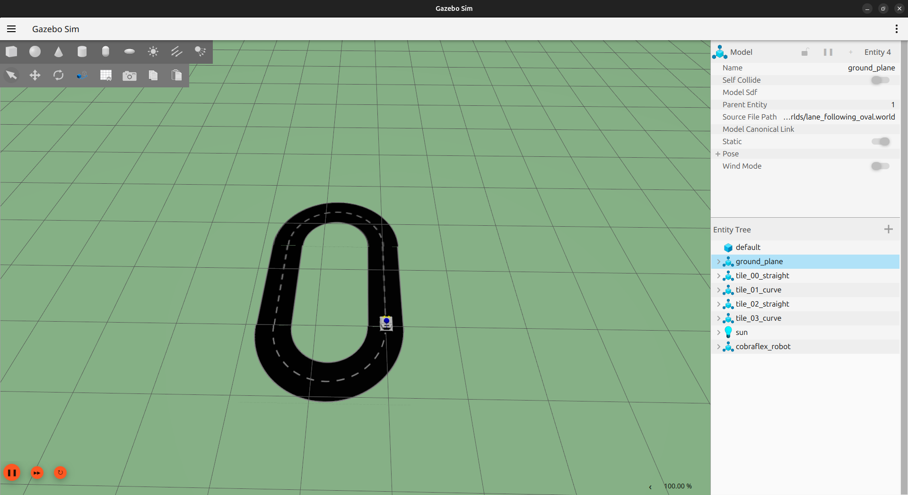
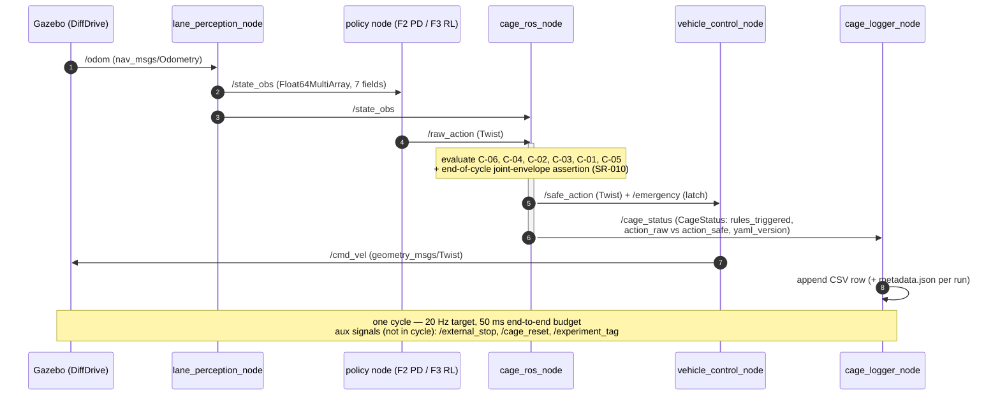

# Capítulo 6 — Implementación, Entorno de Simulación y Verificación

<!--
Estado: REDACCIÓN BORRADOR FASE 2 (D26–D35).
Extensión objetivo: 12–16 páginas.
Convención: las secciones marcadas [BORRADOR D2X] tienen prosa madura de
borrador de Fase 2 fijada el día indicado. Las marcadas
[COMPLETAR FASE 2] dependen de números medidos al final de la fase
(latencias, throughput del logger, completion rate del PD, resultados
exactos de pytest). Las marcadas [PULIDO FASE 6] requieren retoque
estilístico al cierre.
-->

## 6.1 Introducción del capítulo  [BORRADOR D26]

Este capítulo desarrolla la materialización ejecutable de la Cage
Specification y de la Architectural Design fijadas en el Capítulo 5, y
documenta los artefactos de verificación asociados. En términos del
V-Model adaptado (§3.5.2), el capítulo cubre tres niveles
simultáneamente: el nivel L5 (*Implementation*) con el código de los
cinco nodos ROS2 y el entorno Gazebo; el nivel L4a' (*Cage Unit Tests*),
primer artefacto resultante de la adaptación A2 (desdoblamiento del nivel
de unit testing), con la suite que verifica que cada regla implementada
cumple su especificación; y el nivel L3' (*Integration Testing*) en su
versión preliminar con tests que validan el flujo end-to-end del
pipeline. La validación operacional sobre escenarios y la evaluación
estadística de la policy se difieren a los Capítulos 8 y 9.

La estructura del capítulo es la siguiente. La sección 6.2 documenta el
entorno Gazebo y el modelado del vehículo 1:14, que es la plataforma de
desarrollo de las Fases 2 a 4. La sección 6.3 desarrolla la
implementación de cada uno de los cinco nodos ROS2, presentando para
cada uno su estructura, sus dependencias y las decisiones técnicas no
triviales. La sección 6.4 describe el controlador baseline PD, su
papel como validador de pipeline y como referencia clásica para la
comparación con el RL del Capítulo 7. La sección 6.5 desarrolla la
estrategia de testing en sus tres niveles (unitarios por regla, de
propiedades, de integración) y reporta los resultados. La sección 6.6
documenta la validación end-to-end con métricas preliminares
medidas con el PD circulando en Gazebo. La sección 6.7 documenta la
implementación del **track 'E'** (cámara end-to-end, D-41/D-43), el
sistema de récord de la tesis, que **reutiliza y supera** la
infraestructura de las secciones anteriores: las secciones 6.2–6.6
describen la materialización F2 del track de estado, hoy congelada como
brazo baseline. La sección 6.8 cierra el capítulo y articula la
transición al Capítulo 7.

Una decisión transversal merece comentario antes de entrar en detalle.
Una de las tentaciones de un capítulo de implementación es convertirse
en un manual de uso del código. Esta no es la función académica del
capítulo. La función es documentar las decisiones técnicas no triviales
y los hallazgos empíricos de la implementación, no enumerar la API
completa de cada nodo. El código fuente es el artefacto de referencia
para la API; este capítulo articula el rationale de las decisiones que
ese código materializa. Los listados de código en el capítulo son
selectivos y se eligen para ilustrar la decisión que se está
documentando, no para sustituir el código fuente.

---

## 6.2 Entorno Gazebo y modelado del vehículo  [BORRADOR D25]

### 6.2.1 Selección de versión y rationale

La elección concreta del entorno de simulación es **ROS2 Jazzy + Gazebo
Sim (Harmonic)**, integrados a través de los paquetes `ros_gz_sim` y
`ros_gz_bridge`. Esta elección se fijó al inicio de la implementación y
no se ha revisado posteriormente, porque cambiar de simulador a mitad
de tesis tiene un coste muy alto en tiempo y en validez de los logs
históricos.

El rationale de la elección tiene tres componentes. Primero, Jazzy es
la versión LTS vigente de ROS2 y empareja oficialmente con Gazebo
Harmonic, de modo que el stack completo está soportado sin recurrir a
distribuciones en fin de vida. Segundo, el puente `ros_gz_bridge` es el
mecanismo de integración mantenido activamente entre ROS2 y el nuevo
Gazebo, y los plugins de sistema `gz-sim-*` (tracción, GPU LiDAR, IMU,
cámara) cubren las necesidades del caso de estudio sin depender de
Gazebo Classic. Tercero, partir directamente del Gazebo actual evita la
deuda de portar más adelante desde Classic, que está en *maintenance
mode*.

La desventaja reconocida es que el ecosistema de plantillas de robot
cars (F1TENTH, MuSHR) sigue mayoritariamente sobre Gazebo Classic, por
lo que su reutilización directa es limitada y parte de la integración
(bridge de tópicos en `config/gz_bridge.yaml`, plugins de sistema en el
URDF) se construyó a medida. Esta limitación queda documentada en el
Capítulo 11 como nota metodológica.

<!--
NOTA INTERNA (revisión de coherencia, 2026-05-28): §6.2.1 reescrita para
reflejar el stack realmente implementado (ROS2 Jazzy + Gazebo Sim
Harmonic vía ros_gz, evidenciado en src/cobraflex/package.xml,
config/gz_bridge.yaml y urdf/robot.gazebo). La versión previa afirmaba
"ROS2 Humble + Gazebo Classic 11", incoherente con la implementación.
Confirmar que el rationale aquí escrito corresponde a la decisión real.
-->

### 6.2.2 Mundo Gazebo: pista, iluminación, suelo

El mundo (archivo `worlds/lane_following_oval.world` en formato SDF) contiene
cuatro elementos. Primero, una pista en forma de óvalo cerrado con
dimensiones aproximadas de 4 m × 2.5 m (radio interior 0.4 m, exterior
0.8 m) y carriles delimitados por marcas blancas pintadas de 5 cm de
ancho sobre suelo gris uniforme. Segundo, un sistema de iluminación
ambiental uniforme sin sombras direccionales, que evita complicar la
percepción visual con artefactos de iluminación. Tercero, un suelo
plano sin gradientes y con coeficientes de fricción típicos de hormigón
liso. Cuarto, un sistema de referencia con origen marcado en el centro
geométrico del óvalo y eje X alineado con la dirección preferente de
circulación.

La elección de un óvalo simple, no de un circuito complejo, es
deliberada. La función del mundo en esta fase es validar el pipeline
end-to-end y permitir el desarrollo del baseline PD; un mundo más
complejo introduciría modos de fallo (curvas cerradas, cambios de
gradiente, intersecciones) cuya gestión se difiere a la scenario library
de Fase 4. El óvalo permite vueltas repetidas con geometría conocida y
métricas reproducibles.



*Figura 6.1 — Vista superior del mundo Gazebo. Pista oval con marcas de carril, vehículo 1:14 en posición de inicio, sistema de referencia.*

### 6.2.3 Modelado del vehículo 1:14

El vehículo se modela en URDF con dimensiones aproximadas del CobraFlex
1:14 que se usará en la Fase 5 (chasis de ≈0.228 m de largo, ruedas de
0.03725 m de radio, separación entre ruedas de 0.154 m). La plataforma
CobraFlex tiene cuatro ruedas fijas sin articulación de dirección: gira
por diferencia de velocidad entre los lados (tracción diferencial /
skid-steer), no mediante un ángulo de rueda. El modelo de simulación
reproduce fielmente esta cinemática mediante un plugin de tracción
diferencial (ver más abajo), de modo que la entrada normalizada
*steering* ∈ [-1, 1] de la cage y la policy no representa un ángulo de
rueda sino una velocidad de giro (yaw rate) comandada.

El plugin Gazebo elegido para la dinámica del vehículo es el sistema
`gz-sim-diff-drive-system` (DiffDrive). Este plugin se suscribe al
topic `/cmd_vel` con tipo `geometry_msgs/Twist` —interpretando
`linear.x` como velocidad longitudinal y `angular.z` como yaw rate— y
publica odometría (`/odom`) y TF del vehículo. Los comandos se enrutan
entre ROS2 y Gazebo mediante `ros_gz_bridge` según el mapeo declarado
en `config/gz_bridge.yaml`. El ajuste de los parámetros del plugin
(separación y radio de rueda, aceleración lineal máxima) produce una
respuesta del vehículo aproximadamente realista para el horizonte de
bandwidths de interés (0–10 Hz).

Los sensores simulados incluyen: una IMU (modelo ZED Mini, 200 Hz) con
ruido gaussiano; un GPU LiDAR de 360° (RPLiDAR, 10 Hz, alcance 8 m); y
una cámara RGB frontal de 640×480 a 20 Hz para experimentos
posteriores. Todos se exponen a ROS2 vía `ros_gz_bridge` (`/imu`,
`/scan`, `/camera/image_raw`). En esta fase, el nodo Perception deriva
el estado del vehículo a partir de la odometría (`/odom`) en lugar de
los sensores exteroceptivos, porque el foco de Fase 2 es el pipeline de
control; los sensores reales quedan para experimentos de robustez en
Fase 4 y para el porting a físico en Fase 5.

### 6.2.4 Launch files y orquestación

El sistema completo se lanza desde un único launch file principal
(`launch/full_pipeline.launch.py`) que orquesta el levantamiento de
Gazebo con el mundo y el vehículo, los cinco nodos ROS2 en el orden
correcto (Logger primero, Perception, Vehicle Control, Cage,
Policy/PD), y la publicación inicial del `/experiment_tag` con un
identificador derivado de la fecha y de la versión de
`cage.yaml` cargado.

El launch file admite argumentos desde la línea de comandos: el modo
de la cage (`enforcement` por defecto, `monitoring` o `disabled`); el
controlador a usar (`pd` o `rl`); y el tag de experimento. Esta
parametrización es la que articula los experimentos comparativos del
Capítulo 8.

---

## 6.3 Implementación de los nodos ROS2  [BORRADOR D30]

### 6.3.1 Patrón común

Los cinco nodos siguen un patrón de implementación común basado en
`rclpy` (cliente ROS2 para Python). Cada nodo es una clase que hereda
de `rclpy.node.Node`, declara sus suscriptores y publicadores en el
constructor, define callbacks de mensaje como métodos de la clase, y
expone una función `main()` para ser ejecutada como entry point.

La elección de Python sobre C++ requiere justificación. Python tiene
overhead de inferencia y de mensajes en ROS2, lo cual a 20 Hz
introduce latencia adicional de pocos milisegundos por nodo. Esa
latencia es aceptable para el caso (presupuesto de 50 ms), y a cambio
Python proporciona velocidad de desarrollo, integración directa con
las librerías de RL (Stable-Baselines3 / CleanRL en Fase 7) y
ecosistema de testing maduro (pytest, hypothesis). La decisión se
documenta como reversible: si la latencia se vuelve crítica en Fase 5
con el coche físico, el nodo cage puede portarse a C++ manteniendo la
misma especificación.

Cada nodo implementa además dos prácticas comunes. La primera es la
*health check* periódica: cada segundo, el nodo publica un mensaje en
`/diagnostics` con su estado interno (último mensaje recibido, tasa
efectiva, contadores de errores). Esto permite detectar nodos que se
han colgado sin que el sistema lance una excepción visible. La
segunda es la *parameter discovery* mediante el sistema de parámetros
de ROS2: cada nodo declara sus parámetros con valores por defecto y
los lee en runtime, lo cual permite cambiar configuración sin
modificar código.

### 6.3.2 Perception node (D26)

El nodo Perception consume la odometría del simulador y publica un
estado estructurado en `/state_obs` como un `std_msgs/Float64MultiArray`
de siete campos (`lateral_offset_m`, `heading_error_rad`, `speed_mps`,
`curvature_ahead_inv_m`, `distance_left_m`, `distance_right_m`,
`state_valid`). En la implementación actual la fuente es la odometría
del plugin DiffDrive (topic `/odom`, `nav_msgs/Odometry`), proyectada
sobre la polilínea conocida de la pista, porque el foco de Fase 2 es el
pipeline de control, no la percepción robusta. La estructura del nodo
está preparada para portar a sensores reales en Fase 5 con un cambio
mínimo: el algoritmo de extracción de offset y heading se aísla de modo
que su entrada cambiará pero el `Float64MultiArray` de salida será el
mismo.

Las decisiones técnicas no triviales en este nodo son tres. Primera,
la estimación de `curvature_ahead`. El método actual hace una proyección
geométrica desde la posición de odometría del vehículo a la geometría
conocida de la pista, calcula la curvatura en un horizonte de 0.5 m
adelante, y aplica un filtro pasabajo de primer orden con constante
de tiempo 200 ms para suavizar el resultado. Esta estimación es
trivial en simulación con ground truth y será no-trivial en físico;
el filtro pasabajo se mantendrá igual para preservar el contrato con
C-04 (que asume curvatura ya filtrada).

Segunda, la asignación del flag `state_valid`. El flag es `false` si
alguno de los siguientes ocurre: el último mensaje de Gazebo es más
viejo que 100 ms; algún campo del estado está fuera de rango plausible
(por ejemplo, lateral_offset mayor que 1 m sobre una pista de 0.4 m
de carril); o el vehículo está en una posición topológicamente
inconsistente (por ejemplo, fuera del óvalo). La validez es publicada
junto con el estado y consumida principalmente por C-05.

Tercera, la frecuencia de publicación. El nodo publica a 20 Hz por
timer interno, pero la fuente Gazebo publica a 50 Hz. Esto implica que
Perception submuestrea: en cada tick del timer, lee el último estado
recibido y publica. La alternativa (publicar a 50 Hz, dejando que
suscriptores submuestreen) se descartó porque concentra el coste de
submuestreo en cada suscriptor en vez de hacerlo una vez.

### 6.3.3 Vehicle Control node (D27)

El nodo Vehicle Control traduce `/safe_action` (un `geometry_msgs/Twist`
con la acción normalizada de la cage: `angular.z` = steering ∈ [-1, 1],
`linear.x` = throttle) al comando `/cmd_vel` (`Twist`) que consume el
plugin DiffDrive. La traducción es lineal: el throttle escala una
velocidad de crucero (`fixed_speed_mps`, atenuada por el throttle seguro
cuando `use_safe_throttle` está activo), y el steering normalizado se
mapea a yaw rate mediante la ganancia `steering_to_yaw_rate_gain = 0.8`
(elegida para dar un radio de giro mínimo holgado frente a las curvas
R = 0.8 m del óvalo).

Una decisión técnica no trivial es el manejo de la transición a modo
emergencia. El nodo se suscribe al topic `/emergency` (`std_msgs/Bool`)
que publica la cage; mientras está enclavado en `true`, fuerza
`cmd_vel.linear.x = 0` (y `angular.z = 0`) para materializar la
detención controlada de C-05 sin que el vehículo pivote en sitio.
Adicionalmente, un *watchdog* sobre reloj de pared publica un `Twist`
nulo si `/safe_action` deja de llegar durante más de
`safe_action_timeout_s = 0.5 s`: si el nodo cage se cuelga o Gazebo se
pausa, el plugin DiffDrive mantendría el último `/cmd_vel` y el robot
seguiría moviéndose sin supervisión. Esta redundancia es deliberada por
defensa en profundidad: proporciona una detención básica sin requerir la
cage activa.

### 6.3.4 Safety Cage node (D28-D29)

El nodo Safety Cage es el que más superficie de código tiene y el que
más cuidado requiere en su implementación, porque cualquier defecto
aquí compromete la red de seguridad del sistema completo. Su
estructura interna refleja la arquitectura conceptual del Capítulo 5.

La lógica vive en una clase pura `SafetyCageNode` (en `cage/cage_node.py`,
sin dependencias de ROS2), envuelta por el nodo `cage_ros_node` del
paquete `safety_cage`. La clase pura mantiene el estado persistente
necesario entre ciclos: la acción del ciclo anterior (para C-06), el
estado de activación histerético de cada regla (C-01/C-02) y la máquina
de estados de emergencia de C-05.

La lógica de cada regla está aislada en un módulo independiente
(`cage/rules/c01_lane_boundary.py`, etc.) que expone una clase de regla
(p. ej. `LaneBoundaryRule`) con el método `evaluate(state, raw_action,
prev_action, ctx)` que devuelve un `CageDecision`. El método es
determinista dado sus inputs y no tiene side effects sobre nada externo
al estado de la propia regla. Esta separación es crítica para los tests
unitarios: cada regla puede probarse aisladamente sin necesidad de ROS2
corriendo (ver Listing 6.1).

El callback principal del nodo, ejecutado cada vez que llega un mensaje
en `/raw_action`, aplica las seis reglas en el orden de evaluación
(C-06, C-04, C-02, C-03, C-01, C-05), encadenando la salida de cada una
con la entrada de la siguiente, y compone el mensaje `CageStatus` con el
estado de cada regla. Si el modo es `monitoring`, la acción de salida se
reasigna a la acción raw original al final de la cadena, manteniendo
`CageStatus` con su contenido lógico inalterado. Si el modo es
`disabled`, las reglas ni siquiera se evalúan y la salida es la entrada.

Una decisión técnica no trivial es la gestión del estado entre tópicos.
El ciclo no se sincroniza por `message_filters`, sino que es *event-
driven* sobre `/raw_action`: el último `/state_obs` se mantiene en
buffer y se consume en cada disparo de `/raw_action`. Si `/raw_action`
llega antes de que exista un primer `/state_obs`, la cage emite el
safe-stop neutro y marca estado ausente; si un `/state_obs` previo
queda obsoleto por encima del umbral de frescura, C-05 dispara por su
trigger de estado *stale* (staleness máxima de 200 ms, SR-007), y la
ausencia sostenida durante más de cinco ciclos activa la rama de estado
inválido de C-05.

**Listing 6.1.** Esqueleto de `LaneBoundaryRule.evaluate` (C-01)
ilustrando la estructura común de las reglas: histéresis con estado
interno, corrección proporcional al exceso sobre el umbral de
desactivación, y reporte de la intervención vía `CageDecision`. Código
extraído de `cage/rules/c01_lane_boundary.py`.

```python
class LaneBoundaryRule:
    def __init__(self, params):
        self.d_max = params["d_max_m"]
        self.h_d = params["h_d_m"]
        self.gain = params["correction_gain"]
        self.d_activate = self.d_max - self.h_d
        self.d_deactivate = self.d_max - 2.0 * self.h_d
        self._active = False
        self._below_threshold_cycles = 0

    def evaluate(self, state, raw_action, prev_action=None, ctx=None):
        d = state.lateral_offset
        abs_d = abs(d)

        # Hysteresis: activate on rising edge, deactivate after N stable cycles.
        if abs_d > self.d_activate:
            self._active = True
            self._below_threshold_cycles = 0
        elif abs_d < self.d_deactivate:
            self._below_threshold_cycles += 1
            if self._below_threshold_cycles >= _CYCLES_TO_DEACTIVATE:
                self._active = False
        else:
            self._below_threshold_cycles = 0

        if not self._active:
            return CageDecision(fire=False, reason="within-bounds", ...)

        # Proportional correction toward centreline, sign opposite to d.
        steering_raw, throttle_raw = raw_action
        excess = max(0.0, abs_d - self.d_deactivate)
        correction = -math.copysign(self.gain * excess, d)
        steering_safe = max(-1.0, min(1.0, correction))

        return CageDecision(
            fire=True,
            safe_action=(steering_safe, throttle_raw),  # throttle untouched
            reason="lane-boundary-correction",
            metadata={"rule": "C-01", "lateral_offset": d,
                      "correction_raw": correction},
        )
```



**Figura 6.2 — Un ciclo de control completo del pipeline F2 (vista de
secuencia).** El nodo cage es event-driven: se ejecuta al recibir cada
`/raw_action`, de modo que la frecuencia efectiva del bucle es la del nodo
más lento (§5.7.3). El presupuesto end-to-end es 50 ms; la caracterización de
§6.6.2 midió mediana y P95 de exactamente 50.0 ms sobre el run definitivo
pre-F3. El track 'E' de récord sustituye este grafo por el bucle in-process a
10 Hz (§5.7.4); este diagrama documenta la arquitectura baseline F2, que
sigue siendo el plano del despliegue físico (F5).

### 6.3.5 Logger node (D30)

El nodo Logger se suscribe a todos los topics relevantes y escribe los
mensajes a disco. El diseño es asíncrono para no bloquear los otros
nodos: cada callback solo añade el mensaje a una cola thread-safe en
memoria; un thread separado consume la cola y escribe a disco.

El formato de salida es CSV, una línea por mensaje, con un archivo
distinto por topic. El directorio de salida es
`experiments/sim/YYYY-MM-DD_HH-MM-SS_<experiment_tag>/` con cinco
archivos: `state_obs.csv`, `raw_action.csv`, `safe_action.csv`,
`cage_status.csv`, y `metadata.json`. Este último es crítico para
reproducibilidad: contiene la versión de `cage.yaml` cargada,
el hash del commit de Git en el momento de la corrida, la duración
total, los argumentos del launch file, y un timestamp ISO 8601 de
inicio y fin.

La elección de CSV sobre Parquet o SQLite responde a tres
consideraciones: legibilidad humana (un investigador puede abrir un
CSV con cualquier herramienta), simplicidad de escritura (no requiere
buffering por bloques), y compatibilidad con pandas (la herramienta
de análisis de los Capítulos 8 y 9). El precio es el tamaño en disco;
para una corrida de 3 minutos a 20 Hz son aproximadamente 0.5 MB
por archivo, lo cual es manejable.

Una decisión técnica no trivial es el dimensionamiento de la cola
interna. Si la cola crece sin límite, un evento de I/O lento (por
ejemplo, el sistema operativo flusheando) podría agotar la memoria.
La cola tiene un tope de 10000 entradas por topic (≈ 8 minutos de
buffer a 20 Hz); si se llena, las entradas más viejas se descartan y
se publica una warning en `/diagnostics`. En operación normal, el
buffer típico es de pocas decenas de entradas.

El test de throughput ejecutado en D30 tarde, descrito en §6.5.4,
verificó que el logger sostiene 20 Hz durante 14.09 min (845.4 s)
sin pérdida de mensajes y con uso de memoria estable: 16 910 líneas
capturadas frente a 16 910 esperadas a 20 Hz (0% de pérdida; ver
`experiments/sim/runs/ros_run_20260523T153003Z/cage_status.csv`).

---

## 6.4 Controlador baseline PD como validador de pipeline  [BORRADOR D32]

### 6.4.1 Función del PD en la tesis

El controlador PD tiene tres funciones distintas en la tesis y vale
la pena ser explícito sobre cada una para evitar que el lector
sobredimensione su importancia.

Primera, **validar el pipeline end-to-end**. Si el PD circula por la
pista con el pipeline activo (Perception → PD → Cage → Vehicle Control
→ Gazebo), el pipeline está estructuralmente correcto. Cualquier
problema observado al sustituir el PD por un RL entrenado en la
Fase 3 (Capítulo 7) será atribuible al RL, no al pipeline. Esta es la
función central en la Fase 2 y es la que justifica que el PD se
desarrolle antes que el RL.

Esta predicción se confirma en el Capítulo 7: la policy PPO sustituye
al PD como fuente de la acción sobre el mismo contrato de cage
(`step(state, raw_action) → safe_action`), con la cage invocada **en
proceso** —misma `SafetyCageNode` y mismo `cage.yaml`, replicando el
mapeo de `vehicle_control_node`— y completa el escenario nominal
SC-NOM-01 sin emergencias (§7.2.5 y §7.5; D-34). El único problema que
apareció al pasar de PD a RL fue de la *policy* (aprendizaje bloqueado
en la curva hasta exponerle el preview de curvatura, §7.2.1), no del
pipeline ni de la cage —exactamente el tipo de atribución que esta
función validadora anticipa.

Segunda, **proveer un baseline de referencia clásica** para los
experimentos comparativos del Capítulo 8. Cuando se evalúa la performance
del RL+cage frente a alternativas, el PD+cage es la opción natural
para representar "control clásico sin aprendizaje". Esta comparación
sitúa los resultados del RL en su contexto adecuado.

Tercera, **generar los primeros datos de log reales**. Antes de
disponer de un RL entrenado, el PD ejecutando vueltas en el óvalo
produce un dataset de logs que permite desarrollar y depurar los
scripts de análisis y visualización que se usarán intensivamente en
las Fases 4 y 5. Llegar a esas fases con scripts de análisis sin
probar es un riesgo evitable.

El PD no es parte de la aportación académica de la tesis. Es
infraestructura. Su tuning no tiene que ser óptimo; tiene que ser
"suficientemente bueno" para validar el pipeline. La aceptación de
esta característica como infraestructura más que como contribución es
fundamental para no dedicarle tiempo desproporcionado al ajuste.

### 6.4.2 Estructura del controlador

La estructura del controlador es un PD doble: un lazo sobre el
lateral_offset y un lazo sobre el heading_error, ambos contribuyendo
al steering, más un throttle aproximadamente constante con reducción
suave en curva. Las ecuaciones son

```python
steering_raw = -Kp_y · lateral_offset - Kd_y · lateral_rate
             + -Kp_h · heading_error - Kd_h · heading_rate
throttle_raw = throttle_nominal · (1 - α · |curvature_ahead|)
```

donde `lateral_rate` y `heading_rate` se estiman numéricamente como
diferencias finitas entre observaciones sucesivas (en producción
podría usarse un filtro de Kalman ligero, pero para los propósitos
del baseline la diferencia finita es suficiente).

Las ganancias se ajustaron manualmente en D32 mañana siguiendo un
procedimiento clásico: empezar con ganancias bajas, aumentar Kp_y
hasta que el vehículo siga el centro del carril en recta sin offset
constante, ajustar Kd_y para evitar oscilación, y luego repetir el
proceso para el lazo de heading. Los valores resultantes en la
versión 0.8.0 de `policy/baseline_pd.yaml` son
`Kp_y = 3.0`, `Kd_y = 0.0`, `Kp_h = 0.3`, `Kd_h = 0.0`, con
feedforward de curvatura `kappa_to_steering_gain = 0.45` y throttle
nominal 0.5 atenuado por `alpha_curve_slowdown = 0.6`. Los dos
términos derivativos se anularon tras detectar que la proyección
sobre la polilínea introduce saltos discretos de `ey` y de
`track_heading` al cambiar de segmento en la entrada de curva;
diferenciar numéricamente una señal discontinua genera picos
espurios que saturan el actuador, y el feedforward de curvatura
cubre el papel anticipativo que se esperaba del derivativo. El
valor exacto de las ganancias no es relevante académicamente; lo
relevante es que existe un PD que circula por la pista de manera
estable (ver §6.6.1).

### 6.4.3 Limitaciones reconocidas

El PD tiene limitaciones reconocidas que vale la pena documentar.
Primera, no anticipa curvas: el feed-forward por curvatura es
aproximado y el PD reacciona principalmente a errores ya
manifestados, no a errores predichos. Segunda, no es adaptativo: las
ganancias son constantes, optimizadas para el régimen de velocidades
del experimento, y empeoran fuera de él. Tercera, no maneja
robustamente perturbaciones grandes: si el estado inicial está fuera
del régimen de operación nominal, el PD puede tardar varios segundos
en recuperarse o entrar en oscilación.

Estas limitaciones son parte del rationale de querer un controlador
basado en RL: el RL puede aprender a compensar curvas anticipándose,
puede ser adaptativo a través de su estado interno (si la red tiene
componente recurrente o si el estado de entrada incluye historia), y
puede haber sido entrenado sobre escenarios perturbados. El Capítulo
8 cuantificará estas diferencias empíricamente.

---

## 6.5 Estrategia y resultados de testing  [BORRADOR D33]

### 6.5.1 Filosofía y nivel de cobertura

La filosofía de testing en este capítulo es que los tests no son un
extra opcional sino parte integral del entregable de Fase 2. Sin
ellos, la confianza en la cage no es justificable, y por tanto el
argumento de seguridad del Capítulo 10 carece de base.

La estrategia opera en tres niveles. El primero son tests unitarios
por regla, que verifican que el método `evaluate` de cada regla cumple
su especificación en casos representativos. El segundo son tests de
propiedades, que verifican propiedades generales del comportamiento
de la cage sobre vectores de entrada aleatoriamente generados. El
tercero son tests de integración, que verifican el flujo end-to-end
del pipeline con todos los nodos activos pero sin Gazebo (con mocks
de los topics).

El criterio de aceptación de Gate 2 es: 100% de los tests unitarios y
de propiedades en verde, y al menos un test de integración en verde.

### 6.5.2 Tests unitarios por regla

Para cada regla C-01 a C-06 se ha escrito una batería de entre 3 y 5
tests cubriendo tres tipos de caso: *compliance* (la regla no debe
activarse), *violación marginal* (la regla debe activarse con
corrección suave) y *violación severa* (la regla debe activar con
corrección fuerte o emergencia). Adicionalmente, para reglas con
estado interno (C-01, C-02 con histéresis; C-05 con máquina de
estados; C-06 con acción previa), tests específicos verifican que el
estado se gestiona correctamente entre invocaciones.

Un ejemplo concreto del patrón de test, para C-01:

```python
def test_within_bounds_no_fire(rule):
    """C-01 should not fire when offset is well within limits."""
    result = rule.evaluate(state=State(lateral_offset=0.0), raw_action=(0.0, 0.5))
    assert result.fire is False
    assert result.safe_action is None

def test_exceeds_activation_positive_offset(rule):
    """C-01 fires with correction toward the centreline beyond d_activate."""
    result = rule.evaluate(state=State(lateral_offset=0.16), raw_action=(0.0, 0.5))
    assert result.fire is True
    steering_safe, _ = result.safe_action
    assert steering_safe < 0.0  # positive offset -> steer toward centre

def test_hysteresis_persists_in_band(rule):
    """Once active, C-01 stays active inside the hysteresis band."""
    rule.evaluate(state=State(lateral_offset=0.16), raw_action=(0.0, 0.5))  # trigger
    r = rule.evaluate(state=State(lateral_offset=0.13), raw_action=(0.0, 0.5))
    assert r.fire is True
    assert r.metadata["active"] is True
```

El número total de tests específicos por regla al cierre de D33 es
61 entre las seis reglas (`cage/tests/test_c01_lane_boundary.py`
a `test_c06_rate_limiter.py`, incluyendo
`test_c05_triggers_extended.py`). La suite completa de la cage
suma 132 casos (per-rule + integración de la cadena de reglas +
serialización del logger + comprobación de versión SR-spec); con
los 3 tests del baseline PD el repositorio reúne 144 casos.
Todos pasan con código de retorno cero de pytest
(`pytest cage/tests policy/tests` → 144 passed, fechado 2026-05-23).

**El patrón por regla es agnóstico a la fuente de la acción.** Los
tests unitarios construyen pares `(State, raw_action)` sintéticos e
invocan `evaluate`/`step` directamente; no presuponen que la acción
raw provenga del PD. El patrón se mantiene, por tanto, sin cambios
cuando la policy RL sustituye al PD: lo único que cambia es el productor
de `raw_action`, no el contrato de la cage ni las aserciones por regla
(compliance / violación marginal / violación severa). La verificación
de F3 lo confirma: el test `test_lane_violation_triggers_c01_correction`
en `policy/tests/test_cage_bridge.py` alimenta una violación de borde de
carril a través del bridge RL en proceso —misma
`SafetyCageNode` y mismo `cage.yaml`— y comprueba que C-01 dispara con
la corrección hacia el centro, reutilizando exactamente el mismo patrón
de aserción de esta sección. La superficie de test que sí es específica
de la policy se limita a la capa de *glue* (mapeo throttle→velocidad,
ensamblado de `State`, acción segura→`/cmd_vel`), cubierta por esa
misma suite.

### 6.5.3 Tests de propiedades transversales

Tres propiedades generales del cage se verifican por construcción
mediante tests cerrados sobre vectores representativos (no aleatorios:
el uso de `hypothesis` se difiere a F3 cuando la cobertura per-rule
esté estable). Los tres son tests pytest ordinarios dentro de
`cage/tests/`.

**Idempotencia**: si la cage ve un estado plenamente compliante con
todas las constraints, la acción de salida es idéntica a la de
entrada. Cubierto por `test_cage_node.py::test_no_intervention_on_clean_state`.

**Determinismo**: dada la misma combinación de estado, acción raw,
parámetros y estado interno, la cage produce exactamente la misma
salida. Implícitamente verificado por la ausencia de fuentes de
aleatoriedad en `cage/rules/` (sin RNG, sin tiempo wall) y por la
re-ejecución determinista del pipeline en `test_pipeline.py`.

**Saturación**: las acciones de salida nunca exceden los límites
físicos del vehículo. Cubierto end-to-end por C-06 (rate limiter)
y C-04 (speed ceiling), con tests en
`test_c06_rate_limiter.py` y `test_c04_speed_ceiling.py`.

Estas tres propiedades dan confianza estructural en la implementación;
la generación aleatoria con `hypothesis` está prevista para F3 como
refuerzo de los casos borde, no como cobertura primaria.

### 6.5.4 Tests de integración

El test de integración primario en F2 vive en
`cage/tests/test_pipeline.py::test_pd_cage_logger_pipeline` y
encadena `BaselinePD → SafetyCageNode → CageLogger` en pura Python
durante 200 ciclos (10 s a 20 Hz) sobre un stub cinemático del
vehículo. Verifica que: (i) el PD produce acciones plausibles, (ii)
el cage interviene cuando la deriva lateral supera `d_max`, (iii) el
logger persiste todos los ciclos sin pérdida, y (iv) el CSV
resultante es bien formado. Una variante (`test_pipeline_handles_missing_state_until_first_obs`)
cubre el camino en que `/raw_action` precede al primer `/state_obs`:
el cage emite el safe-stop neutro `(0.0, -0.5)` durante los ciclos
sin estado y se recupera al primer obs real.

La integración a nivel ROS2 (cinco nodos contra mocks de tópicos
sin Gazebo, vía `pytest-launch_testing`) se difiere a F3 cuando la
suite del pipeline ROS sea estable bajo cambios de la policy RL;
la cobertura actual sobre la lógica pura de cage y PD agota las
fuentes de error que no dependen del transporte ROS2.

El test de throughput se mide directamente sobre el run definitivo
pre-F3 `ros_run_20260523T153003Z` en vez de un test sintético: durante
845.4 s el logger captura 16 910 mensajes a 20 Hz sin pérdida.

Resultados del test de throughput, medidos sobre los 16 910 ciclos
del run `ros_run_20260523T153003Z` (845.4 s de operación continua,
modo `enforcement`):

- Frecuencia efectiva del callback de cage: 20.00 Hz (target 20 Hz).
- Periodo de ciclo: mediana 50.0 ms, P95 50.0 ms, máximo 62.0 ms.
  La latencia state→safe_action no se mide por separado en F2
  (se difiere a F3 cuando se instrumenten timestamps por etapa);
  el periodo de ciclo da una cota superior holgada bajo el
  presupuesto de latencia de 50 ms del ciclo de control a 20 Hz; el
  único ciclo de 62 ms se atribuye a jitter del scheduler de Linux no
  realtime.
- Líneas perdidas en logger: 0 sobre 16 910 esperadas a 20 Hz
  (`wc -l cage_status.csv` = 16 911 incluyendo cabecera).

### 6.5.5 Ejecución y automatización

La suite se ejecuta con `pytest cage/tests policy/tests` desde la
raíz del repositorio; `pytest.ini` restringe la auto-detección a
estos dos directorios para que los paquetes ROS2 bajo `src/` se
testeen vía `colcon test` (su toolchain `ament_python` con
`ament_pep257`/`ament_flake8`). La traceability matrix
(`tools/check_traceability.py --strict`) se ejecuta como gate
manual antes de cada commit que toque hazards, SRs o reglas; su
integración en un hook `pre-commit` se difiere a F3, junto con un
workflow de GitHub Actions que ejecute el ciclo completo de
pytest + traceability + `check_scenario_yaml.py` en cada push.

En F2 la garantía de que la suite no regresiona descansa en la
disciplina del autor de ejecutar `pytest` antes de cada commit
relevante; F3 sustituirá esta disciplina por automatización del
repositorio.

---

## 6.6 Validación end-to-end y métricas preliminares  [BORRADOR D34]

### 6.6.1 Demostración integrada

La validación end-to-end de Fase 2 es una corrida de 3 minutos del
sistema completo en Gazebo con el baseline PD como controlador, la
cage en modo `enforcement`, el logger activo, y una perturbación
inducida intencionalmente al inicio (heading_error = 0.3 rad en el
spawn) para forzar al menos una activación de cage observable.

La demostración pasa si: el vehículo completa al menos 3 vueltas
completas al óvalo sin entrar en modo emergencia; la cage interviene
durante la perturbación inicial y libera tras estabilización; el
logger captura todos los mensajes sin pérdida; los archivos de
salida tienen la estructura esperada y son legibles por los scripts
de análisis preliminares.

El run definitivo pre-F3 es
`ros_run_20260523T153003Z` (PD baseline 0.8.0, cage YAML 0.5.1,
escenario SC-NOM-01, modo `enforcement`, perímetro ODD-3 = 8.0232 m).
La demostración cumple los cuatro criterios:

- El vehículo recorre 79.51 m, equivalentes a 9.91 vueltas
  completas frente al objetivo de 3, en 845.4 s
  (≈ 85.3 s por vuelta a velocidad media 0.094 m/s).
- La cage interviene en 8 ciclos de los 16 910 totales, distribuidos
  entre C-02 (6 activaciones) y C-06 (7 activaciones, en combinación
  con C-02 en 5 de los 8 ciclos); las reglas C-01, C-03 y C-05 no
  se activan durante toda la corrida, consistente con un PD que se
  mantiene dentro del régimen nominal del óvalo.
- No se registra ningún ciclo en modo emergencia.
- El logger captura 16 910 filas sin pérdida y los scripts de
  análisis preliminares procesan el CSV sin errores; los hashes
  SHA-256 de `cage.yaml`, `baseline_pd.yaml`, world y centerline
  quedan registrados en `metadata.json` para reproducibilidad.

Nota metodológica: la perturbación intencional de spawn
(`heading_error = 0.3 rad`) anticipada al diseñar la sección no
se aplicó en este run, que parte del estado nominal del launch.
Las activaciones de C-01/C-03 bajo perturbación quedan diferidas
al run de robustez previsto antes de tagear G2 (ver §6.6.2 y
apéndice).

### 6.6.2 Métricas preliminares

Tres métricas se reportan preliminarmente en este capítulo, no como
resultado experimental sino como evidencia de que el pipeline funciona.
La caracterización completa pertenece al Capítulo 8.

La primera es la **latencia del ciclo de la cage**. Se mide como
diferencia entre timestamps consecutivos publicados por
`cage_logger_node` sobre 845.4 s de operación. Resultado preliminar:
mediana 50.0 ms, P95 50.0 ms, máximo 62.0 ms; la mediana y P95 están
dentro del presupuesto de latencia de 50 ms del ciclo de control a
20 Hz (el máximo de 62 ms corresponde a un único ciclo y se atribuye
a jitter del scheduler de Linux no realtime). La latencia *sensor → safe_action* desglosada
por etapa requiere instrumentación adicional de timestamps y se
difiere a F3.

La segunda es la **tasa de intervención de la cage** durante
operación nominal con el PD como controlador. Sobre los 16 910
ciclos del run `ros_run_20260523T153003Z`, la cage interviene en
8 ciclos (0.047% del total), todos atribuidos a C-02 (límite de
heading) y/o C-06 (rate limiter de la acción), sin activaciones de
C-01, C-03 ni C-05. La interpretación es: si el PD circula sin
salirse del régimen donde la cage actúa, esa tasa debe ser muy baja
(< 5%). El valor observado, más de dos órdenes de magnitud por debajo
del umbral, confirma que el PD 0.8.0 está bien calibrado para el
escenario nominal y que los umbrales de la cage no son
artificialmente restrictivos.

La tercera es el **completion rate** del PD en condiciones
nominales: porcentaje de vueltas completas del óvalo sin que la
cage entre en modo emergencia. El run definitivo pre-F3 completa
9.91 vueltas (objetivo ≥ 3) en 845.4 s sin ningún ciclo de
emergencia, equivalente a un completion rate provisional de 100%
con N = 1 ejecución. La caracterización completa con N ≥ 30
vueltas exige una campaña de runs múltiples actualmente en cola;
un completion rate consolidado por encima del 80% es el criterio
de Decisión 6 del briefing del supervisor. Valores menores
indicarían que el PD necesita más tuning o que hay un problema
estructural en el pipeline.

Estas tres métricas no son los resultados experimentales de la tesis;
son evidencia de funcionamiento del pipeline antes de introducir el
RL en la Fase 3. La interpretación de cada una se desarrolla en el
Capítulo 8 cuando se compare contra el RL.

---

## 6.7 Implementación del track 'E': cámara end-to-end  [ACTUALIZACIÓN D-41/D-43]

El sistema de récord de la tesis no añade nodos: **especializa el entorno**. El
mismo `GazeboLaneEnv` sirve a ambos tracks y la rama de cámara se activa con un
único conmutador de configuración (`observation.type == "camera"`,
`train_ppo_camera.yaml`). Esta sección documenta las cuatro decisiones técnicas
no triviales de esa especialización; el detalle de ingeniería vive en
`docs/11_camera_rl_training.md` (entrenamiento y entorno) y
`docs/12_cv_lane_keeper.md` (el estimador CV), fieles a la filosofía de §6.1.

**El pipeline de cámara compartido.** La imagen nativa llega por el bridge
ROS↔Gazebo (`/camera/image_raw_lane`) y atraviesa `CameraPipeline` una vez por
ciclo: el *injector* de degradación visual del escenario se aplica **antes** de
la bifurcación, y la misma frame degradada alimenta (a) el estimador CV del
cage a resolución nativa y (b) `to_observation()`, que la reduce a 84×84 en
escala de grises para la policy. Aplicar la degradación una sola vez antes del
split es la **garantía de causa común** de D-43: policy y cage ven el mismo
mundo, también cuando ese mundo está degradado (H-10). Un hallazgo de
implementación con consecuencia directa: el renderizado de cámara en Gazebo
está ligado a tiempo real, así que el reloj de simulación corre a factor 1 en
el track de cámara (el track de estado corría "as fast as possible") — el coste
en tiempo de campaña se presupuesta en el Capítulo 8.

**El estimador CV del cage (D-43).** `CvLaneEstimator`, bajo el supervisor de
salud `CagePerceptionSupervisor`, es un pipeline de visión **clásico y
determinista** (umbralizado, extracción de líneas, geometría de carril;
`docs/12`) que reconstruye `ey`/`epsi` para C-01..C-06. Su validación es
propia y previa al veredicto (campaña-oráculo GE2): detección al 100% con
sesgo de `|ey|` ≤ 32 mm bajo los niveles de glare que después usa la campaña
de escenarios. Cuando el supervisor declara la percepción inválida, C-05
ejecuta la parada controlada open-loop (Trigger 8, SR-013) — el mecanismo que
la campaña GE4-V2 midió como el valor del cage bajo degradación (Cap. 8).

**Los mundos `complex_b`.** El track de récord se valida sobre el circuito
sinuoso y auto-aproximante `complex_b` (perímetro 19,22 m, 2,2× el óvalo) y
sus variantes de estrés de mundo (marcado con huecos `gaps`, desgaste
`worn_50`, partículas). La auto-aproximación forzó un cambio de
implementación en la contención: el criterio perpendicular de salida de vía
del óvalo colapsa cuando dos tramos de la pista quedan a menos de un ancho de
vía, así que el off-road se juzga por **distancia global al eje de la vía**
(centerline de vía separado del centerline de carril; `docs/11` §3.5),
manteniendo el comportamiento legacy intacto para el brazo F.

**Aleatorización visual de dominio (H-10).** El entrenamiento aplica
degradaciones visuales aleatorias dentro del envelope de H-10 como mitigación
de robustez; en evaluación la aleatorización se **desactiva** y el único
estresor visual es el del escenario, para que cada corrida sea atribuible a su
perturbación declarada. La suite de tests de `policy/tests` cubre el pipeline
de cámara, el estimador CV, la geometría de proyección y los modos de
degradación (Cap. 6 §6.5 se queda como está: la estrategia de testing es la
misma, la superficie crece).

---

## 6.8 Síntesis y transición al Capítulo 7  [BORRADOR D35]

Este capítulo ha completado la materialización ejecutable de la rama
izquierda inferior del V-Model adaptado para el caso lane-following.
Cinco nodos ROS2 están operativos; el entorno Gazebo modela un
vehículo 1:14 en una pista oval de 4 m × 2.5 m; la cage implementa
las seis reglas de la especificación con su lógica determinista, sus
parámetros versionados y sus modos de operación; la suite de tests
(unitarios, de propiedades, de integración) verifica el cumplimiento
de la especificación; el baseline PD valida el pipeline end-to-end y
proporciona los primeros datos de log para los scripts de análisis.
Sobre esa base, la sección 6.7 documenta la especialización de cámara
del track 'E' —el sistema que porta el veredicto de la tesis—, que
reutiliza el entorno y la cage sin tocar su especificación.

La pasada del Gate 2 marca el primer hito sustancial de la tesis y
señala una transición importante en el modo de trabajo. Hasta este
punto el trabajo era principalmente de diseño y construcción
estática: especificar, implementar, verificar contra la especificación.
A partir del Capítulo 7 el trabajo se vuelve experimental: entrenar
una policy RL es un proceso estocástico cuyos resultados emergen
empíricamente y deben caracterizarse estadísticamente. La
infraestructura construida en este capítulo es la base sobre la que
ese trabajo experimental se hará tratable.

Una observación metodológica relevante para el Capítulo 7 es que los
logs producidos por el PD durante esta fase ya contienen información
sobre la dinámica del sistema que informará el diseño del entorno de
entrenamiento del RL. La distribución de lateral_offset y de
heading_error durante una vuelta nominal del PD da pistas sobre la
distribución que la policy RL deberá manejar. Las activaciones
ocasionales de la cage durante la perturbación inicial dan pistas
sobre los regímenes que el reward debe penalizar específicamente.
Esta lectura cuidadosa de los logs es la primera tarea del
Capítulo 7.

El Capítulo 7 desarrolla la *Training Specification* (segundo
artefacto resultante de la adaptación A1) y la ejecución del
entrenamiento PPO en el entorno de simulación; el Capítulo 8 evalúa
estadísticamente la policy resultante sobre la *scenario library*
(L4b'); los Capítulos 9 y 10 cierran la rama derecha del V-Model con
la caracterización del gap sim-to-real y el verdicto de validación
acotada. Este capítulo construye y justifica el stack **Gazebo**
(ROS2 Jazzy), que es el entorno principal y portador del veredicto
provisional de la tesis; un **puente de mayor fidelidad en Isaac Sim**
(PhysX + RTX) se introduce más adelante (Cap. 9, adaptación A5, D-44)
como herramienta para estrechar el gap sim-to-real, ortogonal a la
elección de simulador hecha aquí.

---

<!--
APÉNDICE INTERNO — TRABAJO PENDIENTE EN ESTE CAPÍTULO

Fase 4–5 (operacionalización):
  [ ] Añadir resultados de tests con escenarios realistas en §6.5
  [ ] Documentar diferencias de implementación al portar al físico
       en una sección 6.X (a decidir si va aquí o en el Capítulo 9)

Fase 6 (consolidación):
  [ ] Pulido de prosa: pasar §6.3 de tono "documentación técnica" a
       tono "tesis académica" (suavizar imperativos, conectores
       académicos, eliminar referencias a días concretos como D27)
  [ ] Sustituir [COMPLETAR FASE 2] por valores definitivos
  [ ] Verificar formato bibliográfico
  [x] Decisión resuelta (10.07.2026): diagrama de secuencia del ciclo
       de control completo añadido en §6.3.4 como Figura 6.2 (fuente
       canónica manuscript/figures/control_cycle_sequence.mmd).
  [ ] Decisión: ¿añadir tabla resumen de la suite de tests con
       columnas (regla, propósito, casos cubiertos) al final de §6.5?
-->
