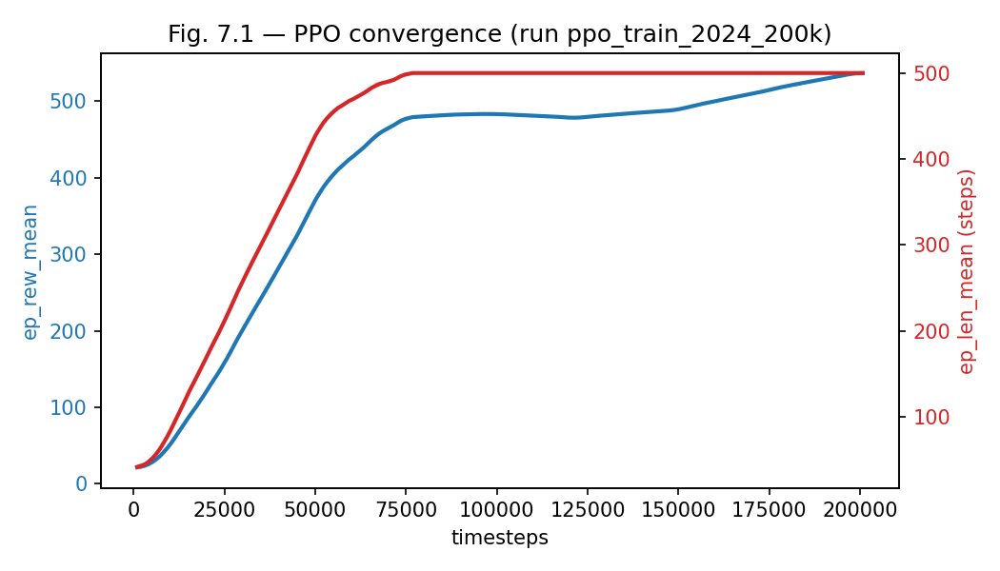
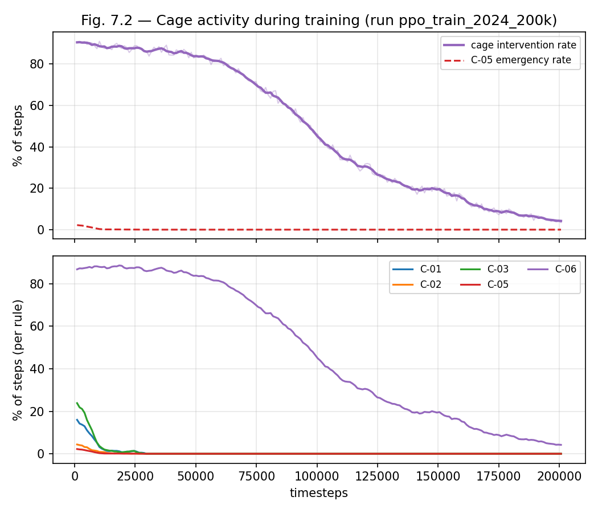
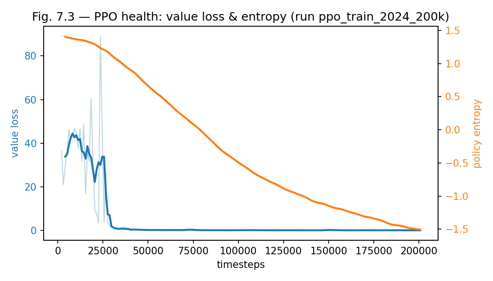
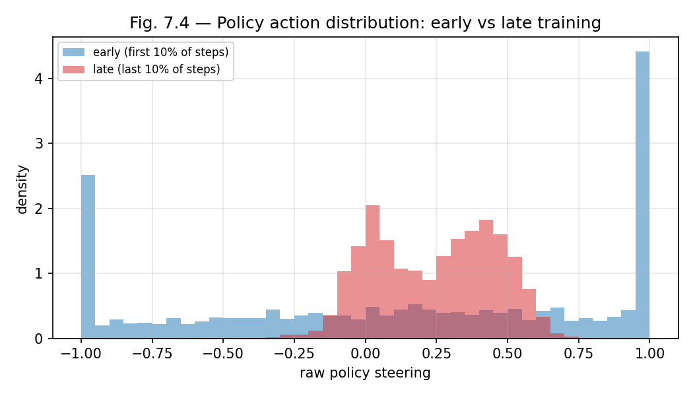
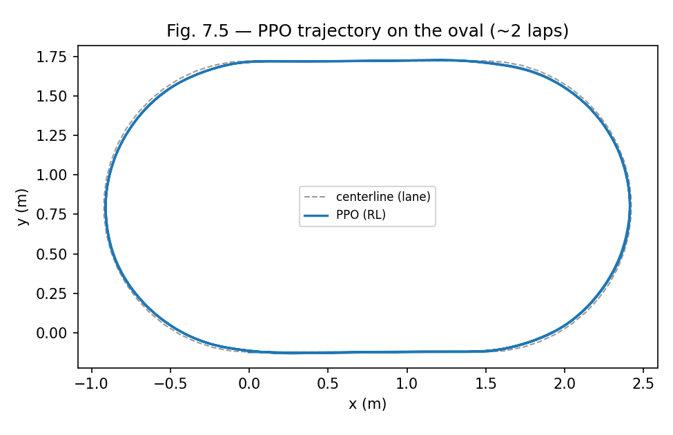
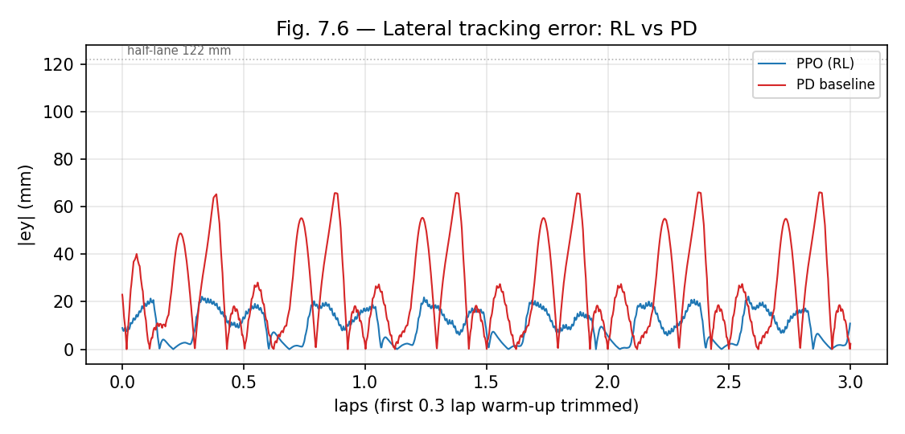
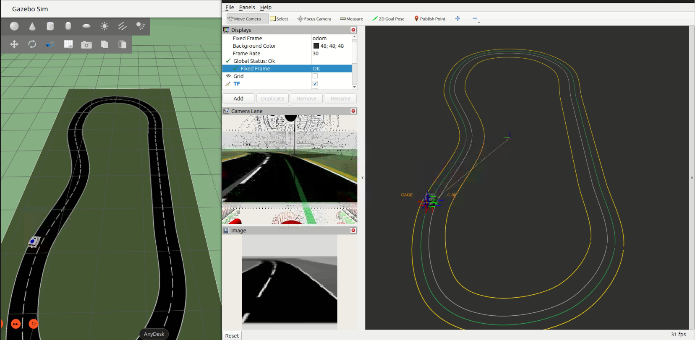
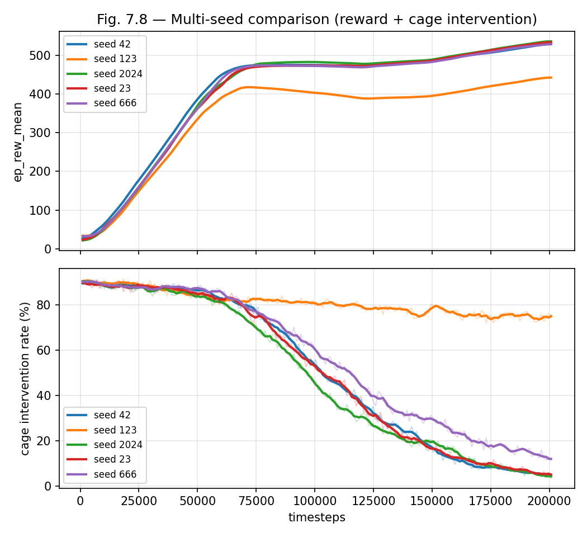

# Capítulo 7 — Training Specification y Entrenamiento PPO

<!--
Estado: ESQUELETO F3 (D36+).
Extensión objetivo: 10–14 páginas.
Convención: secciones marcadas [BORRADOR D3X] tienen prosa fijada.
Las marcadas [COMPLETAR FASE 3] dependen de resultados medidos durante
el entrenamiento (curvas de convergencia, métricas de evaluación,
número de timesteps, completion rate del RL).
Las marcadas [PULIDO FASE 6] requieren retoque estilístico al cierre.

Artefacto A1 del V-Model adaptado: Training Specification.
Debe existir antes del primer entrenamiento (D-07, D-34).
-->

## 7.1 Introducción del capítulo  [BORRADOR D36]

Este capítulo produce el segundo artefacto resultante de la adaptación A1
del V-Model (D-07): la **Training Specification**. Mientras el Capítulo 5
especificó el comportamiento de la cage mediante la *Cage Specification*
(primer artefacto de A1), la Training Specification especifica las
condiciones bajo las cuales la policy RL se entrena: espacio de
observación, espacio de acción, función de recompensa, criterios de
terminación y truncación, hiperparámetros PPO, y el modo de operación de
la cage durante el entrenamiento.

La Training Specification no es un resultado experimental: es un
*meta-diseño* que precede al primer entrenamiento y determina qué puede
y qué no puede aprender la policy. Las decisiones técnicas documentadas
aquí son responsabilidad del diseñador; la evidencia empírica de que esas
decisiones producen una policy competente es responsabilidad del
Capítulo 8.

El capítulo tiene la siguiente estructura. La sección 7.2 desarrolla la
Training Specification propiamente dicha, con sus ocho componentes. La
sección 7.3 describe el entorno de simulación adaptado para entrenamiento
RL. La sección 7.4 reporta los resultados del entrenamiento PPO
definitivo. La sección 7.5 evalúa la policy entrenada sobre el
escenario nominal (SC-NOM-01) para establecer una línea base de
rendimiento. La sección 7.6 sintetiza y articula la transición al
Capítulo 8.

---

## 7.2 Training Specification  [BORRADOR D36]

La Training Specification es el artefacto A1 del V-Model adaptado
(D-07). Se documenta aquí antes del primer entrenamiento; cualquier
modificación posterior constituye una revisión del documento y se
registra en `docs/CHANGELOG.md` con su rationale.

### 7.2.1 Espacio de observación

El vector de observación es un array de seis flotantes:

```text
obs = [ey, epsi, speed, prev_steer, kappa_near, kappa_far]
```

donde `ey` es el offset lateral respecto a la línea central del carril
(positivo a la izquierda), `epsi` es el error de heading respecto a la
tangente de la línea central (positivo en sentido antihorario), `speed`
es la velocidad escalar del vehículo en m/s, `prev_steer` es el
steering aplicado en el ciclo anterior (normalizado en [-1, 1]), y
`kappa_near`/`kappa_far` son la **curvatura con signo** de la línea
central (rad/m, positiva a la izquierda) a dos horizontes de preview
(3 y 8 segmentos por defecto).

Los límites del espacio son [-∞, +∞] para `ey`, `speed`, `kappa_near` y
`kappa_far`, [-π, π] para `epsi`, y [-1, 1] para `prev_steer`. En la
práctica, el rango operativo es estrecho: ey ∈ [-0.12, 0.12] m,
epsi ∈ [-0.4, 0.4] rad (ver §6.6.2), |kappa| ≤ 1.25 rad/m (R=0.8 m).

La inclusión de `prev_steer` es una forma ligera de memoria de primer
orden que ayuda al agente a regularizar su comportamiento de steering sin
requerir una arquitectura recurrente. El `speed` es información necesaria
para la calibración de la corrección de heading en curva.

**Preview de curvatura (revisión F3, primer run).** El vector original
de cuatro componentes era puramente reactivo: el agente solo veía
`ey/epsi` actuales y no la curva que se aproxima. En el primer run de
entrenamiento esto bloqueó el aprendizaje — en la curva de R=0.8 m, sin
anticipación, el agente derivaba hasta que la cage tomaba el control
(C-01/C-03) y disparaba C-05, con señal de crédito casi nula
(`explained_variance ≈ 0`). La cage **ya** consumía `curvature_ahead`
internamente; exponerla también a la política (`kappa_near`, `kappa_far`)
le permite anticipar la curva. Con el preview, el agente pasó a completar
vueltas y terminar por truncación. Decisión (ED-7) en
`docs/09_environment_design.md`.

### 7.2.2 Espacio de acción

El espacio de acción es un array de un flotante: `action = [steering]`
en [-1, 1]. La velocidad es fija (`fixed_speed = 0.2 m/s`) durante el
entrenamiento; el agente no controla el throttle. Esta elección reduce
la dimensionalidad del problema de aprendizaje: en la Fase 2 el PD con
velocidad fija ya produce comportamiento estable, por lo que no hay
evidencia de que el agente RL necesite control de velocidad para el
escenario nominal. Si el control de velocidad resulta necesario para los
escenarios perturbados de Fase 4, la Training Specification se revisa.

### 7.2.3 Función de recompensa

La función de recompensa en un ciclo de control es:

```text
r = w_fwd · max(progress, 0)
  - w_ey  · |ey|
  - w_eps · |epsi|
  - w_ds  · |Δsteering|
  - w_term · [terminated_off_road]
```

donde `progress` es el avance **normalizado** a lo largo de la línea
central en ese ciclo (≈1.0 a velocidad de crucero; el entorno gestiona el
wrap del arco en el circuito cerrado), `Δsteering` es el cambio en el
steering **crudo de la política** (no el post-cage; ver §7.2.5), y
`[terminated_off_road]` es 1 solo si el episodio termina por salida de
**vía** (no por emergencia C-05; ver §7.2.4). Los pesos nominales (sujetos
a ajuste experimental) son:

| Parámetro | Valor | Rationale |
| --- | --- | --- |
| `w_fwd` (forward_progress) | 1.0 | Premia progreso real (≈1.0/paso a crucero) |
| `w_ey` (lateral_error) | 2.5 | Penalización principal: offset lateral |
| `w_eps` (heading_error) | 0.75 | Penalización secundaria: heading |
| `w_ds` (steer_delta) | 0.20 | Suavidad de actuación (sobre Δsteering **crudo**, v1.2; ver §7.2.5) |
| `w_term` (termination) | 25.0 | Desincentiva salida de vía |

**Progreso, no velocidad (revisión F3, primer run).** El término forward
originalmente era `w_fwd · speed`. Como la velocidad es fija (crucero
cage-controlado), ese término era una constante ≈0.2 que no discriminaba
la conducta de la política: el retorno apenas dependía de las acciones, lo
que dejaba `explained_variance ≈ 0` y el aprendizaje plano. Sustituirlo
por el **progreso normalizado a lo largo del centerline** hace que el
retorno premie sobrevivir y avanzar más (completar curvas/vueltas) — la
señal que el agente sí puede optimizar. Además mantiene cada paso en pista
**netamente positivo**, de modo que terminar pronto (vía la emergencia
C-05 sin penalización, §7.2.4) nunca renta más que continuar.

El diseño de recompensa es deliberadamente simple. La penalización de
terminación alta (25.0) prioriza la permanencia en **vía** sobre la
optimización de velocidad; nótese que **solo** la salida de vía la aplica
— la emergencia C-05 termina sin penalización (la intervención de la cage
es dinámica, no castigo; D-34, §7.2.4/§7.2.5).

Los pesos son `[provisional, M-P1..M-P4]` — se marcan provisionalmente
hasta que el análisis de sensibilidad del Capítulo 8 confirme que no hay
degeneración. Detalle y banco de preguntas en `docs/10_reward_function.md`.

### 7.2.4 Criterios de terminación y truncación

**Terminación** (episodio falla): el episodio termina (`terminated=True`)
en cualquiera de dos condiciones:

1. **Salida de vía**: `|ey| > road_width / 2`. Se termina en el borde de
   vía y no en el de carril (`lane_width/2`) por una razón deliberada de
   entrenamiento: una policy inicial aleatoria saldría del carril en 1–2
   pasos y nunca acumularía experiencia útil. La cage corrige las
   violaciones de **carril** dentro de la vía (C-01/C-03); terminar en el
   borde de **vía** marca el caso "la cage no pudo evitarlo". **Esta** es
   la única condición que aplica la penalización `w_term` (§7.2.3).
2. **Emergencia C-05** (revisión F3): si la cage enclava un paro de
   emergencia, el rollout ya falló (el coche queda congelado) y los pasos
   restantes no aportan señal — terminar de inmediato evita malgastar el
   horizonte. Se trata como fallo terminal (el value bootstrapea desde 0)
   pero **sin penalización** (`done=off_road` en la recompensa): castigar
   la acción de la cage contradiría su tratamiento como dinámica del
   entorno (D-34). `info["termination_reason"] ∈ {off_road, cage_emergency,
   truncated}`.

Implementación en `GazeboLaneEnv.step`; rationale en
`docs/09_environment_design.md` (ED-4 / ED-8) y D-34 (addendum F3).

**Truncación** (episodio completo): `step_count ≥ max_episode_steps`.
Con `max_episode_steps = 500` y `control_dt = 0.10 s`, el episodio dura
50 s (≈ 1.14 vueltas al óvalo). Episodios más largos aceleran la
convergencia porque el agente ve más variedad de estados por episodio.
El valor de 500 pasos es `[provisional, M-P6]`; el horizonte resultó
adecuado: en el ciclo definitivo de 200 000 timesteps la policy aprende a
recorrer el episodio completo sin terminar (`ep_len_mean` satura en los 500
pasos, §7.4.1), de modo que toda la experiencia tardía es por truncación.

### 7.2.5 Cage durante el entrenamiento

La cage opera en modo `enforcement` durante todo el entrenamiento
(D-34). En cada ciclo de control, `GazeboLaneEnv` construye el estado de
la cage a partir del tracker, forma la acción raw `(steering_policy,
throttle_nominal)`, e invoca **en proceso** la misma clase
`SafetyCageNode` —con el mismo `cage/cage.yaml`— que el nodo de
despliegue `cage_ros_node` envuelve por tópicos. La acción segura
resultante se mapea a `/cmd_vel` replicando `vehicle_control_node`
(throttle→velocidad, `angular.z = steering·yaw_gain`, emergencia→parada
controlada). La recompensa se calcula sobre la acción segura y el estado
resultante, no sobre la acción raw, **con una excepción deliberada: el
término de suavidad `w_ds·|Δsteering|`** (reward v1.2). Ese término existe
para moldear la actuación de la *propia política*. Bajo el reward anterior
(v1.0, con el Δ medido **post-cage**) C-06 absorbía el bang-bang crudo en
una señal post-cage casi idéntica se saturara o no la política, de modo que
medir el Δ post-cage dejaba el término sin efecto: un ciclo previo mostró a
la policy llevando C-06 a su tope el ~89% de los pasos sin pagar por ello.
Por eso el término se computa sobre el `Δsteering` **crudo** (pre-cage) y se
sube de peso (`w_ds = 0.10 → 0.20`): así la política paga su propio jerk en
lugar de delegarlo gratis en C-06. **La evaluación del ciclo definitivo
(§7.5.2) confirma el efecto:** bajo reward v1.2 la policy aprende a girar de
forma nativa suave (|Δraw| medio 0.030, muy por debajo del límite 0.15 de
C-06) y la cage queda latente (0 % de los pasos: ninguna activación del
cage en 4 400). El resto de términos
(ey, epsi, progreso, terminación) sigue sobre el estado resultante / la
acción segura, y las intervenciones de la cage no se penalizan (D-34).

La invocación en proceso —en lugar del intercambio asíncrono
`/raw_action`→`/safe_action` por tópicos— se elige por determinismo (bajo
la semilla fija de §7.2.7) y porque produce un comportamiento de cage
idéntico al de despliegue: misma clase y misma configuración (ver D-34).
El cableado puro y libre de ROS reside en `cobraflex_rl/cage_bridge.py`.

Esta elección alinea entrenamiento con despliegue: la policy aprende
bajo la misma restricción que encontrará en evaluación y en físico. Las
intervenciones de la cage son parte de la dinámica del entorno desde la
perspectiva del agente; no se penalizan explícitamente en la recompensa
(la penalización está implícita en el peor estado que la cage corregida
no puede evitar completamente).

Este cableado es la tarea TS-01 de F3, ya implementada. La cage puede
desactivarse (`cage.enabled: false` en `train_ppo.yaml`) para reproducir
el bucle sin cage usado en la depuración preliminar del pipeline.

### 7.2.6 Hiperparámetros PPO

Los hiperparámetros de partida (versión 1.0) siguen los valores
recomendados de Stable-Baselines3 (SB3 2.8.0) para entornos de control
continuo, con ajuste del horizonte `n_steps` al periodo del episodio. La
tabla lista la configuración **efectiva completa**: las seis primeras filas
se fijan explícitamente (`train_ppo.yaml` → `PPO(...)` en `train_ppo.py`);
el resto son los valores por defecto de SB3 2.8.0, **no sobreescritos**, y se
documentan aquí para reproducibilidad.

| Parámetro | Valor | Fijado en | Fuente / nota |
| --- | --- | --- | --- |
| `total_timesteps` | 200 000 | `train_ppo.yaml` | `[provisional, M-P7]` |
| `learning_rate` | 3×10⁻⁴ | `train_ppo.yaml` | = SB3 default |
| `gamma` | 0.99 | `train_ppo.yaml` | = SB3 default |
| `n_steps` | 1 024 | `train_ppo.yaml` | ≈ 2 episodios de 500 pasos (SB3 default 2 048) |
| `batch_size` | 64 | `train_ppo.yaml` | = SB3 default |
| `device` | cpu | `train_ppo.yaml` | Máquina de desarrollo sin GPU |
| `n_epochs` | 10 | SB3 default | épocas de optimización por rollout |
| `gae_lambda` | 0.95 | SB3 default | trade-off sesgo-varianza en GAE |
| `clip_range` | 0.2 | SB3 default | clip del ratio de probabilidad de PPO |
| `ent_coef` | 0.0 | SB3 default | sin bonus de entropía explícito |
| `vf_coef` | 0.5 | SB3 default | peso de la *value loss* en la pérdida total |
| `max_grad_norm` | 0.5 | SB3 default | clipping de la norma del gradiente |
| `normalize_advantage` | True | SB3 default | normaliza ventajas por minibatch |

**Arquitectura de red.** La política es la `MlpPolicy` por defecto de SB3:
dos capas ocultas de 64 unidades con activación `tanh` y **redes separadas**
para policy y value (sin backbone compartido — el `net_arch` por defecto de
SB3 2.x es `pi=[64, 64]`, `vf=[64, 64]` sobre un extractor identidad), con
salida Gaussiana diagonal (media + `log_std` independiente del estado). No se
modifica `policy_kwargs`: se parte de un default bien probado para minimizar
el riesgo de configuración. La elección de `ent_coef = 0.0` implica que la
exploración no se incentiva explícitamente vía bonus de entropía; la entropía
de la política decae de forma natural al comprometerse con la tarea (su curva
se diagnostica en §7.4).

El presupuesto de timesteps `[provisional, M-P7]` se fijó iterativamente.
Un primer ciclo de 50 000 timesteps produjo una policy competente pero
**no saturada** —la recompensa seguía creciendo al agotar el presupuesto—,
lo que motivó extenderlo. El ciclo definitivo de **200 000 timesteps**
(seed 2024, reward v1.2, §7.4) satura con margen holgado: la literatura de
lane-following simple con PPO sitúa la convergencia entre 20 000 y 100 000
timesteps según la complejidad del entorno, y aquí `ep_len_mean` alcanza el
horizonte completo de 500 pasos hacia ~75 000 timesteps, con la recompensa
estabilizada en el último tercio del presupuesto (§7.4.1).

### 7.2.7 Semillas y reproducibilidad

El ciclo definitivo usa `seed = 2024` y 200 000 timesteps bajo el reward v1.2
(§7.2.3, §7.2.5); los resultados detallados de §7.4 y §7.5.1–§7.5.2
corresponden a esta semilla (la mejor de las cinco; §7.5.3). Se han entrenado **cinco semillas** (42, 123, 2024,
23, 666) bajo la **misma** configuración y presupuesto (**N = 5**). La comparación
entre semillas —que revela **dos cuencas de convergencia** cualitativamente
distintas, *constraint-respecting* (seeds 42, 2024, 23, 666) y *cage-dependent*
(seed 123)— se reporta en §7.5.3. El análisis de sensibilidad de `w_ds` sobre esta
distribución (4/5 vs 1/5) se completa en el
Capítulo 8; dada la **bimodalidad** observada, se reportan las semillas
individualmente (la mediana enmascararía las dos cuencas).

### 7.2.8 Checkpoints y registro

Los checkpoints se guardan en `policy/checkpoints/` cada `n_steps`
pasos (denominación SB3 `cobraflex_ppo_lane_<N>_steps.zip`, p.ej.
`cobraflex_ppo_lane_50176_steps.zip`).
El modelo final se guarda como `cobraflex_ppo_lane.zip`. Cada run de
entrenamiento registra en `experiments/sim/training/<run_id>/`:

- `learning_curve.csv` — una fila por rollout con
  `[timestep, ep_rew_mean, ep_len_mean, explained_variance, value_loss,
  entropy, approx_kl, clip_fraction, std, intervention_rate, emergency_rate,
  int_rate_C-01 … int_rate_C-06]`. Las columnas de salud de PPO (`value_loss`,
  `entropy = −entropy_loss`, `approx_kl`, `clip_fraction`, `std`) y de
  actividad del cage (tasa de intervención global, tasa de emergencia C-05 y
  desglose por regla, acumuladas por paso desde el `info` del entorno)
  habilitan las figuras de dinámica de §7.4. El esquema es un **superconjunto**
  del histórico de cuatro columnas, de modo que las herramientas que leen por
  nombre de columna siguen operando sobre runs antiguos.
- `action_samples.csv` — el steering crudo de la política submuestreado
  (`[timestep, raw_steer]`, una muestra cada `action_sample_every` pasos, 10 por
  defecto), para la figura de distribución de acciones inicio-vs-fin (§7.4).
- `metadata.json` — los mismos campos de reproducibilidad que los runs de
  validación (git commit, hashes YAML, seed, timestamp).

La instrumentación reside en `cobraflex_rl/callbacks.py`
(`LearningCurveCallback`, `ActionSampleCallback`) y en el módulo puro
`cobraflex_rl/training_metrics.py` (esquema de columnas + agregación de la
actividad del cage; tests en `policy/tests/test_training_metrics.py`).

> **Nota de cobertura.** Los cinco ciclos definitivos (seeds 42, 123, 2024, 23,
> 666; §7.5.3) se registraron con la instrumentación extendida completa —columnas
> de actividad del cage y de salud de PPO + `action_samples.csv`—, lo que puebla
> las Figuras 7.2–7.4 (y la 7.8 multi-semilla).

---

## 7.3 Entorno de simulación para entrenamiento RL  [BORRADOR D36]

El entorno de simulación para entrenamiento es el mismo mundo Gazebo
(`lane_following_oval.world`) utilizado en la validación F2, con tres
adaptaciones para el ciclo RL.

Primera, **control del reloj de simulación.** En la validación F2 el
reloj de Gazebo avanza en tiempo real (RTF ≈ 1). En el entrenamiento RL
el simulador se ejecuta *headless* (sin GUI) y con el reloj sin pausa,
lo que permite un RTF superior a 1 y acelera el muestreo de timesteps.
El RTF efectivo depende del hardware; en la máquina de desarrollo se
estima en 2–4×.

Segunda, **reset de episodio.** Al inicio de cada episodio, el vehículo
se teletransporta a la posición de spawn mediante el servicio
`/world/lane_following_oval/set_pose`. Este reset usa el mismo mecanismo
que la detección de warp en `lane_perception_node` (§6.3.2): el nodo
detecta el salto brusco de posición y reinicia su tracker y EMA.

Tercera, **perturbación de spawn.** Para generar diversidad de estados
de inicio, cada episodio introduce una perturbación aleatoria en el
heading de spawn dentro de `[-0.15, +0.15] rad` y en la posición lateral
dentro de `[-0.05, +0.05] m`. Esto evita que la policy memori\-ze una
única trayectoria de arranque y mejora la generalización a los escenarios
perturbados de Fase 4. Los rangos son `[provisional, M-P5]`.

---

## 7.4 Resultados del entrenamiento

Ciclo de entrenamiento PPO definitivo: run `ppo_train_2024_200k` (run_id
`ppo_train_20260606T082917Z`, seed 2024, 200 000 timesteps, reward v1.2,
~6 h a tiempo real, fps≈9) —la semilla con **mejor recompensa y mejor salud de
PPO** (`explained_variance` 0.67) de las cinco entrenadas (§7.5.3)—, registrado
con la instrumentación extendida de §7.2.8 (actividad del cage + salud de PPO por
rollout + `action_samples.csv`), lo que habilita las Figuras 7.2–7.4. Datos crudos:
`experiments/sim/training/ppo_train_2024_200k/learning_curve.csv`
(196 iteraciones de 1 024 pasos). Este ciclo, entrenado bajo el reward
v1.2 (§7.2.5), **supersede** a los ciclos previos —el preliminar de
50 000 timesteps (no saturado) y un ciclo de 250 000 timesteps con reward
v1.0 que saturaba pero dejaba a la policy apoyándose en C-06 el ~89 % de
los pasos (§7.5.2)— y es el que se evalúa en §7.5.

### 7.4.1 Curva de convergencia

`ep_rew_mean` crece de 20.9 (1 024 pasos) a un plateau de **536.8**
(200 704 pasos; máximo 536.8); `ep_len_mean` de 40.8 a **500.0**, es decir
el horizonte completo de truncación (≈ 1.14 vueltas por episodio). La
Figura 7.1 muestra ambas curvas (raw + suavizado ventana 5). A diferencia
del ciclo de 50 000 timesteps, esta corrida **satura**: `ep_len_mean`
alcanza los 500 pasos hacia los ~75 000 timesteps —la policy deja de
salirse y agota el episodio por truncación— y `ep_rew_mean` llega a ~483
(≈ 90 % de su valor final) hacia los ~94 000. El tramo restante (94k–200k)
es un plateau estable en el que `ep_rew_mean` asciende suavemente de ~483 a
536.8 mientras `ep_len_mean` permanece clavado en 500 —el episodio se
completa entero durante toda la meseta—, de modo que esa ganancia tardía de
recompensa es refinamiento residual de la calidad de tracking, no mayor
supervivencia.



*Figura 7.1 — Curva de convergencia del entrenamiento PPO (run
`ppo_train_2024_200k`, seed 2024, 200 000 timesteps): `ep_rew_mean`
(azul) y `ep_len_mean` (rojo) vs timesteps, datos crudos + suavizado
(ventana 5). `ep_len_mean` satura en el horizonte de 500 pasos hacia ~75k y
la recompensa asciende hasta su plateau de ~537 en el último tercio.
Generada por `tools/plot_f3_figures.py`.*

### 7.4.2 Estabilidad y explained_variance

`explained_variance` fue baja y ruidosa durante la fase de mejora rápida
(con tramos negativos y picos aislados): el crítico persigue un retorno
creciente, con la función de valor por detrás de una policy que mejora
rápido. Una vez la recompensa hace plateau se estabiliza: promedia **0.53**
en la meseta (≥75k) —el 62 % de las iteraciones de plateau queda ≥0.5 y el
80 % ≥0.4— y cierra en **0.67** (máximo 0.81), **por encima del umbral de
0.5** de esta sección: el crítico predice con fiabilidad el retorno de una
policy estacionaria.

El criterio de convergencia (`ep_rew_mean` estable en ventana de 10
iteraciones) **se cumple**: la recompensa lleva en plateau desde los ~94k
timesteps, de modo que el presupuesto de 200 000 deja un amplio margen
sobre el punto de convergencia. Esto resuelve la limitación documentada
del ciclo preliminar de 50 000 (no saturado): la policy resultante es
competente (§7.5) **y** saturada.

### 7.4.3 Observaciones sobre la convergencia

- **Inicio (≈0–7%):** la policy emergencia/sale en ~41 pasos de media;
  episodios cortos con emergencias C-05 (~2 % de los pasos) y el cage
  interviniendo en ~90 % (ver `docs/CHANGELOG.md`, entrada de bring-up F3).
- **Subida (≈7–37%):** `ep_len_mean` trepa desde ~41 hasta los 500 pasos
  —la policy completa fracciones crecientes de vuelta hasta recorrer el
  episodio entero, hacia ~75k timesteps—; en paralelo `ep_rew_mean` sube de
  ~45 a ~483.
- **Plateau (≈37–100%):** `ep_len_mean` ≈ 500 (horizonte completo, ~1.14
  vueltas); deja de salirse por completo (las emergencias caen a 0 hacia los
  ~14k timesteps, confirmado en la evaluación §7.5: 0 emergencias en las 11.2
  vueltas / 4 400 pasos). La policy se compromete con acciones concretas y la
  recompensa asciende suavemente de ~483 a ~537.
- **Co-adaptación policy–cage (Figura 7.2).** La tasa de intervención del
  cage **decrece monótonamente de ~90 % a ~3.4 %** a lo largo del
  entrenamiento (por debajo del 45 % hacia ~101k y del 9 % hacia ~171k): la
  policy aprende progresivamente a producir acciones que **respetan las
  constraints** (*constraint-respecting*) en lugar de depender de la
  corrección del cage. El desglose por regla muestra que el grueso es **C-06**
  (rate-limiter), con C-01/C-03 activas solo en el caos inicial (<20k) y luego
  nulas. En paralelo, la **entropía** de la política cae de 1.42 a −1.52
  (Figura 7.3) de forma gradual —exploración que se contrae al comprometerse
  con la tarea, sin colapso prematuro—.
- **Actuación cruda suave (reward v1.2, Figura 7.4):** a diferencia del ciclo
  previo de reward v1.0 —cuyo steering raw era bang-bang y delegaba el
  suavizado en C-06—, bajo reward v1.2 la actuación cruda es **nativamente
  suave** (|Δraw| medio 0.030, cambios de signo en el 1.1 % de los pasos, 0 %
  de saturación a ±1): el rate-limiter C-06 ya casi no interviene (§7.5.2). La
  Figura 7.4 contrasta la distribución del steering crudo al inicio (bimodal,
  saturando en ±1) y al final (concentrada y moderada). A nivel de
  **trayectoria** tampoco hay oscilación apreciable (ey máx 23 mm sobre 11.2
  vueltas en evaluación, §7.5).



*Figura 7.2 — Actividad del cage durante el entrenamiento (run
`ppo_train_2024_200k`): tasa de intervención global (de ~90 % a ~3.4 %) +
emergencia C-05 (arriba) y desglose por regla C-01..C-06 (abajo). La caída
monótona es la evidencia directa de **co-adaptación policy–cage**: la policy
aprende a no necesitar la corrección. Generada por `tools/plot_f3_figures.py`.*



*Figura 7.3 — Salud interna de PPO: value loss (azul) y entropía de la política
(naranja) vs timesteps. La entropía decae de forma gradual (1.42 → −1.52), sin
colapso prematuro de la exploración. Generada por `tools/plot_f3_figures.py`.*



*Figura 7.4 — Distribución de la acción (steering crudo) al inicio (azul, primer
10 % de pasos) vs al final (rojo, último 10 %) del entrenamiento. La policy pasa
de un comando bimodal saturado en ±1 (bang-bang) a uno concentrado y moderado:
aprende suavidad nativa en vez de delegarla en C-06. Generada por
`tools/plot_f3_figures.py`.*

---

## 7.5 Evaluación de la policy sobre SC-NOM-01

Policy evaluada: checkpoint `cobraflex_ppo_lane` (run de entrenamiento
`ppo_train_2024_200k`, seed 2024, 200 000 timesteps, reward v1.2). Run de
evaluación `rl_eval_2024_200k_4k4` (run_id `rl_eval_20260606T145204Z`): un
episodio determinista (spawn sin perturbación, §7.3), horizonte extendido a
4 400 pasos = 440 s (≈ 11.2 vueltas continuas) para que el recuento de
vueltas sea comparable con el PD. Comparación directa con la run del PD
baseline `ros_run_20260523T153003Z` (§6.6.1).

### 7.5.1 Completion rate y métricas de tracking

| Métrica | PD (pre-F3) | PPO (F3) |
| --- | --- | --- |
| Vueltas completadas | 9.91 (845 s) | 11.21 (440 s) † |
| Emergencias cage (C-05) | 0 | **0** |
| Intervenciones cage (% de pasos) | 0.047% | **0%** |
| ey medio \|ey\| (m) | 0.023 | **0.0099** |
| epsi medio \|epsi\| (rad) | 0.076 | **0.033** |

† Las duraciones difieren (PPO 440 s, PD 845 s), así que el recuento bruto
de vueltas **no es 1:1**. Lo robusto y comparable: **ambos completaron su
corrida sin un solo fallo** (0 emergencias), y la PPO **sostuvo > 11
vueltas continuas** sin que el cage tuviera que activar la parada de
emergencia. Las métricas por-paso (tasa de intervención, error de
tracking) son independientes de la duración y son el resultado
discriminante. Referencia:
`experiments/sim/runs/rl_eval_2024_200k_4k4/cage_status.csv`.

**Lectura.** La PPO **iguala** al PD en seguridad (0 emergencias en 11.2
vueltas), lo **supera en precisión de tracking** —el error lateral medio
cae de 23 mm a 9.9 mm (×2.3; máximo 23 mm, dentro del medio-carril de
122 mm y muy por debajo del `d_max = 160 mm` del cage) y el error de
heading medio de 4.3° a 1.9° (×2.3)— y, a diferencia del ciclo previo de
reward v1.0, lo hace **sin una sola intervención del cage** en todo el
episodio (0 % de los pasos, §7.5.2): la policy se mantiene por sí misma
dentro de la envolvente de seguridad en el escenario nominal.



*Figura 7.5 — Trayectoria de la policy PPO sobre el óvalo (~2 vueltas, run
`rl_eval_2024_200k_4k4`), ciñéndose a la línea central del carril. A
escala espacial la diferencia de tracking con el PD (mm) no es resoluble;
ver Figura 7.6. Generada por `tools/plot_f3_figures.py`.*



*Figura 7.6 — Error lateral \|ey\| a lo largo de la corrida: PPO (azul) vs
PD baseline (rojo), warm-up de 0.3 vueltas recortado. La PPO se mantiene en
una banda estrecha (~0–23 mm) frente a la oscilación del PD en curva (hasta
~65 mm), ambos muy por debajo del medio-carril (122 mm). Generada por
`tools/plot_f3_figures.py`.*

### 7.5.2 Comportamiento cualitativo

Tres observaciones del log por-paso (`cage_status.csv`):

1. **Tracking más fino que el PD.** La PPO centra el vehículo con ~2.3× menos
   error lateral (9.9 mm vs 23 mm) y ~2.3× menos error de heading (1.9° vs 4.3°),
   sostenido a lo largo de las 11.2 vueltas. Visualmente (Figura 7.5) la
   trayectoria RL se ciñe a la línea central con menos desviación en curva que el
   PD; la diferencia de banda es nítida en la Figura 7.6.
2. **Actuación cruda nativamente suave (reward v1.2).** A diferencia del ciclo
   previo de reward v1.0 —cuyo steering *crudo* era bang-bang (cambio de signo en
   ~46% de los pasos, saturación frecuente a ±1, \|Δraw\| medio ≈ 0.54, > 3× el
   límite `delta_max = 0.15` de C-06) y delegaba el suavizado en el rate-limiter—,
   la policy entrenada bajo reward v1.2 emite un comando crudo **suave y
   moderado**: magnitud media \|raw\| = **0.26** (máx 0.56, **sin saturar**),
   cambios de signo en solo el **1.1%** de los pasos y \|Δraw\| medio = **0.030**,
   holgadamente **por debajo** del límite de tasa de C-06. La policy aprendió a
   girar de forma continua en lugar de explotar el rate-limiter como actuador de
   tasa. Este es el efecto buscado del término de suavidad sobre el `Δsteering`
   **crudo** (`w_ds = 0.20`, §7.2.5): al pagar su propio jerk, la política
   internaliza la suavidad en vez de delegarla en C-06.
3. **El cage no interviene en nominal (salvaguarda latente).** Como
   consecuencia directa de (2), el steering crudo **nunca** viola
   ninguna regla: la acción segura coincide con la cruda en **los 4 400
   pasos** (\|raw − safe\| = 0 en todo el episodio), de modo que la tasa de
   intervención del cage es **0 %** —**ninguna activación** de ninguna regla
   C-01..C-06— frente al **89.0%** (todo C-06) del ciclo previo de reward v1.0
   y al 0.047% del PD. En
   el escenario nominal la policy se mantiene por sí misma dentro de la envolvente
   de seguridad y el cage opera como **salvaguarda latente**: presente y armado,
   pero sin coste de actuación. El valor protector del cage no se ejerce en
   crucero nominal, sino frente a las perturbaciones y casos límite del Capítulo 8
   (SC-EDGE, SC-PERT), donde la policy sí puede acercarse a los bordes del carril.
   Esto **completa** el diagnóstico del ciclo de reward v1.0: aquél mostró que un
   término de suavidad post-cage era inocuo (la policy llevaba C-06 a su tope
   gratis); reformularlo sobre el `Δsteering` crudo produjo una policy que ya no
   necesita el rate-limiter en nominal.

   > **Refinamiento confirmado (reward v1.2).** El término de suavidad reformulado
   > para penalizar el `Δsteering` **crudo** (pre-cage), con peso subido
   > `w_ds = 0.10 → 0.20` (§7.2.5, `docs/10_reward_function.md`), se diseñó para
   > que la política pagara su propio bang-bang en lugar de delegarlo gratis en
   > C-06. Su efecto, que en el ciclo de reward v1.0 quedaba **pendiente de
   > confirmar en un nuevo ciclo de entrenamiento**, queda **verificado** por esta
   > evaluación: bajo reward v1.2 la actuación cruda es nativamente suave (punto 2)
   > y el cage queda efectivamente latente en el escenario nominal (punto 3, **cero
   > activaciones del cage** en 4 400 pasos). Los pesos siguen
   > `[provisional, M-P4]` a la espera del análisis de sensibilidad del Capítulo 8.



*Figura 7.7 — Captura representativa del lane-following de la policy PPO bajo el
cage (corrida de evaluación de un ciclo previo; visualmente equivalente al run
definitivo de §7.5, ya que la vista de Gazebo/RViz no depende del checkpoint):
vista de Gazebo (óvalo + vehículo 1:14, izquierda) y RViz (modelo del robot y
frames TF, derecha).*

> **Material suplementario (vídeo).** Las grabaciones completas de las corridas
> están en `manuscript/media/` (no versionadas por tamaño; ver `.gitignore`):
> `training_1_lap.mp4` (una vuelta, política entrenada) y `eval_11_lap.mp4` (una
> corrida de evaluación de ~11.5 vueltas de un ciclo previo, representativa de la
> conducta de §7.5).

### 7.5.3 Variabilidad entre semillas: *constraint-respecting* vs *cage-dependent*

La evaluación de §7.5.1–§7.5.2 corresponde a la seed 2024. Entrenar **cuatro semillas
adicionales** (42, 123, 23 y 666) bajo la **misma** configuración, presupuesto y
reward revela que la semilla no produce una variación cuantitativa menor, sino
**dos cuencas de convergencia cualitativamente distintas** —el fenómeno
*constraint-respecting* vs *cage-dependent* anticipado en el diseño del entorno—:
**cuatro de las cinco semillas (42, 2024, 23, 666) convergen a *constraint-respecting*
y una (123) a *cage-dependent***. La Figura 7.8 contrasta sus dinámicas; la tabla
resume el resultado.

| Métrica | Seed 42 | Seed 2024 | Seed 23 | Seed 666 | Seed 123 |
| --- | --- | --- | --- | --- | --- |
| **Cuenca** | c-respecting | c-respecting | c-respecting | c-respecting | **cage-dependent** |
| `ep_rew_mean` (plateau) | 530.2 | 537.0 | 535.0 | 529.3 | 443.1 |
| Tasa de intervención (fin de training) | 5 % | 3 % | 5 % | 11 % | **74 %** |
| **Intervención del cage en eval** | 0.02 % | 0 % | **0 %** | 1.55 % | **58.8 %** † |
| `mean \|ey\|` en eval | 11.6 mm | 9.9 mm | **6.7 mm** | 8.0 mm | **90.7 mm** |
| `max \|ey\|` en eval | 27 mm | 23 mm | 22 mm | 26 mm | **145 mm** |
| Emergencias C-05 | 0 | 0 | 0 | 0 | 0 |
| Vueltas completadas | 11.0 | 11.2 | 11.1 | 11.1 | 11.9 |

† Seed 123 en eval, desglose por regla: **C-06 58 %, C-01 6 %, C-03 3 %** — el cage
no solo suaviza (C-06) sino que **previene salida de carril** (C-01/C-03) en tiempo real.



*Figura 7.8 — Comparación multi-semilla (seeds 42, 123, 2024, 23, 666): `ep_rew_mean`
(arriba) y tasa de intervención del cage (abajo) vs timesteps. Las cinco arrancan
en ~90 % de intervención (policy aleatoria); **las seeds 42, 2024, 23 y 666 se
agrupan decayendo a ~5–12 %** (cuenca *constraint-respecting*) mientras la **seed 123
se mantiene en ~75 %** (única en la cuenca *cage-dependent*). Generada por
`tools/plot_f3_figures.py --seed-runs`.*

**Las dos cuencas.** Ambas policies completan la corrida **sin una sola
emergencia** —la seguridad la garantiza el cage con independencia de la calidad de
la policy—, pero por caminos opuestos:

- **Seeds 42, 2024, 23 y 666 (*constraint-respecting*):** el cage queda **latente**
  (0.02 %, 0 %, 0 % y 1.55 % en eval) y **solo dispara C-06** (suavizado) —nunca las
  reglas de salida de carril C-01/C-03—; la policy aprendió a girar de forma
  nativamente suave y se ciñe a la línea central (11.6, 9.9, 6.7 y 8.0 mm). Sin cage
  seguirían funcionando razonablemente en nominal.
- **Seed 123 (*cage-dependent*):** el cage interviene en el **58.8 %** de los
  pasos, y **no es solo suavizado**: **C-01 (borde de carril) y C-03 (TTLC)
  disparan activamente** (6 % y 3 % de los pasos) porque la policy conduce con un
  error lateral medio de 90.7 mm y alcanza picos de **145 mm —cruza el medio-carril
  (122 mm)—**, y el cage la frena antes del `d_max` (160 mm). Es decir, **el cage
  previene salidas de carril en tiempo real**: sin él, esta policy abandonaría el
  carril.

**Por qué importa para la tesis.** La seed 123 es la evidencia de utilidad del
cage que el escenario nominal de las semillas *constraint-respecting* (como la
2024 evaluada en §7.5) no podía dar: una policy *peor* que el
cage mantiene **segura y dentro de la vía** pese a un tracking pobre y un 58 % de
intervención. El valor del cage **depende de la policy**, y cumple su función en
ambos extremos —latente cuando la policy basta, protector activo cuando no—. Es la
historia de co-adaptación completa.

**Sensibilidad del peso de suavidad (`w_ds`).** Ambas cuencas existen porque el
cage hace *viable* el steering bang-bang (C-06 lo limpia cada paso); la única
fuerza que empuja hacia *constraint-respecting* es el término de suavidad
`w_ds·|Δsteer|` (`w_ds = 0.20`, §7.2.5). Ese valor bastó para **cuatro de las cinco
semillas (42, 2024, 23, 666)** pero **no para la 123**: el peso produce
comportamiento *constraint-respecting* en la mayoría de los casos (**4/5 = 80 %**),
pero **no de forma fiable** entre semillas —la 123 es el caso atípico—. Es
exactamente el motivo del tag `[provisional, M-P4]`; el análisis de sensibilidad del
Capítulo 8 determinará un `w_ds` que reduzca la varianza entre cuencas, o documentará
dicha varianza como resultado. Con **N = 5** la distribución observada queda fijada
en **4/5 *constraint-respecting* vs 1/5 *cage-dependent***.

---

## 7.6 Síntesis y transición al Capítulo 8  [BORRADOR D36]

Este capítulo ha producido la Training Specification (artefacto A1 del
V-Model) y, una vez completado con los datos de §7.4 y §7.5, la
primera evidencia empírica de que una policy PPO puede aprender
lane-following en el mismo entorno donde el PD baseline fue validado.

La Training Specification es un documento de diseño, no de evaluación.
El hecho de que la policy converja en entrenamiento no valida que cumpla
los Safety Requirements: esa validación es el objeto del Capítulo 8.
Lo que este capítulo establece es que existe una policy candidata —
entrenada bajo condiciones documentadas y reproducibles — que el
Capítulo 8 puede evaluar sistemáticamente.

El Capítulo 8 introduce la *scenario library* como instrumento de
evaluación: en vez de una única corrida nominal, la policy se evalúa
sobre todos los escenarios de la library (SC-NOM-01..03, SC-EDGE-01..05,
SC-PERT-01..03), con las métricas M-S1..M-S4, M-P1..M-P7, M-I1..M-I5,
M-C1..M-C2 definidas en `docs/06_metrics_catalogue.md`. La comparación
sistemática entre RL+cage y PD+cage es el resultado experimental central
de la tesis.

---

<!--
APÉNDICE INTERNO — TRABAJO PENDIENTE EN ESTE CAPÍTULO

Fase 4–5:
  [ ] Re-entrenar con el logger extendido (callbacks.py / training_metrics.py) y
      generar las figuras 7.4 (intervención + desglose), 7.5 (value loss +
      entropía) y 7.6 (distribución de acciones); descomentar el bloque de §7.4
  [ ] Evaluar sobre todos los escenarios SC-NOM, SC-EDGE, SC-PERT
  [ ] Añadir análisis multi-semilla (N≥5)

Fase 6 (consolidación):
  [ ] Pulido de prosa
  [ ] Verificar coherencia cruzada §7.2.3 (pesos recompensa) con
       resultados del Capítulo 8 si se revisan los pesos
-->
