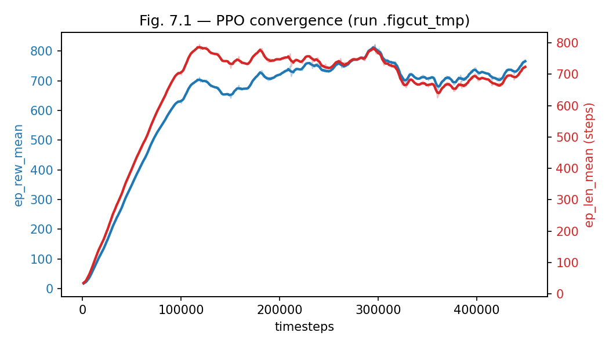
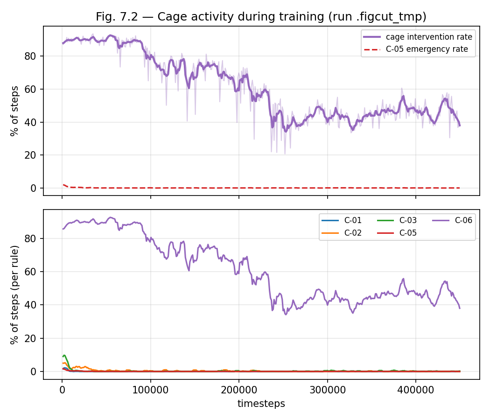
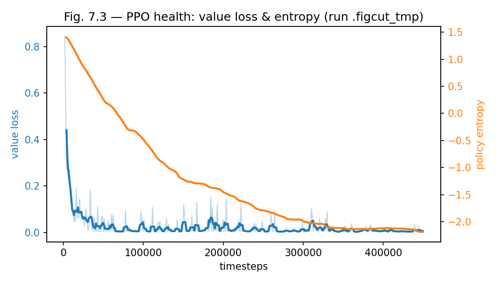
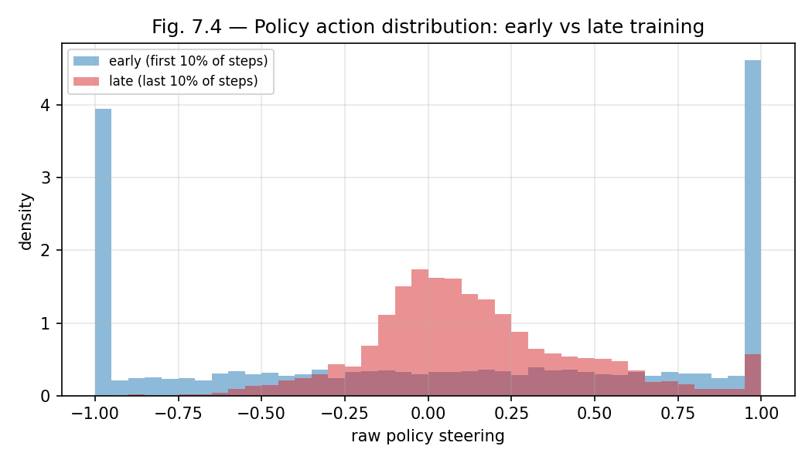
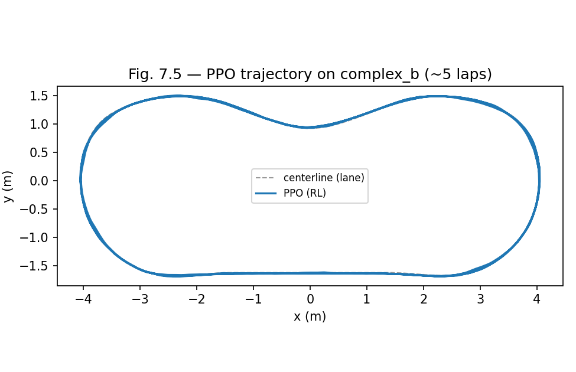
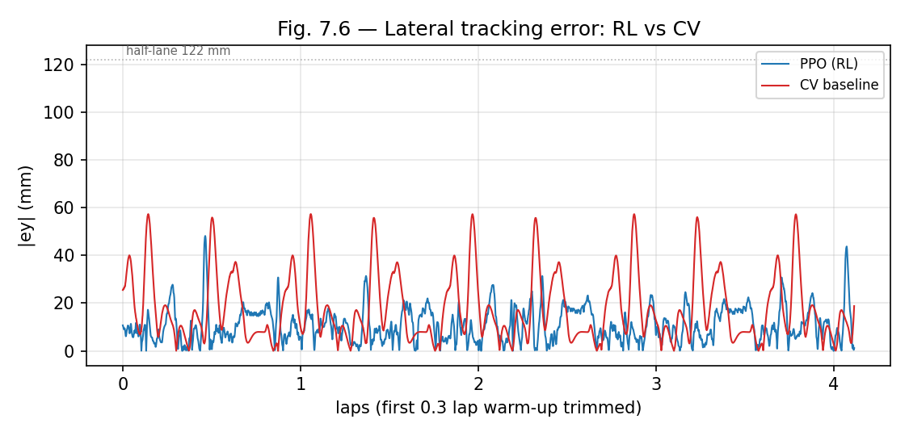
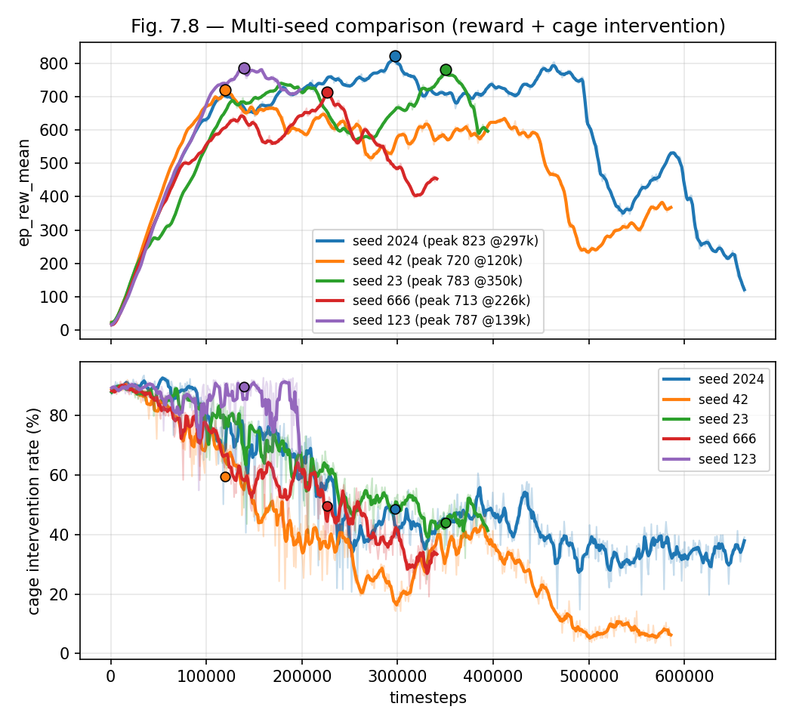
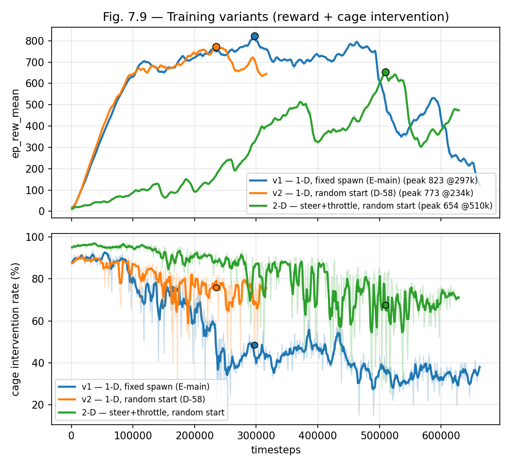

# Capítulo 7 — Training Specification y Entrenamiento PPO/SAC

<!--
Estado: E-track PRIMARIO (actualizado 2026-07-20; GE4-V2 cerrada 2026-06-28). El capítulo
reporta el track 'E' (cámara end-to-end, D-41/D-43) como sistema principal; el
track 'F' (vector de estado) queda como LÍNEA BASE / brazo de control ("coste
de la percepción por cámara"), no se elimina. La campaña GE4 sobre el E-main
297k está EJECUTADA (V2, 1970 runs, veredicto de récord; §8.9, docs/11 §8.4):
el track 'E' es la evidencia de veredicto de cámara y G4 está cerrado
(02.07.2026, docs/07).
El estudio PPO/SAC 1-D/2-D de §7.5.5 es evidencia posterior E5 y no sustituye
el PPO 297k ni reabre GE4.

Convención de figuras: las figuras primarias E llevan sufijo `_newcam`
(generadas del run complex_b 297k por `tools/plot_f3_figures.py`); las
figuras F originales (fig_7_1..fig_7_6, fig_7_8) se conservan como línea
base. Artefacto A1 del V-Model adaptado (D-07, D-34): Training Specification.
-->

## 7.1 Introducción del capítulo  [BORRADOR D36]

Este capítulo produce el segundo artefacto resultante de la adaptación A1
del V-Model (D-07): la **Training Specification**. Mientras el Capítulo 5
especificó el comportamiento de la cage mediante la *Cage Specification*
(primer artefacto de A1), la Training Specification especifica las
condiciones bajo las cuales la policy RL se entrena: espacio de
observación, espacio de acción, función de recompensa, criterios de
terminación y truncación, hiperparámetros PPO, y el modo de operación de
la cage durante el entrenamiento.

El **sistema principal de la tesis es el agente end-to-end de cámara
frontal** (track 'E', D-41/D-43): una política CNN que conduce desde la
imagen cruda, con la cage leyendo su **propio estimador de carril CV
determinista** (D-43). El agente de **vector de estado** (track 'F') se
conserva como **línea base / brazo de control**: comparte toda la Training
Specification salvo la observación, de modo que el delta de resultados
**aísla el coste de la percepción por cámara**. El track 'F' está
plenamente caracterizado (campaña F4, global `SATISFIED`); el track 'E'
tiene su **campaña GE4 ejecutada y cerrada** sobre el E-main de cámara
(V2, 1970 runs, 28.06.2026; §7.5, §8.9) y es la evidencia de veredicto del
brazo de cámara. El capítulo reporta 'E' como primario y 'F' como baseline.

La Training Specification no es un resultado experimental: es un
*meta-diseño* que precede al primer entrenamiento y determina qué puede
y qué no puede aprender la policy. Las decisiones técnicas documentadas
aquí son responsabilidad del diseñador; la evidencia empírica de que esas
decisiones producen una policy competente es responsabilidad del
Capítulo 8.

El capítulo tiene la siguiente estructura. La sección 7.2 desarrolla la
Training Specification con sus ocho componentes (observación de cámara
como primaria; vector de estado como baseline). La sección 7.3 describe el
entorno de simulación adaptado para entrenamiento RL (circuito `complex_b`
de cámara como primario; óvalo del track 'F' como baseline). La sección
7.4 reporta los resultados del entrenamiento PPO de cámara (E-main
`complex_b` 297k) con el contraste de la convergencia del track 'F'. La
sección 7.5 evalúa la policy de cámara sobre el escenario nominal
(SC-NOM-01) contra la línea base de control clásico (CV). La sección 7.6
sintetiza y articula la transición al Capítulo 8.

---

## 7.2 Training Specification  [BORRADOR D36]

La Training Specification es el artefacto A1 del V-Model adaptado
(D-07). Se documenta aquí antes del primer entrenamiento; cualquier
modificación posterior constituye una revisión del documento y se
registra en `docs/CHANGELOG.md` con su rationale. Salvo la observación
(§7.2.1) y los detalles de red/estabilidad de §7.2.6, **los ocho
componentes son comunes a ambos tracks**: ese es el delta mínimo que
D-41/D-43 persiguen — solo cambia la fuente de percepción.

### 7.2.1 Espacio de observación

**Primario (track 'E', cámara — D-41).** La observación es la **imagen de
la cámara frontal** reescalada a **84×84 píxeles en escala de grises**
(uint8), con **frame stack k=4** aplicado por el entrenador
(`VecFrameStack`). La política es una CNN (§7.2.2) que aprende la
percepción en lugar de consumir un estado construido a mano (supersede a
D-01/ED-1 para este track). Las decisiones de codificación quedan fijadas
en E2 dentro de la envolvente que `docs/09` §10 dejó abierta:

- **Escala de grises:** la señal de carril es luminancia (líneas blancas
  sobre asfalto); el color triplica la entrada sin información de carril e
  invita a depender del eje de apariencia que la *domain randomisation* de
  H-10 varía.
- **84×84:** entrada nativa del extractor NatureCNN de SB3; a esa
  resolución las líneas (~10 mm) conservan ≥1 píxel en el campo cercano.
- **k=4:** la observación de cámara no incluye el canal `prev_steer` del
  baseline, así que las pistas de velocidad angular salen íntegramente del
  stack; se toma el extremo superior de la envolvente.

La cámara fuente es la **Lane Cam dedicada** (espejo IMX219-160, 640×360,
HFOV ≈ 90°) montada **5 cm más abajo en el frente del chasis**
(`camera_geometry` h ≈ 0,077 m, pitch 0,25 rad), compartida por la CNN de
la política y el estimador CV de la cage. Cada fotograma atraviesa el
**pipeline compartido** (`camera_pipeline.CameraPipeline`): un único punto
de degradación (estresor de escenario o *domain randomisation*) **antes de
ambos consumidores** — la causa común que D-43 acepta y documenta. La
especificación completa del pipeline, *domain randomisation*, supervisor
de percepción y Trigger 8 de C-05 está en §7.2.5 y en `docs/09` §10.

**Baseline (track 'F', vector de estado).** El brazo de control sustituye
la imagen por un vector de seis flotantes:

```text
obs = [ey, epsi, speed, prev_steer, kappa_near, kappa_far]
```

donde `ey` es el offset lateral respecto a la línea central del carril,
`epsi` el error de heading, `speed` la velocidad escalar, `prev_steer` el
steering del ciclo anterior, y `kappa_near`/`kappa_far` la **curvatura con
signo** de la línea central a dos horizontes de preview (3 y 8 segmentos).
El preview de curvatura (revisión F3, ED-7 en `docs/09`) fue necesario para
desbloquear el aprendizaje en el baseline; en el track 'E' la geometría de
la curva debe inferirse **desde la imagen** — el problema de percepción más
difícil que D-41 asume, con su coste presupuestado en datos
(Shalev-Shwartz & Shashua 2016).

### 7.2.2 Arquitectura de la política y espacio de acción

El espacio de acción es común a ambos tracks: un flotante `action =
[steering]` en [-1, 1], con velocidad fija (`fixed_speed = 0.2 m/s`)
durante el entrenamiento; el agente no controla el throttle. Esta elección
reduce la dimensionalidad del aprendizaje; si el control de velocidad
resulta necesario para los escenarios perturbados de Fase 4, la
especificación se revisa.

**Primario (E):** `CnnPolicy` de SB3 (extractor NatureCNN: conv 32@8×8/4 →
64@4×4/2 → 64@3×3/1 → FC 512, con normalización de imagen interna), sobre la
observación apilada (84×84×4 tras `VecFrameStack` + `VecTransposeImage`).
**Baseline (F):** `MlpPolicy` por defecto (dos capas de 64 `tanh`, redes
separadas pi/vf), sobre el vector de 6 dimensiones. Ambas producen salida
Gaussiana diagonal (media + `log_std` independiente del estado).

### 7.2.3 Función de recompensa

La recompensa es **idéntica en ambos tracks** y se computa sobre el estado
**ground-truth** + progreso, agnóstica a la observación:

```text
r = w_fwd · max(progress, 0)
  - w_ey  · |ey|
  - w_eps · |epsi|
  - w_ds  · |Δsteering|
  - w_term · [terminated_off_road]
```

donde `progress` es el avance **normalizado** a lo largo de la línea
central, `Δsteering` es el cambio en el steering **crudo de la política**
(no el post-cage; §7.2.5), y `[terminated_off_road]` es 1 solo si el
episodio termina por salida de **vía** (no por emergencia C-05; §7.2.4).
Los pesos nominales (sujetos a ajuste experimental) son:

| Parámetro | Valor | Rationale |
| --- | --- | --- |
| `w_fwd` (forward_progress) | 1.0 | Premia progreso real (≈1.0/paso a crucero) |
| `w_ey` (lateral_error) | 2.5 | Penalización principal: offset lateral |
| `w_eps` (heading_error) | 0.75 | Penalización secundaria: heading |
| `w_ds` (steer_delta) | 0.20 | Suavidad de actuación (sobre Δsteering **crudo**, v1.2; §7.2.5) |
| `w_term` (termination) | 25.0 | Desincentiva salida de vía |

El término forward usa **progreso normalizado** (no velocidad): como la
velocidad es fija, un término `w_fwd·speed` sería una constante que no
discrimina la conducta y dejaba `explained_variance ≈ 0` (revisión F3,
primer run). La penalización de terminación alta (25.0) prioriza la
permanencia en **vía**; **solo** la salida de vía la aplica — la emergencia
C-05 termina sin penalización (la intervención de la cage es dinámica, no
castigo; D-34, §7.2.4). Los pesos son `[provisional, M-P1..M-P4]`; detalle
en `docs/10_reward_function.md`.

### 7.2.4 Criterios de terminación y truncación

Comunes a ambos tracks. **Terminación** (`terminated=True`) en dos
condiciones: (1) **salida de vía** `|ey| > road_width/2` — única condición
que aplica `w_term`; se termina en el borde de **vía**, no de carril, para
que una policy inicial aleatoria acumule experiencia útil (la cage corrige
las violaciones de **carril** C-01/C-03 dentro de la vía); (2)
**emergencia C-05** — el rollout ya falló (coche congelado), se trata como
fallo terminal **sin penalización** (castigar la cage contradiría D-34).
`info["termination_reason"] ∈ {off_road, cage_emergency, truncated}`.

**Truncación** (`step_count ≥ max_episode_steps`). Con `max_episode_steps`
= 1024 y `control_dt = 0.10 s` el episodio dura ≈ 102 s. En el track 'E'
sobre `complex_b` el horizonte resultó adecuado: la policy de cámara
aprende a recorrer episodios casi completos (`ep_len_mean` ≈ 791 en el pico,
§7.4.1). Implementación en `GazeboLaneEnv.step`; rationale en `docs/09`
(ED-4/ED-8) y D-34.

### 7.2.5 Cage durante el entrenamiento

La cage opera en modo `enforcement` durante todo el entrenamiento, **en
ambos tracks** (D-34). `GazeboLaneEnv` invoca **en proceso** la misma clase
`SafetyCageNode` —con el mismo `cage/cage.yaml` (v0.6.1)— que el nodo de
despliegue envuelve por tópicos, por determinismo y para que el
comportamiento de la cage sea idéntico al de despliegue. La acción segura
se mapea a `/cmd_vel` replicando `vehicle_control_node`. La recompensa se
calcula sobre la acción segura y el estado resultante, **con una excepción
deliberada: el término de suavidad `w_ds·|Δsteering|`** (reward v1.2) se
computa sobre el `Δsteering` **crudo** (pre-cage) y con peso subido
(`w_ds = 0.10 → 0.20`), para que la política pague su propio jerk en lugar
de delegarlo gratis en C-06 (el rate-limiter). El cableado puro y libre de
ROS reside en `cobraflex_rl/cage_bridge.py`.

**Fuente del estado de la cage (track 'E', D-43).** Lo que cambia en el
track de cámara es la **fuente del estado de la cage**: el supervisor de
percepción (`cage_perception.CagePerceptionSupervisor`) compone el
**estimador CV determinista** con el monitor de salud (SR-013) y el chequeo
de plausibilidad/consistencia temporal (SR-014); cuando el estimado es
aceptable produce el `State` de la cage, y cuando la percepción se pierde o
es sospechosa levanta el **Trigger 8 de C-05** (parada controlada en lazo
abierto). Ni ground truth ni la CNN de la política: así cage y política
generalizan a cualquier vía con líneas visibles. El ground truth queda
confinado a recompensa, terminación y métricas. Presupuestos al ciclo de
10 Hz: `staleness_max_s = 0.5 s`, persistencia del supervisor 4 ciclos;
en cada reset el supervisor se ceba (*priming*) sobre la vista de spawn.
En el **baseline (F)** la cage lee el estado del tracker ground-truth
directamente. Tarea TS-01 de F3, implementada.

### 7.2.6 Hiperparámetros PPO

La tabla lista la configuración **efectiva completa**. La columna E-main es
la del run de cámara `ppo_newcam_complex_b_2024_1M`; la baseline F es la del
run de estado `ppo_train_2024_200k`.

| Parámetro | E-main (cámara) | Baseline (F, estado) | Fuente / nota |
| --- | --- | --- | --- |
| `policy` | **CnnPolicy** | MlpPolicy | red de la política |
| `total_timesteps` | 1 000 000 (plan; parado ≈662k) | 200 000 | `[provisional, M-P7]` |
| `learning_rate` | 3×10⁻⁴, **anneal lineal** | 3×10⁻⁴ constante | E: `lr_schedule: linear` |
| `target_kl` | **0.5** | — (sin freno) | E: freno de región de confianza (§7.4.1) |
| `normalize_reward` | **True** (`VecNormalize`) | False | E: estabiliza el crítico (§7.4.1) |
| `clip_range_vf` | **0.2** | null | E: clip del valor sobre recompensa normalizada |
| `gamma` | 0.99 | 0.99 | = SB3 default |
| `n_steps` | 1 024 | 1 024 | ≈ 1 episodio |
| `batch_size` | 64 | 64 | = SB3 default |
| `n_epochs` | 10 | 10 | SB3 default |
| `gae_lambda` | 0.95 | 0.95 | SB3 default |
| `clip_range` | 0.2 | 0.2 | SB3 default |
| `ent_coef` | 0.0 | 0.0 | sin bonus de entropía |
| `vf_coef` | 0.5 | 0.5 | SB3 default |
| `max_grad_norm` | 0.5 | 0.5 | SB3 default |
| `device` | auto (CUDA si existe) | cpu | E: la CNN aprovecha GPU |

Los **cuatro levers de estabilidad** del E-main (`target_kl`, anneal lineal
de LR, `VecNormalize(norm_reward)` y `clip_range_vf`) **no** existen en el
baseline F: se añadieron tras observar que PPO sobre CNN con randomización
visual es marcadamente menos estable que sobre el vector de estado (§7.4.1).
`norm_obs` se mantiene **False**, de modo que la evaluación/inferencia no se
ve afectada y `ep_rew_mean` en la curva queda **cruda** (comparable con el
baseline). El presupuesto de cámara es **≥ 1M pasos** (D-41 acepta la mayor
demanda de datos del extremo a extremo); un piloto de ~20k valida el bucle
antes de comprometer el presupuesto.

### 7.2.7 Semillas y reproducibilidad

Semilla principal **2024** en ambos tracks (precedente D-36). El **baseline
F** está caracterizado con **N = 5** (seeds 42, 123, 2024, 23, 666), que
revela dos cuencas de convergencia (*constraint-respecting* vs
*cage-dependent*, §7.5.3). El **E-main de cámara** se reporta sobre la
semilla 2024; su **multi-seed N=5** (misma batería) está **completo — 5/5
entrenadas (2024, 42, 123, 666, 23) y evaluadas** (eval nominal SC-NOM-01
por semilla, §7.5.3). El contraste por-semilla se desarrolla en §7.5.3; las
variantes posteriores de la 2024 (random start y acción 2-D) en §7.5.4.

### 7.2.8 Checkpoints y registro

Los checkpoints se guardan cada `n_steps` pasos (denominación SB3
`cobraflex_ppo_lane_<N>_steps.zip`); un *peak* puede seleccionarse post-hoc
(§7.4.1). Cada run registra en `experiments/sim/training/<run_id>/`:
`learning_curve.csv` (una fila por rollout: `ep_rew_mean`, `ep_len_mean`,
salud de PPO `explained_variance/value_loss/entropy/approx_kl/clip_fraction/std`
y actividad del cage `intervention_rate/emergency_rate/int_rate_C-0x`),
`action_samples.csv` (steering crudo submuestreado) y `metadata.json`
(commit, hashes de cage/escenario/checkpoint, semilla, hiperparámetros, y —
track 'E'— clase de política, bloque de observación y envolvente de DR). La
instrumentación reside en `cobraflex_rl/callbacks.py` y el módulo puro
`cobraflex_rl/training_metrics.py`. Restricción operativa del track 'E': con
cámara el simulador queda ligado a tiempo real (la renderización a RTF > 1
deja sin atender los servicios de gz), de modo que el coste de pared es
≈ control_dt por paso (~8 FPS).

---

## 7.3 Entorno de simulación para entrenamiento RL  [BORRADOR D36]

**Primario (track 'E'): el circuito `complex_b`.** El entrenamiento de
cámara se ejecuta sobre el circuito **`complex_b`** — un trazado sinuoso
que **se aproxima a sí mismo** (perímetro **19,22 m**, 2,2× el óvalo del
baseline), elegido para forzar generalización geométrica de la percepción.
La terminación fuera de vía se juzga por la distancia global a la línea
**centro-de-vía** vs `road_width/2` (robusta donde el circuito se aproxima
a sí mismo y el `ey` estático colapsa; `--road-centerline-config`, §3.5 de
`docs/11`).

**Baseline (track 'F'): el óvalo.** El brazo de control se entrena sobre
`lane_following_oval.world` (perímetro 8,79 m), el mismo mundo de la
validación F2.

Tres adaptaciones comunes para el ciclo RL: (1) **reloj de simulación** —
*headless* y sin pausa; en el track de estado RTF 2–4×, en el de cámara
RTF ≈ 1 (ligado al render, §7.2.8); (2) **reset de episodio** por
teletransporte (`/world/<world>/set_pose`), detectado como warp por el
tracker; (3) **perturbación de spawn** — heading `[-0.15, +0.15] rad` y
lateral `[-0.05, +0.05] m` por episodio, para diversidad de estados de
arranque (rangos `[provisional, M-P5]`).

---

## 7.4 Resultados del entrenamiento

**E-main (cámara):** run `ppo_newcam_complex_b_2024_1M` (seed 2024,
`CnnPolicy`, DR p=0,5 nivel 0,2–0,8, los cuatro levers de estabilidad de
§7.2.6), sobre `complex_b`. Plan de 1M pasos, **parado manualmente a ≈ 662k**
por degradación tardía (abajo). Datos crudos:
`experiments/sim/training/ppo_newcam_complex_b_2024_1M/learning_curve.csv`
(647 iteraciones); checkpoint-en-pico verificado
(`cobraflex_ppo_newcam_complex_b_2024_297k_peak.zip`, hash `44c8e912…`,
`num_timesteps == 296960`). El **baseline F** (`ppo_train_2024_200k`, seed
2024, estado, reward v1.2) se reporta al final de la sección como contraste.

### 7.4.1 Curva de convergencia y estabilidad (E-main)

`ep_rew_mean` asciende de ~14 (1k) hasta un **pico de ≈ 822,9 en el paso
≈ 297k** (`ep_len_mean` ≈ 791, cerca del tope de 1024 → episodios casi
completos) y **mantiene la banda 700–800 hasta ~450k** (Figura 7.1, **recortada
en 450k**: ~770 en la última iteración mostrada). El run se detuvo manualmente
más tarde, tras un **colapso de exploración posterior a ~450k** (`ep_rew_mean`
cae a ~113 hacia 662k al sobre-recocerse el `std`, 0,034 → 0,018); ese tramo es
**irrelevante para la policy desplegada** —el checkpoint-en-pico (§7.4.3) es del
paso 297k, muy anterior— y se **omite de las figuras de entrenamiento** por no
informar sobre el agente evaluado.



*Figura 7.1 — Convergencia del E-main de cámara (run `ppo_newcam_complex_b_2024_1M`,
seed 2024): `ep_rew_mean` y `ep_len_mean` vs timesteps (crudo + suavizado).
Pico ≈ 822,9 @ ≈ 297k y meseta 700–800 hasta el corte en **~450k**; el colapso
de exploración posterior a ~450k (que motivó el paro manual) se omite por
irrelevante para la policy desplegada — de ahí la selección de
**checkpoint-en-pico** (297k). Generada por `tools/plot_f3_figures.py`.*

**Decaimiento tardío = colapso de exploración, no del crítico.**
Crucialmente, `value_loss` permanece **minúsculo** (~0,003–0,07) durante
todo el run —incluido el tramo posterior a 450k omitido de las figuras—: no es
la inestabilidad de la función de valor de iteraciones previas, sino contracción
de exploración una vez el `std` anela. Por eso **el pico es la política a conservar** (checkpoint-en-pico) y
el decaimiento posterior no contamina el checkpoint del paso 297k. Los
cuatro levers de §7.2.6 nacen precisamente de domar la inestabilidad del
PPO de cámara: `target_kl = 0,5` frena la actualización cuando un minibatch
excede 1,5× ese valor (un piloto previo de `complex_b` colapsó a ~105k con
`approx_kl` desbocado a ~2,7 sin freno de región de confianza);
`VecNormalize(norm_reward)` + `clip_range_vf` mantienen los objetivos del
crítico ~O(1) (sin ellos el crítico perseguía retornos ~700–800 y la curva
hacía dientes de sierra hasta dígitos sueltos).

### 7.4.2 Co-adaptación policy–cage (E-main)

La tasa de intervención del cage **decrece de ~87 % (inicio) a ~40 %** (en el
corte de ~450k), **dominada por C-06** (el rate-limiter), con las reglas de seguridad
(C-01/C-03) cayendo a ~0 (Figura 7.2). Es decir: la policy aprende a
**respetar las constraints de seguridad** (no se acerca al borde), pero su
steering crudo sigue siendo a tirones y C-06 lo suaviza de forma continua —
un comportamiento benigno coherente con la evaluación (§7.5: 43 % C-06, 0
emergencias). La entropía decae de forma gradual (Figura 7.3), sin colapso
prematuro de la exploración hasta el sobre-recocido tardío.



*Figura 7.2 — Actividad del cage durante el entrenamiento de cámara (run
`ppo_newcam_complex_b_2024_1M`): tasa de intervención global + emergencia C-05
(arriba) y desglose por regla C-01..C-06 (abajo). La intervención cae de ~87 %
a ~40 % **dominada por C-06**; C-01/C-03 caen a ~0 (la policy se vuelve
constraint-respecting en seguridad, pero su jerk lo absorbe el rate-limiter).
Curva recortada en ~450k. Generada por `tools/plot_f3_figures.py`.*



*Figura 7.3 — Salud interna de PPO (cámara): value loss (azul) y entropía
(naranja) vs timesteps (recortada en ~450k). El `value_loss` se mantiene
minúsculo en todo el tramo mostrado (y también en el posterior omitido) —
la estabilización por `VecNormalize`/`clip_range_vf` funciona; el decaimiento
tardío de recompensa es exploración, no el crítico. Generada por
`tools/plot_f3_figures.py`.*



*Figura 7.4 — Distribución de la acción (steering crudo) al inicio vs al
final del entrenamiento de cámara. Generada por `tools/plot_f3_figures.py`.*

### 7.4.3 La inestabilidad del PPO de cámara como hallazgo de track

El contraste con la convergencia **monótona** del baseline de estado
(§7.4.4) es un **hallazgo del track**: **PPO sobre CNN con randomización
visual es marcadamente menos estable** que sobre el vector de 6 dimensiones.
La evolución de la cámara lo confirma a lo largo de tres runs principales:
la cámara frontal original (ZED) colapsó tras un pico de 288,5 @ 139k; la
*Lane Cam* sobre óvalo (`ppo_newcam_train_2024_750k`) alcanzó 335,6 @ 425k y
degradó; y este run de `complex_b` alcanza 822,9 @ 297k con los levers de
estabilidad antes de degradar. En los tres, la **política de checkpoints
periódicos (cada 1024 pasos) pasa de conveniencia a necesidad** y la
selección por **checkpoint-en-pico** es la norma. La recompensa **no es
comparable entre circuitos** (el integral de recompensa de `complex_b`
—perímetro mayor, geometría más cerrada— difiere del óvalo): 822,9 no dice
nada por sí solo sobre la calidad de conducción; eso lo establece la
evaluación de §7.5.

### 7.4.4 Línea base (track 'F', vector de estado) — contraste

El run de estado `ppo_train_2024_200k` (seed 2024, 200k, reward v1.2)
**converge de forma monótona**: `ep_rew_mean` 20,9 → **536,8**,
`ep_len_mean` → **500** (horizonte completo hacia ~75k), `explained_variance`
cierra en **0,67**. La intervención del cage cae de ~90 % a ~3,4 % (caída
mucho más profunda que la del track de cámara: el estado perfecto permite a
la policy emitir steering **nativamente suave**, |Δraw| medio 0,030, y C-06
queda casi inactivo). Esta convergencia limpia es exactamente el baseline
contra el que se mide la inestabilidad del track de cámara (§7.4.3). Las
figuras del baseline de estado se conservan como `fig_7_1_convergence.png`,
`fig_7_2_intervention.png`, `fig_7_3_ppo_health.png` y
`fig_7_4_action_distribution.png` (sufijo sin `_newcam`).

---

## 7.5 Evaluación sobre SC-NOM-01

**Primario (E-main de cámara).** Policy evaluada: checkpoint del pico
`cobraflex_ppo_newcam_complex_b_2024_297k_peak.zip` (seed 2024). Runs de
evaluación `rl_newcam_eval_2024_cb297k_4k4` (enforcement) y `…_mon`
(monitoring): un episodio determinista (spawn sin perturbación, §7.3),
horizonte 4 400 pasos = 440 s, DR desactivada (el único estresor visual
legítimo en evaluación es el del escenario), sobre `complex_b`. La línea
base de comparación es el **controlador clásico CV** (pure-pursuit sobre el
mismo estimador CV determinista, misma vía y cámara): run
`cv_ctrl_eval_newcam_4k4`.

### 7.5.1 Completion rate, tracking y comparación con la base CV

| Métrica (SC-NOM-01, `complex_b`) | CV pure-pursuit (enf) | **RL 297k (enf)** | RL 297k (mon) |
| --- | --- | --- | --- |
| Vueltas completadas | 4,85 | 4,88 | 4,89 |
| media \|ey\| | 17,2 mm | **10,9 mm** | 12,9 mm |
| máx \|ey\| | 57,3 mm | 48,2 mm | 46,2 mm |
| media \|epsi\| | 0,025 rad | 0,028 rad | 0,030 rad |
| Emergencias C-05 | 0 | **0** | 0 |
| Intervención cage | 0 % | 43,5 % (solo C-06) | 45,7 % (solo C-06) |

Evidencia: `experiments/sim/runs/rl_newcam_eval_2024_cb297k_4k4{,_mon}/` y la
comparación consolidada `experiments/sim/runs/baseline_cv_vs_rl_nominal.json`.

**Lectura.** **El agente RL de cámara bate al baseline CV en precisión de
tracking** — 10,9 vs 17,2 mm de media \|ey\| (~37 % más ajustado), a la misma
distancia (~94 m) y con **0 emergencias** en ambos. Esto **invierte el
hallazgo del óvalo** (donde el CV clásico era el más preciso): sobre la
geometría sinuosa y auto-aproximante de `complex_b` el punto de mira del
pure-pursuit se degrada mientras la CNN sostiene la línea — la primera
evidencia nominal de que el agente aprendido justifica su coste frente al
baseline clásico. **Las vueltas no son comparables entre circuitos**
(`complex_b` 19,22 m vs óvalo 8,79 m): la fila CV de la misma pista es la
única comparación de vueltas justa, y la distancia recorrida (~94 m) iguala
a las 11,16 vueltas del eval sobre óvalo (~98 m).



*Figura 7.5 — Trayectoria del E-main de cámara sobre `complex_b` (run
`rl_newcam_eval_2024_cb297k_4k4`), ciñéndose a la línea central del carril en
el trazado sinuoso. Generada por `tools/plot_f3_figures.py`.*



*Figura 7.6 — Error lateral \|ey\| sobre `complex_b`: RL de cámara (azul) vs
CV pure-pursuit baseline (rojo), warm-up de 0.3 vueltas recortado. El eje x es la
distancia **acumulada** (vueltas), no la `s` por-vuelta. El RL se mantiene en
banda más estrecha que el CV, ambos muy por debajo del medio-carril (122 mm).
Generada por `tools/plot_f3_figures.py --cv-run`.*

### 7.5.2 Comportamiento cualitativo: la cage queda latente

Tres observaciones del log por-paso (`cage_status.csv`):

1. **Tracking más fino que la base clásica.** El RL centra el vehículo con
   ~37 % menos error lateral que el CV (10,9 vs 17,2 mm), sostenido a lo
   largo de la corrida.
2. **La cage queda latente in-ODD en ambos modos.** **0 emergencias** y
   **ninguna** activación de C-01/C-02/C-03/C-05 — **solo C-06** (el
   rate-limiter) dispara (43–46 %). Enforcement y monitoring dan vueltas y
   \|ey\| casi idénticos (4,88 vs 4,89; 10,9 vs 12,9 mm): la policy se mantiene
   por sí misma dentro de la envolvente de seguridad y la cage no actúa sobre
   seguridad. Es la **firma del track 'F'** recuperada — y, a diferencia de
   checkpoints de cámara previos (la parada de curva SR-014/Trigger-8 del
   139k), aquí ocurre sobre un circuito **más difícil**.
3. **El coste es la suavidad, no la seguridad.** El RL dispara C-06 en
   43–46 % de los pasos (la CNN comanda steering a tirones que el limitador
   suaviza, intervención **benigna**) frente al 0 % del CV. La actuación es
   **más ajustada pero más a tirones** que la del CV; C-06 absorbe el jerk
   sin dañar la precisión (el \|ey\| de enforcement es incluso ligeramente
   mejor que el de monitoring).

> **Alcance: esta sección es la eval nominal; la campaña GE4 está cerrada.**
> Esta evaluación establece la **competencia in-ODD** del E-main de cámara. La
> campaña GE4 completa sobre el 297k se ejecutó y cerró como **V2** (1970 runs,
> 28 escenarios × {enf, mon}, 28.06.2026, veredicto de récord): el §8.9 del
> Cap. 8 y `docs/07` la reportan — global `NOT SATISFIED` *literal* bloqueado
> solo por la cláusula recovery-time de SR-002/003 (reconciliados vía D-47),
> **sin brecha de ningún predicado de seguridad SR-CL-A** y con SR-001
> cumplido. Con ella el track 'E' es la evidencia de veredicto del brazo de
> cámara y **G4 queda cerrado** (02.07.2026, docs/07).


*Figura 7.7 — Captura representativa del lane-following bajo el cage: vista de
Gazebo (vehículo 1:14) y RViz (modelo del robot y frames TF). La vista no
depende del checkpoint.*

### 7.5.3 Variabilidad entre semillas (track 'E' cámara; baseline F)

**Multi-seed de cámara (N = 5, completo).** Replicando el protocolo del
baseline F, el E-main se entrena sobre la batería **{2024, 42, 23, 666, 123}**
(la misma que F, para que el contraste E↔F sea comparable, §7.2.7). **Entrenadas
las cinco. Las cinco colapsan tarde por contracción de exploración y ninguna
converge al plan de 1M**: se detienen entre ~198k (123) y ~663k (2024) →
selección por **checkpoint-en-pico** en todas. Hay **notable variabilidad de
semilla en la altura y el momento del pico** (pico `ep_rew_mean` ∈ [713, 823],
paso del pico ∈ [120k, 350k]; Fig. 7.8), pero la **firma es idéntica** en las
cinco: subida → pico → decaimiento por sobre-recocido de `std`. El **eval
nominal SC-NOM-01** de cada peak (enforcement + monitoring, 4400 pasos,
13.07.2026) fija las columnas de evaluación de la tabla.

| Métrica (track 'E', `complex_b`) | Seed 2024 | Seed 42 | Seed 23 | Seed 666 | Seed 123 |
| --- | --- | --- | --- | --- | --- |
| **Cuenca** | c-respecting | c-respecting | **conflicto cage–CV**¹ | **cage-dependent**² | c-respecting |
| `ep_rew_mean` (pico) | **822,9** | **720,2** | **782,6** | **713,2** | **787,1** |
| Paso del checkpoint | 296 960 | 124 928 | 350 208 | 226 304 | 139 264 |
| Intervención (fin sano, C-06) | ~40 % (@450k) | ~41 % (@400k) | ~44 % (@350k) | ~55 % (@226k) | ~85 % (@139k) |
| Intervención cage (**eval**) | 43,5 % (solo C-06) | 64,9 % (solo C-06) | 42,2 % (C-06 + C-02/03/05) | 56,4 % (C-06 + C-03/05) | 90,0 % (C-06; C-02 1,3 %) |
| `mean \|ey\|` (**eval**) | 10,9 mm | 13,3 mm | 22,9 mm³ | 20,7 mm³ | 17,4 mm |
| `max \|ey\|` (**eval**) | 48,2 mm | 41,6 mm | 117,9 mm | 122,4 mm | 60,6 mm |
| Emergencias C-05 (**eval**) | 0 | 0 | 1 (parada) | 1 (parada) | 0 |
| Vueltas (**eval**) | 4,88 | 4,91 | 0,67 (parada C-05) | 0,69 (parada C-05) | 4,92 |
| `mean \|ey\|` (**monitoring**) | 12,9 mm | 16,5 mm | **18,8 mm (limpia, max 53,6)** | **178,8 mm (max 312 — fuera de vía)** | 26,2 mm |

¹ La 23 es un caso **nuevo, no visto en el baseline F**: la policy *sola*
(monitoring) conduce el horizonte completo **limpia** (4,99 vueltas, max
|ey| 53,6 mm; réplica 4,93 / 53,1 — reproducible), pero en enforcement el
cage la degrada y acaba deteniéndola, con **desenlace intermitente entre
runs** (réplica del 13.07: 2,44 vueltas vs 0,67 del run citado — jitter de
timing de Gazebo). Las dos manifestaciones observadas comparten mecanismo —
una lectura del estimador CV **errónea pero confiada** (`cv_ok=1`) en una de
las dos secciones CV-débiles del circuito: (a) en el run citado, en s 13,0–13,4
la policy comanda steer correctivo hacia dentro (+0,3…+1,0) y la acción
aplicada sale opuesta o atenuada (overrides C-02/C-03 + límite C-06), ey crece
0,057→0,118 m y C-05 para en el borde de la cuenca de recuperación (~0,120 m,
D-43/H-12); (b) en la réplica, tras 2,4 vueltas limpias, C-05 dispara
directamente en s=8,75 **con el coche centrado** (ey real 0,033) — el mismo
falso positivo que su monitoring registra de forma contrafactual y estable en
esa sección (primer flag en s=8,86/8,77, ey real 0,040/0,036, en los dos runs
mon). Es una **interferencia negativa cage–percepción**: segura (paradas
controladas, sin excursión) pero contraproducente en tarea.
² La 666 **sí reproduce bajo cámara la cuenca *cage-dependent* del baseline F**
(allí la exhibía la 123): en monitoring comete la excursión que el cage evita
— |ey| medio 178,8 mm, max 312 mm, conduce fuera del carril gran parte del
horizonte — y en enforcement el cage la escala C-03 → C-05 y la detiene en
ey = 0,122 m sin contacto. El primer flag C-05 de su monitoring (s = 13,64,
ey = 0,110) es deriva **real**, no falso positivo. Nótese el cruce: la 123,
*cage-dependent* en F (58,8 %), bajo cámara es *constraint-respecting* (la
más a tirones — C-06 90 %, C-02 1,3 % — pero completa y segura).
³ Media sobre el run truncado (la parada llega en la primera vuelta).

**Lectura de las curvas (5/5).** Las cinco semillas comparten la **misma firma
en entrenamiento**: la cage queda **latente** (int_rate C-01/C-03/C-05 ≈ 0 en
toda la curva) y **solo C-06** —el rate-limiter de suavidad— interviene. Esa
señal, sin embargo, **no basta para clasificar la cuenca**: el eval nominal la
refuta en dos de las cinco (la 666, *cage-dependent*, y la 23, conflicto
cage–CV — notas ¹/² de la tabla), pese a curvas de entrenamiento indistinguibles
de las sanas. **El árbitro de la cuenca es el eval, no la curva** — la extensión
natural del precedente D-36 («el mérito del checkpoint se mide por eval»). El
corolario del colapso sí es robusto: la **contracción de exploración es
sistemática —independiente de la semilla— y ninguna de las cinco converge al
plan de 1M** (Fig. 7.8); la selección **checkpoint-en-pico** no es un parche
para una corrida mala sino el protocolo correcto para esta configuración.

**Lectura por semilla (eval nominal, enforcement + monitoring).** Tres de las
cinco (2024, 42, 123) **confirman *constraint-respecting***: 0 emergencias, sin
C-01/C-03/C-05 en ambos modos, ~4,9 vueltas. Las dos evaluadas primero **baten
al CV** en tracking (10,9 y 13,3 mm vs 17,2 mm); la 123 queda a la par (17,4 mm)
y es la que **más rinde el C-06**: sin actuar (monitoring) su `mean |ey|` sube a
**26,2 mm** y el limitador la aprieta a 17,4 — el aporte de suavizado crece con
lo a tirones de la semilla (2024: 12,9→10,9; 42: 16,5→13,3; 123: 26,2→17,4). Las
otras dos no completan el horizonte en enforcement, **por razones opuestas**: la
**666** porque su policy es genuinamente peor (la excursión de 312 mm de su
monitoring es la evidencia de utilidad del cage que en el baseline F daba la
123 — parada segura vs abandono del carril), y la **23** porque el cage —sobre
una lectura CV errónea pero confiada— **le estorba** en la sección dura (nota ¹).
Las réplicas del 13.07 separan los dos casos: la parada de la **666 reproduce
con precisión** (s = 13,5–13,7, ey 0,116–0,122, misma escalada C-03→C-05 en
ambos runs — determinista), mientras que la de la **23 es intermitente** entre
las dos secciones CV-débiles (s ≈ 8,8 y s ≈ 13,4; nota ¹). El punto s ≈ 13,4
— el borde de la cuenca de recuperación del estimador (ey ≈ 0,12, D-43/H-12)
— es donde caen tres de las cuatro paradas 1-D observadas, mientras
2024/42/123 cruzan esa sección ~5 veces por eval sin incidente: esa sección es
el **discriminador por semilla** de `complex_b`, y el under-read residual de
GE4-V2 reaparece aquí como mecanismo activo. La seguridad, en el sentido
SR-CL-A, se sostiene en los cinco casos (**ningún contacto con el borde de vía
en enforcement**; todas las detenciones son paradas controladas C-05).



*Figura 7.8 — Multi-semilla del **track de cámara** (N = 5: 2024, 42, 23, 666,
123; curva completa hasta la parada): `ep_rew_mean` (arriba, con el **pico** de
cada semilla marcado ●) e intervención del cage (abajo) vs timesteps. Las cinco
**suben → pican → decaen** (contracción de exploración; **ninguna converge al
plan de 1M**) y en entrenamiento solo interviene C-06 (C-01/C-03/C-05 ≈ 0) — una
señal que el eval nominal luego matiza para 666/23 (tabla y notas ¹/² arriba: la
curva no basta para clasificar la cuenca). El pico marcado es el checkpoint
rescatado (selección checkpoint-en-pico). Generada por
`tools/plot_f3_figures.py --seed-runs`.*

**Línea base (track 'F', estado) — la referencia que estableció las cuencas.**
Las cinco semillas del baseline F revelan **dos cuencas**: cuatro
*constraint-respecting* y una (123) *cage-dependent* (curvas en
`fig_7_8_multiseed.png`, Fig. 7.8b).

| Métrica (baseline F, estado) | Seed 42 | Seed 2024 | Seed 23 | Seed 666 | Seed 123 |
| --- | --- | --- | --- | --- | --- |
| **Cuenca** | c-respecting | c-respecting | c-respecting | c-respecting | **cage-dependent** |
| Tasa de intervención (eval) | 0,02 % | 0 % | 0 % | 1,55 % | **58,8 %** |
| `mean \|ey\|` (eval) | 11,6 mm | 9,9 mm | 6,7 mm | 8,0 mm | **90,7 mm** |
| `max \|ey\|` (eval) | 27 mm | 23 mm | 22 mm | 26 mm | **145 mm** |
| Emergencias C-05 | 0 | 0 | 0 | 0 | 0 |

**Por qué importa.** En el baseline F la seed 123 es la evidencia de utilidad del
cage que el escenario nominal de las *constraint-respecting* no puede dar: una
policy *peor* que el cage mantiene **segura y dentro de la vía** (C-01/C-03
disparan activamente; sin cage abandonaría el carril). El valor del cage
**depende de la policy** — latente cuando la policy basta (el E-main de cámara en
nominal, §7.5.2), protector activo cuando no. La fuerza que empuja hacia
*constraint-respecting* es el término de suavidad `w_ds` (§7.2.5), suficiente para
4/5 semillas del baseline F. El multi-seed de cámara ya cerrado muestra una
partición distinta —3/5 *constraint-respecting*, una *cage-dependent* y una en
conflicto cage–CV—, por lo que la percepción y su supervisor cambian la cuenca y
la curva de entrenamiento no basta para anticiparla. El análisis de sensibilidad de `w_ds` es del Capítulo 8 (tag
`[provisional, M-P4]`).

### 7.5.4 Variantes posteriores de la seed 2024: random start (v2) y acción 2-D  [E5]

Cerrado el multi-seed, la semilla principal se re-entrenó dos veces variando
**una** decisión de configuración por variante (Fig. 7.9; eval nominal SC-NOM-01
del pico de cada una, 13.07.2026):

**v2 — spawn aleatorio a lo largo del circuito (`random_start_s`, D-58).** El
curriculum de spawn que en Isaac desbloqueó la curva en U (kin2, docs/13) se
probó en Gazebo sobre la 1-D: `ppo_newcam_complex_b_2024_v2`, idéntica a la v1
salvo el flag. Resultado: **no mejora a la v1 donde el spawn fijo ya aprende el
circuito completo**. Pico más bajo (773,2 @ 234k vs 822,9 @ 297k — con la
salvedad de que la curva v2 mezcla tramos fáciles y difíciles por episodio y no
es comparable 1:1), y en eval **completa y es *constraint-respecting* en ambos
modos** (5,12 vueltas, 0 emergencias, solo C-06) pero con **peor tracking**
(16,7 mm vs 10,9) y **más carga de C-06** (77,6 % vs 43,5 %). Lectura: D-58 es
una herramienta para *secciones infra-visitadas que bloquean el aprendizaje*
(el caso Isaac); donde ese cuello no existe, diluye el refinamiento sobre la
línea nominal sin comprar nada.

**2-D — dirección + throttle (`train_ppo_camera_2d.yaml`, D-50/D-59).** El
posterior 2-D de Gazebo (contraparte limpia del track Isaac):
`ppo_gz2d_complex_b_2024`, ~629k de 1M, **pico 654,4 @ 510k** — claramente por
debajo de la 1-D (823/773): **la dimensión de throttle no pagó en recompensa**
sobre `complex_b`, donde la velocidad fija 0,2 m/s ya es cinemáticamente
suficiente (a diferencia de Isaac, D-54). El eval del pico (ckpt 525k) separa
dos planos:

- **Competencia de conducción (monitoring):** el 2-D conduce **bien** a
  velocidad variable — 525k: 4,66 vueltas, `mean |ey|` 21,0 mm, max 52,6 mm,
  velocidad 0–0,38 m/s (media 0,187; **frena en las curvas**, el comportamiento
  que motivó D-50); réplica 4,52 / 20,0 mm / mismo perfil de velocidad —
  reproducible. El 500k conduce igual de limpio pero más lento (3,83 vueltas,
  18,0 mm, media 0,156).
- **Compatibilidad con la envolvente del cage (enforcement):** **ningún run
  2-D completa el horizonte** (cuatro runs entre ambos ckpts: 26 pasos / 0,62 /
  0,91 / 1,52 vueltas), y todas las paradas comparten la firma C-04+C-05 **con
  el coche centrado** (ey ≤ 0,03) **a >0,25 m/s**, en posiciones variables del
  circuito. Dos mecanismos observados de la misma raíz: el cruce directo de la
  envolvente (525k acelera a 0,438 m/s > `v_warning` 0,4 en la recta inicial)
  y disparos C-05 sobre lecturas CV marginales que a 0,2 m/s quedan
  sub-umbral (p. ej. 500k: parada con ey = 0,013; el monitoring del 525k sitúa
  esa falsa creencia establemente en s ≈ 12,3–12,4). Los umbrales de velocidad
  (`v_warning` 0,4; techo de curva 0,25) son `[provisional]`, calibrados para
  el régimen 0,2 m/s del 1-D. Primera activación real del **arbitraje
  longitudinal** del cage (285–526 pasos con corrección de throttle por run
  de 500k).

Lectura conjunta: la política 2-D es **competente pero no compatible tal cual
con la envolvente de velocidad canónica del cage** — el resultado esperado de
D-59: los umbrales de velocidad de `cage.yaml` (y los supuestos
`vehicle.speed_mps` de la librería de escenarios) están calibrados para el
régimen 1-D y deben revisarse **antes** de cualquier campaña 2-D. En recompensa,
el 2-D queda por debajo de la 1-D en `complex_b`; el caso de uso que lo
justifica (SR-009 bien-planteado, ODD-3/4) sigue siendo el argumento, no el
rendimiento nominal. Ambas variantes quedan como **baselines posteriores** —
ninguna toca el E-main de récord (GE4-V2, seed 2024 297k).



*Figura 7.9 — Variantes de entrenamiento de la seed 2024 sobre `complex_b`:
v1 (1-D, spawn fijo — el E-main), v2 (1-D, `random_start_s`, D-58) y 2-D
(steer + throttle, D-50/D-59). Arriba `ep_rew_mean` (picos ●), abajo
intervención del cage. Las curvas con random start (v2, 2-D) no son
comparables 1:1 con la v1 (la mezcla de spawns cambia la distribución de
episodios); el juicio es el eval nominal (§7.5.4). Generada por
`tools/plot_f3_figures.py --variant-runs`.*

### 7.5.5 Estudio posterior PPO–SAC en Gazebo: checkpoints, mecanismos y límites  [E5]

Una vez cerrado G4 se incorporó **Soft Actor-Critic (SAC)** al mismo entrenador
mediante la selección `algorithm: ppo | sac` (D-60). Esta extensión conserva el
entorno, la cámara, la recompensa, la cage y el *spine* de evaluación; cambia el
algoritmo de actualización y añade el *replay buffer* y el coeficiente de
entropía propios de SAC. Su objetivo es estudiar eficiencia y estabilidad del
aprendizaje, no sustituir retrospectivamente el PPO E-main ni reabrir GE4.

La tabla siguiente enlaza explícitamente cada corrida con el checkpoint que realmente
se evaluó y con su resultado nominal. Todos los valores de evaluación proceden
de SC-NOM-01, con horizonte programado de 4 400 pasos (salvo parada anticipada)
y DR desactivada; `enf` y `mon` denotan *enforcement* y *monitoring*. El pico
indicado pertenece a la curva de entrenamiento y no
siempre coincide exactamente con la cadencia de checkpoints, por lo que la
selección final se resuelve mediante evaluación, siguiendo el precedente D-36.

| Acción · configuración | Evidencia de entrenamiento | Checkpoint evaluado | SC-NOM-01, enforcement | SC-NOM-01, monitoring |
| --- | --- | --- | --- | --- |
| **1-D**, SAC `auto`, seed 2024 · `sac_newcam_complex_b_2024_1M` | pico 720,0 @ 89 089; parada manual en 307 201 de 1M previstos | 75k (`58631022…`) | 5,12 vueltas; 19,8 mm; 0 emerg.; 48,3 % C-06 | 5,13 vueltas; 23,3 mm; 0 emerg. |
| **1-D**, `ent_coef=0.005`, seed 2024 · `sac_newcam_entfix_complex_b_2024_1M` | pico 722,5 @ 82 945; sin el colapso abrupto; parada en 260 097 | 75k (`b74505ac…`) | 5,04 vueltas; 21,6 mm; 0 emerg.; 9,1 % C-06 | 5,04 vueltas; 21,6 mm; 0 emerg. |
| **1-D**, `ent_coef=0.005`, seed 42 · `sac_newcam_entfix_complex_b_42_120k` | pico 744,3 @ 87 041; réplica acotada a 120 833 | 75k (`4d09e43c…`) | 4,63 vueltas; **12,3 mm**; 0 emerg.; **2,3 % C-06** | **pendiente: no existe run nominal `_mon`** |
| **1-D**, `ent_coef=0.005`, seed 666 · `sac_newcam_entfix_complex_b_666_120k` | pico 606,9 @ 80 897; réplica acotada a 120 833 | 75k (`18c80fce…`) | 5,00 vueltas; 14,0 mm; 0 emerg.; 5,3 % C-06 | 5,00 vueltas; 14,0 mm; 0 emerg.; 6,2 % C-06 contrafactual |
| **1-D**, `ent_coef=0.005`, buffer 200k, seed 2024 · `sac_newcam_entfix_buf200_2024_180k` | banda 690–745 sostenida; pico 744,7 @ 155 649; parada en 180 225 | 150k (`a5c5f3c4…`) | 4,94 vueltas; 26,9 mm; 0 emerg.; 14,4 % C-06 | no ejecutado |
| **2-D**, SAC `auto`, seed 2024 · `sac_gz2d_tuned_complex_b_2024_1M` | ciclos colapso–recuperación; pico 527,0 @ 153 601; parada en 250 881 | flanco 175k (`e8934d51…`) | 3,45 vueltas; 34,8 mm; 1 parada C-05 | 4,31 vueltas; 32,3 mm; 0 emerg. |
| **2-D**, `ent_coef=0.005`, seed 2024 · `sac_gz2d_tuned_entfix_2024_1M` | pico 558,7 @ 77 825; subida sin ciclos abruptos; parada en 176 129 | 75k (`b76724c7…`) | **4,32 vueltas; 17,1 mm; 0 emerg.**; 17,1 % C-06 | 4,31 vueltas; 16,3 mm; 0 emerg. |
| **2-D**, `ent_coef=0.005`, seed 42 · `sac_gz2d_tuned_entfix_42_120k` | pico 270,9 @ 47 105; réplica acotada a 120 833 | 50k (`cbde3836…`) | **4,97 vueltas; 18,2 mm; 0 emerg.**; 46,4 % C-06 | 4,84 vueltas; 22,6 mm; 39 pasos con trigger C-05 contrafactual |

*Cadena corrida → checkpoint → evaluación del estudio SAC
posterior. Los porcentajes de intervención en monitoring son activaciones
contrafactuales: se registran, pero la acción de la cage no se aplica.*

**Mecanismo 1 — temperatura de entropía.** En las corridas con
`ent_coef: auto`, la temperatura descendió hasta aproximadamente
4 × 10⁻⁴ en 1-D y 7 × 10⁻⁴ en 2-D. La 1-D sufrió una caída
abrupta alrededor de 143k y la 2-D exhibió ciclos de colapso y recuperación. El
cambio aislado a `ent_coef: 0.005` conservó un suelo de exploración y eliminó
esas transiciones violentas en ambos espacios de acción. No eliminó, sin
embargo, el descenso lento posterior al pico: temperatura y degradación lenta
son dos mecanismos distintos.

**Mecanismo 2 — reemplazo del replay.** La variante 1-D de seed 2024 con buffer
100k empieza a perder rendimiento cuando el buffer se llena y comienza a
expulsar la etapa inicial de aprendizaje. El probe de una sola variable
(`buffer_size` 100k→200k) mantiene la recompensa en 690–745 hasta su parada a
180k, antes de que pueda comenzar el reemplazo. Esta coincidencia temporal
apoya la lectura de que el descenso lento está asociado a la expulsión de la
distribución fundacional. Es evidencia mecanística fuerte, pero todavía de una
sola semilla y un horizonte acotado; no constituye por sí sola una ley general
de SAC. Además, el checkpoint 150k del buffer 200k no mejora el eval nominal
frente a los 75k entfix (26,9 mm frente a 12,3–21,6 mm): **una curva alta no
reemplaza la evaluación cerrada en lazo**. Tampoco es una receta gratuita:
con aproximadamente 56 kB por transición de cámara, retener 1M pasos exigiría
del orden de 56 GB de RAM; una corrida completa requiere dimensionamiento de
hardware o una estrategia de replay que preserve la etapa fundacional sin
conservar todas las transiciones.

**Robustez de semilla y acción 2-D.** En 1-D, los tres checkpoints entfix
evaluados en enforcement completan el horizonte sin emergencia: **3/3 limpios
en enforcement**. Solo seeds 2024 y 666 disponen también del nominal en
monitoring, por lo que el contraste completo es por ahora **2/2**; clasificar la
seed 42 como *constraint-respecting en ambos modos* queda pendiente del run
`rl_sacentfix42_eval_cb75k_4k4_mon`. En 2-D, el entfix permite los primeros
horizontes completos bajo enforcement: la seed 2024 se autolimita por debajo
del techo de 0,25 m/s y la seed 42 completa aun con una curva de recompensa
mucho más baja. El SAC 2-D `auto`, en cambio, conserva las dos incompatibilidades
ya observadas con PPO 2-D: margen nulo frente al techo de velocidad y parada
inducida por el *over-read* de rumbo del estimador CV. Por ello la magnitud de
`ep_rew_mean` no es comparable directamente entre 1-D y 2-D ni basta para
declarar compatibilidad con la envolvente de la cage.

**Contrato de la siguiente corrida 2-D (preregistrado, no entrenado).** Para no
reinterpretar un checkpoint 0.25 bajo otro mapa de acción, el config
`train_sac_camera_2d_tuned_entfix_margin022.yaml` exige entrenamiento fresco,
cap 0.22 m/s, margen mínimo 0.03 m/s frente a C-04, `ent_coef=0.005` y un parent
acotado a 75k. El buffer de 150k cubre ese parent y la continuación 50k completa
(125k acumulados) sin expulsión. Un fingerprint del contrato viaja dentro del checkpoint; resume o
eval con un modelo histórico falla explícitamente. Tras el nominal, un preflight
D-43 ligado a hashes de checkpoint/config debe pasar antes de cualquier campaña.
El follow-up SC-PERT-03 también queda fijo antes de generar datos: continuación
única de 50k desde ese parent con `lambda_stall=4.0`, replay/VecNormalize
restaurados, brazos *released* y *stall_variant*, y criterio porcentual
`M-P6 > 50.0` frente a `M-P6 == 0 ∧ M-P2 == 1`.

**Estado al 24.07.2026.** El contrato dejó de ser teórico en tres pasos.
Primero, la **interfaz de medición de rumbo** que el config margin022 activa
—el estimador `joint_pair_quadratic` con ganancia de medición de Gazebo 1.60—
se calibró y **pasó** su prueba controlada D-43→C-02 (21.07.2026): 6/6 fallos
reales de rumbo detectados, 0 falsos C-02/C-05 sobre 392 ciclos centrados
seguros, retardo máximo 0,10 s, ligado por hash al renderer Lane Cam y a la
geometría `complex_b` (docs/12 §4.9; `d43_c02_calibration_20260721T082128Z`).
Segundo, el **parent fresco 75k se entrenó** (SAC 2-D cámara, seed 2024,
`complex_b`; checkpoint `cobraflex_sac_gz2d_lane_tuned_entfix_margin022_75k_v1`,
hash `4f3b56e2…`). Tercero —y este fue el bloqueador real— el **preflight D-43
ligado al checkpoint** sobre la traza nominal en bucle cerrado **quedó
BLOQUEADO**: 13 falsos disparos de C-02 en ventana centrada en dos ápices
cerrados de `complex_b` (`s ≈ 8,9` y `16,1`), uno escalando a emergencia C-05.
La causa es el solapamiento monofotograma de **H-12**: un vehículo *centrado y
bien alineado* produce en el ápice un rumbo CV (≈ 0,44 rad) *mayor* que un fallo
de rumbo genuino, por lo que ninguna ganancia escalar los separa y la resta de
curvatura monofotograma ya se había rechazado por enmascarar fallos (§4.8). La
salida es **temporal** (**D-62**, docs/12 §4.10): un fallo real *desplaza* el
vehículo —`ey` deriva en un ciclo— mientras que la sobre-lectura geométrica deja
un vehículo centrado y sin deriva. El **gate T3 de consistencia temporal** (opt-in,
`heading_temporal_window`) limita `|epsi|` a 0,32 rad (bajo el `theta_activate`
de C-02) *sólo* mientras el propio `ey` del estimador confirma seguimiento de
carril (centrado y sin deriva) con curvatura real presente; como un fallo rompe
esa condición al instante, el límite **no puede enmascarar un fallo** ni añade
retardo. Con T3 el preflight nominal **pasa a PASS** en un re-eval fresco de
Gazebo: los 7 chequeos en 0/0, error máximo de `|epsi|` centrado 0,361 rad, **0
C-02 / 0 C-05 / 0 emergencias** en los 4400 pasos, 52 fotogramas de ápice
limitados a ±0,320 rad con `|ey|` ≈ 5 mm, y los fallos held-out todavía **6/6
detectados** (`d43_preflight_margin022_2024_75k_t3.json`;
`rl_sacmargin022_eval_2024_cb75k_4k4_t3`, 3,99 vueltas, `|ey|` medio 16,9 mm).
Al ser una lectura del cage en tiempo de evaluación —la política observa la CNN,
nunca `cv_epsi`— no requiere reentrenar y no altera el fingerprint del contrato.
Con ello el nominal D-43 queda satisfecho; **[PENDIENTE — F5:** el fine-tune de
50k y la campaña de 80 celdas SC-PERT-03 bajo este contrato**.]**

**Frontera de validez.** Estas corridas son trabajo **posterior E5**. Ninguna
agotó el presupuesto nominal de 1M; las réplicas cubren N=3 en 1-D y N=2 en
2-D, con brazos nominales todavía incompletos, y no se ejecutó una campaña de
28 escenarios equivalente a GE4. Los dos probes SC-PERT con SAC se analizan en
§8.9.6, pero son subconjuntos deliberados. En consecuencia, la receta que
emerge —suelo de entropía + buffer dimensionado al horizonte— es una hipótesis
de diseño respaldada por evidencia, no un nuevo veredicto de seguridad. El
veredicto de récord continúa siendo GE4-V2 sobre el PPO 297k.

**[FIGURA SUGERIDA — fig_7_10 (los datos ya existen en
`experiments/sim/training/sac_*`):** panel de dos mecanismos que hoy el texto
describe pero no ilustra. (a) *Temperatura de entropía:* `ep_rew_mean` y entropía
frente a pasos para `auto` (caída abrupta ~143k en 1-D / ciclos en 2-D) vs
`ent_coef=0.005` (banda estable) — muestra el suelo de exploración. (b)
*Reemplazo del replay:* la variante buffer-100k perdiendo pico frente al probe
buffer-200k que sostiene la banda 690–745 hasta 180k. Es la evidencia visual más
compacta de los "dos mecanismos distintos" (§7.5.5) y refuerza el mensaje
metodológico "una curva alta no reemplaza la evaluación cerrada".]**

---

## 7.6 Síntesis y transición al Capítulo 8  [BORRADOR D36]

Este capítulo ha producido la Training Specification (artefacto A1 del
V-Model) y la primera evidencia empírica de que una policy PPO **de cámara
end-to-end** puede aprender lane-following: el E-main `complex_b` 297k
conduce con ~11 mm de error lateral, **bate al baseline de control clásico
(CV)** y mantiene la cage **latente** en nominal, sobre un circuito sinuoso.
El brazo de control de estado (track 'F') queda como baseline plenamente
caracterizado que aísla el coste de la percepción.

La Training Specification es un documento de diseño, no de evaluación. Que
la policy converja en entrenamiento no valida que cumpla los Safety
Requirements: esa validación es el objeto del Capítulo 8, que introduce la
*scenario library* como instrumento — la policy se evalúa sobre todos los
escenarios (SC-NOM/EDGE/PERT/FRONT) con las métricas M-S/M-P/M-I/M-C de
`docs/06`. La campaña **GE4 sobre el E-main de cámara 297k está ejecutada y
cerrada** (V2, 1970 runs, 28.06.2026): el §8.9 la reporta como veredicto de
récord del brazo de cámara, y con ella G4 queda cerrado (docs/07). La
comparación sistemática RL+cage vs CV+cage —y el contraste E↔F como coste de
la percepción— es el resultado experimental central de la tesis.

El estudio SAC de §7.5.5 amplía posteriormente la evidencia sobre estabilidad
del aprendizaje y elección de checkpoint. Se mantiene fuera de la cadena de
veredicto GE4: sus campañas parciales se utilizan en el capítulo siguiente para
comprobar si la dirección del contraste cage-on/cage-off sobrevive al cambio de
algoritmo, no para re-puntuar los Safety Requirements.

---

<!--
APÉNDICE INTERNO — TRABAJO PENDIENTE EN ESTE CAPÍTULO

E-track (primario):
  [x] E-main de cámara complex_b 297k: training + eval nominal SC-NOM-01
      (enf+mon) — cage latente, bate al baseline CV (§7.4–7.5)
  [x] Figuras E (convergencia, co-adaptación, salud PPO, acción, trayectoria,
      tracking) generadas del run complex_b (sufijo _newcam)
  [x] Campaña GE4 sobre el E-main 297k — EJECUTADA Y CERRADA (V2, 1970 runs,
      28 escenarios, 28.06.2026; §8.9, docs/11 §8.4); G4 cerrado 02.07.2026
  [x] Multi-seed N=5 de cámara — COMPLETO 13.07.2026 (5/5 entrenadas +
      eval nominal enf+mon por semilla; §7.5.3 + Fig. 7.8). Hallazgos: 666
      cage-dependent (la cuenca F reaparece bajo cámara), 23 conflicto
      cage-CV (interferencia negativa, primera observada), la curva de
      entrenamiento no clasifica la cuenca (el eval es el árbitro)
  [x] Variantes de la 2024 — v2 random-start (D-58: no mejora en Gazebo) y
      2-D steer+throttle (competente en mon, incompatible con la envolvente
      de velocidad canónica en enf); §7.5.4 + Fig. 7.9

Baseline F (conservado):
  [x] Caracterizado: 200k estado, N=5 semillas, campaña G4 SATISFIED

Fase 6 (consolidación):
  [ ] Pulido de prosa; coherencia §7.2.3 (pesos) con sensibilidad del Cap. 8
-->
