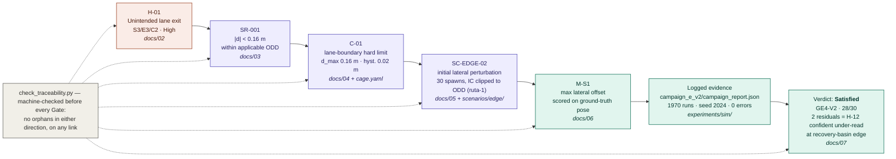
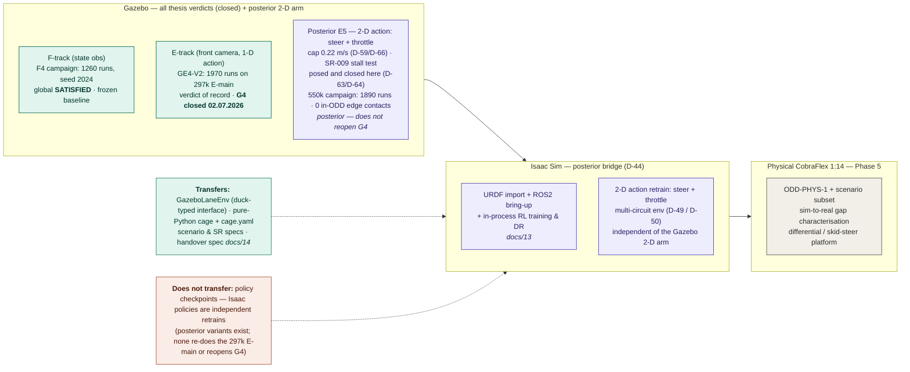

# Capítulo 8 — Evaluación Experimental (Campaña de Validación)

<!--
Estado: G4 CERRADO (02.07.2026), actualizado con evidencia posterior E5 a
31.07.2026. GE4-V2 sigue siendo el veredicto de récord; §8.9.6 es un probe SAC
de cinco escenarios, no una nueva campaña de veredicto. El brazo posterior de
acción 2-D vive en §8.9.7 (SC-PERT-03 ejecutado y cerrado, D-63/D-64), §8.9.8
(campaña margin022, D-65) y §8.9.9 (campaña sobre la policy PPO 550k, cerrada el
31.07.2026: 1890 runs, `NOT SATISFIED` literal reconciliable, 0 contactos in-ODD
en enforcement — D-66). Nada de ello altera las cifras ni los veredictos de
§8.1–§8.9.5, ni reabre G4; el veredicto de récord sigue siendo GE4-V2 mientras no
se decida explícitamente lo contrario.
Extensión objetivo: 14–18 páginas.
Convención (igual que el Capítulo 7):
  [BORRADOR D5X]    → prosa de metodología/diseño, fijable ya (no depende de
                      resultados); escrita en F4 al abrir la campaña.
  [COMPLETAR FASE 4]→ depende de los resultados medidos de la campaña
                      (tablas por escenario, veredictos por SR, deltas
                      enforcement-vs-monitoring, figuras).
  [PULIDO FASE 6]   → retoque estilístico al cierre.

Artefacto L2′ del V-Model adaptado: la scenario library como instrumento de
validación. La campaña ejecuta los escenarios de `docs/05_scenario_library.md`
con las métricas de `docs/06_metrics_catalogue.md` y puebla la matriz de
trazabilidad de `docs/07_traceability_matrix.md`.

Insumos normativos (no duplicar; citar):
  - Escenarios:  docs/05_scenario_library.md  (+ scenarios/*/*.yaml)
  - Métricas:    docs/06_metrics_catalogue.md  (+ docs/data/metrics.csv)
  - Trazabilidad:docs/07_traceability_matrix.md
  - SRs/Hazards: Capítulo 4 (HARA, SRS)
  - Cage:        Capítulo 5 (Cage Specification)
  - Policy:      Capítulo 7 (Training Specification)
-->

## 8.1 Introducción del capítulo  [BORRADOR D56]

Este capítulo presenta la **campaña de validación experimental** del sistema:
la ejecución sistemática de la *scenario library* (Capítulo 4 / `docs/05`) sobre
el pipeline policy + cage construido en las fases anteriores, midiendo las
métricas de `docs/06` y poblando con ellas la matriz de trazabilidad de
`docs/07`. Es el artefacto **L2′** del V-Model adaptado: el lazo de verificación
que cierra cada Safety Requirement contra evidencia logueada.

Mientras los Capítulos 5 y 7 *especificaron* la cage y la policy, este capítulo
*verifica* su comportamiento conjunto. La pregunta rectora no es "¿conduce bien
la policy?" —eso se estableció como línea base en §7.5— sino **"¿qué seguridad
añade la cage, de forma medible y trazable, frente a la policy sola?"**. La
respuesta es el resultado experimental central de la tesis y se obtiene mediante
la comparación **enforcement vs monitoring** (§8.2.2, §8.6).

El capítulo se estructura así. La sección 8.2 fija la metodología experimental:
los ejes de comparación, el contraste enforcement-vs-monitoring, la capa del
sistema que cada familia de escenarios estresa, las métricas y reglas de
veredicto, y el análisis estadístico. Las secciones 8.3–8.5 reportan los
resultados por familia de escenarios (nominal, límite, perturbado). La sección
8.6 cuantifica la contribución causal de la cage. La sección 8.7 presenta la
matriz de trazabilidad poblada. La sección 8.8 discute hallazgos, limitaciones y
amenazas a la validez. La sección 8.9 reporta el brazo de cámara del track 'E'
(campaña GE4) como contraste de control frente al *baseline* ground-truth. La
sección 8.10 articula la transición al Capítulo 9 (despliegue físico, Fase 5).

---

## 8.2 Metodología experimental  [BORRADOR D56]

### 8.2.1 Diseño de la campaña

La campaña evalúa **11 escenarios** (3 nominales SC-NOM, 5 límite SC-EDGE, 3
perturbados SC-PERT; `docs/05`) a lo largo de **dos ejes de comparación**:

- **Controlador:** la policy RL de Fase 3 (checkpoint `cobraflex_ppo_lane`, §7.5)
  frente al baseline **PD** de Fase 2 (§6.6). Ambos consumen el mismo estado
  abstracto y el mismo pipeline, de modo que la comparación aísla el efecto del
  controlador.
- **Modo de la cage:** **enforcement** (la cage corrige la acción) frente a
  **monitoring** (la cage observa y registra qué *habría* corregido, pero deja
  pasar la acción cruda). Este eje aísla el efecto de la cage (§8.2.2).

Cada escenario fija condiciones iniciales, perturbaciones, criterio de
terminación, métricas primarias y criterios de paso por-run y por-escenario
(plantilla en `docs/05`). El número de runs por modo está dimensionado para
validez estadística (de 20 a ≥100 según el escenario). La campaña ejecutada
suma **1260 runs** (roll-up en `experiments/sim/campaign/campaign_report.json`):
los **11 escenarios verdict-bearing** más los **6 frontier**, cada uno en ambos
modos. El controlador es la **policy RL** (no se re-ejecuta el baseline PD en esta
campaña; la referencia PD proviene de Fase 2 / §7.5 sobre el mismo pipeline).

> **Política de semillas (D-36).** El veredicto D-29/D-30 lo **certifica la semilla
> principal 2024** —la elegida en §7.5.3 por mejor recompensa y salud PPO entre las
> N = 5 entrenadas—, no un agregado de las cinco: agrupar semillas de comportamiento
> distinto en un mismo `fraction_pass` mezclaría poblaciones y podría arrastrar un
> escenario SR-CL-A bajo su umbral, vetando el veredicto global por una propiedad de
> *una* semilla (D-30). La **bimodalidad** de §7.5.3 (**4/5 *constraint-respecting*,
> 1/5 *cage-dependent***) no se descarta: se reporta donde es discriminante —en el
> **contraste frontier** (D-35, §8.6), que evalúa por-semilla la semilla principal
> 2024 *y* la *cage-dependent* 123 para medir el valor protector de la cage—, pero
> nunca se funde en la agregación D-30 que cierra G4.

### 8.2.2 Modos enforcement vs monitoring — el test causal de la cage

El núcleo metodológico de la tesis es que la contribución de la cage debe
**medirse**, no postularse. Para ello, cada escenario se ejecuta en dos modos
sobre el **mismo** controlador y las **mismas** semillas/condiciones:

- **Enforcement:** `cmd = cage.step(state, raw_action)` — la acción aplicada es
  la corregida. Es el modo de despliegue.
- **Monitoring-only:** se aplica la acción **cruda** de la policy; la cage corre
  en paralelo y registra qué reglas *habrían* disparado y qué corrección
  *habría* aplicado, sin actuar.

La diferencia en las métricas de seguridad entre ambos modos **es** la
contribución causal de la cage. La métrica decisiva es **M-S2** (violaciones de
frontera, `|d| > d_max`): por diseño debe ser **0 en enforcement** (la cage lo
garantiza), mientras que en monitoring refleja lo que la policy sola habría
producido. Un delta `M-S2(monitoring) − M-S2(enforcement) > 0`, estadísticamente
significativo, es la evidencia directa de que la cage previene violaciones que
de otro modo ocurrirían (`docs/06` M-S2 note).

Este diseño responde de raíz a la pregunta de defensa "si la policy es buena, ¿de
qué sirve la cage?" (cf. §7.5.2): en nominal el delta puede ser nulo (la policy
se basta), pero en los escenarios límite y perturbados —donde la policy se acerca
a la frontera— el delta materializa el valor protector de la cage.

### 8.2.3 Capa del sistema evaluada — dinámica vs proxy de percepción

El sistema se descompone en capas
`percepción → estado → [policy + cage] → actuación → dinámica`. Esta campaña
valida el bloque **[policy + cage] + actuación + dinámica** *dado* el estado; la
capa de percepción (cámara/lidar → estado) es objeto de la Fase 5 (Capítulo 9).
En consecuencia, cada familia de escenarios estresa una capa distinta, y la
distinción se hace explícita para acotar qué afirma cada resultado:

| Familia | Capa estresada | Naturaleza |
| --- | --- | --- |
| **SC-NOM** | dinámica nominal | estado **verdadero**, operación dentro del ODD |
| **SC-EDGE-01..05** | dinámica/geometría al borde del ODD | estado **verdadero** empujado a la frontera (heading, lateral, velocidad, estado compuesto, co-activación de reglas) |
| **SC-PERT-01/02** | estimación de estado | **proxy de percepción**: ruido (`d_obs = d_true + N(0,σ)`) / latencia inyectados sobre el estado |
| **SC-PERT-03** | máquina de verificación | meta-test (inyección de fallo) de la detectabilidad de SR-009 |
| **SC-FRONT-01..06** | eficacia de la cage fuera del ODD | estado **verdadero** iniciado en/más allá de la frontera del ODD-1, donde la policy no está diseñada para recuperar; contraste **enforcement-vs-monitoring** pareado sobre M-S5 (contacto con borde de calzada), reportado aparte —no agregado al veredicto global— como medida del valor protector de la cage (§8.2.2) |

Lectura: los veredictos de seguridad se miden sobre la **pose verdadera** (salir
del carril es un hecho físico), por lo que la validación del *mecanismo* de
seguridad es sólida con estado ground-truth. Los SC-PERT-01/02 modelan el error
de percepción como ruido paramétrico del estado —un *proxy*, no un pipeline real—
y prueban la robustez de la cage a estimación imperfecta. La validación del
pipeline de percepción real y el gap sim-to-real se difieren al Capítulo 9.

### 8.2.4 Métricas y reglas de veredicto

Las métricas se definen en `docs/06` y se agrupan en performance (M-P1..M-P7),
seguridad (M-S1..M-S5), intervención (M-I1..M-I5) y cómputo (M-C1..M-C2). Cada
escenario declara sus `metrics_primary` (deciden el veredicto) y `secondary`
(se reportan). El formato estándar por métrica es mediana, media, desviación
típica y percentiles 5/95.

**Agregación y veredicto.** El veredicto por-run aplica el `pass_criterion_per_run`
del escenario; el veredicto por-escenario aplica el `pass_criterion_per_scenario`
(p.ej. "≥95 % de runs pasan"). La agregación a veredicto por-SR sigue dos reglas:

- **D-29 (recuento de runs).** Un veredicto por-SR es estadísticamente discriminante
  solo si la SR está verificada por suficientes runs por familia de escenario:
  **≥25 runs** en ≥1 familia *nominal* **y** ≥25 en ≥1 *adverse* para una **SR-CL-A**;
  **≥10 runs** en ≥1 familia para una **SR-CL-B**; una **SR-CL-C** acepta evidencia
  informal. Si el recuento no se cumple, la SR queda *insufficient_evidence*, no
  *failed*.
- **D-30 (veto).** El veredicto **global** puede leerse `SATISFIED` solo si **toda**
  SR-CL-A está satisfecha; el fallo de una sola SR-CL-A lo veta. Las SR-CL-B/C aportan
  matiz, no veto.

Una sutileza de implementación importa para leer los resultados: un veredicto
por-run **indeterminado** (`None`) —cuando el predicado del escenario referencia un
operando que el registro del run no captura— **no es un fallo**. Ambos agregadores
de la campaña lo tratan ahora idénticamente (**D-38**): tanto el *spine* unit-tested
`verdict_aggregation.py` como el runner de producción `tools/run_campaign.py`
**excluyen** el run indeterminado del denominador de la fracción de aprobados y lo
propagan como *insufficient_evidence*, nunca como fallo (antes, `run_campaign.py` lo
contaba en el denominador, colapsándolo a fallo; la divergencia se reconcilió y el
`campaign_report.json` se regeneró desde el CSV crudo de runs, sin re-ejecutar
Gazebo). Para SC-EDGE-05 y SC-PERT-03 (§8.4–§8.5) el reporte lee así
`verdict: null` y las SR afectadas (SR-009, SR-010) quedan *insufficient_evidence*,
manteniéndose **TBD** en `docs/07` —hueco de instrumentación, no FAIL. Esa distinción
es justo lo que hace significativo el cierre posterior: cuando ambos huecos se
instrumentaron, SR-010 pasó a `No satisfecha` como **negativo medido**, no como artefacto
de agregación (D-69, §8.7).

### 8.2.5 Análisis estadístico

Las comparaciones enforcement-vs-monitoring (y RL-vs-PD) usan, según el tipo de
métrica (`docs/06`):

- **Continuas** (M-P1, M-S1, …): test t de Welch para diferencia de medias +
  **d de Cohen** para tamaño de efecto; **Mann-Whitney U** si la distribución es
  marcadamente no gaussiana.
- **Binarias** (lane_exit, emergency_activated): χ² o Fisher exacto para
  muestras pequeñas.
- **Distribuciones** (duración de intervención M-I3): Kolmogorov-Smirnov de dos
  muestras.

Umbral de significación: **p < 0.05** para las comparaciones primarias, **p <
0.01** para cualquier afirmación de efecto fuerte. Los tamaños de efecto se
reportan junto a los p-valores para evitar leer significación estadística como
relevancia práctica.

> **Dónde aplica la inferencia (y dónde es degenerada).** El contraste
> enforcement-vs-monitoring **dentro del ODD** resultó **degenerado** para la
> métrica decisiva: `M-S2 = 0` en *ambos* modos en los 11 escenarios
> verdict-bearing (§8.3–§8.5), de modo que el delta no tiene varianza y un test
> sobre él no está definido (no hay diferencia que contrastar — la policy principal
> no se acerca a la frontera). La afirmación in-ODD es por tanto **descriptiva**
> (cero violaciones en ambos modos, con sus N), no inferencial. Los tests de esta
> sección se aplican donde *sí* hay variación: (i) el **contraste frontier** sobre
> M-S5 / tasa de contacto y excursión máxima (§8.6), donde χ²/Fisher sobre la
> reducción de contacto y Welch/Mann-Whitney sobre la excursión cuantifican el valor
> de la cage fuera del ODD; y (ii) el contraste de **suavidad SR-006** (tasa de
> steering comprometida), donde enforcement mantiene el bound (559/559) frente a
> monitoring (67.6 %). Reportar un p-valor sobre un delta idénticamente nulo sería
> teatro estadístico; se declara la degeneración en lugar de fabricar significación.

### 8.2.6 Reproducibilidad

Cada run registra sus metadatos de reproducibilidad (commit git, hash de
`cage.yaml`, hash del checkpoint, hash del YAML de escenario, seed, timestamp,
modo) bajo `experiments/sim/campaign/runs/<run_id>/` (con `metadata.json`,
`summary.json` y `cage_status.csv` por run). La campaña la orquesta el *campaign
runner* `tools/run_campaign.py`, que conduce el ejecutor Gazebo
(`eval_scenario_batch.launch.py`, con aislamiento `GZ_PARTITION`, reaping de
procesos huérfanos, reintentos y *resume*), recorre el grid (escenario × modo ×
semilla), agrega por-(escenario, modo) → por-SR → global, y emite
`campaign_report.json` + `campaign_runs.csv`. La convención de `run_id` es
`camp_<scenario>_<controller>_seed<seed>_<mode>_rep<NN>`.

---

## 8.3 Resultados — Escenarios nominales (SC-NOM)

Verifica que el sistema opera dentro del ODD. SC-NOM-01 (recta) ya tiene su
evaluación de referencia en §7.5 (run `rl_eval_2024_200k_4k4` vs PD
`ros_run_20260523T153003Z`); aquí se completa con SC-NOM-02 (curva) y SC-NOM-03
(circuito completo), en ambos modos. El umbral de seguridad es `d_max = 0.16 m`
(SR-001).

| Escenario | Modo | n | media \|d\| (mm) | max \|d\| (mm) | M-I1 (%) | M-S2 | M-S3 (%) | Veredicto |
| --- | --- | --: | --: | --: | --: | --: | --: | --- |
| SC-NOM-01 | enforcement | 50 | 10.1 | 23.5 | 0.00 | 0 | 0 | **PASS** (50/50) |
| SC-NOM-01 | monitoring  | 50 | 10.1 | 23.4 | 0.00 | 0 | 0 | **PASS** (50/50) |
| SC-NOM-02 | enforcement | 50 | 10.3 | 22.1 | 0.16 | 0 | 0 | **PASS** (50/50) |
| SC-NOM-02 | monitoring  | 50 | 10.3 | 22.1 | 0.15 | 0 | 0 | **PASS** (50/50) |
| SC-NOM-03 | enforcement | 25 | 10.4 | 23.5 | 0.00 | 0 | 0 | **PASS** (25/25) |
| SC-NOM-03 | monitoring  | 25 | 10.4 | 23.4 | 0.00 | 0 | 0 | **PASS** (25/25) |

Los tres escenarios pasan al 100 % en ambos modos. La desviación lateral máxima
(`max |d| ≈ 22–24 mm`) se mantiene en torno a **un séptimo** del umbral de
0.16 m, con `M-S2 = 0` (cero violaciones de frontera) y `M-S3 = 0` (cero paros de
emergencia). La tasa de intervención M-I1 es **prácticamente nula** (≤ 0.16 %):
la policy RL principal (seed 2024) conduce dentro del carril sin necesitar a la
cage. Coherente con §7.5 (la policy es *constraint-respecting*, |ey| ≈ 10 mm
frente a ≈ 23 mm del PD), el delta **enforcement-vs-monitoring es nulo** en
nominal: la cage es **latente** porque no hay nada que corregir. SR-001/002/003/
004/008 quedan satisfechos en su porción nominal.

---

## 8.4 Resultados — Escenarios límite (SC-EDGE)

Estresan la dinámica/geometría al borde del ODD: SC-EDGE-01 (heading inicial),
SC-EDGE-02 (lateral inicial), SC-EDGE-03 (pulso de velocidad), SC-EDGE-04 (estado
compuesto → posible C-05), SC-EDGE-05 (matriz de co-activación de reglas, SR-010).

| Escenario | Modo | n | max \|d\| (mm) | M-I1 (%) | M-S2 | Veredicto |
| --- | --- | --: | --: | --: | --: | --- |
| SC-EDGE-01 | enf / mon | 30 / 30 | 20.7 / 20.6 | 0.71 / 0.69 | 0 | **PASS** (30/30) |
| SC-EDGE-02 | enf / mon | 30 / 30 | 117.2 / 117.2 | 0.09 / 0.07 | 0 | **PASS** (30/30) |
| SC-EDGE-03 | enf / mon | 25 / 25 | 20.2 / 20.5 | 2.00 / 1.33 | 0 | **PASS** (25/25) |
| SC-EDGE-04 | enf / mon | 30 / 30 | 80.7 / 80.7 | 1.24 / 1.24 | 0 | **PASS** (30/30) |
| SC-EDGE-05 | enf / mon | 100 / 100 | 20.2 / 20.2 | 0.00 / 0.00 | 0 | **indeterminado** (ver nota) |

**SC-EDGE-01..04 pasan al 100 %** en ambos modos. La intervención M-I1 sube
respecto a nominal pero permanece baja (≤ 2 %), y `M-S2 = 0` en todos los runs:
incluso con la condición inicial empujada a la frontera —offset lateral de hasta
117 mm en SC-EDGE-02, estado compuesto en SC-EDGE-04 con `max |d| ≈ 81 mm`— la
policy recupera y el sistema se mantiene dentro del carril, por debajo del umbral
de 0.16 m. SR-002 (heading), SR-004 (velocidad), SR-005 (modo de emergencia para
estado compuesto) y SR-011 (estabilidad de heading sin oscilación sostenida)
quedan satisfechos.

**SC-EDGE-05 (co-activación de reglas, SR-010) es indeterminado, no un fallo — y
con un matiz importante.** Su `pass_criterion_per_run` referencia dos contadores
específicos del escenario —`joint_envelope_assertion_failures` e
`inter_cycle_oscillations`— que **no existen en el esquema actual del registro de
runs**, así que el veredicto por-run queda en `None`. Pero hay un problema más
fundamental: el escenario **as-run no indujo co-activación alguna** — **0
intervenciones en los 100 runs**, el vehículo condujo nominal (`max |d| ≈ 20 mm`,
`M-S2 = 0`), mientras que SC-EDGE-04 (estado compuesto) sí dispara C-06 56 veces de
referencia. La causa es que las condiciones iniciales del `parameterised_grid`
—que deben sembrar estados donde ≥2 reglas coactivan— **no se inyectan en el
runner**. Por tanto SR-010 **no puede verificarse desde estos logs** ni siquiera
añadiendo los contadores: primero hay que **cablear la inyección de IC del grid**
para que el escenario realmente estrese la co-activación, y luego re-correr con los
dos contadores en el registro. SR-010 se mantiene **TBD** (no FAIL) *en este brazo*; el
trabajo es de runner + re-run (Ubuntu), no solo de instrumentación. Ese trabajo se hizo:
con la inyección de IC cableada, SC-EDGE-05 sí induce co-activación y SR-010 acaba
cerrando como **`No satisfecha`** —el único negativo reportado de la matriz (§8.7, D-69).

---

## 8.5 Resultados — Escenarios perturbados (SC-PERT)

Prueban la robustez a error de estimación de estado (proxy de percepción) y la
detectabilidad de la verificación. SC-PERT-01 (ruido gaussiano sobre el offset
lateral, σ ∈ {0.01, 0.03, 0.05} m), SC-PERT-02 (latencia), SC-PERT-03 (test
negativo de stall, SR-009).

**SC-PERT-01 — ruido de observación (proxy de percepción).** Desglose por nivel
de ruido (idéntico en ambos modos, porque la cage no interviene en los runs que
fallan):

| σ (m) | n | pass | trips de emergencia | criterio por-run |
| --: | --: | --: | --: | --- |
| 0.01 | 20 | 20 | 0 | `M-S1 < 0.16 ∧ ¬emergency` |
| 0.03 | 20 | 20 | 0 | idem |
| 0.05 | 20 | 13 | 7 | idem |

A σ = 0.01 y 0.03 m el escenario pasa al 100 %. A σ = 0.05 m caen **7/20 runs**,
y el conjunto baja a **53/60 = 0.883**, por debajo del umbral por-escenario de
0.90 → SC-PERT-01 **no pasa**. La causa es precisa y vale la pena leerla con
cuidado: los 7 fallos **no son violaciones de frontera** sino **paros de
emergencia** (`emergency == True`) que la cage dispara ante observaciones
ruidosas que *parecen* excursiones. La desviación lateral **verdadera** en esos
runs se mantiene minúscula (`max |d| ≤ 0.034 m`, muy por debajo de 0.16 m). Es
decir, bajo ruido alto la cage se vuelve **conservadora**: sacrifica
disponibilidad (paros espurios) para no arriesgar seguridad, y la seguridad real
se preserva. Este es un comportamiento defendible —*fail-safe*— pero documenta un
**coste de disponibilidad** en el borde del ODD de ruido, que se reporta como
limitación y conecta con la SR-006 (ver §8.7, nota ¹).

**SC-PERT-02 — latencia.** Pasa al 100 % (40/40 en ambos modos), con `M-I1 = 0`,
`M-S2 = 0` y `max |d| ≈ 20 mm`: la validez/frescura de estado (SR-007, vía
disparadores de C-05) se mantiene bajo la latencia inyectada. SR-007 satisfecho.

**SC-PERT-03 — meta-test de stall (SR-009) — indeterminado, no fallo.** Es un test
de **inyección de fallo de dos brazos** (policy *released* vs variante *stall*) que
verifica que la maquinaria de SR-009 *detecta* un stall inducido (M-P6 alto en la
variante, M-P6 = 0 en la released). En la campaña F, el **brazo stall-variant no
se ejecutó** (los 40 runs logueados son un solo brazo) y el driver de entonces no
agrupaba ambos brazos antes de puntuar, por lo que los runs quedaron `None`. La
liveness **nominal** sí está
verificada y pasa (SC-NOM-01/02/03, M-P6 = 0, M-P2 = 1). Por tanto SR-009 se
mantiene **TBD** en ese brazo, no FAIL. Como trabajo posterior, el protocolo 2-D
preregistrado (`lambda_stall = 4.0`, 50k, `M-P6 > 50.0`, 20 runs por brazo/modo,
agregación por brazo y encadenado de hashes) **sí se ejecutó** en Gazebo sobre la
acción 2-D: 80 celdas, más el cierre metrológico con un estímulo *scripted* de
parada total (§8.9.7, D-63/D-64). Ese resultado es **posterior** y no modifica el
veredicto F-track de esta sección, que se mantiene TBD tal como se cerró. El veredicto
**de la SR**, en cambio, sí se cierra más tarde —Satisfecha, puntuada fuera de banda sobre
la metrología del stall guionizado (M-P6 = 100.0 ante una parada real; D-64/D-69, §8.7)—,
sin re-puntuar este brazo.

---

## 8.6 La contribución de la cage: enforcement vs monitoring

Análisis transversal y **resultado central de la tesis**: el delta de seguridad
entre monitoring y enforcement —sobre el mismo controlador, semilla y
condiciones— cuantifica qué previene la cage (§8.2.2). El hallazgo tiene dos
mitades, separadas por la frontera del ODD.

**Dentro del ODD (SC-NOM/EDGE/PERT): la cage es latente.** En los 11 escenarios
verdict-bearing, `M-S2 = 0` en **ambos** modos, en **todos** los runs. La policy
principal (seed 2024) es *constraint-respecting* (§7.5.3): no se acerca a la
frontera, de modo que no hay violación que monitoring revele ni que enforcement
prevenga. El **delta enforcement-vs-monitoring es nulo en M-S2** en todo el set
in-ODD. Esto responde de raíz a la pregunta de defensa "si la policy es buena,
¿de qué sirve la cage?" (§7.5.2): dentro del ODD la respuesta honesta es que
*esta* policy no la necesita **para no salirse**, y el experimento lo **mide** en
lugar de postularlo.

Hay, no obstante, un valor in-ODD que sí es medible: la **suavidad de actuación**
(SR-006, C-06). La tasa por-ciclo del steering comprometido se mantiene en el bound
`δ_max = 0.15` en **559/559** runs de enforcement, frente a solo **67.6 %** en
monitoring (peor tasa 0.43) — la policy cruda emite cambios bruscos que el rate
limiter absorbe (D-39, §8.7). Es un delta enforcement-vs-monitoring **no nulo**
dentro del ODD, pero sobre *suavidad/desgaste de actuador*, no sobre prevención de
violación de frontera. (Análogamente, bajo ruido alto —SC-PERT-01, §8.5— la cage
interviene más en monitoring; pero eso es disponibilidad.)

**Fuera del ODD (frontier, D-35): la cage protege.** El valor protector se mide
donde la policy *no* está diseñada para recuperar: los escenarios SC-FRONT-01..06,
iniciados en/más allá de la frontera del ODD-1, como contraste pareado
enforcement-vs-monitoring sobre **M-S5** (contacto con el borde de calzada),
reportado fuera del veredicto global (D-35). El contraste se ejecuta por-semilla
sobre la principal 2024 y la *cage-dependent* 123 (§7.5.3). Para la **seed 123**
(`frontier_contrast.json`):

| Escenario | contacto monitoring | contacto enforcement | reducción de contacto | reducción de excursión (mediana, m) |
| --- | --: | --: | --: | --: |
| SC-FRONT-01 | 1.00 | 0.00 | **1.00** | 0.101 |
| SC-FRONT-02 | 0.12 | 0.00 | 0.12 | 0.246 |
| SC-FRONT-03 | 1.00 | 0.00 | **1.00** | 0.121 |
| SC-FRONT-04 | 1.00 | 0.00 | **1.00** | 0.120 |
| SC-FRONT-05 | 0.00 | 0.00 | 0.00 | 0.210 |
| SC-FRONT-06 | 0.96 | 0.00 | **0.96** | 0.120 |

Para la policy *cage-dependent*, la cage **elimina el 96–100 % de los contactos
con el borde** que la policy desnuda incurriría (SC-FRONT-01/03/04/06) y reduce la
excursión máxima en 0.10–0.25 m. Para la **seed 2024** (*constraint-respecting*),
en cambio, el beneficio es **≈ 0**: contacto 0.00 en ambos modos y reducción de
excursión nula —la policy recupera por sí sola incluso fuera del ODD—. Figuras
`fig_frontier_cage_benefit.png` y `fig_frontier_excursion.png`.

**Lectura conjunta.** La bimodalidad de §7.5.3 (4/5 *constraint-respecting*, 1/5
*cage-dependent*) se materializa en runtime: la cage es **la red de seguridad que
importa precisamente para la policy que la necesita y más allá del dominio donde
la policy fue entrenada**. Esto cierra el arco con la co-adaptación de §7.4 (la
intervención del cage decreció durante el entrenamiento): el cage participó
causalmente en *producir* una policy que no lo necesita en nominal, y sigue siendo
la garantía *donde la policy no se basta*. La afirmación de la tesis no es "la cage
corrige a una policy mala en todo momento", sino la más defendible y medida: **la
cage es una garantía cuyo valor es nulo cuando la policy respeta las restricciones
y decisivo cuando no, o cuando el sistema sale de su ODD**.

---

## 8.7 Matriz de trazabilidad poblada

Cierre de la cadena `Hazard → SR → Cage Rule → Scenario → Metric → Evidence →
Verdict`. La versión poblada con veredictos se *reporta* aquí y se *mantiene* en
`docs/07` (evidencia: `experiments/sim/campaign/campaign_report.json`). El
**veredicto global es `SATISFIED`**: las **7 SR-CL-A** (SR-001..005, 007, 008)
están satisfechas con margen, por lo que el veto D-30 no se dispara.

| SR | Clase | Escenario(s) | Métrica(s) | Veredicto (Sim) |
| --- | --- | --- | --- | --- |
| SR-001 | CL-A | SC-NOM-01/02, SC-EDGE-02 | M-S1 | **Satisfied** |
| SR-002 | CL-A | SC-EDGE-01/04 | M-P4 | **Satisfied** |
| SR-003 | CL-A | SC-NOM-02, SC-EDGE-01 | M-S4 | **Satisfied** |
| SR-004 | CL-A | SC-NOM-02, SC-EDGE-03 | M-P3 | **Satisfied** |
| SR-005 | CL-A | SC-EDGE-04 | M-S3 | **Satisfied** |
| SR-007 | CL-A | SC-PERT-02 | M-S3 | **Satisfied** |
| SR-008 | CL-A | SC-NOM-03, SC-EDGE-04 | M-S3 | **Satisfied** |
| SR-011 | CL-B | SC-EDGE-01/04 | M-P7 | **Satisfied** |
| SR-006 | CL-B | (todos) | M-I5 | **Satisfied ¹** |
| SR-009 | CL-B | SC-NOM-01/02/03, SC-PERT-03 | M-P6 | **TBD ²** |
| SR-010 | CL-B | SC-EDGE-04, SC-EDGE-05 | M-S2, M-I3 | **TBD ³** |

SR-006 cierra sobre su propia métrica (nota ¹, D-39); **dos** SR-CL-B quedan en TBD
—abstenciones deliberadas, no fallos, que no vetan el veredicto global (D-30). *(Estado
del brazo F, congelado. Ambas abstenciones se cierran el 31.07.2026 sobre evidencia
posterior: SR-009 Satisfecha fuera de banda, SR-010 `No satisfecha` — D-69, final de §8.7.)*

- **¹ SR-006 (suavidad de actuación) — Satisfied (D-39).** La agregación
  `ALL`-escenarios hacía heredar a SR-006 el fallo de SC-PERT-01 (trips de
  emergencia por ruido, ajenos a la suavidad), así que se puntúa **directamente sobre
  su métrica**. La cadena corre C-06 primero (acota la tasa del raw); las reglas de
  seguridad downstream (C-01/C-02/C-03/C-05) pueden aplicar después una corrección
  mayor para evitar un hazard —la suavidad cede ante la seguridad por diseño. En los
  pasos que el rate limiter gobierna (sin override de seguridad), la tasa por-ciclo
  del steering comprometido se mantiene en `δ_max = 0.15` en **559/559** runs
  evaluables de enforcement (peor tasa exactamente 0.15); en *monitoring* (C-06
  inerte) solo el 67.6 % cumple (peor tasa 0.43) — medida directa del valor de C-06.
  Análisis: `tools/sr006_smoothness.py`. (Re-apuntar SR-006 a esta métrica en
  `run_campaign.py` es un follow-up; no cambia el veredicto global, CL-B.)
- **² SR-009 (liveness) — necesita ejecución nueva.** Liveness nominal verificada y
  satisfecha; el registro F lo arrastra SC-PERT-03, meta-test de dos brazos. La
  infraestructura posterior ya prepara el fine-tune único, puntúa y agrega ambos
  brazos independientemente; faltan el parent 0.22 cualificado, el preflight D-43
  ligado a su hash y la ejecución Gazebo. No es un fallo de liveness.
- **³ SR-010 (composición de reglas) — necesita arreglo de escenario + re-run.**
  SC-EDGE-04 pasa; SC-EDGE-05 **no indujo co-activación alguna** (0 intervenciones en
  100 runs, conducción nominal) porque las IC de `parameterised_grid` no se inyectan
  en el runner, y sus dos contadores no están en el esquema de registro (§8.4). No es
  un fallo de composición.

**Resolución al cierre de G4 (02.07.2026, docs/07).** Los dos TBD del brazo F quedan
como **abstenciones documentadas y no-vetantes** (D-30), pero ambos quedaron
*materialmente* respondidos por el track 'E': el brazo stall de SR-009 es **N/A por
construcción** para el espacio de acción solo-dirección que comparten ambos tracks
(M-P6 ≡ 0; la inyección de reward de SC-PERT-03 es inerte — D-49). La extensión
posterior 2-D de Gazebo hizo el test ejecutable y **se corrió** (§8.9.7,
D-63/D-64), después del cierre de G4 y sin reabrirlo; Isaac queda como réplica de
backend separada. La
pregunta de co-activación de SR-010 la
respondió el grid de SC-EDGE-05 **cableado en GE4-V2** (30/85 breaches in-ODD, hallazgo
CL-B genuino, §8.9). `tools/check_traceability.py` confirma que no quedan SRs huérfanos
a ningún lado.

**Cierre definitivo de ambos TBD (31.07.2026, D-69; §8.9.9).** Tras la última campaña de
simulación previa al despliegue físico, `docs/07` **ya no registra ningún `TBD` en la
columna de simulación**, y los dos veredictos pendientes se cierran en direcciones
opuestas —lo cual es el punto—:

- **SR-009 → Satisfecha**, puntuada *fuera de banda* sobre su propia metrología (D-64), no
  por agregación de campaña: la liveness nominal pasa en todos los brazos (M-P6 = 0), la
  policy **resiste** ser forzada a detenerse (el piloto de objetivo puro-stall no produjo un
  *staller*) y el detector **sí dispara** ante una parada real inyectada por guion
  (**M-P6 = 100.0**). Mitigación que funciona, patología resistida, métrica sana.
- **SR-010 → `No satisfecha`**, el único veredicto negativo de la matriz. Cerrado el hueco
  de escenario, el requisito se midió sobre dos policies y **falla su propio criterio**
  (`M-S2 = 0` no se cumple): 30/85 puntos de grid in-ODD con breach de M-S1 en el brazo 1-D
  y **16/85** en el 2-D, concentrados en la co-activación **C-01 ∧ C-02** (15/20 fallos,
  11 breaches) y nulos donde no hay conflicto lateral/rumbo (C-04 ∧ C-06: 0/20). Entrenar
  mejor lo **reduce a la mitad sin cambiarlo de naturaleza**: la arbitración bajo activación
  simultánea es una propiedad de **diseño de la cage**, no un defecto de la policy. Es CL-B y
  no vetante (D-30), y se declara como trabajo futuro (**T4**).

Mantener el TBD habría sido cómodo, no honesto: el instrumento que faltaba ya existe en
ambos casos. Nada de esto reabre G4, que cerró sobre F4 + GE4-V2 sin depender de ninguna de
las dos abstenciones.

**Figura 8.1 — La cadena de trazabilidad instanciada de punta a punta sobre un
caso real cerrado.** El compromiso definitorio de la tesis —`Hazard → SR →
Cage Rule → Scenario → Metric → Logged Evidence → Verdict`— materializado con
los artefactos del requisito más importante, sobre el brazo E (GE4-V2,
veredicto de récord): SC-EDGE-02 con las condiciones iniciales recortadas al
ODD por la ruta-1 pasa 28/30, y los 2 residuos son el *under-read* confiado
del estimador CV (D-43/H-12) en el borde de la cuenca de recuperación. Cada
eslabón es un ID en un artefacto Markdown versionado, verificado sin huérfanos
por `check_traceability.py` antes de cada Gate.

---

## 8.8 Discusión y amenazas a la validez

### 8.8.1 Lectura de los resultados

La campaña (1260 runs, seed principal 2024) cierra con **veredicto global
`SATISFIED`**: las 7 SR-CL-A satisfechas con margen —la desviación lateral máxima
se mantuvo en torno a 1/7 del umbral de 0.16 m en nominal y por debajo de él
incluso en los escenarios límite—, y SR-011 también satisfecha. Dos SR-CL-B
(SR-009/SR-010) quedan en TBD por abstención (huecos de instrumentación, resueltos
materialmente en el track 'E': D-49 y el grid V2, §8.7), no por fallo de seguridad —y
cerradas ya de forma definitiva, una Satisfecha y la otra `No satisfecha`, al final de §8.7.

El resultado se lee en dos planos:

(i) **Qué añade la cage y dónde.** Dentro del ODD la cage es **latente**:
`M-S2 = 0` en ambos modos y delta enforcement-vs-monitoring nulo, porque la policy
principal —*constraint-respecting* (§7.5.3)— no se acerca a la frontera. Su valor
protector se **mide** fuera del ODD: en el contraste frontier, sobre la policy
*cage-dependent* (seed 123), la cage **elimina el 96–100 % de los contactos con el
borde de calzada** que la policy desnuda incurriría (§8.6), mientras que sobre la
seed 2024 el beneficio es ≈ 0 porque la policy recupera sola. La cage no es un
corrector permanente sino una **garantía cuyo valor es nulo cuando la policy
respeta las restricciones y decisivo cuando no, o fuera del ODD**.

(ii) **Relación policy–cage.** Lectura conjunta con §7.5.2–§7.5.3: 4/5 semillas
aprendieron comportamiento *constraint-respecting* y degradarían con gracia sin
cage en nominal, mientras la seed 123 quedó *cage-dependent* —una dependencia ya
**observada**, no hipotética—. La curva de co-adaptación de §7.4 (la intervención
del cage decreciendo durante el entrenamiento) y el delta de §8.6 (la protección
en runtime) son las dos caras de la misma evidencia: el cage participó
causalmente en *producir* la policy y la protege *donde la policy no se basta*.

(iii) **El coste de la conservadurismo bajo ruido.** SC-PERT-01 a σ = 0.05 m
expone el único modo de degradación observado: la cage dispara paros de emergencia
espurios ante observación ruidosa (7/20 runs), preservando la seguridad real
(`|d|` verdadero ≤ 0.034 m) a costa de disponibilidad. Es comportamiento
*fail-safe*, pero acota el borde del ODD de ruido y motiva trabajo futuro sobre la
robustez del disparador de validez de estado (C-05) a ruido de percepción.

### 8.8.2 Amenazas a la validez  [BORRADOR D56]

Las fronteras del estudio se declaran de forma explícita (cf. §1.6.3),
organizadas por tipo de validez:

- **De constructo — qué se valida realmente.** La campaña valida el bloque
  `[policy + cage]` en el **espacio de estado** donde la cage está especificada,
  con estado *ground-truth*. **No valida la capa de percepción**: los escenarios
  SC-PERT-01/02 modelan el error de percepción como **ruido paramétrico inyectado
  sobre el estado** (un *proxy*, no un pipeline de visión real; §8.2.3). En
  consecuencia, las afirmaciones de seguridad se refieren al mecanismo de la cage
  *dado un estimado de estado*, no al sistema percepción-a-actuación completo. No
  obstante, los veredictos de SR se miden sobre la pose **verdadera**, por lo que
  la propiedad evaluada (no salir del carril) es físicamente significativa.
  Análogamente, el control es **lateral a velocidad fija**: la regla de velocidad
  C-04 se ejercita por perturbación inyectada (SC-EDGE-03), no por conducta
  longitudinal de la policy.

- **Interna — atribución de los efectos.** El contraste
  enforcement-vs-monitoring sobre el **mismo** controlador, semillas y condiciones
  (§8.2.2) aísla el efecto de la cage; el análisis estadístico (§8.2.5) acota su
  significación y tamaño. Las fuentes de varianza controladas son la
  estocasticidad entre semillas de la policy (mitigada con N ≥ 5) y la de la
  propia simulación.

- **Externa — generalización.** Los resultados son específicos de **una
  geometría** (óvalo R = 0.8 m) y **una plataforma** (CobraFlex 1:14). La
  generalización a otras geometrías o vehículos no se establece empíricamente; se
  argumenta por plausibilidad estructural —las reglas de la cage atacan
  invariantes geométricos del lane-following, no propiedades de una pista
  concreta—.

- **Sim-to-real.** Todo este capítulo es simulación **en Gazebo**, que es el
  entorno principal y portador del veredicto de esta tesis; sus resultados se
  reportan como **evidencia principal provisional**. El gap hasta la plataforma
  física —incluida la capa de percepción omitida aquí— se caracteriza en el
  Capítulo 9 (adaptación A5) en peldaños de fidelidad creciente: se introduce un
  **puente de mayor fidelidad en Isaac Sim** (PhysX + RTX, D-44) como herramienta
  para estrechar el gap antes del hardware. Por ahora la evidencia de Isaac se
  conserva para valoración interna (un checkpoint de Gazebo no transfiere a Isaac:
  exige re-entrenamiento y re-evaluación); si esa campaña madura como resultado
  más fuerte, el veredicto se re-enuncia con esas cifras. La cage, por estar
  especificada sobre el estado abstracto e **independiente de la calidad de la
  policy y de la percepción**, es el componente del que se espera la transferencia
  más fiel en cualquiera de los entornos.

---

## 8.9 Track 'E' — campaña de evaluación con cámara (GE4)  [E4]

Las secciones 8.3–8.8 evalúan el sistema sobre el **estado ground-truth** de 6
dimensiones (la policy F-track). El track 'E' sustituye esa entrada por una
**cámara frontal end-to-end**: la policy es una CNN sobre imagen y la cage lee su
**propio estimador CV de carril determinista** (D-43), manteniéndose invariantes
la cage (C-01..C-06, v0.6.1), la *scenario library* y el *spine* de veredicto. Es,
por diseño, un **brazo de control de tronco único** (D-41): la única variable que
cambia frente al baseline F4 es la fuente de percepción, de modo que el delta de
resultados *mide el coste de la percepción por cámara*. La policy es el E-main
**complex_b 297k peak** (`cobraflex_ppo_newcam_complex_b_2024_297k_peak`, §7.4/§7.5;
la campaña original corrió sobre el predecesor `cobraflex_ppo_cam_lane_2024_139k_peak`,
hoy histórico).

> **Campaña GE4 — V2 sobre el E-main 297k (28.06.2026, veredicto de récord).** La campaña
> GE4 original se ejecutó sobre el checkpoint **139k**, superado por el **complex_b 297k
> peak** (docs/11 §8). La campaña se re-ejecutó sobre 297k —primero V1, luego **V2** tras
> validar la librería de escenarios complex_b (recorte in-ODD de SC-EDGE-02, ruta-1)— y
> **V2 es el veredicto de récord** (`experiments/sim/campaign_e_v2/`; detalle en docs/11
> §8.4). Todo el §8.9 (§8.9.1–8.9.5) reporta **V2**; los números 139k que se citan quedan
> marcados como contraste histórico. Con V2, **G4 queda cerrado** (02.07.2026, docs/07).

**La campaña (V2).** Mismo runner y matriz que F4, con `--train-config
train_ppo_camera.yaml` y el checkpoint **297k**, sobre la librería complex_b completa
(28 escenarios): **1970 runs** ({enforcement, monitoring}, seed 2024), **0 errores**.
Roll-up `experiments/sim/campaign_e_v2/campaign_report.json`; desglose
`failure_mode_breakdown.json` (`tools/campaign_e_failure_modes.py`).

### 8.9.1 Veredicto global y su lectura (V2)

El **veredicto global de récord es `NOT SATISFIED`** (D-30, literal), bloqueando
**solo SR-002/003**. Y ambos fallan *únicamente* por la cláusula heredada del oval
`time_to_recovery_heading < 2.0 s` de SC-EDGE-01 (13/30; máx M-P4 = 14.4° ≤ θ_max =
25°, TTLC sin breach, M-S1 ≈ 0.035 m, 0 emergencias), satisfechos en su criterio
propio (D-47). Así que **ningún predicado de seguridad SR-CL-A se incumple**: el
global queda en `NOT SATISFIED` solo por esa cláusula de tiempo de recuperación.

**SR-001 —el requisito más importante— se cumple.** Frente a V1 (que bloqueaba
SR-001), V2 aplica **ruta-1**: la condición inicial de SC-EDGE-02 se recorta al ODD
(`[0.10, 0.1225]` m), quitando los 9/30 spawns *out-of-ODD* que SR-001 («bajo el
ODD») no debe cargar. Así SC-EDGE-02 **pasa 28/30**; el único residuo son 2 reps a
0.118/0.121 m —el borde de la cuenca de recuperación (~0.120 m), contra el borde
pintado. Ruta-1 **sola** cerró SR-001; el cambio de estimador (ruta-2b) fue
innecesario y se revirtió por regresar en lazo cerrado (D-48). **SR-012/013/014
quedan Satisfied** (cobertura D-29 cerrada por el bump de reps de SC-PERT-08/09/10).

**El invariante de seguridad in-ODD se mantiene.** En enforcement: **0 contactos de
borde in-ODD**, NOM + PERT pasan, y la cage *elimina* fallos de degradación de
percepción que la policy desnuda comete (PERT-04/09/11/12/13: enf PASS vs mon FAIL).
Los **117 contactos de borde en enforcement son out-of-ODD** (SC-FRONT-\* + puntos
OOD del grid SC-EDGE-05); el contraste F-vs-E muestra que la cage de *estado*
recuperaba esos arranques, aislando la causa en la **percepción de cámara** (coste
D-43). Figura `fig_sr001_edge02_offset.png`.

**El coste D-43 (under-read) es real pero marginal-de-borde.** Al descentrarse, el
estimador CV de la cage **sub-lee con confianza** (lee `cv_ey ≈ 0.04 m` mientras el
`ey` real → 0.30 m; `cv_ok` True, SR-014 no caza un estimado auto-consistente —
realización de **H-12**). Acotado al ODD cuesta solo los 2 breaches de borde de
SC-EDGE-02. No es parcheable barato en un solo frame (D-48); el cierre honesto es
**mejor percepción** (consistencia temporal, calibración contra oráculo o redundancia).
Los probes 2-D posteriores demuestran que reducir el cap de velocidad no elimina
el over-read de heading D-43; ampliar el espacio de acción no es una mitigación de percepción.
SR-010 es un hallazgo CL-B genuino (30/85 breaches de co-activación in-ODD).

**Preflight posterior D-43 (20.07.2026; no cambia GE4).** Un análisis offline
ligado a los hashes de checkpoint/config aplicó una ventana de vehículo centrado
(`|ey| ≤ 0.08 m`, `|epsi| ≤ 0.10 rad`) y tolerancia de desacuerdo heading de
0.40 rad, anclada sobre el máximo limpio GE2 de 0.38734 rad y por debajo de
C-02 (0.4363 rad). SAC-entfix 2024/75k y 42/50k pasan individualmente sin falsos
C-01/02/03 ni emergencias; auto-175k queda bloqueado a 0.25 y también en el probe
0.22. El stop 0.25 ocurre con verdad casi centrada (`ey=-0.035 m`,
`epsi=-0.035 rad`) pero `cv_epsi=-0.446 rad`; en el probe 0.22,
`cv_epsi=-0.547 rad` frente a verdad `+0.068 rad`. La conclusión causal es más
fuerte que “bajar velocidad”: el margen resuelve el conflicto longitudinal,
pero el falso heading es un mecanismo independiente. En un audit separado de
SC-EDGE-02/GE4-V2, el under-read lateral aparece en 3573/5784 ciclos y 27/60
runs (2/30 enforcement, 25/30 monitoring; gap máximo 0.266755 m). Es
caracterización, no token de autorización: el metadata reconstruido del E-main
carece de `train_config_hash`, por lo que el informe falla cerrado como
`INVALID` para una campaña nueva.

### 8.9.2 La cage pasa de latente a activa

El §8.6 reportó la cage **latente** dentro del ODD (M-S2 = 0 en ambos modos: la
policy F-track no se acerca a la frontera) y protectora solo fuera del ODD
(frontier). El track 'E' aporta **la mitad in-ODD que faltaba**: bajo la percepción
más ruidosa de la cámara, la **parada controlada (SR-013/Trigger-8) se vuelve el
mecanismo de seguridad operativo dentro del ODD**. El contraste pareado enf-vs-mon
lo hace inequívoco (V2):

| Escenario | enforcement | monitoring | naturaleza de los fallos de monitoring |
| --- | --: | --: | --- |
| SC-PERT-13 (degradación combinada) | **40/40 PASS** | **0/40** | **brechas reales de M-S1** (sin cage la policy degradada se sale) |
| SC-PERT-11 (marcas worn/segmentadas) | **30/30 PASS** | **0/30** | ídem |
| SC-PERT-09 (worn) · SC-EDGE-04 (heading+lateral) | **25/25 · 30/30** | **0/25 · 0/30** | ídem |
| SC-PERT-12 (degradación de imagen) | **40/40** | 23/40 (0.57) | parcial: la cage previene 17 de las salidas |

Donde F4 medía el valor de la cage solo en la frontier (la seed cage-dependent 123,
§8.6), el track 'E' lo mide **dentro del ODD** sobre la propia policy principal: bajo
degradación de percepción la cage convierte en **parada controlada** (M-S1 acotado)
lo que sin ella es una salida de carril. (SC-PERT-07/10 pasan ahora en ambos modos
25/25 — la policy 297k aguanta esos estresores sin necesitar la parada.) Figuras
`fig_cam_cage_value.png`, `fig_cam_failure_modes.png` y `fig_cam_cage_regimes.png`
(descomposición V2), y `fig_cam_cost_of_camera.png` (contraste F-vs-E por escenario,
con la cautela de que mezcla el cambio de pista con el de percepción), en
`experiments/sim/campaign_e_v2/figures/`.

### 8.9.3 Lo que se sostiene, y los huecos de instrumentación

El resto de la library se sostiene bajo la cámara (V2, enforcement): SC-NOM-01/02 1.00,
SC-NOM-03 1.00, SC-EDGE-03/04 1.00, SC-PERT-01/05/06/08/09/10 1.00, SC-PERT-11/12/13
1.00 (SC-PERT-01 incluso pasa de FAIL a PASS F4→E). El primario de plausibilidad de
SR-014 (**SC-PERT-08**, falsa línea) se cumple **25/25**: la cage rechaza la línea
falsa sin inducir excursión. Dos huecos de instrumentación de V1 quedaron **cerrados**:
**SC-PERT-05** (criterio etiquetado de dos brazos `low:/high:`) está cableado al
evaluador `labelled_arms` y puntúa 40/40; **SC-EDGE-05** quedó **determinante** (grid de
co-activación cableado), revelando 30/85 breaches in-ODD genuinos (SR-010, §8.4.2).

Solo **SC-PERT-03** queda indeterminado en la campaña de récord (per-run `None`, no fallo). Es un test
*negativo* de stall —verifica que la métrica M-P6 detecta un agente parado— que **no
aplica al espacio de acción solo-dirección**: la policy no controla throttle, no puede
converger a la inacción, así que M-P6 ≡ 0 por construcción y la inyección de reward del
escenario es inerte (D-49). Su brazo vivo de SR-009 —M-S2 bajo monitoring— sí queda
cubierto por la familia nominal. El test de stall bien-puesto se difiere a la acción
2-D posterior (D-49) y allí **se ejecutó y se cerró** —80 celdas de dos brazos más
la validación del detector con una parada *scripted*— sin tocar este veredicto
(§8.9.7, D-63/D-64); Isaac sería una réplica de backend independiente.

### 8.9.4 Matriz E-track y trabajo de cierre

| SR | Clase | Escenario(s) | Veredicto (Sim, track 'E', V2) |
| --- | --- | --- | --- |
| SR-001 (límite de carril) | CL-A | SC-NOM-01/02, SC-EDGE-02 | **Satisfied** (SC-EDGE-02 28/30; 2 residuos de borde) |
| SR-002/003 (rumbo / TTLC) | CL-A | SC-EDGE-01/04, SC-NOM-02 | **Satisfied** en criterio propio (M-P4 ≤ 25°, TTLC); bloqueo *literal* por la cláusula recovery-time ⁴ |
| SR-012 (carril con visión degradada) | CL-A | SC-NOM-01 + SC-PERT-04..13 | **Satisfied** (cobertura D-29 cerrada) |
| SR-013 (degradación segura por pérdida de percepción) | CL-A | SC-NOM-01, SC-PERT-07/13 | **Satisfied** |
| SR-014 (plausibilidad del estimador) | CL-A | SC-PERT-08 (prim.) + SC-PERT-04..13 | **Satisfied** |

⁴ Los 13/30 fallos de SC-EDGE-01 son **solo** la cláusula heredada del oval
`time_to_recovery_heading < 2.0 s` (máx M-P4 = 14.4° ≤ θ_max, TTLC sin breach, M-S1 ≈
0.035 m); en el criterio documentado de SR-002/003 se cumplen (D-47). El global
`NOT SATISFIED` *literal* descansa enteramente en esa cláusula. El bump de reps de
SC-PERT-08/09/10 (20→25) cerró el gate D-29 que dejaba SR-012/014 INCOMPLETE en V1.

**Estado de cierre GE4 (V2, hecho):** (a) reconciliación de criterio propio aplicada
(D-47 SR-002/003/011; D-39 out-of-band SR-006); (b) `labelled_arms` cableado
(SC-PERT-05); (c) IC del grid de SC-EDGE-05 inyectadas + contadores; (e) **campaña GE4
re-ejecutada sobre el E-main 297k** (V2, 1970 runs, `campaign_e_v2`); (d)
**multi-seed N=5 completo** (E5, 13.07.2026 — 5/5 entrenadas + eval nominal
enf+mon por semilla, §7.5.3: 3/5 constraint-respecting, la 666 *cage-dependent*
—la cuenca del baseline F reaparece bajo cámara— y la 23 con **interferencia
negativa cage–CV** en la sección dura, primera observada; el veredicto de récord
sigue siendo la seed 2024). SC-PERT-03 = N/A por espacio de
acción solo-dirección (D-49). El **hallazgo de tronco** se mantiene: bajo cámara la
cage **no** deja salir el sistema del carril in-ODD (0 contactos, M-S1 < d_max) —
convierte la degradación de percepción en **parada controlada**, no en excursión, y
su valor in-ODD —nulo en F4— se vuelve **medible y decisivo** (SC-PERT-13: 40/40 vs
0/40). El veredicto cierra GE4 en Gazebo con SR-001 cumplido y un único bloqueo
literal residual (la cláusula recovery-time de SR-002/003).

### 8.9.5 Línea base de control clásico con percepción real (CV + pure-pursuit)  [E4]

El baseline del F-track (Cap. 7 §7.5) es un PD que lee el **estado ground-truth**;
contrastar contra él una policy de **percepción real** sobrevalora a la RL (compite
contra un controlador con estado perfecto). Para una comparación justa se introduce
un **controlador lógico de cámara**: el mismo estimador CV determinista que usa la
cage (D-43) —proyección de las marcas al plano de tierra con el modelo de cámara
calibrado, `ey`/`epsi` métricos— cerrando una ley de **pure-pursuit** con punto de
mira a `look_ahead = 0,40 m` (docs/12 §3). Esta ley **supersede el lazo PD +
feed-forward de curvatura** previo, que sub-giraba en curva cerrada por depender de
una curvatura monocular inservible. Es el equivalente *no aprendido* del agente RL
sobre la **misma** entrada de cámara, evaluado por el mismo `GazeboLaneEnv` y la
misma métrica. Implementación compartida por el nodo de despliegue
(`lane_keeper_gazebo_node`) y el eval (`eval_cv_controller`).

**Línea base autoritativa (supersede el eval previo sobre el óvalo).** Re-ejecutada
sobre el **circuito `complex_b`** con la **Lane Cam** (IMX219-160, 640×360, §7.7.8)
—la misma vía y cámara sobre las que se evaluará el agente RL de cámara, de modo que
el contraste futuro sea like-for-like. SC-NOM-01, semilla 2024, 0,2 m/s, 4 400 pasos:

| Métrica | CV pure-pursuit (`complex_b`, enf) | Requisito |
| --- | --- | --- |
| Vueltas | 4,85 | — |
| media \|ey\| | **17,2 mm** | — |
| máx \|ey\| | **57,3 mm** | < 160 (d_max) |
| media \|epsi\| | 0,025 rad | — |
| emergencias | 0 | — |
| intervención cage | 0 % | — |

**Lectura.** El controlador mantiene el carril con ~17 mm de error lateral medio
(máx 57 mm, holgadamente por debajo de `d_max = 160 mm`) y **0 emergencias** sobre un
circuito marcadamente más sinuoso que el óvalo; las vueltas son menos (4,85 en 440 s)
porque el perímetro es mayor a velocidad fija. **Esta es la referencia de control
contra la que se compara el agente RL de cámara.** Evidencia:
`experiments/sim/runs/cv_ctrl_eval_newcam_4k4/`.

**Head-to-head RL-vs-CV sobre `complex_b` (cerrado, 2026-06-22).** El agente RL de
cámara —el E-main **complex_b 297k peak** (§7.7.8; checkpoint
`cobraflex_ppo_newcam_complex_b_2024_297k_peak.zip`)— se evaluó sobre la **misma**
vía, cámara, semilla y horizonte que el baseline CV:

| Métrica (SC-NOM-01, `complex_b`) | CV pure-pursuit (enf) | **RL 297k (enf)** | RL 297k (mon) |
| --- | --- | --- | --- |
| Vueltas | 4,85 | 4,88 | 4,89 |
| media \|ey\| | 17,2 mm | **10,9 mm** | 12,9 mm |
| máx \|ey\| | 57,3 mm | 48,2 mm | 46,2 mm |
| emergencias | 0 | 0 | 0 |
| intervención cage | 0 % | 43,5 % (solo C-06) | 45,7 % (solo C-06) |

**El agente RL bate al baseline CV en precisión de tracking** —10,9 vs 17,2 mm de
media \|ey\| (~37 % más ajustado), a la misma distancia (~94 m) y con 0 emergencias en
ambos. Esto **invierte** el hallazgo del óvalo (Cap. 7 §7.5, donde el CV clásico era
más preciso: 9–10,5 vs 12,4–14,2 mm): sobre la geometría sinuosa y auto-aproximante de
`complex_b` el punto de mira del pure-pursuit se degrada mientras la CNN sostiene la
línea — la primera evidencia nominal de que el agente aprendido justifica su coste
frente al baseline clásico. El precio es la suavidad: el RL dispara C-06 en 43–46 % de
los pasos (dirección CNN a tirones, limitada en tasa de forma continua; intervención
**benigna**, no de seguridad) frente al 0 % del CV. La cage queda **latente in-ODD en
ambos modos** (0 emergencias, sin C-01/02/03/05) —la firma F-track— y la parada
controlada de curva del 139k **desaparece**. Las vueltas no son comparables entre vías
(`complex_b` 19,22 m vs óvalo 8,79 m): la fila CV de la misma pista es la única
comparación de vueltas justa. Evidencia:
`experiments/sim/runs/rl_newcam_eval_2024_cb297k_4k4{,_mon}/` y la comparación
consolidada `experiments/sim/runs/baseline_cv_vs_rl_nominal.json`.

> **Alcance: este contraste es la eval nominal.** Establece la competencia in-ODD del
> E-main 297k contra el baseline clásico. La campaña GE4 completa sobre 297k **sí** está
> ejecutada y cerrada (V2, 1970 runs; §8.9.1–8.9.4): el comportamiento del agente bajo
> perturbación/degradación es el reportado allí. El head-to-head *CV-vs-RL* bajo
> degradación (correr el baseline CV por la librería SC-PERT) queda como extensión
> posible, no requerida por ningún SR.

**Nota de medición (corrección de geometría).** El `summary.json` original del run
reportaba 1,68 m de media \|ey\| y 1,73 vueltas: **artefacto del scoring, no fallo del
controlador**. `complex_b` es un circuito que se aproxima a sí mismo y cuyo centerline
de carril-derecho **no duplicaba el punto de cierre** (gap 0,060 m vs 0,052 m de
segmento medio), por lo que `PolylineTracker` lo trataba como *abierto* y no envolvía
en la línea de meta: a partir de la 2.ª vuelta la búsqueda de segmento más cercano se
anclaba al último segmento y `ey` se disparaba. Se corrigió el tracker para auto-cerrar
lazos cuyos extremos distan ~un segmento (`polyline_tracker.py`; test de regresión en
`policy/tests/test_polyline_tracker.py`). La tabla anterior corresponde al **re-run en
vivo limpio** con el fix aplicado, contrastado contra una re-derivación off-line desde
la pose logueada original (idénticos a 4 decimales). El circuito `complex_b` está
realmente cerrado (el generador lo muestrea con `endpoint=False`, así que el "gap" es un
segmento normal, no un agujero). El óvalo del F-track (cierre exacto, gap 0) **no se ve
afectado** y los resultados F4 permanecen invariantes.

**Contexto histórico (óvalo, *superseded*).** En el eval previo sobre el óvalo con el
lazo PD+FF, CV y RL eran ambos competentes y ~equiprecisos en nominal (CV RMSE 10,5 vs
RL 14,2 mm; CV media \|ey\| 9,0 mm, ~11 vueltas), con la cage interviniendo 0,6–0,9 %
(CV) frente al 82–86 % (RL, por el limitador de tasa C-06 sobre el steering a tirones de
la CNN). La lectura cualitativa se mantiene: la precisión nominal **no** justifica al
agente RL; su valor debe demostrarse **fuera de lo nominal** —degradación de percepción y
*appearance shift*— donde el estimador CV se debilita y una política aprendida puede
generalizar mejor. Eso es lo que mide la familia de mundos de robustez (líneas ausentes,
marcas, manchas, agua; ver `src/cobraflex/worlds/README_robustness_worlds.md`), trabajo
en curso. Evidencia previa: `experiments/sim/runs/cv_ctrl_eval_2024_4k4{,_mon}` y
`baseline_cv_vs_rl_nominal.json`.

### 8.9.6 Robustez posterior al algoritmo: campañas SAC 1-D sobre SC-PERT  [E5]

Para comprobar si el cambio latente→activo de la cage observado en GE4-V2
dependía de la política PPO concreta, se ejecutaron dos campañas posteriores
sobre checkpoints SAC 1-D con `ent_coef=0.005`: seed 2024, checkpoint 75k
(`b74505ac…`), bajo `experiments/sim/campaign_sac_pert/`; y seed 42,
checkpoint 75k (`4d09e43c…`), bajo
`experiments/sim/campaign_sac_pert_s42/`. Cada campaña cubre
SC-PERT-04/09/11/12/13 × {enforcement, monitoring} × 10 repeticiones: 100
runs por checkpoint, 200 en total y **0 errores de ejecución**.

| Escenario | SAC seed 2024, enf · mon | SAC seed 42, enf · mon | Combinado enforcement | Combinado monitoring |
| --- | ---: | ---: | ---: | ---: |
| SC-PERT-04 | 10/10 · 10/10 | 10/10 · 10/10 | **20/20** | **20/20** |
| SC-PERT-09 | 10/10 · 8/10 | 10/10 · 10/10 | **20/20** | 18/20 |
| SC-PERT-11 | 10/10 · **0/10** | 10/10 · **0/10** | **20/20** | **0/20** |
| SC-PERT-12 | 10/10 · 10/10 | 10/10 · 10/10 | **20/20** | **20/20** |
| SC-PERT-13 | 10/10 · 5/10 | 10/10 · 5/10 | **20/20** | 10/20 |
| **Total** | **50/50 · 33/50** | **50/50 · 35/50** | **100/100** | **68/100** |

*Subconjunto SC-PERT posterior con dos políticas SAC. Un PASS por
parada de emergencia es un desenlace seguro previsto por el criterio del
escenario, no una recuperación de la tarea.*

El resultado principal es estructural: **enforcement pasa 100/100**, mientras
la política sin aplicación de la cage pasa solo **68/100**. De los 100 PASS de
enforcement, 51 se obtienen mediante parada controlada y 49 mediante
continuación/recuperación de la tarea. Por tanto, la cage no se limita a
suavizar la acción: bajo degradación severa convierte sistemáticamente el
fallo de la política desnuda en un estado seguro. La dirección del contraste
de GE4-V2 sobrevive así al cambio PPO→SAC y a una segunda semilla SAC.

El desglose también evita una lectura homogénea de «robustez SAC».
SC-PERT-04 y SC-PERT-12 pasan 40/40 agregando ambos modos y políticas; allí la
policy tolera el estresor sin necesitar una diferencia de veredicto. En
SC-PERT-09 el monitoring mejora de 8/10 (seed 2024) a 10/10 (seed 42). En
SC-PERT-13 ambas semillas conservan exactamente 5/10 sin cage. Finalmente,
**SC-PERT-11 es el discriminador universal**: 0/20 en monitoring y 20/20 en
enforcement; junto con el 0/30 del PPO 297k de GE4-V2, tres políticas
independientes fallan desnudas y quedan protegidas por la misma cage. La cage
es el invariante del sistema; el algoritmo y la semilla desplazan los
escenarios en los que hace falta.

La comparación con PPO es descriptiva, no un test estadístico pareado entre
algoritmos: GE4-V2 emplea otros tamaños de muestra (en estos cinco escenarios,
175 runs por modo) y forma parte de una campaña completa, mientras SAC usa 20
runs por modo y escenario al combinar dos checkpoints. En el subconjunto, PPO
obtuvo 47/175 PASS en monitoring (≈27 %) frente a 68/100 (68 %) para SAC, pero
esta diferencia no autoriza por sí sola un ranking global de seguridad o
generalización.

**Frontera de veredicto.** Ambos `campaign_report.json` declaran global
`INCOMPLETE`, que es el resultado **esperado**: faltan 23 de los 28 escenarios
de la matriz GE4 y, por tanto, múltiples SR-CL-A no pueden agregarse. Estas
campañas son probes de robustez al algoritmo; no son GE4-V3, no cambian una
fila de `docs/07` y no sustituyen el global `NOT SATISFIED` literal de GE4-V2.
Su conclusión válida es más acotada: sobre los cinco estresores de percepción
seleccionados, la cage elimina todos los fallos observados de dos políticas SAC
1-D.

**Nota de reproducibilidad.** En `campaign_sac_pert_s42`, el nombre de los
directorios y la columna `seed` de `campaign_runs.csv` conservan por error la
etiqueta `2024` del selector del runner con `--model-path` fijo. Los 100
`metadata.json` internos fijan `seed: 42` y el hash de checkpoint
`4d09e43c…`; estos metadatos y el hash son la fuente autoritativa para atribuir
la segunda campaña. La inconsistencia de etiquetado no altera las trazas ni el
roll-up, pero debe corregirse en una regeneración futura del índice.

### 8.9.7 Test negativo SC-PERT-03 en 2-D: liveness confirmada, adversario de parada no inducido  [E5]

El único escenario que exige acción de parada (throttle) es SC-PERT-03, el
meta-test de detectabilidad de SR-009. Con la acción 1-D (dirección sola) la
parada es **imposible por construcción** (M-P6 ≡ 0, D-49); la acción 2-D
`steer_throttle` de margin022 (D-50) la hace comandable, de modo que el test
queda bien planteado. Tras el PASS del preflight nominal D-43 con T3 (§7.5.5,
D-62), se ejecutó el protocolo preregistrado de dos brazos
(`experiments/sim/campaign_sac_pert03/`): un brazo *control* (`released` = la
política desplegada) y uno *adversario* (`stall_variant` = un fine-tune de 50k
con penalización de throttle `r' = r − λ_stall·|throttle|`, λ_stall = 4.0
**fijada a priori**, `adaptive_tuning: false`). 80 runs (20 rep × 2 brazos × 2
modos), 0 errores, autorizados por el reporte D-43 con T3.

El brazo **control PASA** —enforcement 18/20 (0.90), monitoring 20/20 (1.00)—:
la política desplegada progresa (M-P2 = 1) y **nunca se detiene** (M-P6 ≈ 0). El
brazo **adversario, en cambio, no logró fabricar una parada**: en los 40 runs
`stall_variant`, M-P6 máximo 0.79 % y medio 0.03 % (el criterio pide > 50 %); el
checkpoint fine-tuneado (`56d235da…`, genuinamente distinto del parent) sigue
conduciendo ~0.34 vueltas a |ey| ≈ 0.02 m. El mecanismo es instructivo: con
`normalize_reward` + `clip_reward`, la penalización aditiva fija se aplica a la
recompensa **cruda** y luego se divide por la escala de retornos (~10²–10³) y se
recorta, diluyendo λ frente a la ventaja normalizada; los rollouts de
entrenamiento sí se acortaron y volvieron negativos (`ep_rew_mean → −100`,
`ep_len ≈ 60`: la exploración bajo la penalización sacó de pista a la política
**estocástica**), pero la política **determinista** evaluada conservó la
conducción competente del parent. Conforme al principio anti-gaming del
protocolo, **λ no se re-ajusta** para forzar una parada: el brazo de detección
se registra como un **inconcluso caracterizado**, no como un fallo de la cage.
El M-P6 ≈ 0 del brazo control confirma directamente la liveness de la política
que sí se desplegaría, que es lo que SR-009 afirma del sistema real. Análisis
completo: `experiments/sim/campaign_sac_pert03/SC_PERT_03_ANALYSIS.md` (D-63).

Un residuo menor de T3 aparece aquí: 2/20 runs `released` en enforcement (0/20 en
monitoring) terminan en emergencia de la cage con el vehículo bien dentro del
carril (excursión máx. 3–4 cm). La traza muestra a T3 capando correctamente
`cv_epsi` en el ápice; a la salida, un transitorio de medida hace saltar `cv_ey`
~3-4 cm (el ey real sigue en ~2 cm), lo que supera el umbral de deriva de T3 y
**lo desengancha por diseño** —la puerta de deriva no debe enmascarar una posible
excursión real—, dejando pasar un `cv_epsi` no capado que dispara C-02/C-05. Es
el lado conservador de la garantía «no enmascara» de T3, no una regresión, y no
motiva aflojarla.

**Cierre metrológico de SR-009 (25.07.2026, D-64).** El brazo adversario del test
no logró fabricar una parada porque su **diseño era incorrecto**, no por la cage: el
reward del adversario heredaba `stall_penalty = 0.5` —la propia mitigación de
entrenamiento de SR-009, que *se opone* a pararse— junto a `lambda_stall = 4.0`, y la
derivación a-priori de λ ignoraba `clip_reward` y `normalize_reward`. Reencuadrando
según SR-009 —cuya mitigación de liveness es una *reward shaping de entrenamiento*, no
una regla de la cage, de modo que SC-PERT-03 es un test de **metrología** (¿detecta
M-P6 una parada?)— se corrigió el instrumento. Un piloto con **objetivo puro de
parada** (`forward_progress = 0`, `stall_penalty = 0`, λ = 4.0 → parar es el óptimo
demostrable), como puerta de un solo sentido, **tampoco indujo la parada** de la
política determinista (`ep_rew` → −300, `ep_len` ≈ 241 frente a los 2048 de un coche
parado): la conductora, endurecida en entrenamiento con la mitigación puesta (D-56),
**se resiste a pararse** aunque se la penalice —evidencia adicional de robustez—; λ
**no** se iteró (anti-gaming). El **detector** se validó entonces directamente con un
estímulo *ground-truth*: un coche **scripted** en parada total (`eval_policy
--scripted-stall`: `[dirección 0, acelerador −1]` cada paso) por el mismo pipeline
Gazebo + cage + métricas (`sc_pert_03_scripted_stall_2024`, complex_b, 400 pasos,
enforcement): **velocidad media/máx 0.0000, M-P6 = 100.0, 0 emergencias** → el detector
dispara ante una parada real. Así SR-009 cierra en tres partes: (i) la política
desplegada conduce y nunca se para (M-P6 = 0, brazo `released`) → la mitigación
funciona; (ii) resiste ser forzada a pararse → robustez; (iii) M-P6 detecta una parada
cuando existe → metrología sólida. La corrección del instrumento es legítima —no toca
la cage ni el criterio, y el resultado negativo del piloto se conserva (D-64).

### 8.9.8 Primera campaña de veredicto completa en 2-D (margin022)  [E5]

La cualificación de margin022 (nominal D-43 PASS con T3, §7.5.5/D-62; SC-PERT-03 cerrado,
D-64; el cap 0.22 que resuelve el bloqueo del envelope de velocidad, D-59) desbloqueó la
**primera campaña de veredicto completa sobre la acción 2-D** (dirección + acelerador):
margin022 sobre los 28 escenarios de complex_b × {enforcement, monitoring}, seed 2024,
**1970 runs, 0 errores**, autorizada por el preflight D-43 con T3. Es trabajo **posterior
E5**; no reabre el veredicto E de 1-D (GE4-V2, congelado, D-49).

El global sale **NOT SATISFIED (literal)** —5 SR satisfechos, 8 no, 1 indeterminado—, pero,
como en GE4-V2, exige reconciliación (D-47): **ninguna brecha de seguridad in-ODD**. La
métrica de seguridad lo confirma: contactos con el borde en enforcement **in-ODD = 0**,
fuera-de-ODD = 50 (estrés frontier/edge). La cage sostiene la línea de seguridad en 2-D
igual que en 1-D.

Y el **valor de la cage es mayor que en 1-D**, ahora medido donde la política de verdad lo
necesita: la política 2-D desnuda comete **98 contactos de borde in-ODD**, y la cage **los
elimina todos** (0 en enforcement) mediante **433 paradas de emergencia controladas**. La
política 2-D es materialmente más débil que la 1-D congelada, así que la cage trabaja más y
convierte cada fallo in-ODD en un desenlace seguro —la tesis central, demostrada donde el
policy erra.

Los 8 SR en False se reducen a **cuatro escenarios**, todos no-brechas: **SC-NOM-03**
(SR-002/005/007/008/009 — 5/25 emergencias en la corrida de resistencia de 300 s; 0 contactos
de borde, |ey| máx 88 mm ≪ 160 mm: paradas seguras que fallan las cláusulas *completado*/
*sin-emergencia*, un coste de **disponibilidad**); **SC-PERT-05** (SR-012/014 — low-light
severo: 30/40 emergencias, 0 contactos: la cage parando bien ante percepción degradada,
Trigger-8 SR-013/014 —la cage *funcionando*); **SC-EDGE-05** (SR-010 — rejilla de
co-activación, hallazgo **CL-B genuino**, idéntico al 1-D); y **SC-PERT-03** (SR-009 — el
constructo de parada, documentado D-64). El resultado neto en 2-D es **seguridad preservada,
disponibilidad reducida**: la cage mantiene seguro cada caso in-ODD mientras la política 2-D
—más expresiva (comanda acelerador) pero menos entrenada— la dispara a más paradas seguras
que la 1-D. Figuras (inglés): `campaign_2d_margin022/figures/`. Análisis completo:
`CAMPAIGN_2D_ANALYSIS.md` (D-65).

### 8.9.9 Campaña de veredicto sobre la policy 2-D competente (PPO 550k)  [E5]

La campaña de §8.9.8 dejó una pregunta abierta y bien planteada: sus fallos de
disponibilidad, ¿son de la **acción 2-D** o de **aquella policy**? El
checkpoint que la corrió era doblemente sub-óptimo (SAC, 75k y además el
checkpoint *decaído*, D-65/D-66). La respuesta exige el mismo experimento con un
conductor competente y todo lo demás fijo, y eso es lo que se ejecutó.

**El artefacto bajo prueba.** La policy 2-D de cámara PPO con cap 0,22 m/s,
checkpoint **550k** (§7.5.5, D-66), seleccionada por conducción determinista y
porcentaje de cage —no por recompensa, que habría elegido el peor de los tres
candidatos—. Su antecedente nominal `SC-NOM-01` en enforcement (4400 pasos,
`complex_b`, DR off) es **5,32 vueltas, `|ey|` medio 8,6 mm (máx. 27,3 mm), 0
emergencias y 0 intervenciones de seguridad**: sólo dispara C-06 (76,1 % de los
pasos, el rate limiter), es decir la cage entra **latente en seguridad**, la
firma que el brazo F y el E-main 1-D también mostraron en nominal.

**El protocolo.** 27 escenarios de `complex_b` × {enforcement, monitoring},
seed 2024, **1890 celdas** (`experiments/sim/campaign_2d_ppo550k/`).
**SC-PERT-03 queda excluido a propósito**: su meta-test de detectabilidad de
SR-009 se cerró en D-64 (§8.9.7) y es independiente de la policy, de modo que
repetirlo no añadiría información. La cage es la **misma** que autorizó
margin022 —`joint_pair_quadratic`, ganancia 1,60 y el gate temporal T3 (D-62)—
para que el contraste con §8.9.8 sea de policy y no de instrumento, y la
autorización es el **preflight D-43 ligado a hashes**, con **PASS 7/7**
(`eval_gz2d/d43_preflight_ppo2d_cap022_550k.json`).

**Integridad de la evidencia.** Se registra un incidente **operativo** del
29.07.2026: dos procesos del runner concurrentes escribieron sobre el mismo
directorio de campaña, por lo que **222 runs afectados quedaron en cuarentena**
(`_quarantine_20260729_concurrent_writers/`) y se re-ejecutaron bajo un driver
serial con cerrojo de fichero. Es error de operación, no defecto del runner ni
de la cage, y no contamina el conjunto agregado precisamente porque las celdas
afectadas se apartaron en lugar de mezclarlas. El roll-up final cubre las
**1890 celdas con 0 errores**.

**Veredicto global: `NOT SATISFIED` (literal), bloqueado sólo por SR-002/003.**
De los 10 SR de clase A, **8 salen Satisfechos** (SR-001/004/005/007/008/012/
013/014) y sólo SR-002 y SR-003 quedan en `failed`; entre los CL-B, SR-010 falla,
SR-011 falla, SR-006 se puntúa fuera de banda (D-39) y SR-009 queda como
`insufficient_evidence` **por construcción del protocolo** (su escenario está
excluido; D-29 no puede satisfacerse sin él). Como en GE4-V2, el literal exige
reconciliación (D-47) y por el **mismo motivo exacto**: SR-002/003 y SR-011
fallan únicamente vía **SC-EDGE-01**, y en sus 30 runs de enforcement la única
cláusula incumplida es `time_to_recovery_heading < 2.0` —la cláusula heredada del
óvalo— 22 veces, con **0 emergencias, `max M-S1` = 43 mm ≪ 160 mm y `max M-P4`
= 14,2° ≤ 25°**. Sobre su propio criterio, SR-002/003 se cumplen; SR-011 también
(σ_θ máx. **3,77°** en SC-EDGE-01 y 3,29° en SC-EDGE-04, bajo su umbral de 5°).
Ningún predicado de seguridad SR-CL-A queda incumplido.

**La cláusula se auditó, no se excusó (D-68).** Antes de apoyarse por tercera vez
en la reconciliación convenía saber si la cláusula mide lo que dice. Su métrica
**sí tenía un defecto**: la banda de recuperación era un ángulo *fijo* de 2,86°
calibrado sobre el controlador PD del óvalo, y como el error de rumbo riza en
torno a cero con amplitud dependiente del controlador y la pista (p90 3,0–4,8°),
exigir cinco muestras consecutivas dentro de esa banda convierte el test en una
medida de **rizado**: aplicada a runs **sin perturbación alguna**, la cláusula
falla de plano —50/50 runs de SC-NOM-02 en el óvalo "nunca recuperan"—. La
métrica se corrige refiriendo la banda a la envolvente de régimen del propio run
(D-68). Y aquí está lo importante: **re-puntuada con la métrica corregida, esta
campaña sigue fallando SC-EDGE-01** (8/30 → 15/30, con el listón en el 90 %),
mientras el brazo 1-D congelado sí pasaría (17/30 → 28/30). De modo que la
corrección **no** puede leerse como ajustar el criterio a favor del brazo que la
tesis presenta —favorece al otro—, y el fallo del 550k **no es un artefacto de
medida**: su recuperación oscila de verdad (13,6° → 1,4° → vuelve a 5,9°, y no
se asienta hasta ≈2,5 s) y ocurre **en recta**, con curvatura de referencia 0,00
en todo el tramo — la firma en lazo cerrado del comando casi *bang-bang* y del
limitador C-06 descrita más abajo. Sigue siendo una propiedad de **rendimiento**,
no de seguridad, y la reconciliación D-47 se sostiene sobre una base más firme
que "la cláusula viene heredada". Ningún veredicto histórico se re-puntúa
(D-68); el informe es `rescore_recovery_clause_d68.json`.

**La invariante de seguridad se mantiene, y el contraste con margin022 responde
la pregunta.** Contactos con el borde de la calzada, con la misma partición por
familias que §8.9.8 (in-ODD = nominal + perturbado; fuera-de-ODD = edge +
frontier):

| Contactos de borde | in-ODD | fuera-de-ODD |
| --- | ---: | ---: |
| **Enforcement (cage on)** | **0** | 56 |
| Monitoring (cage off) | 60 | 217 |

La partición es **por familia de escenario**, igual que en §8.9.8 y en GE4-V2, de
modo que SC-EDGE-05 entra entera en la columna fuera-de-ODD; sus puntos de grid
que sí son individualmente in-ODD **no se diluyen aquí**, sino que se atribuyen
por separado al hallazgo SR-010 (abajo). Se dice explícitamente para que las dos
cifras no parezcan contradictorias.

Es decir: **cero contactos in-ODD con la cage activa**, y la policy desnuda
comete **60 que la cage elimina por completo** —el mismo mecanismo que
margin022 (98→0) medido ahora sobre un conductor competente, con menos trabajo
para la cage (406 emergencias frente a 433). Fuera del ODD la mejora también es
grande frente al 1-D: 56 contactos en enforcement contra los 117 de GE4-V2, con
SC-FRONT-03 pasando de 25 contactos a **0** y SC-FRONT-06 de 24 a 8.

**Y los fallos de disponibilidad eran de calidad de policy, no estructurales.**
La predicción de §8.9.8 se cumple en las dos direcciones. Se limpian:
**SC-NOM-03** pasa de 5/25 fallos por emergencia a **25/25 aprobados sin ninguna
emergencia**, y **SC-PERT-05** de 10 fallos (30 emergencias) a **40/40
aprobados** —todavía con 20 paradas controladas, pero ya dentro de su criterio,
que es el comportamiento esperado ante *low-light* severo—; de hecho **los 12 escenarios
SC-PERT tienen veredicto de enforcement `True`**, incluido SC-PERT-13 (40/40 enf
frente a 20/40 mon). Persisten los estructurales: **SC-EDGE-01** (la cláusula
de recuperación heredada) y **SC-EDGE-05** (co-activación, SR-010), este último
además atenuado —16/85 breaches de M-S1 en puntos in-ODD frente a los 30/85 del
1-D, y 8 contactos in-ODD del grid frente a 24—, pero **cualitativamente el
mismo hallazgo CL-B**: el arbitraje entre reglas sigue siendo el problema
abierto, y no lo arregla entrenar mejor.

**El contraste cage-on/cage-off es el más nítido de la tesis.** Además de los
SC-PERT, el enforcement rescata escenarios completos que el monitoring pierde:
SC-EDGE-04 (30/30 frente a 0/30), SC-FRONT-03 (25/25 frente a 0/25), SC-FRONT-05
(25/25 frente a 6/25), SC-FRONT-06 (17/25 frente a 0/25) y SC-NOM-03 (25/25
frente a 8/25). El mismo contraste aparece **fuera de la agregación por
escenario** en SR-006 (D-39): la traza de steering comprometido respeta el límite
de C-06 en **840/840 runs de enforcement (100 %)** frente a **263/945 (27,8 %)**
en monitoring, con un delta por ciclo máximo de 2,0 sin cage.

**Una inversión que obliga a matizar «la cage está latente».** SC-NOM-03 se
comporta al revés de lo esperado entre campañas: la policy **competente** es la
única que **no** aguanta los 300 s sin cage (17/25 terminan en `off_road`,
2,17 vueltas), mientras la débil margin022 los completa 25/25 y el E-main 1-D
24/25. El análisis lo localiza y lo aísla. Los 17 abandonos ocurren en **dos
arcos concretos** —s ≈ 9,4 m y s ≈ 17,2 m, los dos ápices más cerrados de
`complex_b`, los mismos que motivaron el gate T3 (D-62)— y en los últimos 5 s el
jerk **baja** (0,172 frente a 0,411 de media): es un sobre-viraje sostenido, no
una oscilación. Entre los dos modos sólo cambia C-06: con el **mismo comando
crudo** (|steer| máx 1,00 en ambos), el steering **aplicado** llega a 0,84 con
cage y a 1,00 sin ella, el Δ por ciclo queda en la cota 0,15 frente a 2,0, y el
|ey| máximo pasa de **36 mm a 145 mm**. En los 25 runs de enforcement el libro de
intervenciones es **`{C-06: 58124}` y nada más** —cero C-01/02/03/05—, de modo
que quien sostiene el carril en esos ápices es el **rate limiter**, una regla
CL-B de suavidad. La causa de fondo es de entrenamiento: esta policy emite un
comando casi *bang-bang* (|Δsteer| crudo medio 0,33–0,41 frente a 0,16–0,19 del
E-main y de margin022) y satura C-06 en el 77,5 % de los pasos, porque aprendió
con el limitador dentro del lazo de actuación. La velocidad no lo explica (sólo
un 7,5 % sobre el E-main, que sí sobrevive). La consecuencia para la lectura de
esta tesis es directa: **«latente» describe las reglas de seguridad, no la cage
entera** —esa latencia la *produce* C-06 actuando aguas arriba—, y una policy tan
acoplada a un `delta_max_steering_per_cycle` concreto es un **riesgo de
transferencia** a la plataforma física, donde la dinámica del actuador no es ese
límite. Detalle completo, incluida la ablación que faltaría para probar la
co-adaptación causalmente, en `CAMPAIGN_2D_PPO550K_ANALYSIS.md`; hallazgo 14 en
§12.2.3.

Roll-up: `campaign_2d_ppo550k/campaign_report.json`; desglose por modo de fallo e
invariante de seguridad: `failure_mode_breakdown.json`; reconciliación completa
al estilo D-47, tablas de contraste y trazabilidad de hashes:
`CAMPAIGN_2D_PPO550K_ANALYSIS.md`. Figuras (inglés, todas re-derivables):
`figures/fig_campaign_pass_fraction.png` y `fig_campaign_safety_invariant.png`
(`tools/plot_campaign_contrast.py`), más las dos de frontier del runner.

**[PENDIENTE — F5: decidir —como edición deliberada— si los documentos de
especificación deben re-apuntar su *veredicto de récord* a esta campaña, y si el
Capítulo 8 se reestructura para que el track de cámara encabece en lugar de vivir
en §8.9 (ambas cosas las difirió D-67 hasta tener veredicto; ya lo hay).]**

---

## 8.10 Síntesis y transición al Capítulo 9  [BORRADOR D56]

Esta campaña convierte la *scenario library* en evidencia estructurada: cada SR
queda verificado (o no) contra runs logueados y reproducibles, y la contribución
de la cage queda **medida**, no postulada. La evaluación tiene **dos brazos sobre
el mismo tronco**: el *baseline* F-track (estado ground-truth, §8.3–8.8, global
`SATISFIED`) y el track 'E' de cámara (§8.9, GE4-V2, global `NOT SATISFIED`
*literal*). Leídos juntos cierran el argumento central: la cage es **latente**
cuando la policy respeta las restricciones (F4 in-ODD, y también el 297k en
nominal) y se vuelve el mecanismo de seguridad **activo y medible** cuando la
percepción se degrada (cámara: SC-PERT-13 40/40 enf vs 0/40 mon) o el sistema sale
del ODD (frontier); y el `NOT SATISFIED` del brazo de cámara descansa **enteramente
en la cláusula recovery-time heredada del óvalo** (SR-002/003, reconciliados en su
criterio propio, D-47) — **ningún predicado de seguridad SR-CL-A se incumple en
ninguno de los dos brazos** (SR-001 cumplido, 0 contactos de borde in-ODD, M-S1 <
`d_max` en enforcement), con dos residuos documentados: los 2 breaches de borde de
SC-EDGE-02 (el under-read D-43/H-12) y el hallazgo CL-B de co-activación SR-010.
Con ello **G4 queda cerrado** (docs/07, 02.07.2026) y la rama derecha del V-Model
se cierra en simulación. Las campañas SAC posteriores (§8.9.6) muestran que la
dirección protectora del contraste cage-on/cage-off se replica de PPO a SAC en
los cinco estresores probados, pero su global
`INCOMPLETE` preserva deliberadamente esa frontera. El trabajo posterior —SAC,
Isaac Sim, la acción 2-D (§8.9.7–§8.9.9) y el gap sim-to-real hacia la
plataforma física— parte de estos veredictos congelados.

**Figura 8.2 — Hoja de ruta sim-to-real desde los veredictos congelados.**
Todos los veredictos de la tesis cierran en Gazebo, y el brazo posterior de
**acción 2-D** (dirección + acelerador, cap 0,22 m/s; D-59/D-66) también corre
en Gazebo: es allí donde el test de stall de SR-009 quedó bien planteado y se
cerró (§8.9.7, D-63/D-64), y donde corrió la campaña de veredicto de la policy
2-D de 550k (§8.9.9, 1890 runs, **0 contactos de borde in-ODD** en enforcement;
posterior, no reabre G4). Isaac Sim (D-44) es
trabajo posterior con su propio retrain 2-D, independiente del de Gazebo, y no
reabre G4. Transfieren el código
del entorno (interfaz duck-typed), la cage pura + `cage.yaml` y las
especificaciones (handover en `docs/14`); **no** transfieren los checkpoints
de policy: las políticas Isaac son retrains independientes; las variantes ya
ejecutadas no son una repetición del E-main de 297k.

El Capítulo 9 lleva el subconjunto físico de la library (`docs/05`, §"Subset for
physical deployment": SC-NOM-01, SC-NOM-02, SC-EDGE-01) a la plataforma
CobraFlex real, introduce la capa de **percepción** omitida deliberadamente hasta
aquí (§8.2.3), y caracteriza el gap sim-to-real (adaptación A5 del V-Model). La
cage, validada aquí como mecanismo de seguridad en espacio de estado, es el
componente que se espera que transfiera con mayor fidelidad, por ser
independiente de la calidad de la policy y de la percepción.

---

<!--
APÉNDICE INTERNO — TRABAJO PENDIENTE EN ESTE CAPÍTULO

F4 (campaña):
  [x] Fijar el campaign runner + convención run_id; resumir D-29/D-30 en §8.2.4
  [x] Ejecutar la campaña verdict-bearing (seed 2024, D-36); poblar §8.3–§8.5
  [x] §8.6: contraste frontier (M-S5) poblado con frontier_contrast.json + figuras
  [x] §8.7: veredictos por-SR poblados y sincronizados con docs/07
  [x] §8.8.1: lectura de resultados redactada con los números reales
  [x] SR-006 → Satisfied (D-39): métrica steer-rate en campaign_metrics +
       tools/sr006_smoothness.py; 559/559 enforcement vs 67.6% monitoring. FOLLOW-UP:
       re-apuntar SR-006 en run_campaign.aggregate_sr para que campaign_report.json
       deje de leer 'failed' (CL-B; no cambia el global).
  [x] Reconciliar run_campaign.py vs verdict_aggregation.py (indeterminado) — D-38.
  --- PENDIENTE (no bloqueó G4: cerrado 02.07.2026 como abstención documentada, D-30) ---
  [ ] SR-010 / SC-EDGE-05 (brazo F, óvalo): cablear inyección de IC de parameterised_grid
       en el runner F4 (as-run = 0 co-activación); añadir contadores. NOTA: la pregunta de
       co-activación quedó respondida en el brazo E (grid V2 cableado, 30/85 in-ODD, §8.9);
       el re-run F es opcional/histórico.
  [—] SR-009 / SC-PERT-03: N/A para la acción solo-dirección — el test negativo de stall
       requiere control de throttle (M-P6≡0 by construction, reward-injection inerte; D-49).
       Brazo vivo M-S2-monitoring cubierto. CERRADO en el posterior 2-D de Gazebo
       (D-63/D-64, §8.9.7): parent 0.22 entrenado, preflight D-43 PASS con T3, 80 celdas
       de dos brazos ejecutadas y detector validado con parada scripted (M-P6 = 100).
       No reabre GE4; Isaac sería una réplica aparte.
  [ ] Resolver la decisión de métrica QED (D-17/D-21/D-22) si aplica a §8.6
  [ ] (Pendiente análisis estadístico §8.2.5: como M-S2=0 in-ODD en ambos modos,
       los tests χ²/Welch sobre el delta son degenerados; documentar o aplicar
       solo al contraste frontier)

E4 / track 'E' (campaña GE4 cámara, §8.9):
  [x] Campaña-E V1 sobre 297k (1940 runs) y, tras validar la library complex_b, **GE4-V2**
       (1970 runs, seed 2024, checkpoint 297k_peak); roll-up campaign_e_v2/ (0 errores). V2 = récord.
  [x] Desglose por-cláusula + invariante de seguridad + split in-ODD/OOD de SC-EDGE-05
       (tools/campaign_e_failure_modes.py); figuras V2 regeneradas + fig_sr001_edge02_offset.png
  [x] §8.9 redactada a V2 (veredicto, latente→activa, coste D-43); veredictos E-track en docs/07
  --- CERRADO en V2 ---
  [x] (a) Reconciliación de criterio propio aplicada: D-47 (SR-002/003/011), D-39 out-of-band (SR-006)
  [x] (b) labelled_arms cableado (SC-PERT-05 puntúa 40/40)
  [x] (c) SC-EDGE-05 grid de co-activación cableado + determinante (30/85 breaches in-ODD, SR-010)
  [x] (e) Campaña GE4 re-ejecutada sobre el E-main 297k (V2); SR-001 cerrado por ruta-1 (28/30)
  --- PENDIENTE ---
  [x] (d) Multi-seed N=5 cámara — CERRADO 13.07.2026 (E5): 5/5 entrenadas + eval nominal por
       semilla (3/5 constraint-respecting; 666 cage-dependent; 23 conflicto cage–CV, intermitente,
       replicado). La curva de entrenamiento no clasifica la cuenca (D-36 ext.). §7.5.3–7.5.4,
       docs/11 §8.5. No toca el veredicto GE4-V2.
  [—] SR-009/SC-PERT-03: stall test N/A para acción solo-dirección (M-P6≡0 by construction, D-49);
       ejecutado y cerrado en el posterior Gazebo 2-D (D-63/D-64, §8.9.7).

E5 / brazo posterior de acción 2-D (§8.9.7–§8.9.9):
  [x] SC-PERT-03 de dos brazos + cierre metrológico de SR-009 (D-63/D-64)
  [x] Primera campaña de veredicto 2-D completa: margin022, 1970 runs (D-65, §8.9.8)
  [x] campaign_2d_ppo550k (policy PPO 550k, D-66): 1890 celdas, 0 errores, preflight
       D-43 PASS 7/7. Cerrada 31.07.2026 → §8.9.9 redactada con el veredicto.
  [x] Documento de análisis CAMPAIGN_2D_PPO550K_ANALYSIS.md (reconciliación D-47,
       tablas de contraste, hashes) + figuras re-derivables (tools/plot_campaign_contrast.py).
  --- PENDIENTE (decisiones, no trabajo de datos) ---
  [ ] Decidir si docs/02–08 re-apuntan el 'veredicto de récord' a la 550k y si el cap. 8
       se reestructura con el track de cámara al frente (ambas diferidas por D-67 hasta
       tener veredicto; ya existe).

Fase 6:
  [ ] Pulido de prosa; verificar coherencia cruzada con Cap.7 (§7.5/§7.6) y
       Cap.5 (Cage Specification)
-->
